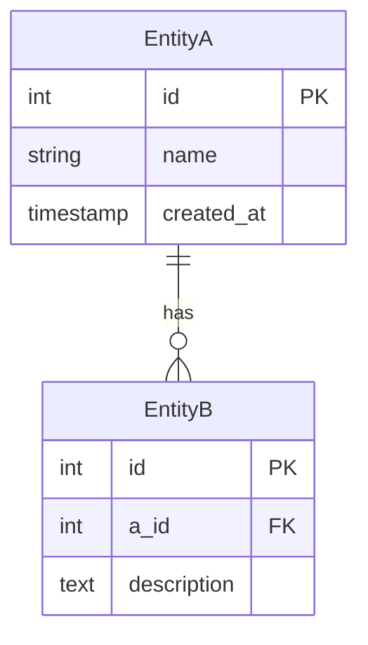

# D-19 — Thiết kế cơ sở dữ liệu (Database Design / ER Diagram)

## 1. Tổng quan (Overview)
- **Tổng quan**: (Mô tả phạm vi và mục đích của thiết kế cơ sở dữ liệu này)

## 2. Sơ đồ ER (ER Diagram)

> [!NOTE]
> Mô tả quan hệ giữa các bảng bằng sơ đồ ER (dùng Mermaid).

## 3. Định nghĩa bảng (Table Definitions)

---
### 3.1. Tên bảng (Table Name)
- **Tên logic (Logical name)**:
- **Tên vật lý (Physical name)**:
- **Tổng quan (Overview)**:

| Tên logic | Tên vật lý | Kiểu | Ràng buộc | Mô tả |
|---|---|---|---|---|
| ID | id | INTEGER | PK, NOT NULL, AUTO_INCREMENT | |
| | | | | |

---

## 4. Định nghĩa index (Index Definitions)

| Tên bảng (vật lý) | Tên index | Cột | UNIQUE |
|---|---|---|---|
| | | | |

---

**Lịch sử sửa đổi (Revision History)**

| Ngày | Phiên bản | Nội dung | Người thực hiện |
|---|---|---|---|
| yyyy-mm-dd | 1.0 | Bản đầu (Initial creation) | |
