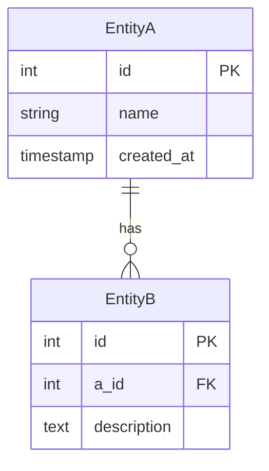

# D-19 データベース設計書 (ER図)

## 1. 概要
- **概要**: (このデータベース設計が対象とする範囲や目的を記述します)

## 2. ER図

> [!NOTE]
> テーブル間の関連を表現するER図をMermaidなどで記述します。

## 3. テーブル定義

---
### 3.1. テーブル名
- **論理名**: 
- **物理名**: 
- **概要**: 

| 論理名 | 物理名 | 型 | 制約 | 説明 |
|---|---|---|---|---|
| ID | id | INTEGER | PK, NOT NULL, AUTO_INCREMENT | |
| | | | | |

---

## 4. インデックス定義

| テーブル物理名 | インデックス名 | 対象カラム | UNIQUE |
|---|---|---|---|
| | | | |

---

**改訂履歴**

| 日付 | バージョン | 改訂内容 | 担当者 |
|---|---|---|---|
| yyyy-mm-dd | 1.0 | 初版作成 | |
