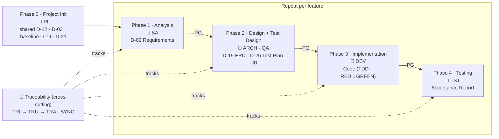

# HBLAB BMad Custom (HBC)

> 🌐 [Tiếng Việt](README.md) (default) · **English**

An **incremental, per-feature** development workflow for HBLAB. The process has **4 phases** per feature, but **Phase 0 — Project Init is mandatory and must run first**: once project-wide (or re-run to **update directly** when needed) to create the **shared** deliverables. Then **each feature** runs all 4 quality-gated phases + TDD (test-first, with RED evidence), tracing requirements down to their tests.

## Table of contents

- [What HBC solves for you](#what-hbc-solves-for-you)
- [🚀 Quick Start](#-quick-start)
- [🗺️ Mental model: Phase 0 + the 4 phases](#-mental-model-phase-0--the-4-phases)
- [📦 Requirements & Installation](#-requirements--installation)
- [📚 Documentation](#-documentation)
- [🧰 Skills overview](#-skills-overview)
- [⚙️ Configuration](#-configuration)
- [📄 License](#-license)

---

## What HBC solves for you

On contractual projects with formal acceptance, three familiar pains:

- **Vague requirements** → you only discover the misunderstanding after building it.
- **Tests that miss requirements** → bugs slip through; no way to know coverage is complete.
- **Hard to prove "we did everything"** at handover or audit.

**HBC** is an expansion module for [BMad Method](https://github.com/bmad-code-org/BMAD-METHOD) applying an **incremental + TDD** process **per feature**. The process has **4 phases** per feature, but **Phase 0 (`PI`) is mandatory and runs first** — once project-wide (or re-run to update directly) — to create the **shared deliverables** (coding standards D-12, glossary D-03, baseline ERD/API). After Phase 0, **5 coordinator agents** guide each feature through the 4 phases, each producing clear **deliverables**, with a **phase gate** stopping errors at every boundary and **traceability** linking every requirement down to its tests. At project end you can answer instantly: *"Every requirement has a design, code, and tests."*

- **For:** teams working incrementally with TDD — BA, Architect, QA, Developer, Tester.
- **Where you type commands:** inside your **AI coding agent** (Claude Code, Cursor…), **not** a plain terminal.

> ℹ️ *This project delivers **incrementally, feature by feature**: each feature runs all 4 gated stages + TDD, then ships. "Waterfall" is a **delivery model**, not HBC's architecture — here it only refers to the discipline **within a single feature** (design first, sign off each milestone). Details: [Is HBC really pure waterfall?](docs/en/explanation/why-incremental-tdd.md#is-hbc-really-pure-waterfall)*

> 📖 New to "deliverable / phase gate / traceability"? → [Concept Glossary](docs/en/reference/concept-glossary.md).

---

## 🚀 Quick Start

> 💡 **You don't need to memorize any skill.** Just type `bmad-help` anytime — it inspects your project state and suggests the next step.

After installing, **inside your AI coding agent** (e.g. Claude Code) opened at the project root, new users follow **4 steps** — Phase 0 first, then take one feature through the process:

1. **Phase 0 — Project Init (MANDATORY, run ONCE)** → type `PI` (`hbc-project-init`). On an **existing codebase (brownfield)**, `PI` **documents the codebase first** (via `bmad-document-project` + `project-context.md`) and derives the **shared** deliverables from it: D-12 Coding Standards (from existing code conventions), D-03 Glossary, baseline D-19 ERD (from the DB schema) / D-21 API (from existing endpoints). A new project (greenfield) creates them from a PRD/choices. Run it **once project-wide** (idempotent, no `feature` arg); re-run later to **update directly**. **This must be done before** any feature work.
2. **Open the Phase 1 coordinator** → type `BA` (or `hbc-agent-ba`).
3. **Create the Requirements Specification (D-02)** → type `REQ`. The required **per-feature** deliverable that grounds every later phase; IDs namespaced as `REQ-<FEAT>-NNN` (e.g. `REQ-AUTH-001`).
4. **Run the Phase Gate** before moving on → type `PG 1 feature=<slug>` (always with the phase number 1–4 + `feature`). Only a "pass" lets you advance.

What you'll see (**illustrative** — exact wording may differ):

```text
> BA
Business Analyst — Phase 1 Analysis coordinator. You can: REQ, GLO, BFD…
> REQ
… (the agent interviews you about a requirement) …
✓ Created _bmad-output/features/auth/planning-artifacts/D-02-requirements.md  (REQ-AUTH-001, REQ-AUTH-002…)
```

Then repeat the loop: open the phase's agent → run its required skills → run `PG <phase> feature=<slug>`. Work through all 4 phases and that feature **ships independently**. *(The tutorial also inserts `TRI` after step 2 to turn on traceability.)*

> 🗂️ **Output layout:** each feature lives under `_bmad-output/features/<feature>/…`; shared deliverables live under `_bmad-output/shared/…`.

📘 **First time?** Start with the [10-minute Quickstart](docs/en/tutorials/quickstart.md) — install, verify, and create your first D-02.

---

## 🗺️ Mental model: Phase 0 + the 4 phases

**Phase 0 — Project Init (`PI`) is mandatory and runs first** — once project-wide (or re-run to **update directly** when needed) — to create the shared deliverables. Then **each feature** moves **sequentially** through 4 phases; each produces a required deliverable and must pass a **Phase Gate** (`PG`) before the next phase begins.



- **Phase 0 (`PI`)** — **mandatory, runs first**; typically once project-wide (or re-run to update directly). **Brownfield** (existing code): documents the codebase first (`bmad-document-project` + `project-context.md`), then derives the shared deliverables from it; greenfield: creates them from a PRD/choices. Produces D-12, D-03 + baselines D-19/D-21; idempotent, no `feature` arg.
- **Phase Gate (`PG`)** — a control checkpoint at each phase boundary (deterministic checks + LLM evaluation); carries `feature=`.
- **Readiness check (`IR`)** — the Phase-2 seam gate reconciling D-02 ↔ D-21/D-26/D-27 + the matrix before implementation.
- **Traceability (`TRI` → `TRU` → `TRA`)** — a matrix ensuring every requirement (REQ ID) has matching design, code, and tests. **`SYNC`** proposes cascade updates when a source doc changes.

👉 To understand Phase / Gate / Deliverable / Traceability in depth: [Core Concepts](docs/en/explanation/concepts.md).

---

## 📦 Requirements & Installation

**Requirements**

- [BMad Method](https://github.com/bmad-code-org/BMAD-METHOD) v6.3.0+ (this project runs v6.8.0)
- **2 required companion BMad modules** installed: **BMad Core Module (`core`)** and **BMad Method (`bmm`)**. HBC is an expansion module — it does not run standalone, it builds on these two.
- Node.js (to run `npx`) · Python 3.10+ (validation scripts)
- **Access to the HBC repo** — a Git URL over SSH/HTTPS or a local path

**Installation**

**Recommended — the interactive installer** (safe for a project that already has modules): the installer shows your installed modules pre-checked and *keeps them selected*. At the *"Select official modules"* step keep **BMad Core Module** + **BMad Method (BMM)** (Builder optional); at the *"install custom or community modules"* step choose **Yes**, then paste the HBC Git URL:

```bash
npx bmad-method install
```

Select **"HBLAB BMad Custom"** when prompted.

> ⚠️ **Non-interactive install — beware of losing modules!** If you run `--custom-source` **without** `--modules`, the installer keeps only `core` + the custom module and **removes the other official modules** (`bmm`, `bmb`…). Always list every module you want to keep:
>
> ```bash
> npx bmad-method install --directory . \
>   --modules bmm,bmb \
>   --custom-source git@git.hblab.vn:stc/erp/stc-erp-bmad-custom.git \
>   --tools claude-code --yes
> ```
>
> `core` is always installed alongside; `--tools` is required for fresh `--yes` installs. To **update later** while preserving config & modules: `npx bmad-method install --action quick-update --custom-source <URL>`.

👉 Step-by-step wizard walkthrough (incl. permission-error handling): [Quickstart](docs/en/tutorials/quickstart.md).

---

## 📚 Documentation

Docs follow the [Divio](https://docs.divio.com/documentation-system/) model — pick by what you need:

| You are... | Read | Start at |
| --- | --- | --- |
| New, want hand-holding | 📘 Tutorial | [Quickstart](docs/en/tutorials/quickstart.md) · [Get Started with HBC](docs/en/tutorials/getting-started-hbc.md) · [Workflow Map](docs/en/tutorials/workflow-map.md) |
| Wanting to understand *why* | 💡 Explanation | [Core Concepts](docs/en/explanation/concepts.md) |
| Needing to do one task | 🔧 How-to | [Run a Phase Gate](docs/en/how-to/run-a-phase-gate.md) · [Manage Traceability](docs/en/how-to/manage-traceability.md) |
| Looking something up | 📖 Reference | [Concept Glossary](docs/en/reference/concept-glossary.md) · [Skills Catalog](docs/en/reference/skills-catalog.md) · [D-xx Deliverables Glossary](docs/en/reference/deliverables-glossary.md) |

---

## 🧰 Skills overview

HBC ships **5 coordinator agents** plus workflow skills per phase. Each workflow skill supports **Create / Update / Validate** modes; most support `--headless` / `-H`. The **Scope** column tells you whether a deliverable is **shared** (project-wide), **per-feature** (one per feature), or **dual** (shared baseline + optional per-feature override).

| Phase | Agent | Key skills (deliverable) | Scope |
| --- | --- | --- | --- |
| 0 · Project Init | — | `PI` (shared D-12/D-03 + baseline D-19/D-21) | shared · **mandatory, runs first** (once / update) |
| 1 · Analysis | `BA` | `REQ` (D-02 Requirements) · `GLO` (D-03) · `BFD` (D-06) | D-02/D-06 per-feature · D-03 shared |
| 2 · Design | `ARCH` | `ERD` (D-19) · `CS` (D-12) · `API` (D-21) | D-12 shared · D-19/D-21 dual |
| 2 · Test Design | `QA` | `TP` (D-26 Test Plan) · `TS` (D-27 Test Spec) · `IR` (Readiness) | per-feature |
| 3 · Implementation | `DEV` | `TB` (Task Breakdown) · `IM` (Code TDD) | per-feature |
| 4 · Testing | `TST` | `TE` (Test Execution) · `AC` (Acceptance) | per-feature |
| Cross-cutting | — | `PG` (Phase Gate) · `TRI`/`TRU`/`TRR`/`TRA` (Traceability) · `SYNC` (Cascade Sync) | per-feature (`PG`/`TR*`) · cross-cutting (`SYNC`) |

📖 Full list with descriptions: [Skills Catalog](docs/en/reference/skills-catalog.md).

---

## ⚙️ Configuration

During installation, you'll be asked:

| Variable | Default | Description |
| --- | --- | --- |
| `user_name` | BMad | Your display name (user-only) |
| `communication_language` | English | Language for agent communication (user-only) |
| `document_output_language` | English | Language for generated documents |
| `output_folder` | `{project-root}/_bmad-output` | Base output directory |

🔧 How to change config after install: [Customize Configuration](docs/en/how-to/customize-config.md).

---

## 📄 License

UNLICENSED — Internal use only.
