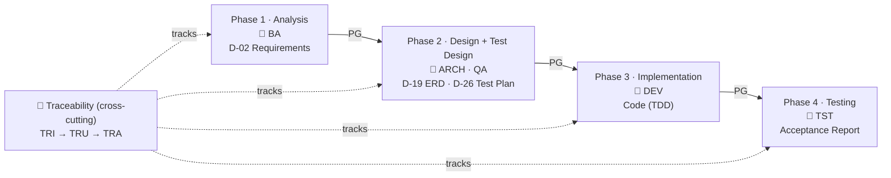

# HBLAB BMad Custom (HBC)

> 🌐 [Tiếng Việt](README.md) (default) · **English**

An expansion module for [BMad Method](https://github.com/bmad-code-org/BMAD-METHOD) implementing a **waterfall + TDD** development lifecycle. **5 coordinator agents** guide you through **4 phases**, producing **D-xx deliverables** with **phase gates** for quality control and full **requirements-to-test traceability**.

---

## 🚀 Quick Start

> 💡 **You don't need to memorize any skill.** Just type `bmad-help` anytime — it inspects your project state and suggests the next step.

New users follow these **3 steps**:

1. **Open the Phase 1 coordinator** → type `BA` (or `hbc-agent-ba`).
2. **Create the Requirements Specification (D-02)** → type `REQ`. This is the required deliverable that grounds every later phase.
3. **Run the Phase Gate** before moving on → type `PG 1` (always with the phase number, 1–4). Only a "pass" lets you advance.

Then repeat the loop: open the phase's agent → run its required skills → run `PG <phase>`. Work through all 4 phases and you're done. *(The tutorial also inserts `TRI` after step 2 to turn on traceability — see below.)*

📘 **First time?** Start with the [10-minute Quickstart](docs/en/tutorials/quickstart.md) — install, verify, and create your first D-02.

---

## 🗺️ Mental model: the 4 phases

HBC moves **sequentially** through 4 phases. Each produces a required deliverable and must pass a **Phase Gate** (`PG`) before the next phase begins.



- **Phase Gate (`PG`)** — a control checkpoint at each phase boundary (deterministic checks + LLM evaluation).
- **Traceability (`TRI` → `TRU` → `TRA`)** — a matrix ensuring every requirement (REQ ID) has matching design, code, and tests.

👉 To understand Phase / Gate / Deliverable / Traceability in depth: [Core Concepts](docs/en/explanation/concepts.md).

---

## 📦 Requirements & Installation

**Requirements**

- [BMad Method](https://github.com/bmad-code-org/BMAD-METHOD) v6.3.0+ (this project runs v6.8.0)
- **2 required companion BMad modules** installed: **BMad Core Module (`core`)** and **BMad Method (`bmm`)**. HBC is an expansion module — it does not run standalone, it builds on these two.
- Node.js (to run `npx`) · Python 3.10+ (validation scripts)
- **Access to the HBC repo** — a Git URL over SSH/HTTPS or a local path

**Installation**

**Recommended — the interactive installer** (safe for a project that already has modules): the installer shows your installed modules pre-checked and *keeps them selected*. At the *"Select official modules"* step keep **BMad Core Module** + **BMad Method (BMM)** (Builder optional); at the *"install custom or community modules"* step choose **Yes**, then paste the HBC Git URL:

```bash
npx bmad-method install
```

Select **"HBLAB BMad Custom"** when prompted.

> ⚠️ **Non-interactive install — beware of losing modules!** If you run `--custom-source` **without** `--modules`, the installer keeps only `core` + the custom module and **removes the other official modules** (`bmm`, `bmb`…). Always list every module you want to keep:
>
> ```bash
> npx bmad-method install --directory . \
>   --modules bmm,bmb \
>   --custom-source git@git.hblab.vn:stc/erp/stc-erp-bmad-custom.git \
>   --tools claude-code --yes
> ```
>
> `core` is always installed alongside; `--tools` is required for fresh `--yes` installs. To **update later** while preserving config & modules: `npx bmad-method install --action quick-update --custom-source <URL>`.

👉 Step-by-step wizard walkthrough (incl. permission-error handling): [Quickstart](docs/en/tutorials/quickstart.md).

---

## 📚 Documentation

Docs follow the [Divio](https://docs.divio.com/documentation-system/) model — pick by what you need:

| You are... | Read | Start at |
| --- | --- | --- |
| New, want hand-holding | 📘 Tutorial | [Quickstart](docs/en/tutorials/quickstart.md) · [Get Started with HBC](docs/en/tutorials/getting-started-hbc.md) · [Workflow Map](docs/en/tutorials/workflow-map.md) |
| Wanting to understand *why* | 💡 Explanation | [Core Concepts](docs/en/explanation/concepts.md) |
| Needing to do one task | 🔧 How-to | [Run a Phase Gate](docs/en/how-to/run-a-phase-gate.md) · [Manage Traceability](docs/en/how-to/manage-traceability.md) |
| Looking something up | 📖 Reference | [Concept Glossary](docs/en/reference/concept-glossary.md) · [Skills Catalog](docs/en/reference/skills-catalog.md) · [D-xx Deliverables Glossary](docs/en/reference/deliverables-glossary.md) |

---

## 🧰 Skills overview

HBC ships **5 coordinator agents** plus workflow skills per phase. Each workflow skill supports **Create / Update / Validate** modes; most support `--headless` / `-H`.

| Phase | Agent | Key skills (deliverable) |
| --- | --- | --- |
| 1 · Analysis | `BA` | `REQ` (D-02 Requirements) · `GLO` (D-03) · `BFD` (D-06) |
| 2 · Design | `ARCH` | `ERD` (D-19) · `CS` (D-12) · `API` (D-21) |
| 2 · Test Design | `QA` | `TP` (D-26 Test Plan) · `TS` (D-27 Test Spec) |
| 3 · Implementation | `DEV` | `TB` (Task Breakdown) · `IM` (Code TDD) |
| 4 · Testing | `TST` | `TE` (Test Execution) · `AC` (Acceptance) |
| Cross-cutting | — | `PG` (Phase Gate) · `TRI`/`TRU`/`TRR`/`TRA` (Traceability) |

📖 Full list with descriptions: [Skills Catalog](docs/en/reference/skills-catalog.md).

---

## ⚙️ Configuration

During installation, you'll be asked:

| Variable | Default | Description |
| --- | --- | --- |
| `user_name` | BMad | Your display name (user-only) |
| `communication_language` | English | Language for agent communication (user-only) |
| `document_output_language` | English | Language for generated documents |
| `output_folder` | `{project-root}/_bmad-output` | Base output directory |

🔧 How to change config after install: [Customize Configuration](docs/en/how-to/customize-config.md).

---

## 📄 License

UNLICENSED — Internal use only.
