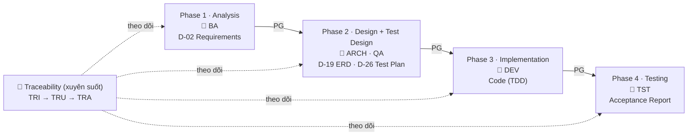

# HBLAB BMad Custom (HBC)

> 🌐 **Tiếng Việt** (mặc định) · [English](README.en.md)

Module mở rộng cho [BMad Method](https://github.com/bmad-code-org/BMAD-METHOD), áp dụng quy trình phát triển **waterfall + TDD**. **5 agent điều phối** dẫn dắt bạn qua **4 phase**, sinh ra các **deliverable D-xx** với **phase gate** kiểm soát chất lượng và **traceability** đầy đủ từ yêu cầu đến test.

---

## 🚀 Bắt đầu nhanh

> 💡 **Không cần thuộc lòng skill nào.** Cứ gõ `bmad-help` bất cứ lúc nào, nó sẽ xem trạng thái dự án và gợi ý bước tiếp theo.

Người mới làm theo **3 bước** sau:

1. **Mở agent điều phối Phase 1** → gõ `BA` (hoặc `hbc-agent-ba`).
2. **Tạo bản đặc tả yêu cầu (D-02)** → gõ `REQ`. Đây là deliverable bắt buộc, làm nền cho mọi phase sau.
3. **Chạy Phase Gate** trước khi sang phase kế → gõ `PG 1` (luôn kèm số phase 1–4). Gate "pass" mới đi tiếp.

Sau đó cứ lặp lại: mở agent của phase → chạy skill bắt buộc → chạy `PG <số phase>`. Đi hết 4 phase là xong. *(Tutorial còn chèn `TRI` sau bước 2 để bật traceability — xem bên dưới.)*

📘 **Lần đầu dùng?** Bắt đầu từ [Khởi động nhanh 10 phút](docs/vi/tutorials/quickstart.md) — cài đặt, xác nhận chạy, và tạo D-02 đầu tiên.

---

## 🗺️ Mô hình tư duy: 4 phase

HBC đi **tuần tự** qua 4 phase. Mỗi phase sinh deliverable bắt buộc, và phải qua **Phase Gate** (`PG`) mới được sang phase sau.



- **Phase Gate (`PG`)** — chốt kiểm soát ở ranh giới mỗi phase (kiểm tra tự động + đánh giá bằng LLM).
- **Traceability (`TRI` → `TRU` → `TRA`)** — ma trận truy vết, đảm bảo mọi yêu cầu (REQ ID) đều có thiết kế, code và test tương ứng.

👉 Muốn hiểu sâu khái niệm Phase / Gate / Deliverable / Traceability: [Khái niệm cốt lõi](docs/vi/explanation/concepts.md).

---

## 📦 Yêu cầu & Cài đặt

**Yêu cầu**

- [BMad Method](https://github.com/bmad-code-org/BMAD-METHOD) v6.3.0+ (dự án này đang dùng v6.8.0)
- **2 module BMad bắt buộc đi kèm** đã cài: **BMad Core Module (`core`)** và **BMad Method (`bmm`)**. HBC là module mở rộng — không chạy độc lập mà dựa trên hai module này.
- Node.js (để chạy `npx`) · Python 3.10+ (cho script kiểm tra)
- **Quyền truy cập repo HBC** — Git URL qua SSH/HTTPS hoặc bản local

**Cài đặt**

**Cách khuyến nghị — trình cài đặt tương tác** (an toàn cho dự án đã có module): trình cài đặt hiện sẵn các module đang cài và *giữ chúng được chọn*. Ở bước *"Select official modules"* giữ **BMad Core Module** + **BMad Method (BMM)** (Builder tùy chọn); tới bước *"install custom or community modules"* chọn **Yes** rồi dán Git URL của HBC:

```bash
npx bmad-method install
```

Chọn **"HBLAB BMad Custom"** khi được hỏi.

> ⚠️ **Cài không tương tác — cẩn thận mất module!** Nếu chạy `--custom-source` mà **không** kèm `--modules`, trình cài đặt chỉ giữ `core` + module custom và **gỡ bỏ các module official khác** (`bmm`, `bmb`…). Luôn liệt kê đầy đủ module cần giữ:
>
> ```bash
> npx bmad-method install --directory . \
>   --modules bmm,bmb \
>   --custom-source git@git.hblab.vn:stc/erp/stc-erp-bmad-custom.git \
>   --tools claude-code --yes
> ```
>
> `core` luôn được cài kèm; `--tools` bắt buộc khi cài mới với `--yes`. Để **cập nhật về sau** mà giữ nguyên cấu hình & module: `npx bmad-method install --action quick-update --custom-source <URL>`.

👉 Hướng dẫn cài từng bước qua wizard (kèm xử lý lỗi quyền): [Khởi động nhanh](docs/vi/tutorials/quickstart.md).

---

## 📚 Tài liệu

Tài liệu tổ chức theo mô hình [Divio](https://docs.divio.com/documentation-system/) — chọn theo nhu cầu của bạn:

| Bạn đang... | Đọc loại | Bắt đầu từ |
| --- | --- | --- |
| Mới, muốn được dắt tay | 📘 Tutorial | [Khởi động nhanh](docs/vi/tutorials/quickstart.md) · [Bắt đầu với HBC](docs/vi/tutorials/getting-started-hbc.md) · [Bản đồ quy trình](docs/vi/tutorials/workflow-map.md) |
| Cần hiểu *vì sao* | 💡 Explanation | [Khái niệm cốt lõi](docs/vi/explanation/concepts.md) |
| Cần làm 1 việc cụ thể | 🔧 How-to | [Chạy Phase Gate](docs/vi/how-to/run-a-phase-gate.md) · [Quản lý Traceability](docs/vi/how-to/manage-traceability.md) |
| Cần tra cứu nhanh | 📖 Reference | [Glossary khái niệm](docs/vi/reference/concept-glossary.md) · [Catalog skill](docs/vi/reference/skills-catalog.md) · [Bảng deliverable D-xx](docs/vi/reference/deliverables-glossary.md) |

---

## 🧰 Tổng quan skill

HBC gồm **5 agent điều phối** + các skill workflow cho từng phase. Mỗi skill workflow hỗ trợ chế độ **Create / Update / Validate**, đa số có `--headless` / `-H`.

| Phase | Agent | Skill chính (deliverable) |
| --- | --- | --- |
| 1 · Analysis | `BA` | `REQ` (D-02 Requirements) · `GLO` (D-03) · `BFD` (D-06) |
| 2 · Design | `ARCH` | `ERD` (D-19) · `CS` (D-12) · `API` (D-21) |
| 2 · Test Design | `QA` | `TP` (D-26 Test Plan) · `TS` (D-27 Test Spec) |
| 3 · Implementation | `DEV` | `TB` (Task Breakdown) · `IM` (Code TDD) |
| 4 · Testing | `TST` | `TE` (Test Execution) · `AC` (Acceptance) |
| Xuyên suốt | — | `PG` (Phase Gate) · `TRI`/`TRU`/`TRR`/`TRA` (Traceability) |

📖 Danh sách đầy đủ kèm mô tả: [Catalog skill](docs/vi/reference/skills-catalog.md).

---

## ⚙️ Cấu hình

Khi cài đặt, bạn sẽ được hỏi:

| Biến | Mặc định | Mô tả |
| --- | --- | --- |
| `user_name` | BMad | Tên hiển thị (chỉ áp dụng cho user) |
| `communication_language` | English | Ngôn ngữ agent giao tiếp (chỉ user) |
| `document_output_language` | English | Ngôn ngữ tài liệu sinh ra |
| `output_folder` | `{project-root}/_bmad-output` | Thư mục output gốc |

🔧 Cách đổi cấu hình sau khi cài: [Tùy chỉnh cấu hình](docs/vi/how-to/customize-config.md).

---

## 📄 Giấy phép

UNLICENSED — Chỉ dùng nội bộ.
