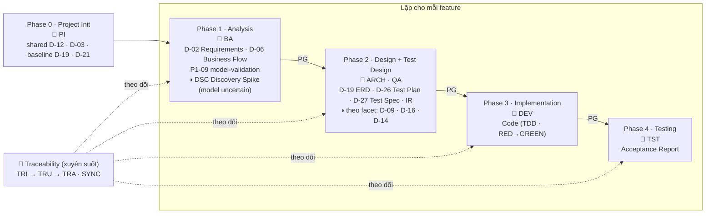

# HBLAB BMad Custom (HBC)

> 🌐 **Tiếng Việt** (mặc định) · [English](README.en.md)

Workflow phát triển cho HBLAB theo mô hình **bàn giao tăng dần từng tính năng** (incremental, per-feature). Quy trình gồm **4 phase** cho mỗi tính năng, nhưng **bắt buộc chạy Phase 0 — Project Init trước tiên**: đúng một lần cho cả dự án (hoặc chạy lại để **update trực tiếp** khi cần) nhằm tạo các deliverable **dùng chung**. Sau đó **mỗi tính năng** đi trọn 4 phase có cổng kiểm soát + TDD (test-first, có bằng chứng RED), truy vết yêu cầu → test.

## Mục lục

- [HBC giải quyết gì cho bạn?](#hbc-giải-quyết-gì-cho-bạn)
- [🚀 Bắt đầu nhanh](#-bắt-đầu-nhanh)
- [🗺️ Mô hình tư duy: Phase 0 + 4 phase](#-mô-hình-tư-duy-phase-0--4-phase)
- [📦 Yêu cầu & Cài đặt](#-yêu-cầu--cài-đặt)
- [📚 Tài liệu](#-tài-liệu)
- [🧰 Tổng quan skill](#-tổng-quan-skill)
- [⚙️ Cấu hình](#-cấu-hình)
- [📄 Giấy phép](#-giấy-phép)

---

## HBC giải quyết gì cho bạn?

> **Phần mềm sống lâu hơn những người làm ra nó.** Nỗi đau lớn nhất không phải *làm sai* — mà là **yêu cầu, lý do thiết kế và cách kiểm thử chỉ nằm trong đầu một người, rồi mất theo khi người ấy rời đi.**

Yêu cầu, thiết kế, code, test và tài liệu mỗi thứ được tạo ở một nơi, một thời điểm, bởi một vai khác nhau — và **quan hệ giữa chúng** (yêu cầu nào dẫn tới thiết kế nào, test nào phủ yêu cầu nào) thường không được ghi lại ở đâu. Khi đội ngũ thay đổi hoặc yêu cầu đi qua nhiều tay, mỗi lần bàn giao là một lần **mất thông tin** — một quyết định thiết kế không ai ghi, một thay đổi yêu cầu không phản ánh vào test — và thường không ai phát hiện cho tới khi va phải. Ba vấn đề quen thuộc:

- **Yêu cầu đầu vào chưa rõ ràng** — mô tả mơ hồ, không ai chất vấn, đến lúc bàn giao mới lộ ra hiểu sai → sửa lại tốn kém.
- **Spec, code và test không khớp nhau** — code và test cùng sinh từ spec nhưng độc lập, sai lệch giữa chúng không ai chịu trách nhiệm phát hiện.
- **Tri thức mất khi người rời đi** — tài liệu rời rạc, khó đọc; người mới khó tiếp quản, dự án khó migrate.

HBC không áp đặt một quy trình. Nó sinh ra từ **nỗi đau thật của từng vai**, và **ghi quan hệ giữa các artifact thành dữ liệu kiểm tra được, thay vì để trong trí nhớ**:

### Đầu vào — yêu cầu viết rõ ràng, kiểm chứng được; thiếu sót bị chặn tại cổng phase

- *Người nêu yêu cầu (Project Owner):* "Tôi không sợ làm sai. Tôi sợ làm sai mà cả tháng sau mới biết."
- *BA (Business Analyst):* "Tôi cần hỏi *đúng* và tìm lại *được*."

HBC xử lý:

- `REQ` (`hbc-create-requirements`) → **D-02** với ID `REQ-<FEAT>-NNN` chuẩn **EARS**, validator bắt thuật ngữ mơ hồ + rà đa góc nhìn (parallel-lens).
- `GLO` (`hbc-create-glossary`) → **D-03** thống nhất ngôn ngữ.
- Khâu discovery chất vấn dựa trên yêu cầu gốc **và** source code/business hiện có *(khi có sẵn)*.
- `PG` (`hbc-phase-gate`) + `IR` (`hbc-check-implementation-readiness`) → chặn lệch ngay tại ranh giới phase.
- Spec **lưu theo từng feature** (`_bmad-output/features/<feature>/`), không gom một đống.

### Spec–code–test khớp nhau — mỗi vai chịu trách nhiệm một cổng

- *Lập trình viên (Developer):* "Một người gác hai cổng thì cổng nào cũng hở."
- *Kiểm thử viên (Tester):* cần vai trò và điểm tựa rõ ràng cho chất lượng spec↔test.

HBC xử lý:

- TDD qua `IM` (`hbc-implement`, RED→GREEN) + `TB` (`hbc-task-breakdown`) → **test là hợp đồng**, dev chỉ lo *code đúng test*.
- `TP` / `TS` (`hbc-create-test-plan` / `hbc-create-test-spec`, **D-26/D-27**) → tester sở hữu cổng *test↔spec*.
- Ma trận truy vết `TRI`/`TRU`/`TRA` (`hbc-traceability`) → **mọi REQ đều có thiết kế, code và test**, gap luôn lộ ra.

> ℹ️ *Công cụ cho vai tester hiện ở mức nền và đang hoàn thiện.*

### Dài hạn — tài liệu đủ để người mới tiếp quản, không phụ thuộc người cũ

- *Nhà tài trợ dự án (Sponsor):* "Tôi muốn một thứ vẫn còn hiểu được sau khi người tạo ra nó đã đi."
- *Quản lý dự án (PM):* "Con người thay được, hệ thống không gãy."

HBC xử lý:

- Tài liệu **readable**: `BFD` (`hbc-create-business-flow-diagram`, **D-06**) + `ERD` (`hbc-create-er-diagram`, **D-19**) + `API` (`hbc-create-api-spec`, **D-21**); thiết kế theo facet: `AD` (kiến trúc **D-09**) · `BD` (hành vi **D-16**) · `UX` (màn hình **D-14**).
- **Deliverable dùng chung** từ `PI` (`hbc-project-init`): `CS` (`hbc-create-coding-standards`, **D-12**) + **D-03** glossary.
- **5 agent điều phối** (`hbc-agent-ba/architect/qa/dev/tester`) → một workflow chung thay cho mỗi vai một tool.
- `SYNC` (`hbc-traceability`) → cập nhật lan truyền khi tài liệu nguồn đổi.

**HBC** là module mở rộng cho [BMad Method](https://github.com/bmad-code-org/BMAD-METHOD), áp dụng quy trình **incremental + TDD** theo **từng tính năng**. Quy trình có **4 phase** cho mỗi tính năng, nhưng **bắt buộc chạy Phase 0 (`PI`) trước tiên** — đúng một lần cho cả dự án (hoặc chạy lại để update trực tiếp) — để tạo các **deliverable dùng chung** (shared: chuẩn code D-12, glossary D-03, baseline ERD/API). Sau Phase 0, **5 agent điều phối** dẫn mỗi feature qua 4 phase, mỗi phase sinh **deliverable** rõ ràng, có **phase gate** chặn lỗi ở mỗi ranh giới, và **traceability** nối mọi yêu cầu tới tận test. Cuối dự án bạn trả lời được ngay: *"Yêu cầu nào cũng có thiết kế, code và test."*

- **Dành cho:** team làm theo incremental + TDD — BA, Architect, QA, Developer, Tester.
- **Gõ lệnh ở đâu:** trong **AI coding agent** của bạn (Claude Code, Cursor…), **không phải** terminal thường.

> ℹ️ *Dự án này **bàn giao tăng dần theo từng tính năng** (incremental): mỗi feature đi trọn 4 giai đoạn có cổng + TDD rồi giao. Chi tiết: [Vì sao Incremental + TDD](docs/vi/explanation/why-incremental-tdd.md)*

> 📖 Lần đầu nghe "deliverable / phase gate / traceability"? → [Glossary khái niệm](docs/vi/reference/concept-glossary.md).

---

## 🚀 Bắt đầu nhanh

> 💡 **Không cần thuộc lòng skill nào.** Cứ gõ `bmad-help` bất cứ lúc nào, nó sẽ xem trạng thái dự án và gợi ý bước tiếp theo.

Sau khi cài đặt, **trong AI coding agent** (vd Claude Code) mở tại thư mục dự án, người mới làm theo **4 bước** — Phase 0 trước tiên, rồi đưa một tính năng vào quy trình:

1. **Phase 0 — Khởi tạo dự án (BẮT BUỘC, chạy MỘT lần)** → gõ `PI` (`hbc-project-init`). Với **dự án có sẵn code (brownfield)**, `PI` **document codebase trước** (qua `bmad-document-project` + `project-context.md`) rồi rút các deliverable **dùng chung** từ đó: D-12 Coding Standards (từ convention code), D-03 Glossary, baseline D-19 ERD (từ schema DB) / D-21 API (từ endpoint). Dự án mới (greenfield) thì tạo từ PRD/lựa chọn. Chạy **đúng một lần cho cả dự án** (idempotent, không cần `feature`); về sau chạy lại để **update trực tiếp**. **Phải xong bước này trước** khi làm bất kỳ tính năng nào.
2. **Mở agent điều phối Phase 1** → gõ `BA` (hoặc `hbc-agent-ba`).
3. **Tạo bản đặc tả yêu cầu (D-02)** → gõ `REQ`. Deliverable **per-feature** bắt buộc, làm nền cho mọi phase sau; ID dạng `REQ-<FEAT>-NNN` (vd `REQ-AUTH-001`).
4. **Chạy Phase Gate** trước khi sang phase kế → gõ `PG 1 feature=<slug>` (luôn kèm số phase 1–4 + `feature`). Gate "pass" mới đi tiếp.

Ví dụ những gì bạn thấy (**minh họa** — câu chữ thực tế có thể khác):

```text
> BA
Business Analyst — điều phối Phase 1 Analysis. Bạn có thể: REQ, GLO, BFD…
> REQ
… (agent phỏng vấn yêu cầu của bạn) …
✓ Đã tạo _bmad-output/features/auth/planning-artifacts/D-02-requirements.md  (REQ-AUTH-001, REQ-AUTH-002…)
```

Sau đó cứ lặp lại: mở agent của phase → chạy skill bắt buộc → chạy `PG <số phase> feature=<slug>`. Đi hết 4 phase là **giao được feature đó độc lập**. *(Tutorial còn chèn `TRI` sau bước 2 để bật traceability.)*

> 🗂️ **Bố cục output:** mỗi feature nằm dưới `_bmad-output/features/<feature>/…`; deliverable dùng chung nằm dưới `_bmad-output/shared/…`.

📘 **Lần đầu dùng?** Bắt đầu từ [Khởi động nhanh 10 phút](docs/vi/tutorials/quickstart.md) — cài đặt, xác nhận chạy, và tạo D-02 đầu tiên.

---

## 🗺️ Mô hình tư duy: Phase 0 + 4 phase

**Bắt buộc chạy Phase 0 — Project Init (`PI`) trước tiên** — đúng một lần cho cả dự án (hoặc chạy lại để **update trực tiếp** khi cần) — để tạo các deliverable dùng chung. Sau đó **mỗi feature** đi **tuần tự** qua 4 phase; mỗi phase sinh deliverable bắt buộc và phải qua **Phase Gate** (`PG`) mới được sang phase sau.



- **Phase 0 (`PI`)** — **bắt buộc, chạy trước tiên**; thường đúng một lần cho cả dự án (hoặc chạy lại để update trực tiếp). **Brownfield** (có code sẵn): document codebase trước (`bmad-document-project` + `project-context.md`) rồi rút deliverable dùng chung từ đó; greenfield: tạo từ PRD/lựa chọn. Sinh D-12, D-03 + baseline D-19/D-21; idempotent, không cần `feature`.
- **Phase Gate (`PG`)** — chốt kiểm soát ở ranh giới mỗi phase (kiểm tra tự động + đánh giá bằng LLM); mang theo `feature=`.
- **Kiểm chứng model sớm (`P1-09` + `DSC`)** — Phase 1 buộc **ký xác nhận domain model** (P1-09) trước khi đóng Analysis. Feature có model chưa chắc (`discovery_risk: uncertain`) chạy **Discovery Spike (`DSC`)**: kiểm chứng giả định rủi ro nhất so với ground-truth (code/DB/ví dụ thật) → verdict **VALIDATED / RESHAPE / KILL**; gate `P1-11` chặn nếu chưa VALIDATED. *(Vá lỗi gốc: "model bị PASSED trước khi kiểm chứng".)*
- **Thiết kế theo facet (◑)** — Phase 2 chỉ sinh deliverable thiết kế mà feature thực sự cần, do **applicability-catalog** quyết: `D-09` Architecture (tích hợp/thuật toán) · `D-16` Behavioral (phi-CRUD) · `D-14` UX (có UI). Feature tối giản chỉ cần D-02 + D-06.
- **Readiness check (`IR`)** — cổng nối ở Phase 2, đối soát D-02 ↔ D-21/D-26/D-27 + ma trận trước khi sang implementation.
- **Traceability (`TRI` → `TRU` → `TRA`)** — ma trận truy vết, đảm bảo mọi yêu cầu (REQ ID) đều có thiết kế, code và test tương ứng. **`SYNC`** đề xuất cập nhật lan truyền (cascade) khi một tài liệu nguồn thay đổi.

👉 Muốn hiểu sâu khái niệm Phase / Gate / Deliverable / Traceability: [Khái niệm cốt lõi](docs/vi/explanation/concepts.md).

---

## 📦 Yêu cầu & Cài đặt

**Yêu cầu**

- [BMad Method](https://github.com/bmad-code-org/BMAD-METHOD) v6.3.0+ (dự án này đang dùng v6.8.0)
- **2 module BMad bắt buộc đi kèm** đã cài: **BMad Core Module (`core`)** và **BMad Method (`bmm`)**. HBC là module mở rộng — không chạy độc lập mà dựa trên hai module này.
- Node.js (để chạy `npx`) · Python 3.10+ (cho script kiểm tra)
- **Quyền truy cập repo HBC** — Git URL qua SSH/HTTPS hoặc bản local

**Cài đặt**

**Cách khuyến nghị — trình cài đặt tương tác** (an toàn cho dự án đã có module): trình cài đặt hiện sẵn các module đang cài và *giữ chúng được chọn*. Ở bước *"Select official modules"* giữ **BMad Core Module** + **BMad Method (BMM)** (Builder tùy chọn); tới bước *"install custom or community modules"* chọn **Yes** rồi dán Git URL của HBC:

```bash
npx bmad-method install
```

Chọn **"HBLAB BMad Custom"** khi được hỏi.

> ⚠️ **Cài không tương tác — cẩn thận mất module!** Nếu chạy `--custom-source` mà **không** kèm `--modules`, trình cài đặt chỉ giữ `core` + module custom và **gỡ bỏ các module official khác** (`bmm`, `bmb`…). Luôn liệt kê đầy đủ module cần giữ:
>
> ```bash
> npx bmad-method install --directory . \
>   --modules bmm,bmb \
>   --custom-source git@git.hblab.vn:stc/erp/stc-erp-bmad-custom.git \
>   --tools claude-code --yes
> ```
>
> `core` luôn được cài kèm; `--tools` bắt buộc khi cài mới với `--yes`. Để **cập nhật về sau** mà giữ nguyên cấu hình & module: `npx bmad-method install --action quick-update --custom-source <URL>`.

👉 Hướng dẫn cài từng bước qua wizard (kèm xử lý lỗi quyền): [Khởi động nhanh](docs/vi/tutorials/quickstart.md).

---

## 📚 Tài liệu

Tài liệu tổ chức theo mô hình [Divio](https://docs.divio.com/documentation-system/) — chọn theo nhu cầu của bạn:

| Bạn đang... | Đọc loại | Bắt đầu từ |
| --- | --- | --- |
| Mới, muốn được dắt tay | 📘 Tutorial | [Khởi động nhanh](docs/vi/tutorials/quickstart.md) · [Bắt đầu với HBC](docs/vi/tutorials/getting-started-hbc.md) · [Bản đồ quy trình](docs/vi/tutorials/workflow-map.md) |
| Cần hiểu *vì sao* | 💡 Explanation | [Khái niệm cốt lõi](docs/vi/explanation/concepts.md) |
| Cần làm 1 việc cụ thể | 🔧 How-to | [Chạy Phase Gate](docs/vi/how-to/run-a-phase-gate.md) · [Quản lý Traceability](docs/vi/how-to/manage-traceability.md) · [Migrate từ v1 lên v2](docs/vi/how-to/migrate-from-v1.md) |
| Cần tra cứu nhanh | 📖 Reference | [Glossary khái niệm](docs/vi/reference/concept-glossary.md) · [Catalog skill](docs/vi/reference/skills-catalog.md) · [Bảng deliverable D-xx](docs/vi/reference/deliverables-glossary.md) |

---

## 🧰 Tổng quan skill

HBC gồm **5 agent điều phối** + các skill workflow cho từng phase. Mỗi skill workflow hỗ trợ chế độ **Create / Update / Validate**, đa số có `--headless` / `-H`. Cột **Phạm vi** cho biết deliverable là **dùng chung** (shared, cả dự án), **per-feature** (mỗi feature một bản), hay **dual** (baseline dùng chung + bản ghi đè per-feature tùy chọn).

| Phase | Agent | Skill chính (deliverable) | Phạm vi |
| --- | --- | --- | --- |
| 0 · Project Init | — | `PI` (shared D-12/D-03 + baseline D-19/D-21) | shared · **bắt buộc, chạy trước** (1 lần / update) |
| 1 · Analysis | `BA` | `REQ` (D-02 Requirements) · `GLO` (D-03) · `BFD` (D-06) · ◑ `DSC` (Discovery Spike nếu `discovery_risk=uncertain`) | D-02/D-06 per-feature · D-03 shared · discovery-note per-feature |
| 2 · Design | `ARCH` | `ERD` (D-19) · `CS` (D-12) · `API` (D-21) · ◑ `AD` (D-09) · `BD` (D-16) · `UX` (D-14) | D-12 shared · D-19/D-21 dual · D-09/D-16/D-14 per-feature theo facet |
| 2 · Test Design | `QA` | `TP` (D-26 Test Plan) · `TS` (D-27 Test Spec) · `IR` (Readiness) | per-feature |
| 3 · Implementation | `DEV` | `TB` (Task Breakdown) · `IM` (Code TDD) | per-feature |
| 4 · Testing | `TST` | `TE` (Test Execution) · `AC` (Acceptance) | per-feature |
| Xuyên suốt | — | `PG` (Phase Gate) · `TRI`/`TRU`/`TRR`/`TRA` (Traceability) · `SYNC` (Cascade Sync) | per-feature (`PG`/`TR*`) · cross-cutting (`SYNC`) |

📖 Danh sách đầy đủ kèm mô tả: [Catalog skill](docs/vi/reference/skills-catalog.md).

---

## ⚙️ Cấu hình

Khi cài đặt, bạn sẽ được hỏi:

| Biến | Mặc định | Mô tả |
| --- | --- | --- |
| `user_name` | BMad | Tên hiển thị (chỉ áp dụng cho user) |
| `communication_language` | English | Ngôn ngữ agent giao tiếp (chỉ user) |
| `document_output_language` | English | Ngôn ngữ tài liệu sinh ra |
| `output_folder` | `{project-root}/_bmad-output` | Thư mục output gốc |

🔧 Cách đổi cấu hình sau khi cài: [Tùy chỉnh cấu hình](docs/vi/how-to/customize-config.md).

---

## 📄 Giấy phép

UNLICENSED — Chỉ dùng nội bộ.
