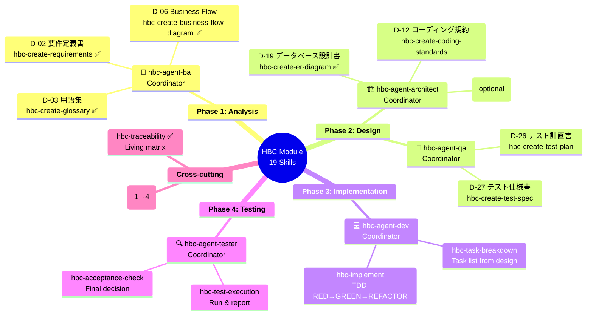
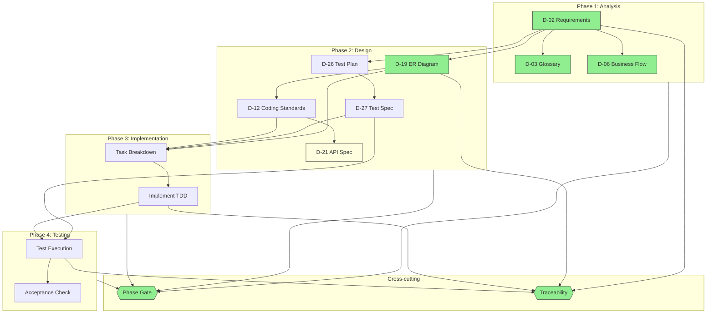

# HBLab Custom Module — 19-Skill Scope (Finalized 2026-05-28)

## Scope Decision

Original research (2026-05-20) envisioned 30 D-xx documents across 3 modules. After brainstorming (Assumption Reversal) and Party Mode roundtable, scope narrowed to **19 skills** (5 agents + 14 workflows) covering **8 D-xx documents** + 6 process outputs across 4 phases.

**Out-of-scope D-xx (deferred to future expansion):** D-01, D-04, D-05, D-07, D-08, D-09, D-10, D-11, D-13, D-14, D-15, D-16, D-17, D-18, D-20, D-21 (optional, in plan), D-22, D-23, D-24, D-25, D-28, D-29, D-31, D-00.

**Removed:** `hbc-create-invest-epics-and-stories` — not part of waterfall lifecycle.

**Decided:** `hbc-create-er-diagram` = D-19 skill (no rename to hbc-create-db-design).

## Architecture

## Dependency Flow

**Legend:**
- 🟢 Xanh = Built (Grade A)
- 🟡 Vàng nhạt = Optional
- Trắng = Chưa build

## Build Status

| # | Skill | Type | Phase | D-xx | Status |
|---|-------|------|-------|------|--------|
| 1 | hbc-phase-gate | workflow | cross-cutting | — | ✅ Built |
| 2 | hbc-traceability | workflow | cross-cutting | — | ✅ Built, Grade A |
| 3 | hbc-create-requirements | workflow | 1-Analysis | D-02 | ✅ Built, Grade A |
| 4 | hbc-create-glossary | workflow | 1-Analysis | D-03 | ✅ Built, Grade A |
| 5 | hbc-create-business-flow-diagram | workflow | 1-Analysis | D-06 | ✅ Built |
| 6 | hbc-agent-ba | agent | 1-Analysis | — | ✅ Built |
| 7 | hbc-create-er-diagram | workflow | 2-Design | D-19 | ✅ Built, Grade A |
| 8 | hbc-create-coding-standards | workflow | 2-Design | D-12 | ⬜ Not built |
| 9 | hbc-create-api-spec | workflow | 2-Design | D-21 | ⬜ Not built (optional) |
| 10 | hbc-create-test-plan | workflow | 2-Design | D-26 | ⬜ Not built |
| 11 | hbc-create-test-spec | workflow | 2-Design | D-27 | ⬜ Not built |
| 12 | hbc-agent-architect | agent | 2-Design | — | ⬜ Not built |
| 13 | hbc-agent-qa | agent | 2-Design | — | ⬜ Not built |
| 14 | hbc-task-breakdown | workflow | 3-Impl | — | ⬜ Not built |
| 15 | hbc-implement | workflow | 3-Impl | — | ⬜ Not built |
| 16 | hbc-agent-dev | agent | 3-Impl | — | ⬜ Not built |
| 17 | hbc-test-execution | workflow | 4-Test | — | ⬜ Not built |
| 18 | hbc-acceptance-check | workflow | 4-Test | — | ⬜ Not built |
| 19 | hbc-agent-tester | agent | 4-Test | — | ⬜ Not built |

**Progress: 7/19 built (37%)**

## Thống kê

| Metric | Count |
|--------|-------|
| **Agents** | 5 (1 per phase + tester) |
| **Workflows** | 14 (12 phase + 2 cross-cutting) |
| **D-xx Documents** | 8 (7 mandatory + 1 optional) |
| **Process Outputs** | 6 (task-breakdown, code, test-report, acceptance-report, gate-reports, matrix) |
| **Built** | 7 skills |
| **Remaining** | 12 skills |
