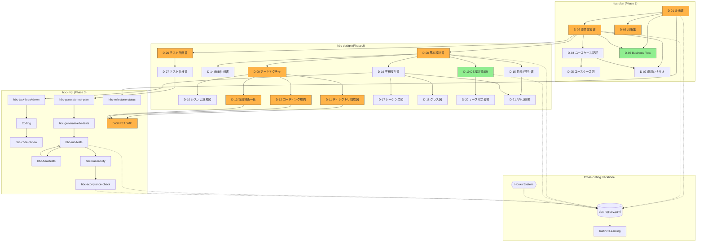

# HBLab Custom Module System — Mind Map

## Tổng quan kiến trúc

```mermaid
mindmap
  root((HBLab Module System))
    **hbc-plan**<br/>Phase 1: Planning
      D-01 企画書<br/>Business Plan
        Mandatory
        Input: Stakeholder
        Output: Goals, Schedule, Budget
      D-02 要件定義書<br/>Requirements/PRD
        Mandatory
        Input: D-01
        Output: FRs, NFRs, Constraints
      D-03 用語集<br/>Glossary
        Mandatory
        Input: All docs
        Output: Term definitions
      D-04 ユースケース記述<br/>Use Case Description
        Optional
        Input: D-02
        Output: Actor flows
      D-05 ユースケース図<br/>Use Case Diagram
        Optional
        Input: D-04
        Output: PlantUML diagram
      D-06 Business Flow<br/>AS-IS / TO-BE
        Mandatory ✅ EXISTS
        Input: D-01, D-02
        Output: Mermaid sequence
      D-07 運用シナリオ<br/>Operational Scenario
        Optional
        Input: D-02, D-04
        Output: Scenario narratives
    **hbc-design**<br/>Phase 2: Design
      Hub Document
        D-08 基本設計書<br/>Basic Design
          Mandatory
          Input: D-02
          Output: Feature list, refs to D-09→D-20
      Architecture
        D-09 アーキテクチャ設計書
          Mandatory
          Input: D-08
          Output: C4, ADR, layers
        D-10 システム構成図
          Optional
          Input: D-09
          Output: Infra diagram
      Standards
        D-11 ディレクトリ構成図
          Mandatory
          Input: D-09
          Output: Folder structure
        D-12 コーディング規約
          Mandatory
          Input: D-09
          Output: Coding rules
        D-13 採用技術一覧
          Mandatory
          Input: D-09
          Output: Tech inventory
      UI/Interface
        D-14 画面仕様書
          Optional
          Input: D-08
          Output: Screen specs
        D-15 外部IF設計書
          Optional
          Input: D-08
          Output: Interface specs
      Detailed Design
        D-16 詳細設計書
          Optional
          Input: D-08
          Output: Module design
        D-17 シーケンス図
          Optional
          Input: D-16
          Output: Mermaid sequence
        D-18 クラス図
          Optional
          Input: D-16
          Output: PlantUML class
      Database
        D-19 データベース設計書<br/>ER Diagram
          Mandatory ✅ EXISTS
          Input: D-08
          Output: Mermaid ER
        D-20 テーブル定義書
          Optional
          Input: D-19
          Output: Column specs
      API
        D-21 API仕様書
          Optional
          Input: D-15, D-16
          Output: Endpoint specs
      Test Design
        D-26 テスト計画書
          Mandatory
          Input: D-02
          Output: Test strategy
        D-27 テスト仕様書
          Optional
          Input: D-26
          Output: Test cases
    **hbc-impl**<br/>Phase 3: Implementation
      Doc Skills
        D-00 README
          Mandatory
          Input: D-11, D-12, D-13
          Output: Project entry
        D-29 プロジェクトサマリー
          Optional
          Input: All docs
          Output: Executive summary
      Workflow Skills
        hbc-task-breakdown
          Input: D-16
          Output: Task list P0→P3
        hbc-code-review
          Input: D-12, D-16
          Output: Review + security scan
        hbc-milestone-status
          Input: D-01 schedule
          Output: Progress tracking
        hbc-acceptance-check
          Input: D-02, traceability
          Output: PASS / CONCERNS / FAIL
      Test Execution Skills
        hbc-generate-test-plan
          Input: D-27 + risk
          Output: Test scenarios
        hbc-generate-e2e-tests
          Input: Test plan
          Output: Playwright .spec.ts
        hbc-run-tests
          Input: .spec.ts
          Output: Results + coverage
        hbc-heal-tests
          Input: Failing tests
          Output: Fix proposals
        hbc-traceability
          Input: Tests + D-02
          Output: Coverage matrix
    **Cross-cutting**<br/>Backbone
      doc-registry.yaml
        documents: status, version, path
        tokens: actors, entities, tech, FRs
        deps: dependency graph
        changelog: change tracking
        validation: check results
      Hooks System
        PostToolUse → auto-update registry
        PreToolUse → validate upstream
        Stop → save session state
        SessionStart → load context
      3-Mode Workflows
        Create: First time generation
        Edit: Update existing doc
        Validate: Check quality
      Incremental Build
        Change 1 doc → cascade only affected
        Skip unchanged downstream
      Composite Skills
        hbc-create-diagram: D-05 + D-17 + D-18
        hbc-create-db-design: D-19 + D-20
        hbc-create-manual: D-28 + D-31
        hbc-create-interface-spec: D-15 + D-21
        hbc-create-test-docs: D-26 + D-27
      Instinct Learning
        Observe patterns across sessions
        Confidence scoring
        Evolve into improved templates
      Selective Install Profiles
        MVP: hbc-plan only
        Standard: plan + design
        Full: plan + design + impl
```

## Dependency Flow

**Legend:**
- 🟢 Xanh = Skill đã có (D-06, D-19)
- 🟠 Cam = Mandatory docs
- Trắng = Optional docs
- Đường nét đứt = Kết nối tới doc-registry backbone

## Thống kê

| Metric | Count |
|--------|-------|
| **Modules** | 3 (plan, design, impl) |
| **D-xx Doc Skills** | 25 (sau composite grouping) |
| **Workflow Skills** | 9 (impl phase) |
| **Cross-cutting Features** | 6 (registry, hooks, 3-mode, incremental, composite, learning) |
| **Mandatory Docs** | 12 |
| **Optional Docs** | 18 |
| **Skills đã có** | 3 (D-06, D-19, INVEST stories) |
| **Skills cần build** | ~31 |
| **Install Profiles** | 3 (MVP, Standard, Full) |
