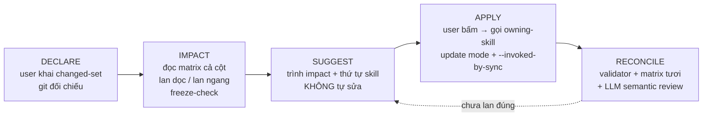
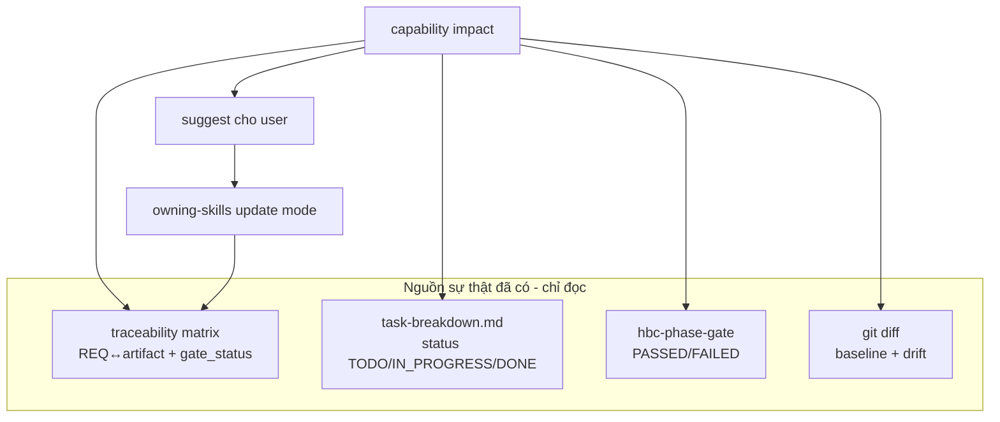
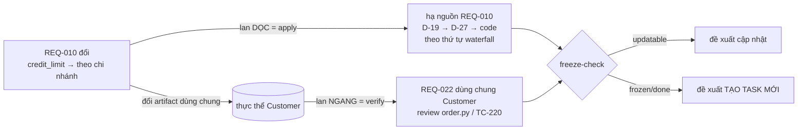

# Architecture Diagrams — capability "impact"

Companion của `SPEC.md`. Chứa sơ đồ; kernel chỉ giữ prose.

## Vòng đời 5 nhịp

## Luồng dữ liệu — chỉ ĐỌC, không sở hữu state

## Hai loại lan (CAP-2)

