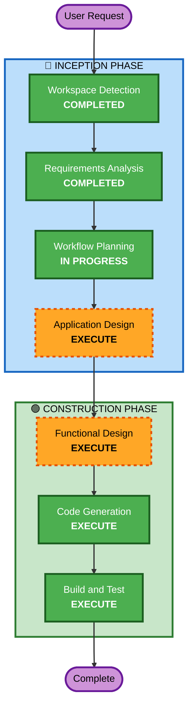

# Execution Plan — hbc-sync Skill

## Detailed Analysis Summary

### Transformation Scope
- **Transformation Type**: New skill addition to existing module
- **Primary Changes**: Thêm skill `hbc-sync` mới + modify existing skills để support auto-chain trigger
- **Related Components**: Tất cả existing create/update skills (cần thêm sync hook ở handoff), hbc-traceability, hbc-shared

### Change Impact Assessment
- **User-facing changes**: Yes — new menu code [SYNC], new CLI command
- **Structural changes**: No — fits within existing skill architecture
- **Data model changes**: No — sử dụng existing document structure
- **API changes**: No — internal skill-to-skill calls
- **NFR impact**: No — tool performance not critical

### Risk Assessment
- **Risk Level**: Low-Medium
- **Rollback Complexity**: Easy (single new directory, can remove cleanly)
- **Testing Complexity**: Moderate (cần test cascade logic + integration with existing skills)

## Workflow Visualization



### Text Alternative
```
INCEPTION PHASE:
  1. Workspace Detection    → COMPLETED
  2. Requirements Analysis  → COMPLETED  
  3. Workflow Planning       → IN PROGRESS
  4. Application Design     → EXECUTE

CONSTRUCTION PHASE:
  5. Functional Design      → EXECUTE
  6. Code Generation        → EXECUTE (ALWAYS)
  7. Build and Test         → EXECUTE (ALWAYS)
```

## Phases to Execute

### 🔵 INCEPTION PHASE
- [x] Workspace Detection (COMPLETED)
- [x] Reverse Engineering (SKIPPED — analyzing only relevant skill patterns, not full RE)
- [x] Requirements Analysis (COMPLETED — requirements.md with 9 REQs)
- [x] User Stories (SKIPPED — developer tooling, no complex user journeys)
- [x] Workflow Planning (IN PROGRESS)
- [ ] Application Design — **EXECUTE**
  - **Rationale**: Cần define component structure, dependency graph data model, orchestration flow, interfaces với existing skills
- [ ] Units Generation — **SKIP**
  - **Rationale**: Single skill, không cần decompose thành multiple units

### 🟢 CONSTRUCTION PHASE
- [ ] Functional Design — **EXECUTE**
  - **Rationale**: Cần thiết kế chi tiết dependency graph, cascade algorithm, stop/ask logic, state management
- [ ] NFR Requirements — **SKIP**
  - **Rationale**: Không có NFR phức tạp, performance target đơn giản (< 30s), no infrastructure
- [ ] NFR Design — **SKIP**
  - **Rationale**: NFR Requirements skipped
- [ ] Infrastructure Design — **SKIP**
  - **Rationale**: No cloud resources, local tool chạy trên máy developer
- [ ] Code Generation — **EXECUTE** (ALWAYS)
  - **Rationale**: Generate SKILL.md, customize.toml, scripts, assets, modify existing skills
- [ ] Build and Test — **EXECUTE** (ALWAYS)
  - **Rationale**: Test cascade logic, integration tests

### 🟡 OPERATIONS PHASE
- [ ] Operations — PLACEHOLDER

## Estimated Timeline
- **Total Stages to Execute**: 5 (Application Design + Functional Design + Code Generation + Build and Test)
- **Estimated Interactions**: 4-6 turns

## Success Criteria
- **Primary Goal**: hbc-sync skill hoạt động đúng cascade flow
- **Key Deliverables**:
  - `src/hbc-sync/SKILL.md` — main skill definition
  - `src/hbc-sync/customize.toml` — configuration
  - `src/hbc-sync/assets/dependency-graph.yaml` — default dependency tree
  - `src/hbc-sync/scripts/` — impact analysis, cascade orchestration
  - Modified existing skills — thêm sync trigger hook tại handoff
- **Quality Gates**:
  - Dependency graph correctly models document relationships
  - Cascade respects dependency order
  - Headless mode returns valid JSON
  - Existing skills unbroken after modification

## Extension Compliance
- **Security Baseline**: N/A — internal developer tooling, no external data, no auth
- **Property-Based Testing**: N/A — not yet opted in, skill is orchestration logic (not data transformation)
