# System Architecture

## System Overview
hbc là một skill-based module. Mỗi đơn vị chức năng là một **skill** (thư mục dưới `src/`) gồm `SKILL.md` (instruction cho LLM) + `customize.toml` (config) + `scripts/` (Python deterministic) + `assets/` (templates) + `references/` (headless contracts). 5 agent điều phối, gọi các workflow skill theo menu code. Một shared library cung cấp structural validation primitives.

## Architecture Diagram

```mermaid
flowchart TD
    subgraph Agents["5 Coordinator Agents"]
        BA["BA Phase 1"]
        ARCH["ARCH Phase 2"]
        QA["QA Phase 2 Test"]
        DEV["DEV Phase 3"]
        TST["TST Phase 4"]
    end

    subgraph P1["Phase 1 Skills"]
        REQ["hbc-create-requirements D-02"]
        GLO["hbc-create-glossary D-03"]
        BFD["hbc-create-business-flow D-06"]
    end

    subgraph P2["Phase 2 Skills"]
        ERD["hbc-create-er-diagram D-19"]
        CS["hbc-create-coding-standards D-12"]
        API["hbc-create-api-spec D-21"]
        TP["hbc-create-test-plan D-26"]
        TS["hbc-create-test-spec D-27"]
        IR["hbc-check-implementation-readiness"]
    end

    subgraph P3["Phase 3 Skills"]
        TB["hbc-task-breakdown"]
        IM["hbc-implement"]
    end

    subgraph P4["Phase 4 Skills"]
        TE["hbc-test-execution"]
        AC["hbc-acceptance-check"]
    end

    subgraph Cross["Cross-cutting"]
        PG["hbc-phase-gate"]
        TR["hbc-traceability"]
        SH["hbc-shared lib"]
    end

    BA --> REQ & GLO & BFD
    ARCH --> ERD & CS & API
    QA --> TP & TS & IR
    DEV --> TB & IM
    TST --> TE & AC
    REQ -.-> SH
    TS -.-> SH
```

## Component Descriptions

### Workflow Skills (15)
- **Type**: Application (LLM-orchestrated workflows)
- **Pattern**: 5-stage (Prerequisites → Discovery → Generation → Validation → Save) cho create skills; +Semantic Review (Lớp 2) ở stage 4b/3b
- **Mode args**: create / update / validate
- **Headless**: tất cả support `--headless` / `-H`

### Agents (5)
- **Type**: Coordinator
- **Responsibilities**: resolve `[agent]` config → embody persona → check predecessor gate → scan phase state → render menu
- **Menu dispatch**: by number / code / fuzzy match

### Shared Library
- **Type**: Internal support (non-invocable)
- **hbc_validation.py**: structure-only parsing, honest verdict
- **Bootstrap**: `sys.path.insert(0, parents[2]/"hbc-shared"/"lib")`

## Data Flow
Document generation flow tuân theo dependency: D-02 → D-03/D-06 → D-19/D-12/D-21 → D-26 → D-27 → task-breakdown → code. Mỗi skill đọc upstream documents, generate output, validate (script + LLM), ghi vào `{planning_artifacts}`.

## Integration Points
- **Config**: `_bmad/config.yaml` + `config.user.yaml`
- **Resolver**: `_bmad/scripts/resolve_customization.py` (3-layer override)
- **Output**: `_bmad-output/` (planning-artifacts, gates, traceability)
- **External**: requires BMM module installed

## Infrastructure Components
- **None** — đây là local developer tooling, không có cloud/deployment. Chạy trong Claude Code / Kiro qua skill mechanism.
