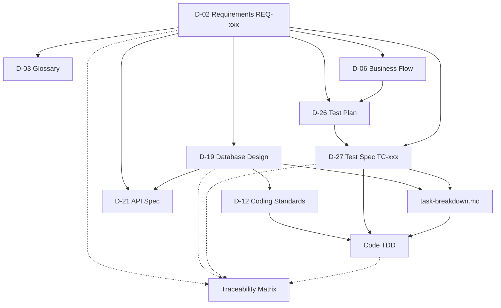

# Dependencies

## Document Dependency Chain (Internal)

### Dependency Detail (verified từ skill inputs)
| Document | Reads (depends on) | Type |
|----------|--------------------|----|
| D-03 Glossary | D-02, project-context.md | Content |
| D-06 Business Flow | PRD/D-02 | Content |
| D-19 Database Design | PRD/D-02, Architecture | Content |
| D-12 Coding Standards | project-context.md, (D-19) | Content |
| D-21 API Spec | D-02 (REQ), D-19 (entities) | Content |
| D-26 Test Plan | D-02 (scope), D-06 (E2E) | Content |
| D-27 Test Spec | D-26, D-02 (TC cases) | Content |
| task-breakdown.md | D-19, D-27 (`--d19 --d27`) | Structural |
| code | D-27 (TDD), D-12 (standards) | Runtime |
| matrix | D-02, D-19, D-27, code | Mapping |

> **Lưu ý cho hbc-sync**: Đây chính là dependency tree mà skill mới sẽ encode trong `dependency-graph.yaml`. Nhận xét: D-27 có nhiều parents (D-26, D-02), task-breakdown có nhiều parents (D-19, D-27) → graph là DAG với shared nodes, không phải tree thuần. Cần xác nhận lại với Application Design (đã model là tree — cần điều chỉnh thành DAG).

## External Dependencies
| Dependency | Purpose | Notes |
|------------|---------|-------|
| BMad Method v6.3.0+ | Host framework | Required |
| BMM Module | Base module | Must install first |
| Python 3.10+ | Script runtime | union type syntax |
| resolve_customization.py | Config resolution | `_bmad/scripts/` |

## Internal Coupling
- Validators → `hbc-shared/lib/hbc_validation.py` (via sys.path bootstrap)
- Agents → skills (via `[[agent.menu]]` skill references)
- Skills → resolve_customization.py (config resolution)
- Skills → nhau (via headless contract, e.g. phase-gate gọi traceability qua on_complete hook)
