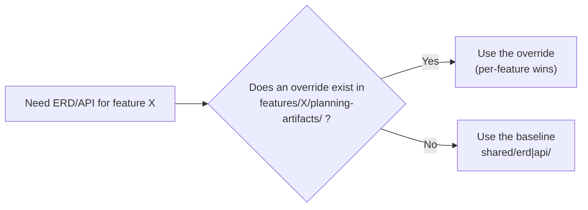
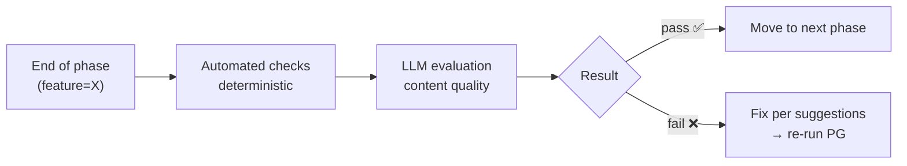
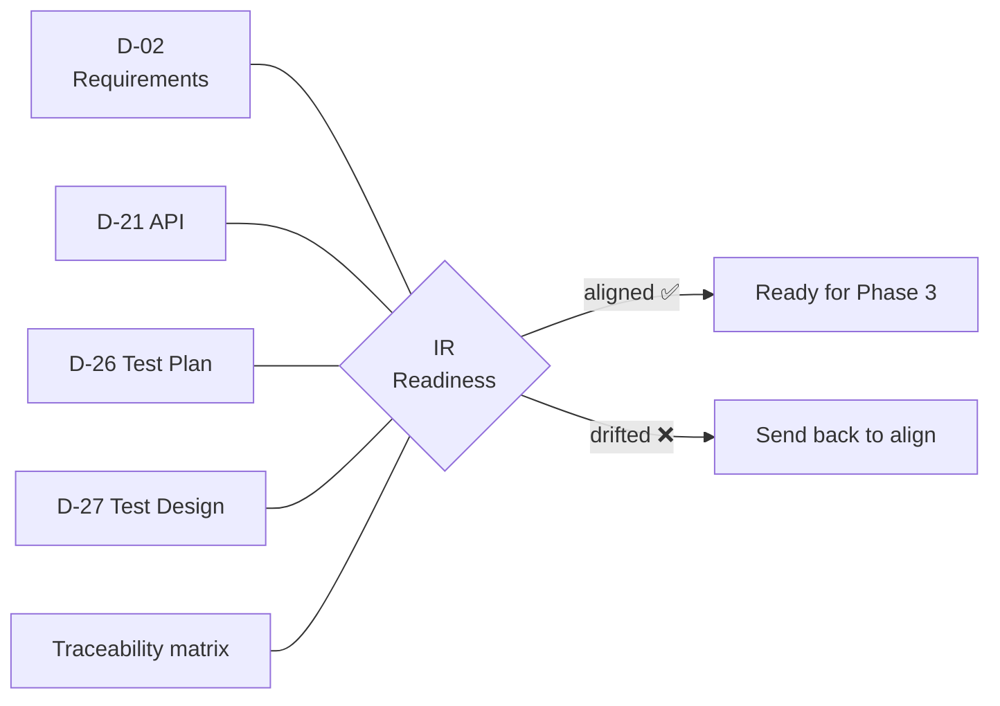
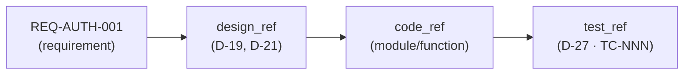
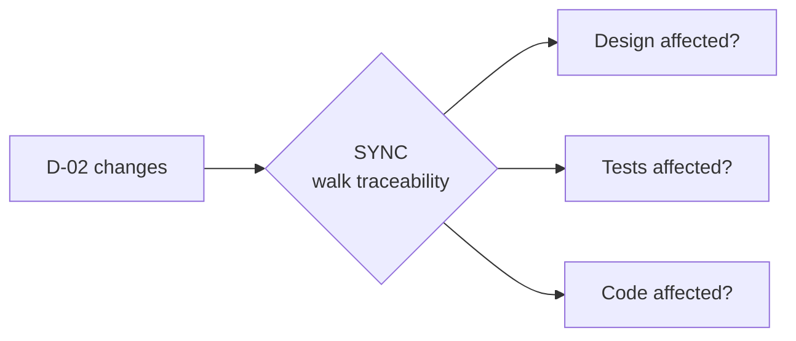
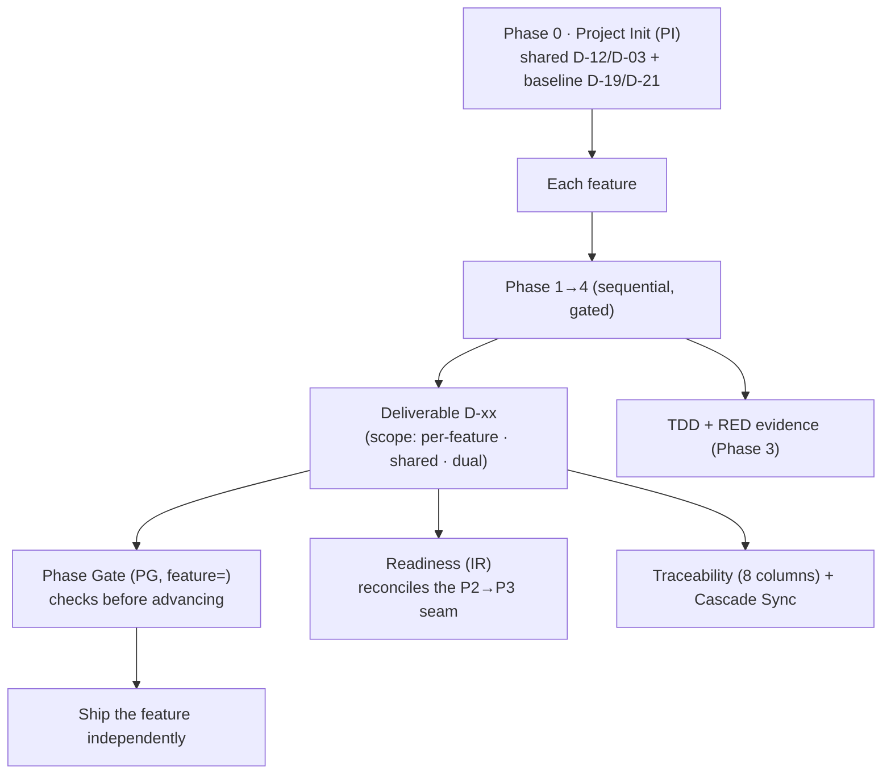

# HBC Core Concepts

> 🌐 **English** · [Tiếng Việt](../../vi/explanation/concepts.md)
>
> 💡 **Explanation** — this document explains *why* HBC is designed the way it is. Not the steps (see the [Tutorial](../tutorials/getting-started-hbc.md)), but the thinking behind them.

HBC is an expansion module for the BMad Method. Its delivery model is **incremental, per-feature delivery**: each feature passes through 4 gated phases + a TDD core, then *ships independently* — no need to wait for other features.

To understand the whole method you need these concepts: **Feature & Scope**, **Phase 0 (Project Init)**, **Phase & Phase Gate**, **Deliverable D-xx**, **Readiness (IR)**, **TDD with RED evidence**, and **Traceability + Cascade Sync**.

> 🧭 **One idea running through everything:** *machines handle structure · humans/LLMs handle meaning.* Hard checks (paths, formats, IDs) are done deterministically by machines; content quality (clear, complete, consistent) is judged by humans or an LLM. Every concept below sits along this dividing line.

---

## 1. Feature & Scope — the unit of delivery, and "who shares what"

HBC does **not** run the whole project in one pass and then deliver. It delivers **incrementally, per feature**: `auth`, `billing`, `report`… each feature is a unit that goes through all 4 phases and ships — independently of the others.

But not everything belongs to a single feature. Some deliverables are **shared** across the whole project. So every deliverable has a **scope**:

| Scope | Deliverables | Where |
| --- | --- | --- |
| **Per-feature** | D-02, D-06, D-26, D-27 | `_bmad-output/features/<feature>/planning-artifacts/` |
| **Shared** | D-03 (glossary), D-12 (coding-standards) | `_bmad-output/shared/glossary/`, `…/coding-standards/` |
| **Dual** | D-19 (erd), D-21 (api) | a shared baseline in `shared/erd\|api/` + an optional per-feature override in `features/<feature>/planning-artifacts/` |

**Why split by scope?** A Glossary or Coding Standards that each feature redefined would contradict itself — so they are *shared*, **deliverables produced once by Phase 0 for the whole project** (not an optional per-feature step — see [section 2](#2-phase-0--project-init-the-mandatory-run-first-step-for-the-whole-project)). Conversely, a requirements spec (D-02) or tests (D-27) are tightly bound to a single feature — so they are *per-feature*. D-19/D-21 are **dual**: a shared baseline built in Phase 0, plus an optional per-feature override.

**Dual = path-existence precedence.** ERD (D-19) and API (D-21) have a **shared baseline** for the whole project, but a feature may need a **local override**. The rule is dead simple:

> 🔎 **Analogy:** the shared baseline is like a *city map*; the per-feature override is like a *zoomed-in district map*. If the zoom exists, use it; otherwise use the city map. No config flag needed — just "does the file exist".

---

## 2. Phase 0 — Project Init: the **mandatory, run-first** step for the whole project

Because shared deliverables serve *every* feature, it would make no sense to let the first feature spawn them. So HBC has **Phase 0 — Project Init** (`PI`, skill `hbc-project-init`) — a **mandatory** step that **runs first**, *before* any feature begins, once for the whole project (re-run to **update it directly** when the groundwork changes).

**Why first?** Phase 0 does two foundational things every feature relies on: it *establishes the project understanding* and *builds the shared groundwork* that each feature stands on. Without this groundwork, the first feature's Phase 1 has no coding standards, glossary, or baseline DB schema to anchor to — so Phase 0 must come first.

**Phase 0 is brownfield-aware.** For an **existing codebase**, Phase 0 *documents the project first*: it scans the source with `bmad-document-project` and builds `project-context.md` via `bmad-generate-project-context` — then **derives the shared deliverables from that analysis**:

- **D-12 Coding Standards** — derived from the existing code conventions.
- **D-03 Glossary** — derived from the project's domain.
- **baseline D-19 ERD** — built from the existing DB schema.
- **baseline D-21 API** — built from the existing endpoints.

For a **greenfield** project (no code yet), these deliverables are created from a PRD/brief/choices rather than from codebase analysis.

**Why once, up front?** So every later feature stands on the same ground: same coding standards, same naming, same baseline DB schema. Phase 0 takes **no** `feature` argument — because it belongs to the whole project by nature; and when the groundwork changes, re-run it to **update the shared deliverables directly**.

> 🔎 **Analogy:** like surveying the plot, then pouring the foundation and running the utilities for the whole site *before* building each individual house. If the plot already has structures (brownfield), survey what's there first, then lay the shared groundwork. Do it once, every house benefits.

---

## 3. Phase — split each feature into 4 ordered stages

For *each* feature, HBC runs **sequentially, with gates** through 4 phases: each phase completes (passes a Phase Gate) before the next begins.

| Phase | Answers the question | Main output |
| --- | --- | --- |
| 1 · Analysis | *What needs to be built?* | Requirements (D-02) |
| 2 · Design + Test Design | *How will we build it? How will we test it?* | DB/API design, test plan (D-26), test design (D-27) |
| 3 · Implementation | *How do we write the code?* | Code (via TDD) |
| 4 · Testing | *Is it correct?* | Acceptance report |

This is a sequential, design-first *skeleton* — but that's only the **discipline inside a single feature** (design-first, lock each milestone), *not* HBC's delivery model. HBC's delivery model is **incremental per-feature delivery**: many small, self-contained feature cycles running at their own pace, rather than one big cycle for the whole project (see [HBC's delivery model](why-incremental-tdd.md#hbcs-delivery-model-feature-by-feature-not-one-pass)).

**Why sequential inside a feature?** Each phase stands on the shoulders of the previous one. You can't design a database without clear requirements; you can't write correct code without a design. Going in order avoids costly rework from misunderstandings baked in early.

> 🔎 **Analogy:** like building *one house* — survey needs → blueprints → build → inspect. Nobody pours the foundation before the blueprints exist. But a whole neighborhood is built house by house — you don't wait for the last one to hand over the first.

---

## 4. Phase Gate — a control checkpoint between phases

A **Phase Gate** (`PG`) is a "checkpoint" at each phase boundary. Since work is now per-feature, each gate **carries `feature=`** so it knows which feature it's closing. Before moving on, the Gate checks whether the current phase is good enough, in two layers:

- **Automated layer (machines handle structure):** hard checks — do the required deliverables exist, are the format/paths correct.
- **LLM layer (humans/LLMs handle meaning):** soft evaluation — is the content clear, complete, consistent.

**Why a Gate?** So errors don't leak into later phases. A vague requirement that slips past Phase 1 becomes a wrong design in Phase 2, wrong code in Phase 3 — the later you catch it, the more expensive the fix. The Gate stops errors at the source.

> 📌 Deliverables required to pass a gate: **D-02, D-12, D-19, D-26, D-27**. Optional: D-03, D-06, D-21.

> 🔎 **Analogy:** like airport security — fail it and you don't board. A "fail" isn't a punishment; it protects the phases downstream.

---

## 5. Deliverable D-xx — handover artifacts with codes

Each phase produces one or more **deliverables** — concrete documents/artifacts, named with a **D-xx** code (D-02, D-19, D-27…).

**Why the codes?** So everyone (and every agent) calls the same thing by the same name. "D-02" is always the Requirements Specification, in any project. Stable codes enable:

- Clear cross-references ("this test case covers a REQ in D-02").
- Phase Gates checking "is the required deliverable present?".
- Traceability linking deliverables together.

Beyond the D-xx code, each deliverable also has a **scope** (per-feature · shared · dual — see [section 1](#1-feature--scope--the-unit-of-delivery-and-who-shares-what)) which decides whether it lives under `features/<feature>/…` or `shared/…`.

**Requirement ID namespace.** Requirements are coded per feature: **`REQ-<FEAT>-NNN`** (e.g. `REQ-AUTH-001`), plus **`REQ-SHARED-NNN`** for shared requirements. The namespace keeps `REQ-AUTH-001` and `REQ-BILLING-001` from colliding. (Legacy `REQ-NNN` still parses, for compatibility.) Test cases are coded **`TC-NNN`**, sequential *within each feature's D-27*.

> 📌 Deliverables are either **required** (⭐) or **optional**. Required ones are the condition for passing a Gate; optional ones are produced when the feature needs them. See the full list in the [Deliverables Glossary](../reference/deliverables-glossary.md).

---

## 6. Readiness (IR) — the "seam" gate at the end of Phase 2

Between design (Phase 2) and coding (Phase 3) there is a **seam** that tends to tear: requirements, design, and tests can drift out of alignment without anyone noticing. The **Readiness check** (`IR`, skill `hbc-check-implementation-readiness`) is the reconciliation gate placed exactly at that seam, *before* you step into Phase 3.

`IR` reconciles **D-02** (requirements) against **D-21** (API), **D-26** (test plan), **D-27** (test design), and the **traceability matrix**:

**Why `IR`?** To catch drift early — things like a requirement with no test covering it, an API endpoint with no test, or a matrix missing a row. If this seam is left unchecked, Phase 3 codes against an inconsistent set of documents.

> 🔎 **Analogy:** like checking that the fabric edges line up *before* you put a stitch in. Discovering the mismatch after you've sewn means unpicking and redoing it.

---

## 7. TDD with RED evidence — write the test first, leave a trace

Phase 3 (`IM`) writes code in a **RED → GREEN → REFACTOR** loop: write a *failing* test first (RED), then write the minimal code to make it *pass* (GREEN), then clean up (REFACTOR).

HBC uses **soft enforcement**: before writing code, you must **record RED evidence** — a trace showing the test was once red. The Phase 3 gate checks for that RED evidence.

**What does "soft" mean?** RED evidence is **self-attested**, not cryptographic proof. HBC trusts the practitioner but *requires a trace to be left behind*. The spirit is **"test-first with RED evidence"**, not merely "tests exist".

**Why test first?** Writing tests after the code tends to become "tests shaped to fit the code" — re-measuring what you just wrote. Writing the test first forces you to state the *expectation* up front, and the RED step proves the test is actually capable of *catching a failure*.

> 🔎 **Analogy:** like setting a mousetrap and checking that it can snap (RED) *before* you trust it works. A trap that has never snapped can't be trusted.

---

## 8. Traceability — the thread from requirement to test, and Cascade Sync

**Traceability** is a **matrix** that answers: *"Has each requirement been designed, coded, and tested?"* In HBC v2 the matrix has **8 columns**:

`feature | req_id | story_id | design_ref | code_ref | test_ref | gate_status | timestamp`

Coverage is computed from three columns — `design_ref` / `code_ref` / `test_ref` — and a REQ missing any of them is a *gap*.

The matrix is kept **per feature**; `TRR` can **roll up across features** to report on the whole project (shared rows counted once). Lifecycle: `TRI` (initialize from REQ IDs) → `TRU` (update at the end of each phase) → `TRA` (final gap audit); `TRR` gives a coverage report anytime.

**Cascade Sync (`SYNC`) — when a document changes.** Deliverables aren't independent: changing D-02 may force edits to design, tests, and code. **Cascade Sync** is *impact analysis*: when a source document changes, `SYNC` walks the traceability matrix to **propose** the updates needed in downstream deliverables/tests/code.

> 📌 `SYNC` **proposes**, it does not silently edit — still following "machines handle structure · humans/LLMs handle meaning": the machine points out *what may be affected*, the human decides *how to fix it*.

**Why it matters?** Traceability answers two questions every project fears: *"Did we forget any requirement?"* (gaps show up immediately) and *"What requirement does this code/test serve?"* (traceable backwards, no "orphan" code). Cascade Sync answers a third: *"If I change this, what else needs to change with it?"*

> 🔎 **Analogy:** the matrix is like a *packing list* — tick off each item as it goes in; at the end the list tells you what's still missing. Cascade Sync is like a *flight-change alert* — change one leg and the system reminds you which connected bookings need rescheduling.

---

## How the concepts fit together

- **Feature & Scope** decide the unit of delivery and who shares what.
- **Phase 0** builds the shared parts once, up front.
- **Phase** splits each feature into stages; **Gate** locks each stage; **IR** guards the seam between design and code.
- **Deliverable** is the concrete output, with a code and a scope.
- **TDD + RED evidence** keeps test-first discipline in Phase 3.
- **Traceability + Cascade Sync** threads everything together so nothing is missed, and propagates change.

> 💬 Not sure what comes next? Ask `bmad-help` — the always-available "what next" helper.

## Read next

- 📘 See the concepts in action: [Get Started with HBC](../tutorials/getting-started-hbc.md).
- 🗺️ Full map of skills & deliverables: [Workflow Map](../tutorials/workflow-map.md).
- 🤔 Why incremental + TDD: [Incremental Delivery & TDD](why-incremental-tdd.md).
- 🔧 Hands-on tasks: [Run a Phase Gate](../how-to/run-a-phase-gate.md) · [Manage Traceability](../how-to/manage-traceability.md).
- 📖 Quickly look up a term: [Concept Glossary](../reference/concept-glossary.md) · [Deliverables Glossary](../reference/deliverables-glossary.md).
