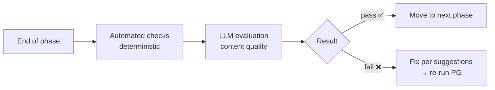
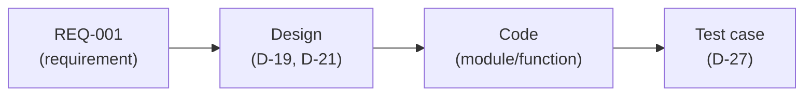
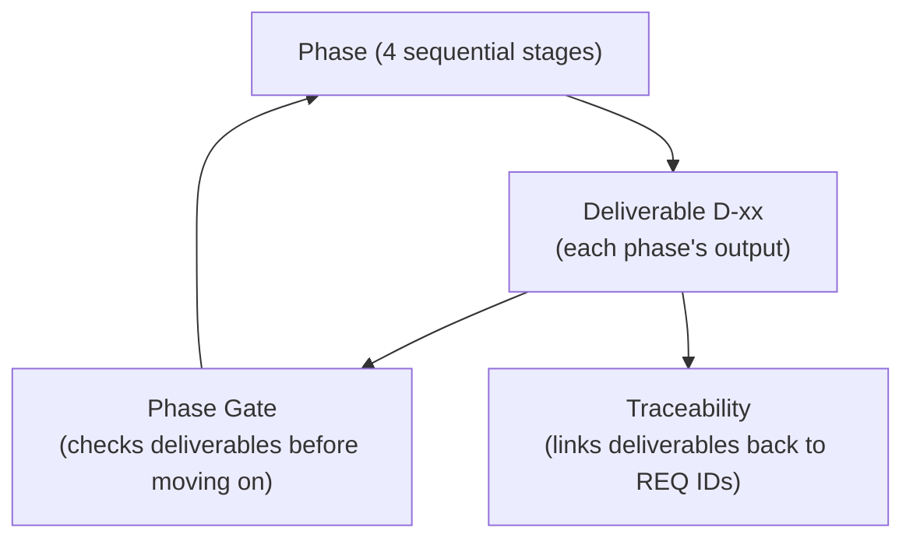

# HBC Core Concepts

> 🌐 **English** · [Tiếng Việt](../../vi/explanation/concepts.md)
>
> 💡 **Explanation** — this document explains *why* HBC is designed the way it is. Not the steps (see the [Tutorial](../tutorials/getting-started-hbc.md)), but the thinking behind them.

HBC rests on 4 concepts. Understand these four and you understand the whole method.

---

## 1. Phase — split work into 4 ordered stages

HBC follows a **waterfall** model: work moves sequentially through 4 phases, each completed before the next begins.

| Phase | Answers the question | Main output |
| --- | --- | --- |
| 1 · Analysis | *What needs to be built?* | Requirements (D-02) |
| 2 · Design | *How will we build it?* | DB design, test plan |
| 3 · Implementation | *How do we write the code?* | Code (via TDD) |
| 4 · Testing | *Is it correct?* | Acceptance report |

**Why sequential?** Each phase stands on the shoulders of the previous one. You can't design a database without clear requirements; you can't write correct code without a design. Going in order avoids costly rework from misunderstandings baked in early.

> 🔎 **Analogy:** like building a house — survey needs → blueprints → build → inspect. Nobody pours the foundation before the blueprints exist.

---

## 2. Deliverable D-xx — handover artifacts with codes

Each phase produces one or more **deliverables** — concrete documents/artifacts, named with a **D-xx** code (D-02, D-19, D-27…).

**Why the codes?** So everyone (and every agent) calls the same thing by the same name. "D-02" is always the Requirements Specification, in any project. Stable codes enable:

- Clear cross-references ("this test case covers a REQ in D-02").
- Phase Gates checking "is the required deliverable present?".
- Traceability linking deliverables together.

> 📌 Deliverables are either **required** (⭐) or **optional**. Required ones are the condition for passing a Gate; optional ones are produced when the feature needs them. See the full list in the [Deliverables Glossary](../reference/deliverables-glossary.md).

---

## 3. Phase Gate — a control checkpoint between phases

A **Phase Gate** (`PG`) is a "checkpoint" at each phase boundary. Before moving on, the Gate checks whether the current phase is good enough, in two layers:

- **Automated layer:** hard checks — do the required deliverables exist, is the format correct.
- **LLM layer:** soft evaluation — is the content clear, complete, consistent.

**Why a Gate?** So errors don't leak into later phases. A vague requirement that slips past Phase 1 becomes a wrong design in Phase 2, wrong code in Phase 3 — the later you catch it, the more expensive the fix. The Gate stops errors at the source.

> 🔎 **Analogy:** like airport security — fail it and you don't board. A "fail" isn't a punishment; it protects the phases downstream.

---

## 4. Traceability — the thread from requirement to test

**Traceability** is a **matrix** that answers: *"Has each requirement been designed, coded, and tested?"*

Each requirement has a **REQ ID** (REQ-001…). The traceability matrix links that REQ ID to everything that flows from it:

**Why it matters?** It answers two questions every project fears:

1. *"Did we forget any requirement?"* → any REQ missing code/test shows up immediately (a gap).
2. *"What requirement does this code/test serve?"* → traceable backwards, no "orphan" code.

The traceability lifecycle: `TRI` (initialize from REQ IDs) → `TRU` (update at the end of each phase) → `TRA` (gap audit at project end). `TRR` gives a coverage report anytime.

> 🔎 **Analogy:** like a packing list for a trip — tick off each item as it goes into the suitcase. At the end, the list tells you what's still missing.

---

## How the four concepts fit together

- **Phase** splits the journey into stages.
- **Deliverable** is the concrete output of each stage.
- **Gate** ensures the current stage meets the bar before advancing.
- **Traceability** threads all deliverables together so no requirement is missed.

## Read next

- 📘 See the four concepts in action: [Get Started with HBC](../tutorials/getting-started-hbc.md).
- 🗺️ Full map of skills & deliverables: [Workflow Map](../tutorials/workflow-map.md).
- 🔧 Hands-on tasks: [Run a Phase Gate](../how-to/run-a-phase-gate.md) · [Manage Traceability](../how-to/manage-traceability.md).
- 📖 Quickly look up a term: [Concept Glossary](../reference/concept-glossary.md).
