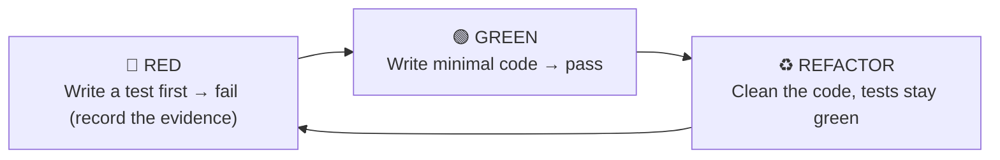
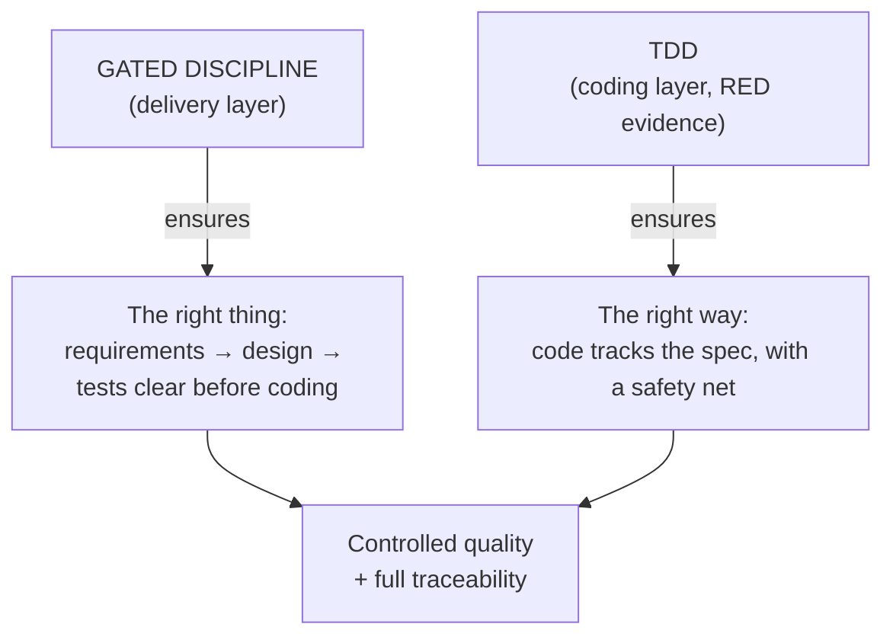
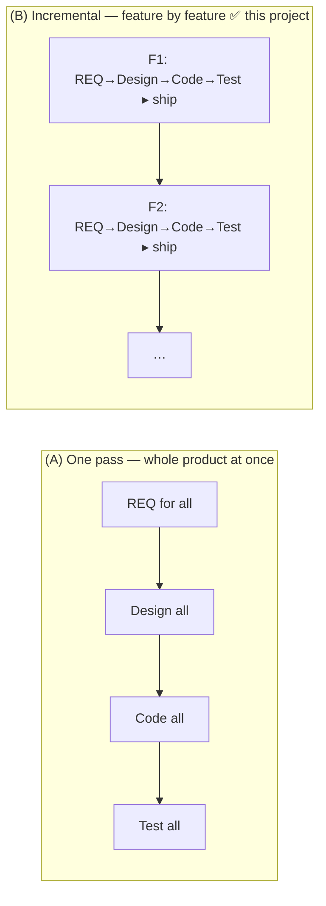

# Why HBC Chooses Incremental + TDD

> 🌐 **English** · [Tiếng Việt](../../vi/explanation/why-incremental-tdd.md)
>
> 💡 **Explanation** — this explains HBC's foundational choice: *incremental delivery, feature by feature (staged delivery)*, where each feature runs a *gated, design-first* cycle combined with *TDD*.

HBC combines two layers: a **gated, design-first process** (each feature runs sequentially through Analysis → Design → Implementation → Testing) at the delivery layer, and **TDD** at the coding layer. The whole thing is applied **per feature** — and v2 *guarantees* that independence by isolating output per feature, gating per feature, and accepting per feature. So at the project level it's **incremental**, not a one-pass build of the whole project. The combination is deliberate.

---

## A gated, design-first cycle: why this discipline is worth it

Within each feature, work moves sequentially: Analysis → Design → Implementation → Testing, each phase finalized (passing a **Phase Gate**, carrying `feature=`) before the next begins.

**Why choose a gated discipline instead of "code now, figure it out as you go"?**

| Context that fits | Reason |
| --- | --- |
| Clear, stable requirements | Few mid-course changes → heavy upfront analysis pays off |
| Need traceability & full docs | Contracts, audits, handover — need explicit D-xx deliverables |
| Outsourcing / multi-party projects | Phase boundaries + gates align all parties at each milestone |
| Gate-controlled quality | Errors are blocked at the Gate, not leaked downstream |

This is exactly HBLAB's environment (ERP, contractual projects with acceptance). A gated discipline + phase gates + traceability give the **control and traceability** that "just code it" struggles to guarantee through documentation.

> ⚠️ **When this discipline does *not* fit:** vague requirements, exploration-by-prototype, fast-moving markets. There, a lighter, fast-iterating approach fits better — don't force the gated frame onto it.

---

## TDD: quality discipline at the coding layer (soft, RED-evidence based)

Inside Phase 3, HBC runs **Test-Driven Development** following the **RED → GREEN → REFACTOR** cycle:

**Soft enforcement, not test-counting.** HBC doesn't merely require "every task has a test" — it requires **test-first with RED evidence**: before writing code, a failing test must exist and be *recorded*. **The Phase 3 gate checks for that RED evidence** (self-attested, not cryptographic proof) — if RED is missing, the gate blocks. This keeps the spirit of TDD without turning it into a rigid ritual.

**Why TDD?**

- **Test-first = an executable specification.** You're forced to understand "what correct means" before coding.
- **RED evidence = proof of test-first.** A failing test recorded *before* the code proves you genuinely wrote the test first — not "tests written after the fact".
- **A safety net for refactoring.** With green tests, you can clean code without fear of breaking it.
- **Aligns with D-27.** The test cases in the Test Spec (D-27, per-feature) are the source for writing the RED test.

---

## Why a gated discipline + TDD work well together

The two layers complement each other:

- **The gated discipline** answers *"are we building the right thing?"* — via thorough upfront analysis & design.
- **TDD** answers *"are we building it the right way?"* — via tests (RED evidence) driving every line of code.

Gated without TDD: pretty docs, but code may drift from the spec. TDD without gates: solid code, but easy to build the wrong thing. Together: **both the right thing and the right way**, with traceability threading the two layers from `REQ-<FEAT>-NNN` to each test case.

---

## Phase 0 and per-feature isolation: how incremental is *guaranteed*

So that "each feature ships independently" isn't just a slogan, v2 sets up concrete scaffolding:

- **Phase 0 — Project Init (run ONCE, project-wide):** before any feature, `hbc-project-init` creates the **shared** deliverables — D-12 Coding Standards, D-03 Glossary, baseline D-19 ERD / D-21 API. Idempotent (skips what exists), no `feature` arg. So every later feature starts on the same foundation without repeating groundwork.
- **Per-feature output isolation:** each feature writes to `_bmad-output/features/<feature>/{planning-artifacts, implementation-artifacts, gates, traceability}/`; shared deliverables live under `_bmad-output/shared/...`. Two features never trample each other's output.
- **Per-feature gates & per-feature acceptance:** the Phase Gate carries `feature=`; the acceptance step (`AC`) closes *one* feature and lets it ship independently — without waiting on any other feature.
- **Per-feature ID namespace:** requirements use `REQ-<FEAT>-NNN` (e.g. `REQ-AUTH-001`), plus `REQ-SHARED-NNN` for shared parts; test cases `TC-NNN` are numbered within *each feature's* D-27. So IDs never collide across features.

These four pieces of scaffolding turn "incremental" from intent into a **structural guarantee**: each feature is a unit with its own boundary, its own gates, its own IDs, shippable on its own.

---

## HBC's delivery model: feature by feature, not one pass

Short answer: **a project's delivery model is decided by *how it's actually executed***, not by "how many steps the tool has" — how you slice scope, write & sign off documents, break down tasks, schedule, and hand over.

HBC is a **gated, deliverable-driven workflow for ONE unit of work** (a feature): REQ → design → code (TDD/RED) → test, with a Phase Gate at each boundary. That sequential-gated ordering describes the discipline *within a feature*; it does *not* by itself decide how the whole project is delivered. The same HBC runs two ways:

> 📌 **In this project:** HBC is delivered as **(B) — incremental, feature by feature**. After Phase 0 lays the shared foundation, each feature goes through all 4 gated stages + TDD, then ships (output isolated in `features/<feature>/...`, with its own gates and acceptance); one feature done, on to the next. So at the project level this is **incremental delivery (staged delivery)**: the *sequential, design-first discipline* (design first, sign off each milestone, full documentation) applies inside a single feature, while the project as a whole ships one feature at a time.

Also, even *within a feature* HBC is softer than a textbook sequential process: tests are **specified early (Design), executed late (Testing)** — a **V** shape; and there's **feedback tolerance** (the gate `fail → fix → re-run`, the `update` mode).

---

## In short

| | Gated discipline | TDD |
| --- | --- | --- |
| Layer | Delivery (macro) | Coding (micro) |
| Answers | Building the right *thing*? | Building it the right *way*? |
| Mechanism | Phase + Gate + Traceability (per-feature) | RED-GREEN-REFACTOR (soft enforcement via RED evidence) |
| Fits when | Stable requirements, need traceability | Whenever you write code |

> 🏷️ **The correct term:** HBC's delivery model is **incremental / staged delivery** — Phase 0 lays the shared foundation once, then each feature is a gated, design-first cycle + TDD, isolated and shipped independently.

## Read next

- 💡 The four foundational concepts: [Core Concepts](concepts.md).
- 📘 See TDD in action in Phase 3: [Get Started with HBC](../tutorials/getting-started-hbc.md#phase-3--implementation-tdd).
