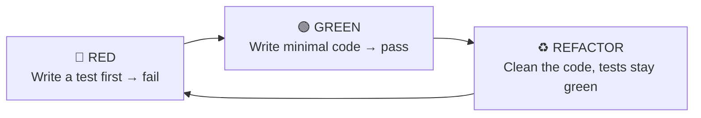
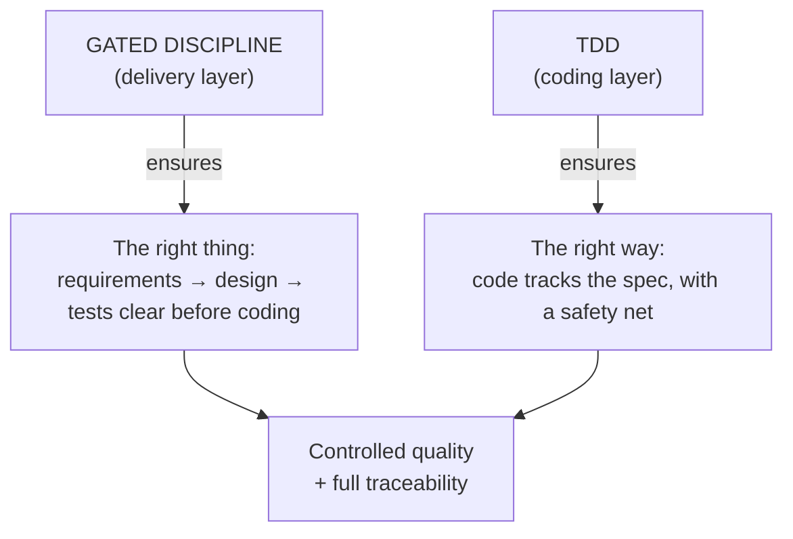
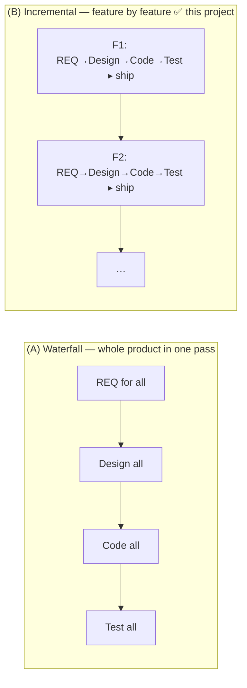

# Why HBC Chooses Incremental + TDD

> 🌐 **English** · [Tiếng Việt](../../vi/explanation/why-incremental-tdd.md)
>
> 💡 **Explanation** — this explains HBC's foundational choice: *incremental delivery, feature by feature*, where each feature runs a *gated, design-first* cycle combined with *TDD*.

HBC combines two layers: a **gated, design-first process** (each feature runs sequentially through Analysis → Design → Implementation → Testing) at the delivery layer, and **TDD** at the coding layer. The whole thing is applied **per feature**, so at the project level it's **incremental**. The combination is deliberate.

---

## A gated, design-first cycle: why this discipline is worth it

Within each feature, work moves sequentially: Analysis → Design → Implementation → Testing, each phase finalized (passing a **Phase Gate**) before the next begins.

**Why choose a gated discipline instead of "code now, figure it out as you go"?**

| Context that fits | Reason |
| --- | --- |
| Clear, stable requirements | Few mid-course changes → heavy upfront analysis pays off |
| Need traceability & full docs | Contracts, audits, handover — need explicit D-xx deliverables |
| Outsourcing / multi-party projects | Phase boundaries + gates align all parties at each milestone |
| Gate-controlled quality | Errors are blocked at the Gate, not leaked downstream |

This is exactly HBLAB's environment (ERP, contractual projects with acceptance). A gated discipline + phase gates + traceability give the **control and traceability** that "just code it" struggles to guarantee through documentation.

> ⚠️ **When this discipline does *not* fit:** vague requirements, exploration-by-prototype, fast-moving markets. There, a lighter, fast-iterating approach fits better — don't force the gated frame onto it.

---

## TDD: quality discipline at the coding layer

Inside Phase 3, HBC mandates **Test-Driven Development** following the **RED → GREEN → REFACTOR** cycle:

**Why TDD?**

- **Test-first = an executable specification.** You're forced to understand "what correct means" before coding.
- **A safety net for refactoring.** With green tests, you can clean code without fear of breaking it.
- **Naturally high test coverage.** Not "tests written after the fact" once the code is done.
- **Aligns with D-27.** The test cases in the Test Spec (D-27) are the source for writing the RED test.

---

## Why a gated discipline + TDD work well together

The two layers complement each other:

- **The gated discipline** answers *"are we building the right thing?"* — via thorough upfront analysis & design.
- **TDD** answers *"are we building it the right way?"* — via tests driving every line of code.

Gated without TDD: pretty docs, but code may drift from the spec. TDD without gates: solid code, but easy to build the wrong thing. Together: **both the right thing and the right way**, with traceability threading the two layers from REQ to each test case.

---

## Is HBC really "pure waterfall"?

Short answer: **"waterfall" is a *project delivery model*, not HBC's architecture.** Whether a project is waterfall is decided by *how it's actually executed* — how you slice scope, write & sign off documents, break down tasks, schedule, and hand over — not by "how many steps the tool has".

HBC is just a **gated, deliverable-driven workflow for ONE unit of work** (a feature): REQ → design → code (TDD) → test, with a Phase Gate at each boundary. That sequential-gated ordering does *not* by itself make the whole project waterfall. The same HBC runs two ways:

> 📌 **In this project:** HBC is delivered as **(B) — incremental, feature by feature**. Each feature goes through all 4 gated stages + TDD, then ships; one feature done, on to the next. So at the project level this is **incremental delivery (staged delivery)**, not a one-pass waterfall. "Waterfall" only describes the *discipline within a single feature* (design first, sign off each milestone, full documentation) — not the project's delivery model.

Also, even *within a feature* HBC is softer than textbook waterfall: tests are **specified early (Design), executed late (Testing)** — a **V** shape; and there's **feedback tolerance** (the gate `fail → fix → re-run`, the `update` mode).

---

## In short

| | Gated discipline | TDD |
| --- | --- | --- |
| Layer | Delivery (macro) | Coding (micro) |
| Answers | Building the right *thing*? | Building it the right *way*? |
| Mechanism | Phase + Gate + Traceability | RED-GREEN-REFACTOR |
| Fits when | Stable requirements, need traceability | Whenever you write code |

> 🏷️ **The correct term:** HBC's delivery model is **incremental / staged delivery** — each feature is a gated, design-first cycle + TDD. Don't label the whole project "waterfall".

## Read next

- 💡 The four foundational concepts: [Core Concepts](concepts.md).
- 📘 See TDD in action in Phase 3: [Get Started with HBC](../tutorials/getting-started-hbc.md#phase-3--implementation-tdd).
