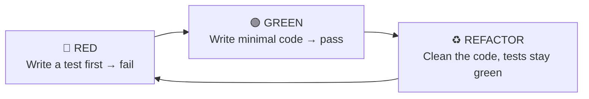
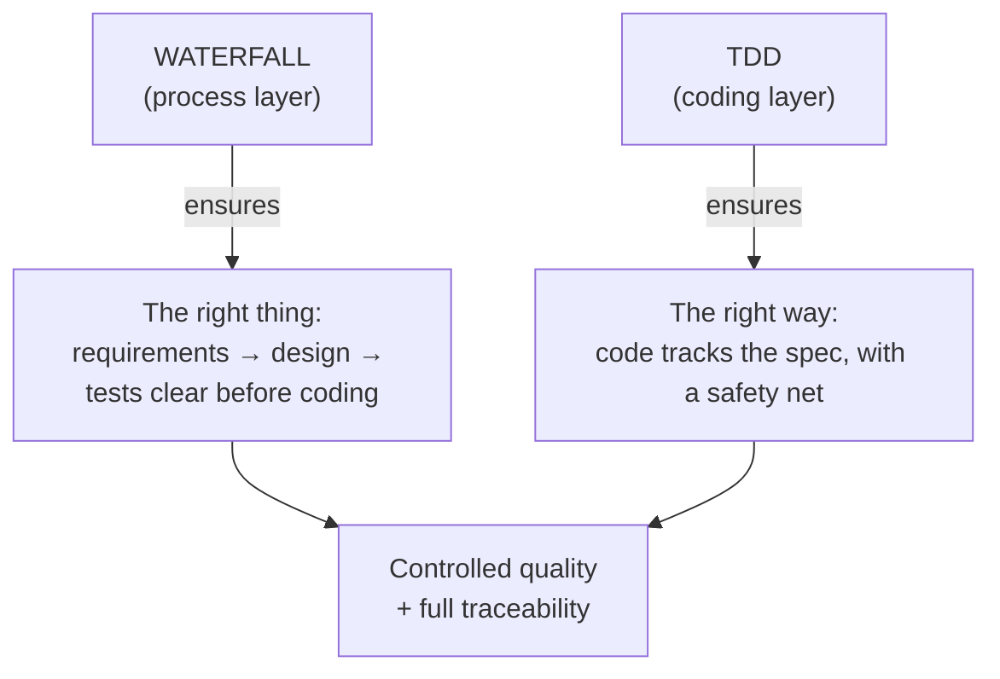

# Why HBC Chooses Waterfall + TDD

> 🌐 **English** · [Tiếng Việt](../../vi/explanation/why-waterfall-tdd.md)
>
> 💡 **Explanation** — this explains HBC's foundational choice. If you've ever wondered "why waterfall in the age of agile?", here's the answer.

HBC combines two seemingly opposing things: **waterfall** at the process layer, and **TDD** at the coding layer. The combination is deliberate.

---

## Waterfall: for requirements that need to be locked down

Waterfall is sequential: Analysis → Design → Implementation → Testing, each phase finalized before the next begins.

**Why waterfall instead of pure agile?**

| Context that fits waterfall | Reason |
| --- | --- |
| Clear, stable requirements | Few mid-course changes → heavy upfront analysis pays off |
| Need traceability & full docs | Contracts, audits, handover — need explicit D-xx deliverables |
| Outsourcing / multi-party projects | Phase boundaries + gates align all parties at each milestone |
| Gate-controlled quality | Errors are blocked at the Gate, not leaked downstream |

This is exactly HBLAB's environment (ERP, contractual projects with acceptance requirements). Waterfall + phase gates + traceability give the **control and traceability** that pure agile struggles to guarantee through documentation.

> ⚠️ **When waterfall does *not* fit:** vague requirements, exploration-by-prototype, fast-moving markets. There, agile/iterative fits better — don't force waterfall onto it.

---

## TDD: quality discipline at the coding layer

Inside Phase 3, HBC mandates **Test-Driven Development** following the **RED → GREEN → REFACTOR** cycle:

**Why TDD?**

- **Test-first = an executable specification.** You're forced to understand "what correct means" before coding.
- **A safety net for refactoring.** With green tests, you can clean code without fear of breaking it.
- **Naturally high test coverage.** Not "tests written after the fact" once the code is done.
- **Aligns with D-27.** The test cases in the Test Spec (D-27) are the source for writing the RED test.

---

## Why waterfall + TDD work well together

The two layers complement each other:

- **Waterfall** answers *"are we building the right thing?"* — via thorough upfront analysis & design.
- **TDD** answers *"are we building it the right way?"* — via tests driving every line of code.

Waterfall without TDD: pretty docs, but code may drift from the spec. TDD without waterfall: solid code, but easy to build the wrong thing. Together: **both the right thing and the right way**, with traceability threading the two layers from REQ to each test case.

---

## In short

| | Waterfall | TDD |
| --- | --- | --- |
| Layer | Process (macro) | Coding (micro) |
| Answers | Building the right *thing*? | Building it the right *way*? |
| Mechanism | Phase + Gate + Traceability | RED-GREEN-REFACTOR |
| Fits when | Stable requirements, need traceability | Whenever you write code |

## Read next

- 💡 The four foundational concepts: [Core Concepts](concepts.md).
- 📘 See TDD in action in Phase 3: [Get Started with HBC](../tutorials/getting-started-hbc.md#phase-3--implementation-tdd).
