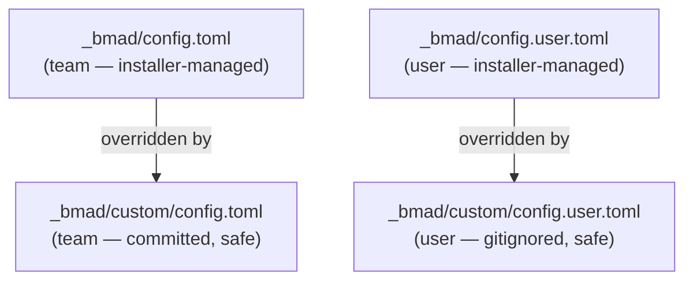

# How to Customize Configuration

> 🌐 **English** · [Tiếng Việt](../../vi/how-to/customize-config.md)
>
> 🔧 **How-to** — change config values (language, output folder, display name) durably.

## Goal

Change a config value **without it being overwritten** when the module is reinstalled.

## The config variables

| Variable | Scope | Description |
| --- | --- | --- |
| `user_name` | User | Display name in agent greetings |
| `communication_language` | User | Language the agent uses with you |
| `document_output_language` | Team | Language for generated documents |
| `output_folder` | Team | Base output directory (default `_bmad-output`) |

## Understand the config layers (important)



> ⚠️ **Don't edit** `_bmad/config.toml` or `_bmad/config.user.toml` directly — they're installer-managed and **will be overwritten** on the next install.

## Two ways to change a value

### Option 1 — Re-run the installer (simple)

Use the **interactive** installer so your existing modules are kept:

```bash
npx bmad-method install
```

The installer remembers your prior answers as defaults; just enter the new value.

> ⚠️ Don't use a bare `npx bmad-method install --custom-source ...` just to change config — without `--modules` it will **remove** the other official modules (`bmm`/`bmb`).

### Option 2 — Pin values via custom files (durable, preferred)

Edit/create the override files — the installer **never touches** them:

- **Team** values (committed): `_bmad/custom/config.toml`
- **User** values (personal, gitignored): `_bmad/custom/config.user.toml`

Example pinning the document language and display name:

```toml
# _bmad/custom/config.toml
[core]
document_output_language = "Tiếng Việt có dấu"
output_folder = "{project-root}/_bmad-output"
```

```toml
# _bmad/custom/config.user.toml
[core]
user_name = "Hanhnt2"
communication_language = "Tiếng Việt có dấu"
```

Values in the custom files **always win** over installer-generated ones.

## Tips

- Put **team-wide** values in `custom/config.toml` (commit them so everyone shares).
- Put **your personal** values in `custom/config.user.toml` (already gitignored).

## Related

- 📘 [Get Started with HBC](../tutorials/getting-started-hbc.md)
- 📖 [Skills Catalog](../reference/skills-catalog.md)
