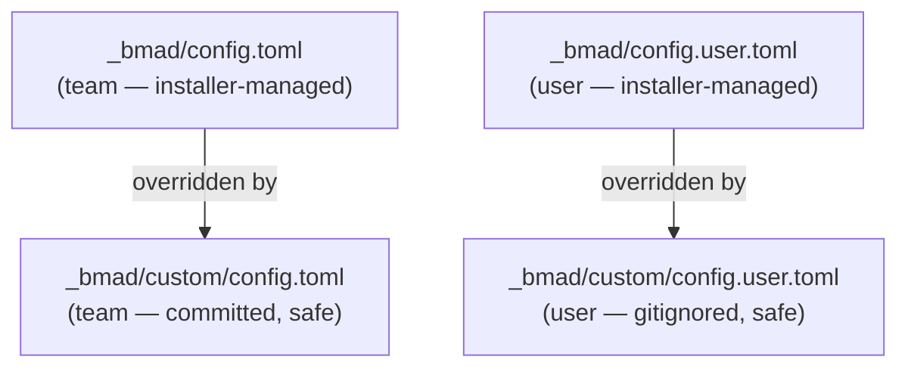
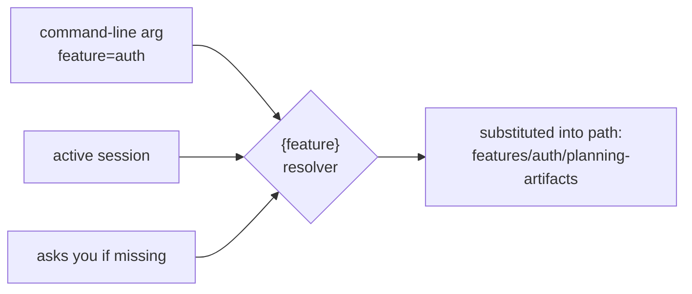
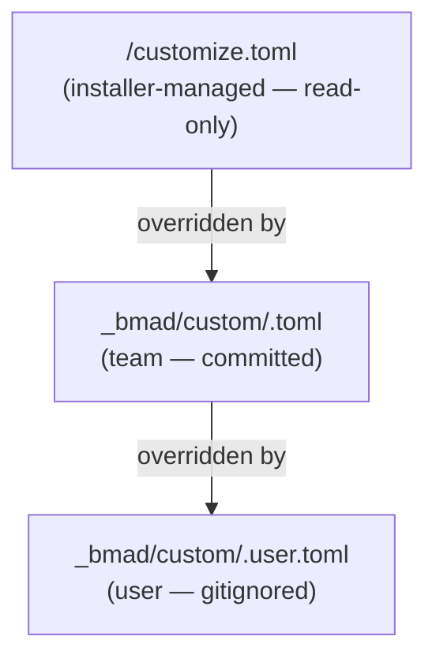

# How to Customize Configuration

> 🌐 **English** · [Tiếng Việt](../../vi/how-to/customize-config.md)
>
> 🔧 **How-to** — change config values (language, output folder, **per-feature / shared output paths**) durably, without them being overwritten on reinstall.

## Goal

Change a config value — especially **where each skill writes its deliverables** — **without it being overwritten** when the module is reinstalled.

## Two kinds of configuration

HBC has two separate customization surfaces:

1. **Project config** (`config.toml`) — language, display name, the root `output_folder`.
2. **Per-skill config** (`<skill>.toml`) — that skill's own `output_dir` / output paths, using the **per-feature / shared / dual** layout.

## Part A — Project config

### The config variables

| Variable | Scope | Description |
| --- | --- | --- |
| `user_name` | User | Display name in agent greetings |
| `communication_language` | User | Language the agent uses with you |
| `document_output_language` | Team | Language for generated documents |
| `output_folder` | Team | Base output directory (default `_bmad-output`) — the root for **all** per-feature/shared paths |

### The config layers (important)



> ⚠️ **Don't edit** `_bmad/config.toml` or `_bmad/config.user.toml` directly — they're installer-managed and **will be overwritten** on the next install.

### Two ways to change a value

#### Option 1 — Re-run the installer (simple)

Use the **interactive** installer so your existing modules are kept:

```bash
npx bmad-method install
```

The installer remembers your prior answers as defaults; just enter the new value.

> ⚠️ Don't use a bare `npx bmad-method install --custom-source ...` just to change config — without `--modules` it will **remove** the other official modules (`bmm`/`bmb`).

#### Option 2 — Pin values via custom files (durable, preferred)

Edit/create the override files — the installer **never touches** them:

- **Team** values (committed): `_bmad/custom/config.toml`
- **User** values (personal, gitignored): `_bmad/custom/config.user.toml`

```toml
# _bmad/custom/config.toml
[core]
document_output_language = "Tiếng Việt có dấu"
output_folder = "{project-root}/_bmad-output"
```

```toml
# _bmad/custom/config.user.toml
[core]
user_name = "Hanhnt2"
communication_language = "Tiếng Việt có dấu"
```

Values in the custom files **always win** over installer-generated ones.

## Part B — Per-skill output paths (per-feature / shared layout)

Every HBC skill has its own `customize.toml` (read-only, installer-managed) declaring where that skill writes its deliverable. These paths **no longer use the old flat layout** (`_bmad-output/planning-artifacts/...`) — they follow a **scope**:

| Scope | Where it writes | Example skills |
| --- | --- | --- |
| **Per-feature** | `{output_folder}/features/{feature}/planning-artifacts` (or `implementation-artifacts`) | `REQ` D-02, `BFD` D-06, `TP` D-26, `TS` D-27 |
| **Shared** (project-wide) | `{output_folder}/shared/{coding-standards \| glossary}` | `CS` D-12, `GLO` D-03 |
| **Dual** (ERD/API) | baseline **shared** `{output_folder}/shared/{erd \| api}` **+** per-feature override | `ERD` D-19, `API` D-21 |

### `{feature}` is resolved at runtime

The `{feature}` placeholder in a path is replaced with the **feature slug** at run time, in priority order:



Only paths that **contain** `{feature}` are substituted. **Shared** paths have no `{feature}`, so they write to a single fixed location for the whole project.

### Dual skills (ERD/API): two paths, path-existence precedence

The `ERD` and `API` skills declare **both** a shared baseline path and a per-feature override path:

```toml
# excerpt from src/hbc-create-er-diagram/customize.toml (read-only)
er_diagram_output_path  = "{output_folder}/shared/erd/D-19-database-design.md"
er_diagram_feature_path = "{output_folder}/features/{feature}/planning-artifacts/D-19-{feature}-database-design.md"
```

Rule: **the per-feature override wins if it exists** (path-existence precedence). No `feature` → use the shared baseline.

### Override layers (same as project config)



Merge rule: **scalars → override wins** · **arrays (`persistent_facts`, `activation_steps_*`) → append**.

> ⚠️ Don't edit the `customize.toml` inside a skill folder — it's **overwritten on every update**. Always override via `_bmad/custom/<skill>.toml`.

### Example 1 — change a **per-feature** skill's path

Move `REQ`'s D-02 output into a dedicated `requirements` folder (still per-feature):

```toml
# _bmad/custom/hbc-create-requirements.toml
[workflow]
# scalar → override wins; {feature} is still substituted by the resolver at run time
output_dir = "{output_folder}/features/{feature}/requirements"
```

When you run `REQ create feature=auth`, the file is written to `_bmad-output/features/auth/requirements/`.

### Example 2 — change a **shared** skill's path

Change where `GLO` writes D-03 (project-wide glossary — no `{feature}`):

```toml
# _bmad/custom/hbc-create-glossary.toml
[workflow]
glossary_output_path = "{output_folder}/shared/glossary/GLOSSARY.md"
```

The file always writes to a single project-wide location, independent of any feature.

## Tips

- Put **team-wide** values in `custom/config.toml` and `custom/<skill>.toml` (commit them so everyone shares).
- Put **your personal** values in `custom/config.user.toml` and `custom/<skill>.user.toml` (already gitignored).
- Keep the `{output_folder}` and `{feature}` placeholders in paths — the resolver substitutes them at run time; hard-coding a path breaks the per-feature/shared layout.

## Related

- 📘 [Get Started with HBC](../tutorials/getting-started-hbc.md)
- 📖 [Skills Catalog](../reference/skills-catalog.md)
- 📖 [Deliverables Glossary (D-xx)](../reference/deliverables-glossary.md)
- 🔗 [Use Headless Mode](use-headless-mode.md)
