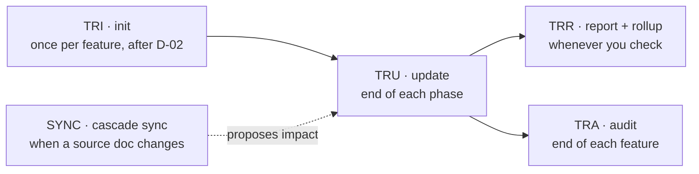
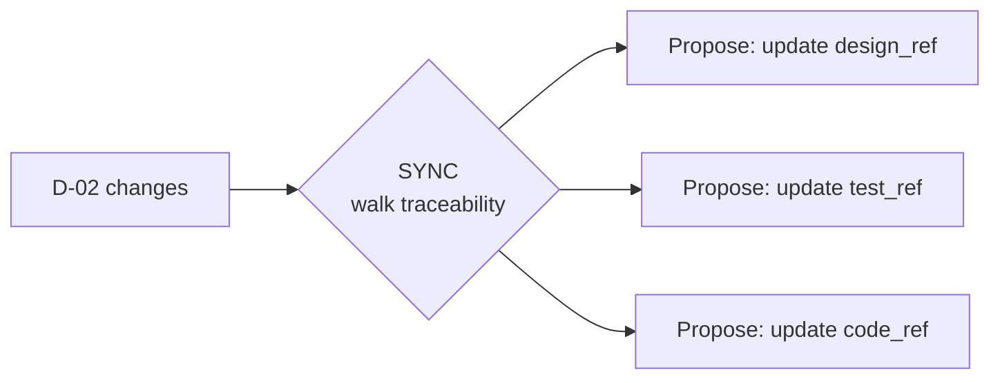

# How to Manage Traceability

> 🌐 **English** · [Tiếng Việt](../../vi/how-to/manage-traceability.md)
>
> 🔧 **How-to** — operate the traceability matrix **per feature** and roll it up across features. To understand *what traceability is & why*, see [Core Concepts](../explanation/concepts.md#8-traceability--the-thread-from-requirement-to-test-and-cascade-sync).

## Goal

Ensure every requirement (`REQ-<FEAT>-NNN` or `REQ-SHARED-NNN`) has matching design, code, and tests — nothing missed, nothing "orphaned". HBC ships **incrementally, per feature**, so the matrix is per feature too: you can ship one feature without waiting on another.

## The 8-column matrix

In HBC v2, each matrix row has **8 columns**:

| Column | Meaning |
| --- | --- |
| `feature` | Feature slug (e.g. `auth`) — `SHARED` for shared requirements |
| `req_id` | `REQ-<FEAT>-NNN` (e.g. `REQ-AUTH-001`) or `REQ-SHARED-NNN` |
| `story_id` | Related user story |
| `design_ref` | Design reference (D-19 ERD / D-21 API…) |
| `code_ref` | Code reference (file/function) |
| `test_ref` | Test reference (TC-NNN in D-27) |
| `gate_status` | Most recent Phase Gate status |
| `timestamp` | Last update time |

> 📊 **Coverage** is computed over the three columns `design_ref` / `code_ref` / `test_ref`: a REQ has a "complete chain" when all three carry a value.

Each feature's matrix lives at `_bmad-output/features/<feature>/traceability/`.

## build-graph / matrix-as-view

The matrix is **not** a table you hand-maintain — it is a **VIEW (matrix-as-view)** derived from a **build-graph kernel**: artifacts are nodes, and the REQ→design→code→test edges are computed from the `sources:` field each node declares. Coverage and drift come **FROM the graph** (e.g. `missing_edges` = a REQ defined in D-02 with no matrix row), not from you typing the cells correctly.

`TRU` still **records the mappings** (fills the references into the cells), but the coverage/drift numbers you read are re-derived live from the build-graph each run — so staleness can't be silently forgotten.

> 📐 The graph also enforces **v_pair** (each present design deliverable must carry its paired test-level edge). And the **cross-feature** blast-radius re-baseline is a separate engine — `hbc-rebaseline` (`[RBL]`), not part of the 4 commands here.

## The 4-command lifecycle



| Step | Command | When | Result |
| --- | --- | --- | --- |
| 1. Initialize | `TRI` | **Once per feature**, after D-02 is final | 8-column matrix from the feature's REQ IDs |
| 2. Update | `TRU` | End of **each** phase | Fill `design_ref` / `code_ref` / `test_ref` / `gate_status` / `timestamp` |
| 3. Report | `TRR` | Anytime | Per-feature coverage + **rollup** across features |
| 4. Audit | `TRA` | End of each feature (Phase 4) | Gap list + severity |
| ➕ Cascade Sync | `SYNC` | When a source document changes | Cascade impact analysis (read-only) + downstream fix proposals |

Add `-H` to any command to run headless. Per-feature commands need `feature=<slug>` when headless — see [Headless mode](use-headless-mode.md).

## Step by step

### 1. Initialize (once per feature)

After the feature's D-02 is complete and REQ IDs exist (`REQ-<FEAT>-NNN`):

```
TRI feature=auth
```

Creates the matrix at `_bmad-output/features/auth/traceability/`. Each row is a REQ ID; the other seven columns stay empty until `TRU` fills them.

> ⚠️ Run `TRI` **once per feature** only. Re-running may overwrite that feature's existing matrix.

### 2. Update after each phase

At the end of each phase (before running `PG`):

```
TRU feature=auth
```

`TRU` fills columns as the phases progress:

- `design_ref` — after **Phase 2** (Design: ERD/API).
- `test_ref` — after **Phase 2** (Test Design: D-27), topped up in **Phase 4**.
- `code_ref` — after **Phase 3** (Implementation).
- `gate_status` + `timestamp` — each time you pass a Phase Gate.

### 3. Report coverage + rollup

```
TRR feature=auth     # coverage for the auth feature only
TRR                  # rollup across all features
```

`TRR` tells you how many REQ IDs have a complete traceability chain (all of `design_ref` + `code_ref` + `test_ref`).

> 🧮 **Cross-feature rollup:** when you run `TRR` without `feature=`, the per-feature matrices are merged. `REQ-SHARED-NNN` (shared) rows are **counted once**, so the numbers aren't inflated when several features reference the same shared requirement.

### 4. Gap audit at feature end

```
TRA feature=auth
```

Lists which of the feature's REQs still lack links (missing `design_ref` / `code_ref` / `test_ref`) and classifies severity. Target: **0 gaps** before you accept that feature.

> 🔎 **drift-watch:** a *filled* `test_ref` can still go stale as D-27 grows (test cases change/are added and the cell no longer matches). The audit **flags** this; re-run **`TRU` Phase-2** to backfill it back into alignment.

## Cascade Sync — when a source document changes

Deliverables aren't independent: changing D-02 (requirements) may force edits to design (D-19/D-21), tests (D-27), and code. `SYNC` **proposes the impact**: it walks the traceability matrix to suggest the updates needed in downstream deliverables/tests/code — that suggestion doesn't edit anything itself.

> ⚠️ **But cascade is now ENFORCED, not just proposed.** A **cascade-precheck** step runs before a document can be considered "complete": if there is an **untraced change**, it **BLOCKS** with the code `untraced_change` / `cascade_required` — the document can't reach complete until you **backfill** the missing traceability edge and re-run. In short: `SYNC` *proposes* the downstream work; cascade-precheck *forces* you not to miss a change.



```
SYNC feature=auth
```

`SYNC` returns per-skill suggestions (e.g. "re-run `ERD` for REQ-AUTH-003", "add `TS` for REQ-AUTH-007"). You decide which to apply, then re-run `TRU` to update the matrix.

## Handling gaps

1. Run `TRA feature=<slug>`, read the gap list.
2. For each gap, add what's missing (e.g. missing `test_ref` → go back to `TS`/`TE` and create a test for that REQ).
3. If the gap stems from a source document that just changed, run `SYNC feature=<slug>` to see what else needs updating.
4. Re-run `TRU` then `TRA` to confirm the gap is closed.

> 💡 Not sure what comes next? Call `bmad-help` for a skill suggestion based on your current state.

## Related

- 🔗 [Run a Phase Gate](run-a-phase-gate.md)
- 🔗 [Headless mode](use-headless-mode.md)
- 📖 [Deliverables Glossary](../reference/deliverables-glossary.md)
- 📖 [Skills Catalog](../reference/skills-catalog.md)
