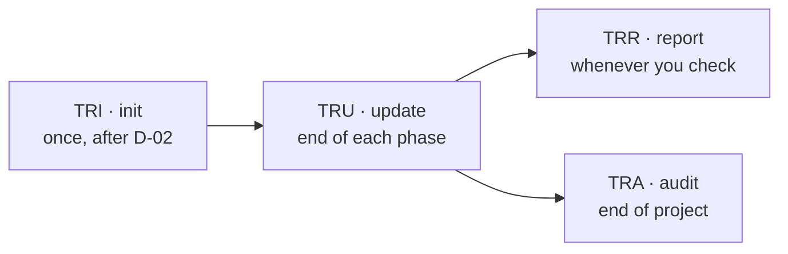

# How to Manage Traceability

> 🌐 **English** · [Tiếng Việt](../../vi/how-to/manage-traceability.md)
>
> 🔧 **How-to** — operate the traceability matrix across the project lifecycle. To understand *what traceability is & why*, see [Core Concepts](../explanation/concepts.md#4-traceability--the-thread-from-requirement-to-test).

## Goal

Ensure every requirement (REQ ID) has matching design, code, and tests — nothing missed, nothing "orphaned".

## The 4-command lifecycle



| Step | Command | When | Result |
| --- | --- | --- | --- |
| 1. Initialize | `TRI` | **Once**, after D-02 is final | Matrix from REQ IDs |
| 2. Update | `TRU` | End of **each** phase | Fill new columns (design/code/test/gate) |
| 3. Report | `TRR` | Anytime | Coverage: how many REQs have full chains |
| 4. Audit | `TRA` | End of project (Phase 4) | Gap list + severity |

Add `-H` to any command to run headless.

## Step by step

### 1. Initialize (once)

After D-02 is complete and REQ-xxx IDs exist:

```
TRI
```

Creates the matrix under `{output_folder}/traceability` (default `_bmad-output/traceability`).

> ⚠️ Run `TRI` **once** only. Re-running may overwrite the existing matrix.

### 2. Update after each phase

At the end of each phase (before running `PG`):

```
TRU
```

`TRU` fills columns: `design_ref` (after Phase 2), `code_ref` (after Phase 3), `test_ref` (after Phase 2/3), `gate_status`.

### 3. Check coverage anytime

```
TRR
```

Tells you how many REQ IDs have a complete traceability chain — use it to track progress.

### 4. Gap audit at project end

```
TRA
```

Lists which REQs still lack links (missing design/code/test) and classifies severity. Target: **0 gaps** before acceptance.

## Handling gaps

1. Run `TRA`, read the gap list.
2. For each gap, add what's missing (e.g. missing `test_ref` → go back to `TS`/`TE` and create a test for that REQ).
3. Re-run `TRU` then `TRA` to confirm the gap is closed.

## Related

- 🔗 [Run a Phase Gate](run-a-phase-gate.md)
- 📖 [Deliverables Glossary](../reference/deliverables-glossary.md)
