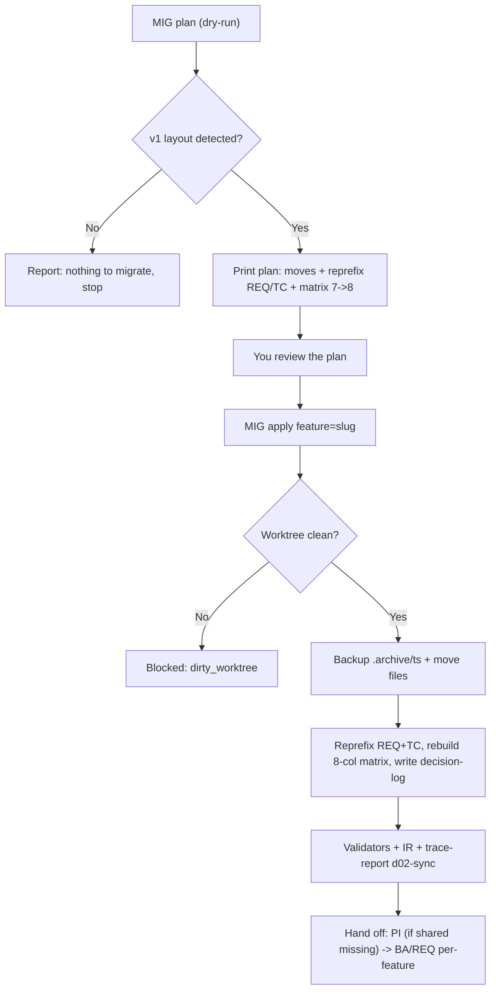

# How to Migrate a Project from HBC v1 to v2

> 🌐 **English** · [Tiếng Việt](../../vi/how-to/migrate-from-v1.md)
>
> 🔧 **How-to** — do one specific task: take a project that ran **HBC v1 (flat layout)** up to the **v2 layout (per-feature + shared)** safely. To understand *why v2 moved to per-feature*, see [Why Incremental + TDD](../explanation/why-incremental-tdd.md).

## Goal

You have a project **running HBC v1**: outputs sit flat under `_bmad-output/{planning-artifacts,implementation-artifacts,gates,traceability}/`, IDs are `REQ-NNN`, and the traceability matrix has 7 columns. HBC v2 moved to a **per-feature + shared** model. This guide gets you there **safely** (preview → review → apply), then hands you back to the normal per-feature flow.

## When you need it

Run `MIG` when the project shows **v1 (flat) layout signs**:

- flat outputs `_bmad-output/planning-artifacts/D-*`, `implementation-artifacts/`, `gates/`, `traceability/`;
- requirement IDs of the form `REQ-NNN` (no feature prefix yet);
- a **7-column** traceability matrix (no `feature` column).

If the project is already on v2 (or there's nothing to migrate), `MIG` reports **"nothing to migrate"** and stops — it breaks nothing.

## What changes (v1 → v2)

| Aspect | v1 (flat) | v2 (per-feature + shared) |
| --- | --- | --- |
| Layout | `_bmad-output/{planning-artifacts,implementation-artifacts,gates,traceability}/` | `_bmad-output/features/<feature>/{…}/` + `_bmad-output/shared/{coding-standards,glossary,erd,api}/` |
| Requirement IDs | `REQ-NNN` | `REQ-<FEAT>-NNN` (+ `REQ-SHARED-NNN`) |
| Test-case IDs | `TC-NNN` (flat) | `TC-NNN` per-feature |
| Traceability matrix | 7 columns | **8 columns** (adds a leading `feature` column) |
| D-codes | D-08 (Architecture), D-17 (Behavioral) | **reconciled** to canonical: D-08 → D-09, D-17 → D-16 |

**Artifact routing:** D-12 Coding Standards / D-03 Glossary + baseline D-19 ERD / D-21 API → `shared/`; while D-02, D-06, D-26, D-27, the task breakdown, gates and the matrix → `features/<feature>/`.

## The safe flow: plan → review → apply

Migration is a **one-time, file-moving (destructive)** operation, so always go through two steps: **preview (dry-run)** first, then **apply**.

### 1. Preview (dry-run, default)

```
MIG plan
```

`MIG plan` **writes nothing**. It prints the full plan for you to inspect:

- each `src → dst` move (which files go to `shared/`, which to `features/<feature>/`);
- the `REQ-NNN → REQ-<FEAT>-NNN` **and** `TC-NNN` re-prefix map;
- the **D-code reconcile** list (`dcode_rename`): D-08 → D-09, D-17 → D-16;
- the plan to rebuild the matrix from 7 → 8 columns (injecting the `feature` column).

> ⚠️ In headless mode (`-H`), the default is also **dry-run** returning a plan JSON. To actually move files, headless needs both `feature=<slug>` **and** `--apply`. Missing feature → blocked with `feature_required`; multiple features in a flat doc → blocked with `multi_feature_ambiguous`. Pick the autonomy mode — `--strict` (stop at the first domain decision) or `--assumptions-allowed` (CI default) — see [Autonomy (A5)](use-headless-mode.md#autonomy-a5-strict-vs-assumptions-allowed).

### 2. Review the plan

Read the preview carefully. In particular check that the **assigned feature is correct** and that **D-19/D-21 go to `shared/` (baseline)**, not per-feature (only D-06 is per-feature).

### 3. Apply

```
MIG apply feature=<slug>
```

On `apply`, `MIG` will: move files; re-prefix **REQ and TC** in the moved D-02/D-26/D-27 + matrix; **reconcile D-codes** (rename D-08 → D-09, D-17 → D-16); **rebuild the 8-column matrix** (injecting the `feature` column); and write a **decision-log** of every change.

## Backup & dirty-guard

Before moving anything, `apply` always:

- **checks the worktree is clean (dirty-guard):** if there are uncommitted changes, `MIG` **refuses** to move (code `dirty_worktree`) — commit or stash first, or use `--force` if you're sure;
- **backs up first:** copies the current state into `.archive/<timestamp>/` (or records a git stash note) so you can roll back.

## One feature per run

In v1, **each `apply` handles a single feature** — always pass `feature=<slug>`. If a flat doc holds requirements for **multiple features**, `MIG` **warns** (`multi_feature_ambiguous`) and asks you to split manually, then run `MIG apply feature=<slug>` **for each feature in turn**. Watch for **TC number collisions across features** after the split.

## Idempotency (safe to re-run)

`MIG` detects artifacts **already on v2** and skips them. Re-running on an already-migrated project (or one with nothing to migrate) reports **"nothing to migrate"** without overwriting. If `shared/` is already populated (because `PI` ran), `MIG` **won't overwrite** it — avoiding double-creation.

**The D-code reconcile is idempotent too:** a file already on its canonical code (D-09/D-16) is **not re-renamed**.

### A mixed D-code tree (MIXED) — `dcode_collision`

If the tree has **both the legacy and the canonical code** present (e.g. both D-08 *and* D-09 exist), `MIG` won't merge them for you — it reports **`dcode_collision`** and **leaves you to adjudicate** (which file to keep, how to merge content) before reconciling further.

## Verify & hand off

After `apply`, confirm the v2 layout is valid before returning to the normal flow:

1. **Run the validators** on the migrated artifacts (each deliverable must PASS its own validator).
2. **Reconcile D-02 ↔ tests/IR:** run `IR feature=<slug>` to PASSED (reconciles D-02 ↔ D-21/D-26/D-27 + the matrix) and check d02-sync via the trace-report.
3. **Hand off to the per-feature flow:** if `shared/` is still missing pieces, run `PI` once; then continue `BA → REQ …` **per feature** as usual.

> 💡 After migration the matrix is already 8-column — run `TRU feature=<slug>` to update it, then `PG <n> feature=<slug>` like any other feature.

## Migration flow



## Tips

- Always run `MIG plan` (dry-run) first, read the preview carefully, then `apply`.
- Commit or stash all changes **before** `apply` so the dirty-guard doesn't block you.
- One feature per run — split multi-feature docs manually and run them in turn.
- After migration, don't re-create shared with `PI` if `shared/` is already populated.
- Not sure what's next? Ask `bmad-help` for a suggestion.

## Related

- 🚀 [Project Init (Phase 0)](../tutorials/getting-started-hbc.md)
- 🔗 [Manage Traceability](manage-traceability.md)
- 🤖 [Use Headless Mode](use-headless-mode.md)
- 🗺️ [Workflow Map](../tutorials/workflow-map.md)
- 📖 [Skills Catalog](../reference/skills-catalog.md)
