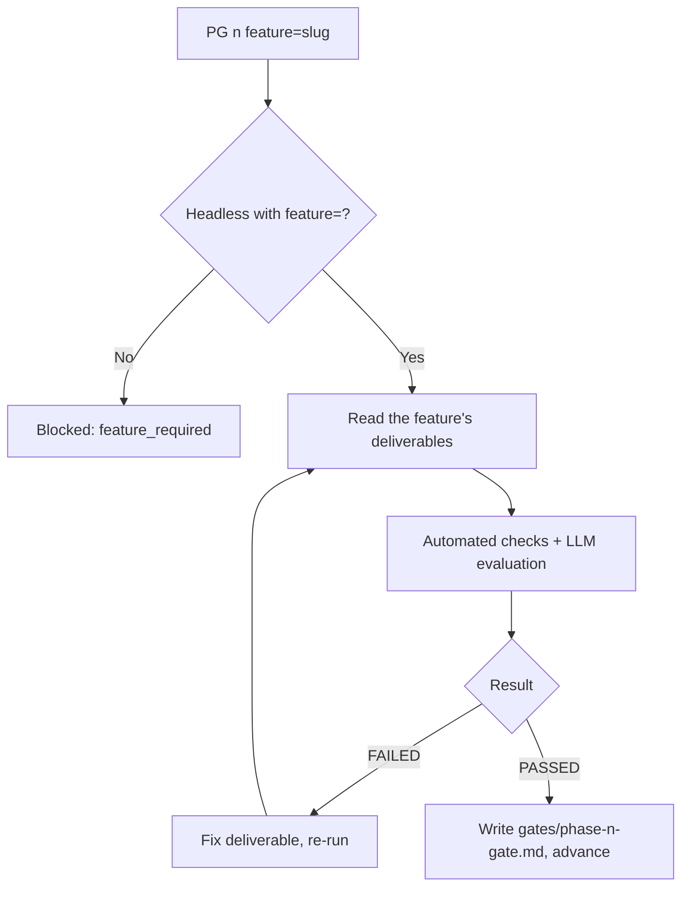

# How to Run a Phase Gate

> 🌐 **English** · [Tiếng Việt](../../vi/how-to/run-a-phase-gate.md)
>
> 🔧 **How-to** — do one specific task: run and handle the result of a Phase Gate for **one feature**. To understand *what a Gate is*, see [Core Concepts](../explanation/concepts.md#4-phase-gate--a-control-checkpoint-between-phases).

## Goal

Check whether a phase of **one feature** is complete enough to advance to the next. Phase Gates now run **per-feature**: each feature has its own gate set, controlled independently of other features.

## Run the gate

Always **pass the phase number** (1–4) plus the **feature slug** via `feature=`:

```
PG 2 feature=auth
```

or run non-interactively (headless):

```
PG 2 feature=auth -H
```

**Required** args:

- `1` | `2` | `3` | `4` — the phase number
- `feature=<slug>` — the feature slug to gate
- add `-H` to run headless

> ⚠️ In headless mode, `PG` **requires** `feature=`. Without it, the gate is blocked with code `feature_required`.

## Read the result

The gate runs two layers — **automated checks** (are required deliverables present, is the format correct) + **LLM evaluation** (is content clear, complete, consistent) — then returns one of these **verdicts**:

| Verdict | Meaning |
| --- | --- |
| **PASSED** | Passed — you can advance to the next phase. |
| **FAILED** | Failed — a required (knockout) item failed; fix it and re-run. |
| **WARNING** | Lenient-mode downgrade, for non-correctness items **only**; does not hard-block. |
| **CONTESTED** | Blocks; a **human must adjudicate** — the gate **never auto-passes**. |
| **BLOCKED** | The evaluator **crashed / is un-runnable** — **never a PASS**, and not a transient error you can skip. |

In headless mode, a **design gate** that is clean but **has no USER sign-off** returns the verdict **`PASSED_PENDING_SIGNOFF`** under `--assumptions-allowed` (see [Headless mode](use-headless-mode.md#autonomy-a5-strict-vs-assumptions-allowed)) — machine-clean but still awaiting sign-off.

The gate reads and writes its report inside **that feature's own** folder:

```
_bmad-output/features/<feature>/gates/phase-<n>-gate*.md
```

For example with `feature=auth`, the Phase 2 gate writes to `_bmad-output/features/auth/gates/phase-2-gate.md`.

### Phase-specific conditions

- The **Phase 1 gate** has a **`P1-09` — model-validation** item: the USER **signs off** that the domain model (entities, states, rules) has been validated before closing Analysis. This item is **greenfield-adaptive** (with no code yet to reconcile against, confirm on assumptions/PRD). Its purpose: stop a "wrong model that still got PASSED" error from leaking down into design.
- The **Phase 1 gate** also has a **`P1-11`** item (only when D-02 sets `discovery_risk: uncertain`): it requires a **discovery-note** with verdict **VALIDATED** + signed off (run `DSC` / `hbc-discovery-spike`). RESHAPE/KILL — or missing/unsigned — means the model is **not ready** → **FAIL** until it is re-spiked to VALIDATED. `known`/absent → N/A. For an uncertain feature, this is the *path* that validates P1-09 (not a bare attestation).
- The **Phase 2 gate** additionally requires **`IR` (readiness check)** to have PASSED — `IR` reconciles D-02 ↔ D-21/D-26/D-27 and the traceability matrix before allowing advance to Phase 3.
- The **Phase 3 gate** checks for **RED evidence** — a recorded failing test must exist *before* code was written (test-first, per soft TDD).

> ⚠️ **Design gates need USER sign-off:** a **design-gate PASS in BOTH Phase 1 AND Phase 2** requires explicit USER **sign-off** on the design — no bare attestation, no auto-pass. (P1-09 above is the Phase 1 instance of this rule.)

### The reconcile machine-floor knockout

Beyond the checklist, the gate runs a **reconcile / invariant-FAIL** step at the **machine-floor** (build-graph). This is a RED that **no caller can downgrade** (frozen verdict, waiver-proof) and **blocks a PASS even when the checklist passes** — the anti-false-green guarantee:

- **model-drift** between code↔design (e.g. D-19 ↔ code) — the `ground-truth` node (code/DB) diverges from a design node; or
- a **REQ missing its matrix edge** (`missing_edges`: a REQ defined in D-02 with no matrix row).

Either of the above → the gate **does not PASS**, even if every checklist item is met. (The "is it *meaningfully* wrong" judgment — rename vs real divergence — is the **semantic-ceiling**, deferred to the LLM review layer, not decided at the machine-floor.)

## When it's FAILED

1. Open the gate report in `features/<feature>/gates/` and read the list of unmet items.
2. Fix the exact deliverable called out (e.g. D-02 missing acceptance criteria → open `REQ` in `update` mode with the same `feature`).
3. Re-run `PG <n> feature=<feature>`.
4. Repeat until **PASSED** before advancing.

> 💡 A "FAILED" gate isn't your fault — it's blocking an error from leaking into a later phase (where the fix is far more expensive).

## RECYCLE → phase-(n−k)

When the problem lives in a **stale upstream** node (e.g. the Phase 3 gate finds the Phase 2 design has gone stale), the gate does **not** return a flat FAIL — it **RECYCLEs**, handing control back to the **earliest** phase that owns that dirty/failing node (earliest-wins). You fix it **in that phase**, then re-run forward through the gates.

Each recycle is counted. Repeated recycles that hit the **loop-cap** ("blown appetite") turn the gate **BLOCKED** with a **circuit-breaker** recommendation for the USER to decide: **re-slice / defer / kill** (a recommendation, not an auto-action). While BLOCKED, CI is **never green**.

## Tips

- Run the gate **before every phase transition**, don't leave it to the end.
- Before running `PG`, run `TRU` to update the feature's traceability — the gate also inspects `gate_status` in the `features/<feature>/traceability/` matrix.
- For Phase 2, run `IR feature=<feature>` to PASSED first, then run `PG 2`.
- Use `-H` when running inside CI/automation scripts (always include `feature=`). Pick the autonomy mode — `--strict` (stop at the first domain decision) or `--assumptions-allowed` (CI default) — see [Autonomy (A5)](use-headless-mode.md#autonomy-a5-strict-vs-assumptions-allowed).
- Not sure what's next? Ask `bmad-help` for a suggestion.

## Per-feature gate flow



## Related

- 🔗 [Manage Traceability](manage-traceability.md)
- 🤖 [Headless Mode](use-headless-mode.md)
- 🗺️ [Workflow Map](../tutorials/workflow-map.md)
- 📖 [Skills Catalog](../reference/skills-catalog.md)
```
