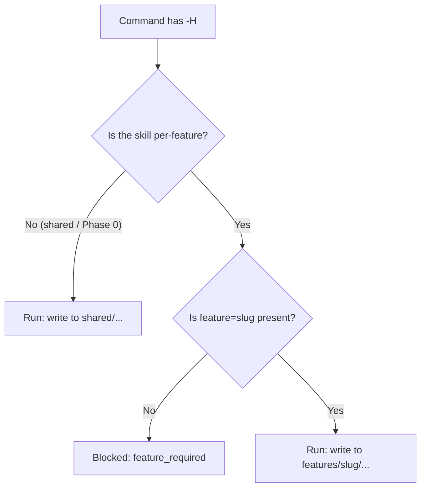

# How to Use Headless Mode

> 🌐 **English** · [Tiếng Việt](../../vi/how-to/use-headless-mode.md)
>
> 🔧 **How-to** — run HBC skills without interactive back-and-forth, targeting one feature at a time (per-feature).

## Goal

Run a skill in automated mode (no stopping to ask you) for scripts, CI, or when the input is already clear — while pointing it at exactly the **feature** the skill should act on.

Because HBC uses incremental per-feature delivery, most skills need to know which feature they are running for. In interactive mode the agent can ask; in headless mode **there is no one to ask**, so you pass `feature=<slug>` right in the command.

## Syntax

Add the `--headless` flag or its shorthand `-H`, plus `feature=<slug>` when the skill needs it:

```
REQ create feature=auth -H
PG 1 feature=auth -H
TRU feature=auth -H
```

A realistic, complete headless command for Phase 1 of the `auth` feature:

```
REQ create feature=auth -H
```

This writes its output under `_bmad-output/features/auth/planning-artifacts/D-02-...`. Each feature has its own directory tree under `features/<feature>/`, so passing the wrong `feature=` writes to the wrong place.

Most workflow skills support `-H` (see the Args column in the [Skills Catalog](../reference/skills-catalog.md)).

## When is `feature=` required?

The rule depends on the skill's **scope**:

| Scope | Skill (code) | `feature=` in headless | Output location |
| --- | --- | --- | --- |
| **Phase 0** | `PI` (hbc-project-init) | Takes no `feature` | `shared/...` (run once, project-wide) |
| **Shared** | `GLO` D-03, `CS` D-12 | Takes no `feature` | `shared/glossary/`, `shared/coding-standards/` |
| **Dual** | `ERD` D-19, `API` D-21 | Optional (defaults to shared baseline) | `shared/erd\|api/`, or `features/<feature>/...` if overridden |
| **Per-feature** | `REQ`, `BFD`, `TP`, `TS`, `IR`, `TB`, `IM`, `TE`, `AC`, `PG`, `TRI/TRU/TRR/TRA` | **Required** | `features/<feature>/...` |

A **per-feature** skill missing `feature=` in headless is blocked with the reason `feature_required` (with no one to ask, the skill stops safely instead of guessing).

> 💡 **Dual** skills (`ERD`/`API`) treat `feature` as optional: leave it out to update the shared baseline; pass it to create/override the per-feature copy. The **path-existence precedence** rule applies — if an override exists, it wins.

## The "blocked reason" concept

When you run headless and a precondition is not met, a skill **does not guess** — it stops and returns a *blocked reason* drawn from a predefined **closed set**. Each skill lists its own set of reasons in its headless contract; `feature_required` is the one shared by every per-feature skill.



## Autonomy (A5): strict vs assumptions-allowed

When running headless, the agent still hits choices that need deciding. **A5 autonomy** separates **MECHANICAL** decisions (the machine decides & proceeds) from **DOMAIN** decisions (must ask; never fabricate a default). Two standard flags — applied uniformly across every skill **and** the gate — pick how an unresolved domain decision is handled:

| Flag | Behavior |
| --- | --- |
| `--strict` | Stop at the **first unresolved DOMAIN decision** and return `blocked` with the question. |
| `--assumptions-allowed` (CI default) | Take the **most-defensible** option, log an `ASSUMPTION`, then continue; **never blocks the first turn, never fabricates a green/PASS**. |

The two flags are **orthogonal** to `-H`: `-H` decides *whether there is interactive back-and-forth*, while `--strict`/`--assumptions-allowed` decide *how a domain decision is handled when there is no one to ask*. The CI default is `--assumptions-allowed` so the pipeline runs seamlessly while still leaving an `ASSUMPTION` trail to review later.

> 💡 On a **design gate** that is clean but **has no USER sign-off**, `--assumptions-allowed` returns the headless verdict **`PASSED_PENDING_SIGNOFF`** (see [Run a Phase Gate](run-a-phase-gate.md)) — machine-clean but still awaiting sign-off, **not** a full PASS.

A few common cross-skill **blocked reasons** seen under `--strict` (each skill lists its own closed set):

- `untraced_change` — a change with no traceability edge (cascade-precheck).
- `stale_design` — an upstream design node is stale (dirty-set).
- `mapping_unconfirmed` — a mapping needs USER confirmation.
- `dcode_collision` — a mixed D-code tree (both legacy and canonical codes present).

## When to use it

| Situation | Why headless fits |
| --- | --- |
| Running in a CI/CD pipeline | No human to answer prompts |
| Input is already complete and clear | No need for the agent to ask more |
| Batch re-runs | Avoid mid-run pauses |
| Automation via scripts | Seamless execution, one feature per line |

## When **not** to use it

- First-time creation of a deliverable that needs discussion (e.g. the first `REQ` for a new feature) — interactive mode enables better elicitation.
- When requirements are still vague — letting the agent ask yields higher quality.

> 💡 Simple rule: **interactive when first creating content; headless when validating, updating, or automating.**

## Combining with modes and feature

`-H` pairs with a skill's mode/argument **and** `feature=<slug>`. For example, running a whole feature from design through the gate:

```
ERD feature=auth -H
CS -H
TP feature=auth -H
TS feature=auth -H
IR feature=auth -H
PG 2 feature=auth -H
```

Note: `CS` is a shared skill, so it takes **no** `feature=`; `ERD` is dual, so passing `feature=auth` creates a per-feature override (omit it to update the shared baseline).

Or batch-validate at the end of a feature:

```
REQ validate feature=auth -H
TS validate feature=auth -H
TRA feature=auth -H
```

## Related

- 📖 Per-skill Args column: [Skills Catalog](../reference/skills-catalog.md)
- 🔗 [Run a Phase Gate](run-a-phase-gate.md)
- 🔗 [Manage Traceability](manage-traceability.md)
