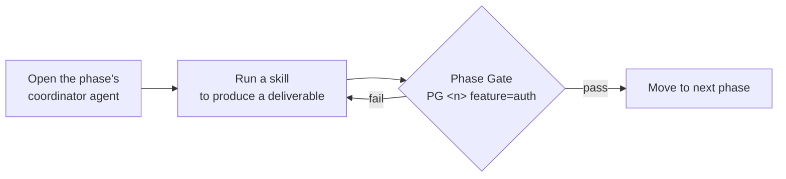
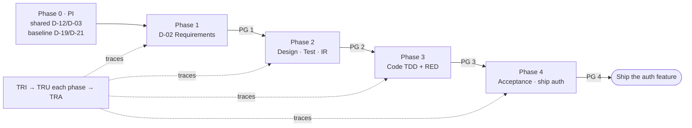

# Get Started with HBC (Take One Feature Through Its Lifecycle)

> 🌐 **English** · [Tiếng Việt](../../vi/tutorials/getting-started-hbc.md)
>
> 📘 **Tutorial** — learning by doing. Initialize the project once, then take **one** feature through all of HBC's phases until it ships.

## What you'll achieve

By the end of this tutorial you will:

- Understand HBC's core loop: **open agent → run skill → pass the Phase Gate → move to the next phase**.
- Run **Phase 0 (`PI`)** once to create the project-wide shared deliverables.
- Take one feature through Phase 1 → 4 yourself: Analysis → Design → Implementation → Testing, then **ship that feature independently**.
- Know how to turn on **traceability** to trace from requirement to test.

HBC ships **incrementally, per feature** (incremental per-feature delivery): each feature goes through the phases, then ships independently of other features. "Waterfall" here is only a *way to slice scope*, not HBC's architecture — inside a **single** feature, HBC keeps waterfall-like discipline (design first, close a gate at every milestone).

We'll use one running example: the **`auth`** feature (Login / Authentication). Every path and ID below follows this feature.

## Before you begin

> ▶️ **Never run HBC before?** Do the [10-minute Quickstart](quickstart.md) first — it covers installation, verifying it runs, where to type commands, and creating your first D-02 file. This tutorial continues from there to take one feature through its full lifecycle.

You should have finished the Quickstart (HBC installed, typed `BA` and seen the agent greet you). If `BA` doesn't respond, see the [troubleshooting section in the Quickstart](quickstart.md#if-ba-doesnt-respond-).

> 💡 **Golden tip:** Whenever you're unsure what to do next, type `bmad-help`. It inspects your project state and suggests the next step.
>
> 📖 **Hit an unfamiliar term?** (deliverable, phase gate, traceability, scope, RED evidence…) → look it up in the [Concept Glossary](../reference/concept-glossary.md).

## The core loop

Every phase of a feature follows the same rhythm:



Learn this rhythm and you can use HBC. Let's try it.

## Two kinds of paths: per-feature and shared

HBC writes output to two places. Grasp this up front and the later steps will be clear:

- **Per-feature:** `_bmad-output/features/auth/{planning-artifacts, implementation-artifacts, gates, traceability}/`
- **Shared (project-wide):** `_bmad-output/shared/{coding-standards, glossary, erd, api}/`

| Scope | Deliverables | Where |
| --- | --- | --- |
| **Per-feature** | D-02, D-06, D-26, D-27 | `features/auth/planning-artifacts/` |
| **Shared** | D-03 (glossary), D-12 (coding-standards) | `shared/glossary/`, `shared/coding-standards/` |
| **Dual** | D-19 (erd), D-21 (api) | baseline in `shared/erd|api/` + optional per-feature override in `features/auth/planning-artifacts/` (the override wins if it exists) |

Requirements are coded **`REQ-AUTH-NNN`** (per-feature, e.g. `REQ-AUTH-001`); shared requirements are `REQ-SHARED-NNN`. Test cases `TC-NNN` are numbered sequentially within **each feature's** D-27.

---

## Phase 0 — Project Init (run ONCE, project-wide)

**Goal:** create the **shared** deliverables before touching any feature. This runs exactly once for the whole project, with **no** feature name.

```
PI
```

`PI` (`hbc-project-init`) creates: **D-12 Coding Standards** + **D-03 Glossary** (shared), and **baseline D-19 ERD / D-21 API** under `shared/`. It is **idempotent** — re-running skips whatever already exists, so it's safe to run.

> 📌 Because it isn't tied to any feature, `PI` takes **no** `feature=`. After this step, everything else is per-feature.

✅ **Phase 0 done:** the project has shared coding standards, a glossary, and baseline ERD/API. Now let's put the `auth` feature through the process.

---

## Phase 1 — Analysis
**Goal:** clearly describe what `auth` should do, as requirements with IDs (`REQ-AUTH-NNN`).

### Step 1.1 — Open the Analysis agent

```
BA
```

Agent **BA** (Business Analyst) greets you and shows the Phase 1 menu.

> 🎉 **Micro-win:** Seeing the agent greet you means you're "inside" HBC in the right place — every later step is just picking work for it to do.

### Step 1.2 — Create the Requirements Specification (D-02)

```
REQ
```

The agent interviews you about the feature. For `auth` you might answer something like:

> A user enters their email and password to log in. The system verifies the credentials, temporarily locks the account after 5 failed attempts, and issues a session on success.

Result: a **D-02 Requirements Specification** file in `_bmad-output/features/auth/planning-artifacts/`, with requirements numbered `REQ-AUTH-001`, `REQ-AUTH-002`… EARS keyword syntax stays English (`WHEN … THE SYSTEM SHALL …`); prose follows `{document_output_language}`.

> 📌 **D-02 is required** — it's the foundation for every later phase. Other Phase 1 deliverables (`GLO` shared glossary, `BFD` per-feature business flow) are optional, used as needed.

### Step 1.3 — Initialize Traceability

> **Traceability** = linking each requirement to its design, code, and tests, so none is missed.

As soon as you have REQ IDs, turn on the feature's traceability matrix:

```
TRI
```

`TRI` reads the REQ IDs from D-02 and creates the traceability matrix in `features/auth/traceability/`. It has **8 columns**: `feature | req_id | story_id | design_ref | code_ref | test_ref | gate_status | timestamp`. From now on, each later phase fills in more columns (design, code, test).

### Step 1.4 — Pass Phase Gate 1

Before moving to Design, check Phase 1 is complete — **always include the phase number and the feature**:

```
PG 1 feature=auth
```

The Phase Gate runs deterministic checks + LLM evaluation, then returns **pass** or **fail** with reasons, written to `features/auth/gates/`. If **fail**, fix per the suggestions and re-run. Only a **pass** lets you continue.

✅ **Phase 1 done:** you have D-02 and an initialized traceability matrix for `auth`.

---

## Phase 2 — Design + Test Design
**Goal:** design the data/code standards, plan testing, then run a **readiness check** — before writing a single line of code.

### Step 2.1 — Design (ARCH agent)

```
ARCH
```

Then run:

- `ERD` → **D-19 Database Design / ER Diagram** (dual). By default it updates the baseline in `shared/erd/`; if `auth` needs to differ from the baseline, create a per-feature override (e.g. a `users` table with `email`, `password_hash`, `failed_attempts`…). The override wins if it exists.
- `CS` → **D-12 Coding Standards** (shared — usually already created in Phase 0; re-run to extend if needed).
- `API` → **D-21 API Specification** (dual, optional — e.g. endpoint `POST /auth/login`).

### Step 2.2 — Test design (QA agent)

```
QA
```

Then:

- `TP` → **D-26 Test Plan** (test strategy for `auth`).
- `TS` → **D-27 Test Specification** (concrete test cases `TC-001`, `TC-002`… e.g. "wrong password → error", "5 failed attempts → account locked").

### Step 2.3 — Update Traceability

```
TRU
```

`TRU` fills the `design_ref` / `test_ref` columns — now each REQ ID links to its matching design and test cases.

### Step 2.4 — Readiness check (`IR`), then pass the Gate

This is the new Phase-2 checkpoint — run it **before** `PG 2`:

```
IR
```

`IR` (`hbc-check-implementation-readiness`) reconciles **D-02 ↔ D-21 / D-26 / D-27 + the matrix**: does every requirement have a matching API, test plan, test case, and traceability row? It's the "seam" between design and implementation — fix any gaps `IR` flags before moving on. When `IR` is clean:

```
PG 2 feature=auth
```

✅ **Phase 2 done:** you have the DB design, test plan, test spec, and a passed readiness check — all traced back to REQs.

---

## Phase 3 — Implementation (TDD)
> **TDD** = write the test first, run it and watch it fail, then write code to make it pass.

**Goal:** write code following the **RED → GREEN → REFACTOR** cycle, with **RED evidence** before any code.

### Step 3.1 — Break down the work

```
DEV
TB
```

`TB` (Task Breakdown) splits `auth` into small, ordered tasks, written to `features/auth/implementation-artifacts/`.

### Step 3.2 — TDD implementation (RED evidence before code)

Run all tasks (or a specific one with `IM task TASK-001`):

```
IM all
```

`IM` guides you through each task via TDD:

1. 🔴 **RED** — write a test (from D-27) first, **run it, watch it fail, and record the RED evidence**. HBC applies **soft TDD**: RED evidence must be recorded *before* you write code — the Phase 3 gate checks for this evidence (self-attested, not cryptographic proof).
2. 🟢 **GREEN** — write the minimum code to make the test **pass**.
3. ♻️ **REFACTOR** — clean up the code, tests stay green.

> 📌 The spirit: "test-first with RED evidence", not merely "tests exist".

### Step 3.3 — Update Traceability & pass the Gate

```
TRU
PG 3 feature=auth
```

`TRU` fills the `code_ref` column. `PG 3` also checks for RED evidence.

✅ **Phase 3 done:** code works, tests are green with RED evidence, traced to REQs.

---

## Phase 4 — Testing & Acceptance
**Goal:** run all tests, handle defects, make the acceptance decision — then **ship `auth` on its own**.

```
TST
TE all
AC review
```

- `TE all` → **Test Execution Report** (run tests, record results, triage defects). You can also run `TE unit` / `TE integration` / `TE e2e` separately.
- `AC review` → **Acceptance Report** (ACCEPTED/REJECTED/DEFERRED/PENDING decision). Acceptance is **per-feature**: `auth` is accepted and shipped independently, without waiting for other features.

Finally, finalize traceability and audit for gaps:

```
TRA
PG 4 feature=auth
```

`TRA` audits the `auth` matrix — flagging any REQ still missing `design_ref`/`code_ref`/`test_ref`. Ideal: **0 gaps**.

> 💡 To check coverage anytime (optional), type `TRR`. `TRR` can also roll up coverage **across features** (shared rows counted once).

> 🔁 **When a source doc changes later:** run `SYNC` (Cascade Sync) to analyze the impact and propose cascading updates to the dependent docs/tests/code.

✅ **Phase 4 done:** the `auth` feature has gone through its full lifecycle, been accepted and shipped on its own, with complete traceability.

---

## What you just did



You ran **Phase 0** once, then took the `auth` feature through all 4 phases with full traceability and shipped it on its own. The next feature just repeats Phase 1 → 4 with its own `feature=` — Phase 0 doesn't run again.

## Next steps

- 🗺️ See the full map of skills & deliverables: [Workflow Map](workflow-map.md).
- 💡 Understand Phase / Gate / Scope / Traceability in depth, and why incremental + TDD: [Core Concepts](../explanation/concepts.md) · [Why incremental + TDD](../explanation/why-incremental-tdd.md).
- 🔧 When you need a specific task: [Run a Phase Gate](../how-to/run-a-phase-gate.md) · [Manage Traceability](../how-to/manage-traceability.md) · [Use Headless Mode](../how-to/use-headless-mode.md) · [Customize Configuration](../how-to/customize-config.md).
- 📚 Reference: [Concept Glossary](../reference/concept-glossary.md) · [Skills Catalog](../reference/skills-catalog.md) · [Deliverables Glossary](../reference/deliverables-glossary.md).

## Quick reference

| Task | Type |
| --- | --- |
| Don't know what's next | `bmad-help` |
| Initialize the project (once, shared) | `PI` |
| Open each phase's agent | `BA` · `ARCH` · `QA` · `DEV` · `TST` |
| Create requirements (D-02) | `REQ` |
| Readiness check (Phase 2) | `IR` |
| TDD implementation (RED first) | `IM all` (or `IM task TASK-001`) |
| Run tests / acceptance | `TE all` · `AC review` |
| Check a phase boundary | `PG 1 feature=auth` … `PG 4 feature=auth` |
| Traceability | `TRI` (init) → `TRU` (update) → `TRA` (audit) · `TRR` (coverage, can roll up across features) |
| Sync when a doc changes | `SYNC` |
