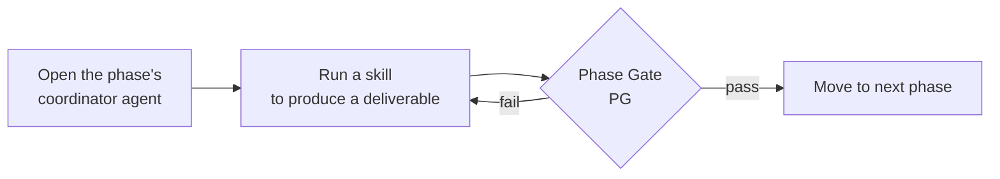
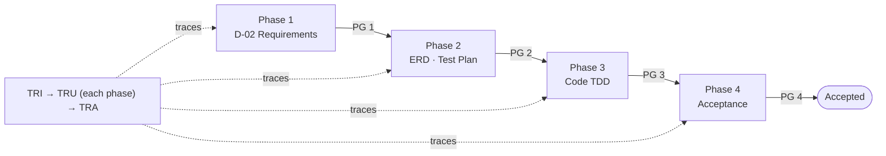

# Get Started with HBC (4-Phase Walkthrough)

> 🌐 **English** · [Tiếng Việt](../../vi/tutorials/getting-started-hbc.md)
>
> 📘 **Tutorial** — learning by doing. Take a small feature through all 4 HBC phases.

## What you'll achieve

By the end of this tutorial you will:

- Understand HBC's core loop: **open agent → run skill → pass the Phase Gate → move to the next phase**.
- Take a small feature through all 4 phases yourself: Analysis → Design → Implementation → Testing.
- Know how to turn on **traceability** to trace from requirement to test.

We'll use one running example: a **"Change Password"** feature.

## Before you begin

> ▶️ **Never run HBC before?** Do the [10-minute Quickstart](quickstart.md) first — it covers installation, verifying it runs, where to type commands, and creating your first D-02 file. This tutorial continues from there to cover all 4 phases.

You should have finished the Quickstart (HBC installed, typed `BA` and seen the agent greet you, produced a D-02). If `BA` doesn't respond, see the [troubleshooting section in the Quickstart](quickstart.md#if-ba-doesnt-respond-).

> 💡 **Golden tip:** Whenever you're unsure what to do next, type `bmad-help`. It inspects your project state and suggests the next step.
>
> 📖 **Hit an unfamiliar term?** (deliverable, phase gate, traceability, TDD…) → look it up in the [Concept Glossary](../reference/concept-glossary.md).

## The core loop

Every phase in HBC follows the same rhythm:



Learn this rhythm and you can use HBC. Let's try it.

---

## Phase 1 — Analysis

**Goal:** clearly describe what the feature should do, as requirements with IDs (REQ IDs).

### Step 1.1 — Open the Analysis agent

Type:

```
BA
```

Agent **BA** (Business Analyst) greets you and shows the Phase 1 menu.

> 🎉 **Micro-win:** Seeing the agent greet you means you're "inside" HBC in the right place — every later step is just picking work for it to do.

### Step 1.2 — Create the Requirements Specification (D-02)

Type:

```
REQ
```

The agent interviews you about the feature. For "Change Password" you might answer something like:

> A logged-in user can change their password by entering their old password and a new one. The system verifies the old password is correct, the new password is strong enough (≥ 8 characters), and differs from the old one.

Result: a **D-02 Requirements Specification** file in `_bmad-output/planning-artifacts/`, with requirements numbered like `REQ-001`, `REQ-002`…

> 📌 **D-02 is required** — it's the foundation for every later phase. Other Phase 1 deliverables (`GLO` glossary, `BFD` business flow) are optional, used as needed.

### Step 1.3 — Initialize Traceability

> **Traceability** = linking each requirement to its design, code, and tests, so none is missed.

As soon as you have REQ IDs, turn on the traceability matrix:

```
TRI
```

`TRI` reads the REQ IDs from D-02 and creates the initial traceability matrix. From now on, each later phase adds columns (design, code, test) to this matrix.

### Step 1.4 — Pass Phase Gate 1

Before moving to Design, check Phase 1 is complete — **always include the phase number**:

```
PG 1
```

The Phase Gate runs deterministic checks + LLM evaluation, then returns **pass** or **fail** with reasons. If **fail**, fix per the suggestions and re-run `PG 1`. Only a **pass** lets you continue.

✅ **Phase 1 done:** you have D-02 and an initialized traceability matrix.

---

## Phase 2 — Design + Test Design

**Goal:** design the data/code standards and plan testing — before writing a single line of code.

### Step 2.1 — Design (ARCH agent)

```
ARCH
```

Then run the required deliverables:

- `ERD` → **D-19 Database Design / ER Diagram** (illustrative, for "Change Password": the `users` table might have `password_hash`, `password_updated_at`… — your real result depends on your design).
- `CS` → **D-12 Coding Standards** (if the project doesn't have one yet).
- `API` → **D-21 API Specification** (optional — e.g. endpoint `PUT /users/me/password`).

### Step 2.2 — Test design (QA agent)

```
QA
```

Then:

- `TP` → **D-26 Test Plan** (test strategy for the feature).
- `TS` → **D-27 Test Specification** (concrete test cases, e.g. "wrong old password → error", "new password < 8 chars → rejected").

### Step 2.3 — Update Traceability & pass the Gate

```
TRU
```

`TRU` fills the design/test columns in the matrix — now each REQ ID links to its matching design and test cases. Then:

```
PG 2
```

✅ **Phase 2 done:** you have the DB design, test plan, and test spec — all traced back to REQs.

---

## Phase 3 — Implementation (TDD)

> **TDD** = write the test first, then write code to make it pass.

**Goal:** write code following the **TDD cycle: RED → GREEN → REFACTOR**.

### Step 3.1 — Break down the work

```
DEV
TB
```

`TB` (Task Breakdown) splits the feature into small, ordered tasks coded `TASK-xxx`.

### Step 3.2 — TDD implementation

Run all tasks (or a specific one with `IM task TASK-001`):

```
IM all
```

`IM` guides you through each task via TDD:

1. 🔴 **RED** — write a test (from D-27) first, run it and watch it **fail**.
2. 🟢 **GREEN** — write the minimum code to make the test **pass**.
3. ♻️ **REFACTOR** — clean up the code, tests stay green.

### Step 3.3 — Update Traceability & pass the Gate

```
TRU
PG 3
```

✅ **Phase 3 done:** code works, tests are green, traced to REQs.

---

## Phase 4 — Testing & Acceptance

**Goal:** run all tests, handle defects, make the acceptance decision.

```
TST
TE all
AC review
```

- `TE all` → **Test Execution Report** (run tests, record results, triage defects). You can also run `TE unit` / `TE integration` / `TE e2e` separately.
- `AC review` → **Acceptance Report** (ACCEPTED/REJECTED/DEFERRED/PENDING decision).

Finally, finalize end-to-end traceability and audit for gaps:

```
TRA
PG 4
```

`TRA` audits the whole matrix — flagging any REQ still missing design/code/test. Ideal: **0 gaps**.

> 💡 To check coverage anytime (optional), type `TRR` for a coverage report.

✅ **Phase 4 done:** the "Change Password" feature has gone through the full lifecycle, with acceptance and complete traceability.

---

## What you just did



You've grasped the **core loop** and taken a feature through all 4 phases with full traceability. This is exactly how HBC works for every feature — only the scale differs.

## Next steps

- 🗺️ See the full map of skills & deliverables: [Workflow Map](workflow-map.md).
- 💡 Understand Phase / Gate / Deliverable / Traceability in depth: [Core Concepts](../explanation/concepts.md).
- 🔧 When you need a specific task: [Run a Phase Gate](../how-to/run-a-phase-gate.md) · [Manage Traceability](../how-to/manage-traceability.md) · [Use Headless Mode](../how-to/use-headless-mode.md) · [Customize Configuration](../how-to/customize-config.md).

## Quick reference

| Task | Type |
| --- | --- |
| Don't know what's next | `bmad-help` |
| Open each phase's agent | `BA` · `ARCH` · `QA` · `DEV` · `TST` |
| Create requirements (D-02) | `REQ` |
| TDD implementation | `IM all` (or `IM task TASK-001`) |
| Run tests / acceptance | `TE all` · `AC review` |
| Check a phase boundary | `PG 1` … `PG 4` (always with the number) |
| Traceability | `TRI` (init) → `TRU` (update) → `TRA` (audit) · `TRR` (coverage report) |
