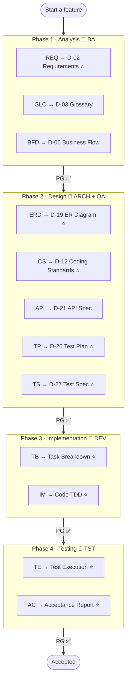
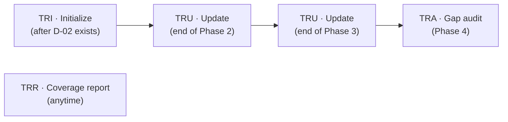

# HBC Workflow Map

> 🌐 **English** · [Tiếng Việt](../../vi/tutorials/workflow-map.md)
>
> 📘 **Tutorial** — all of HBC on one page. Use it as a map: see where you are, what you just did, and where you're headed.

## The big picture: 4 phases, 5 agents, D-xx deliverables

> ⭐ = **required** deliverable. The rest are optional, used as needed.
> Each `PG ✅` arrow is a **Phase Gate** — must pass before the next phase.

## The cross-cutting layer: Traceability

Traceability runs alongside everything; it belongs to no single phase — it links everything back to REQ IDs:

| Skill | When | What it does |
| --- | --- | --- |
| `TRI` | After D-02 exists | Initialize the matrix from REQ IDs |
| `TRU` | End of each phase | Fill new columns (design / code / test) |
| `TRR` | Anytime | Report current coverage |
| `TRA` | Phase 4 | Audit, flag gaps and severity |

## Lookup: phase → agent → skill → deliverable

| Phase | Agent | Skill | Deliverable | Required |
| --- | --- | --- | --- | :---: |
| **1 · Analysis** | `BA` | `REQ` | D-02 Requirements Specification | ✅ |
| | | `GLO` | D-03 Glossary | — |
| | | `BFD` | D-06 Business Flow Diagram | — |
| **2 · Design** | `ARCH` | `ERD` | D-19 Database Design / ER Diagram | ✅ |
| | | `CS` | D-12 Coding Standards | ✅ |
| | | `API` | D-21 API Specification | — |
| **2 · Test Design** | `QA` | `TP` | D-26 Test Plan | ✅ |
| | | `TS` | D-27 Test Specification | ✅ |
| **3 · Implementation** | `DEV` | `TB` | Task Breakdown | ✅ |
| | | `IM` | Code (TDD: RED-GREEN-REFACTOR) | ✅ |
| **4 · Testing** | `TST` | `TE` | Test Execution Report | ✅ |
| | | `AC` | Acceptance Report | ✅ |
| **Cross-cutting** | — | `PG` | Phase Gate (boundary validation) | — |
| | — | `TRI`/`TRU`/`TRR`/`TRA` | Traceability matrix | — |

> 💡 Every workflow skill has 3 modes: **Create / Update / Validate**, and most support `--headless` / `-H` for non-interactive runs.
>
> ℹ️ `PG` and `TRI/TRU/TRR/TRA` are not *required deliverables* (the column shows "—"), but they are **strongly recommended cross-cutting practices** at every phase boundary — skipping them loses control and traceability.

## How to read this map

- **Go left → right, in order.** HBC is waterfall: don't skip phases.
- **Every boundary has a Gate.** Hitting `PG ✅` means stop and validate before moving on.
- **Traceability runs in the background.** Run `TRU` at the end of each phase; run `TRA` at the end of the project.

## Next steps

- 📘 Never run it? Start with [Get Started with HBC](getting-started-hbc.md).
- 💡 Want to understand *why* there are Gates, Deliverables, Traceability: [Core Concepts](../explanation/concepts.md).
- 📖 Look up the full D-xx codes: [Deliverables Glossary](../reference/deliverables-glossary.md).
