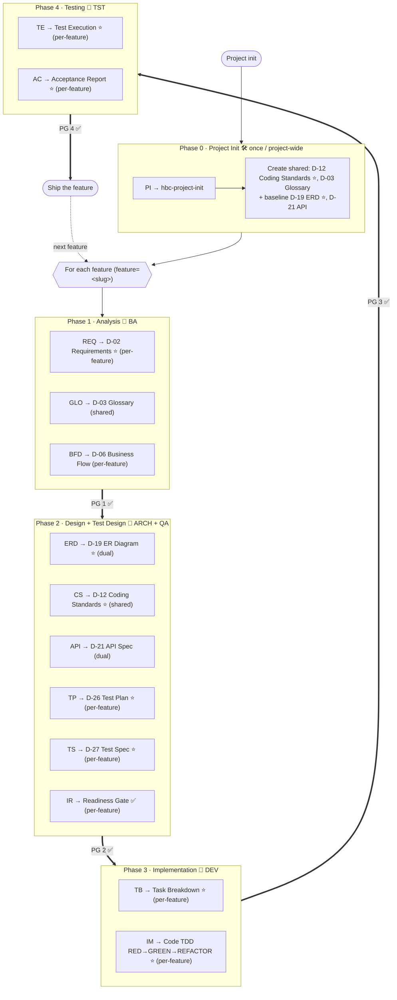
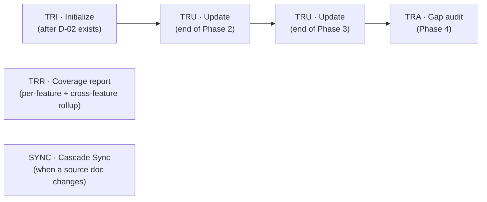

# HBC Workflow Map

> 🌐 **English** · [Tiếng Việt](../../vi/tutorials/workflow-map.md)
>
> 📘 **Tutorial** — all of HBC on one page. Use it as a map: see where you are, what you just did, and where you're headed.

## The delivery model: incremental per-feature delivery

HBC is an expansion module for BMad Method. Delivery is **incremental, per-feature (staged delivery)**: each feature passes through 4 gated phases + TDD, then ships — **independently** of other features.

"Waterfall" here is a *delivery model* (how you slice scope), **not** HBC's architecture. Inside a **single** feature, HBC keeps waterfall-like discipline (design-first, gate each milestone); but at the project level, slicing per feature makes the whole *incremental*, not a one-pass waterfall.

Before any feature, run **Phase 0** once for the whole project to create the shared deliverables. Then each feature runs Phases 1–4.

## The big picture: Phase 0 + the per-feature 4-phase loop

> ⭐ = **required** deliverable at the gate. The rest are optional, used as needed.
> Each `PG <n> ✅` arrow is a **Phase Gate** carrying `feature=` — must pass before the next phase.
> `IR` (readiness gate) is the **Phase 2 → 3 seam**: it reconciles D-02 ↔ D-21/D-26/D-27 + matrix before code starts.

## Phase 0 — Project Init (run ONCE, project-wide)

`PI` (skill `hbc-project-init`) runs **once for the whole project, before any feature**, to create the **shared deliverables**:

- **D-12 Coding Standards** (shared ⭐) → `shared/coding-standards/`
- **D-03 Glossary** (shared) → `shared/glossary/`
- **baseline D-19 ERD** (⭐) → `shared/erd/`
- **baseline D-21 API** → `shared/api/`

This skill is **idempotent** (skips what already exists) and takes **no** `feature` argument. After Phase 0, each new feature runs through its own Phases 1–4.

## Output layout: `features/<feature>/...` + `shared/...`

The new layout replaces the old flat `planning-artifacts` directory:

- **Per-feature:** `_bmad-output/features/<feature>/{planning-artifacts, implementation-artifacts, gates, traceability}/`
- **Shared (project-wide):** `_bmad-output/shared/{coding-standards, glossary, erd, api}/`

| Scope | Deliverables | Where |
| --- | --- | --- |
| **Per-feature** | D-02, D-06, D-26, D-27 | `features/<feature>/planning-artifacts/` |
| **Shared** | D-03 (glossary), D-12 (coding-standards) | `shared/glossary/`, `shared/coding-standards/` |
| **Dual** | D-19 (erd), D-21 (api) | baseline `shared/erd|api/` + optional per-feature override at `features/<feature>/planning-artifacts/` — **path-existence precedence** (override wins if it exists) |

> Implementation artifacts (task-breakdown, code, test-execution-report, acceptance-report) → `features/<feature>/implementation-artifacts/`. Gates → `features/<feature>/gates/`. Matrix → `features/<feature>/traceability/`.

## The cross-cutting layer: Traceability + Cascade Sync

Traceability runs alongside everything; it belongs to no single phase — it links everything back to REQ IDs. **Cascade Sync (`SYNC`)** is also cross-cutting: when a source doc changes, it runs impact analysis and proposes cascade updates to downstream docs/tests/code.

| Skill | When | What it does |
| --- | --- | --- |
| `TRI` | After D-02 exists | Initialize the matrix from REQ IDs |
| `TRU` | End of each phase | Fill new columns (design / code / test) |
| `TRR` | Anytime | Report current coverage per-feature + cross-feature rollup (shared rows counted once) |
| `TRA` | Phase 4 | Audit, flag gaps and severity |
| `SYNC` | When a source doc changes | Impact analysis; propose cascade updates to downstream docs/tests/code |

### Traceability matrix — 8 columns

`feature | req_id | story_id | design_ref | code_ref | test_ref | gate_status | timestamp`

Coverage counts `design_ref` / `code_ref` / `test_ref`. The matrix is **per-feature**; `TRR` can roll up across features (shared rows counted once).

## Lookup: phase → agent → skill → deliverable → scope

| Phase | Agent | Skill | Deliverable | Scope | Required |
| --- | --- | --- | --- | --- | :---: |
| **0 · Project Init** | — | `PI` | hbc-project-init (D-12/D-03 + baseline D-19/D-21) | shared, run once | — |
| **1 · Analysis** | `BA` | `REQ` | D-02 Requirements Specification | per-feature | ✅ |
| | | `GLO` | D-03 Glossary | shared | — |
| | | `BFD` | D-06 Business Flow Diagram | per-feature | — |
| **2 · Design** | `ARCH` | `ERD` | D-19 Database Design / ER Diagram | dual | ✅ |
| | | `CS` | D-12 Coding Standards | shared | ✅ |
| | | `API` | D-21 API Specification | dual | — |
| **2 · Test Design** | `QA` | `TP` | D-26 Test Plan | per-feature | ✅ |
| | | `TS` | D-27 Test Specification | per-feature | ✅ |
| | | `IR` | Readiness gate (reconcile D-02 ↔ D-21/D-26/D-27 + matrix) | per-feature | ✅ |
| **3 · Implementation** | `DEV` | `TB` | Task Breakdown | per-feature | ✅ |
| | | `IM` | Code (TDD: RED-GREEN-REFACTOR, RED evidence) | per-feature | ✅ |
| **4 · Testing** | `TST` | `TE` | Test Execution Report | per-feature | ✅ |
| | | `AC` | Acceptance Report (ship one feature independently) | per-feature | ✅ |
| **Cross-cutting** | — | `PG` | Phase Gate (carries `feature=`) | per-feature | — |
| | — | `TRI`/`TRU`/`TRR`/`TRA` | Traceability matrix (8 columns) | per-feature + rollup | — |
| | — | `SYNC` | Cascade Sync (impact analysis) | cross-cutting | — |

> 💡 Every workflow skill has 3 modes: **Create / Update / Validate**, and most support `--headless` / `-H` for non-interactive runs. Per-feature skills require `feature=<slug>` in headless (missing it is blocked as `feature_required`); dual skills (ERD/API) make `feature` optional (defaulting to the shared baseline); shared skills (GLO/CS) and Phase 0 (`PI`) take no `feature`.
>
> ℹ️ `PG`, `TRI/TRU/TRR/TRA`, and `SYNC` are not *required deliverables* (the column shows "—"), but they are **strongly recommended cross-cutting practices** at every phase boundary — skipping them loses control and traceability.

## Soft TDD: RED evidence

Phase 3 `IM` runs RED→GREEN→REFACTOR. **Soft enforcement:** a **failing-test (RED) evidence** is required/recorded *before* writing code; the Phase 3 gate checks for RED evidence (self-attested, not crypto-proof). Frame it as "test-first with RED evidence", not merely "tests exist".

## How to read this map

- **Phase 0 first, then the feature loop.** Run `PI` once; then repeat Phases 1→4 for each feature, shipping each one independently.
- **Go left → right, in order within a feature.** Phases run sequentially with gates — no skipping. (Applied per feature, so at the project level it's *incremental*, not a one-pass waterfall.)
- **Every boundary has a Gate.** Hitting `PG <n> ✅` means stop and validate before moving on; `IR` is the readiness gate at the Phase 2 → 3 seam.
- **Traceability + Sync run in the background.** Run `TRU` at the end of each phase; run `TRA` at the end of the project; run `SYNC` when a source doc changes to cascade the update.

## Next steps

- 📘 Never run it? Start with [Get Started with HBC](getting-started-hbc.md).
- 💡 Want to understand *why* there are Gates, Deliverables, Traceability, incremental TDD: [Core Concepts](../explanation/concepts.md) · [Why incremental + TDD](../explanation/why-incremental-tdd.md).
- 📖 Look up the full D-xx codes: [Deliverables Glossary](../reference/deliverables-glossary.md). Look up skills: [Skills Catalog](../reference/skills-catalog.md). Look up concepts: [Concept Glossary](../reference/concept-glossary.md).
- 🧭 Not sure what's next? `bmad-help` is always available to suggest the next step.
