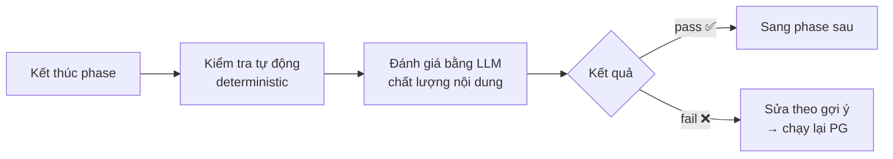
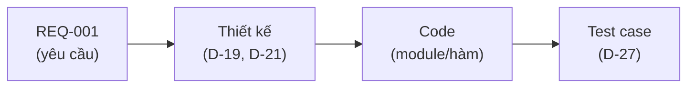
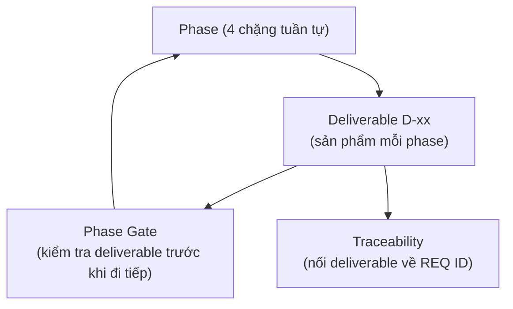

# Khái niệm cốt lõi của HBC

> 🌐 [English](../../en/explanation/concepts.md) · **Tiếng Việt**
>
> 💡 **Explanation** — tài liệu này giải thích *vì sao* HBC được thiết kế như vậy. Không phải các bước làm (xem [Tutorial](../tutorials/getting-started-hbc.md)), mà là tư duy đằng sau.

HBC dựng trên 4 khái niệm. Hiểu được 4 cái này là bạn hiểu cả phương pháp.

---

## 1. Phase — chia công việc thành 4 chặng có thứ tự

HBC theo mô hình **waterfall**: công việc đi tuần tự qua 4 phase, mỗi phase hoàn thành rồi mới sang phase sau.

| Phase | Trả lời câu hỏi | Sản phẩm chính |
| --- | --- | --- |
| 1 · Analysis | *Cần làm cái gì?* | Yêu cầu (D-02) |
| 2 · Design | *Làm bằng cách nào?* | Thiết kế DB, kế hoạch test |
| 3 · Implementation | *Viết code thế nào?* | Code (theo TDD) |
| 4 · Testing | *Đã đúng chưa?* | Báo cáo nghiệm thu |

**Vì sao tuần tự?** Mỗi phase đứng trên vai phase trước. Bạn không thể thiết kế DB nếu chưa rõ yêu cầu; không thể viết code đúng nếu chưa có thiết kế. Đi đúng thứ tự giúp tránh làm lại tốn kém vì hiểu sai từ đầu.

> 🔎 **Phép loại suy:** như xây nhà — khảo sát nhu cầu → bản vẽ → xây → nghiệm thu. Không ai đổ móng khi chưa có bản vẽ.

---

## 2. Deliverable D-xx — sản phẩm bàn giao được đánh mã

Mỗi phase tạo ra một hoặc nhiều **deliverable** — tài liệu/sản phẩm cụ thể, đặt tên theo mã **D-xx** (D-02, D-19, D-27…).

**Vì sao đánh mã?** Để mọi người (và mọi agent) gọi cùng một thứ bằng cùng một tên. "D-02" luôn là Đặc tả yêu cầu, ở bất kỳ dự án nào. Mã ổn định giúp:

- Tham chiếu chéo rõ ràng ("test case này phủ REQ trong D-02").
- Phase Gate kiểm tra được "deliverable bắt buộc đã có chưa".
- Traceability nối các deliverable lại với nhau.

> 📌 Có deliverable **bắt buộc** (⭐) và **tùy chọn**. Bắt buộc là điều kiện để qua Gate; tùy chọn làm khi tính năng cần. Xem danh sách đầy đủ ở [Bảng deliverable](../reference/deliverables-glossary.md).

---

## 3. Phase Gate — chốt kiểm soát giữa các phase

**Phase Gate** (`PG`) là một "trạm kiểm soát" ở ranh giới mỗi phase. Trước khi sang phase sau, Gate kiểm tra phase hiện tại đã đủ chất lượng chưa, gồm hai lớp:

- **Lớp tự động:** kiểm tra cứng — deliverable bắt buộc có tồn tại không, định dạng đúng không.
- **Lớp LLM:** đánh giá mềm — nội dung có rõ ràng, đầy đủ, nhất quán không.

**Vì sao cần Gate?** Để lỗi không trôi sang phase sau. Một yêu cầu mơ hồ lọt qua Phase 1 sẽ thành thiết kế sai ở Phase 2, code sai ở Phase 3 — càng về sau sửa càng đắt. Gate chặn lỗi tại nguồn.

> 🔎 **Phép loại suy:** như cửa kiểm tra an ninh sân bay — không qua được thì không lên máy bay. Gate "fail" không phải để phạt bạn, mà để bảo vệ phase sau.

---

## 4. Traceability — sợi chỉ nối yêu cầu đến test

**Traceability** (truy vết) là một **ma trận** trả lời câu hỏi: *"Mỗi yêu cầu đã được thiết kế, code và test chưa?"*

Mỗi yêu cầu có một **REQ ID** (REQ-001…). Ma trận traceability nối REQ ID đó tới mọi thứ phát sinh từ nó:

**Vì sao quan trọng?** Nó trả lời được hai câu hỏi mà dự án nào cũng sợ:

1. *"Có yêu cầu nào bị bỏ quên không?"* → REQ nào thiếu code/test sẽ lộ ra ngay (gap).
2. *"Code/test này phục vụ yêu cầu nào?"* → truy ngược được, không có code "mồ côi".

Vòng đời traceability: `TRI` (khởi tạo từ REQ ID) → `TRU` (cập nhật cuối mỗi phase) → `TRA` (audit gap cuối dự án). `TRR` cho báo cáo coverage bất cứ lúc nào.

> 🔎 **Phép loại suy:** như danh sách hành lý khi đi du lịch — đánh dấu từng món đã xếp vào vali. Cuối cùng nhìn danh sách là biết còn thiếu gì.

---

## Bốn khái niệm ăn khớp với nhau thế nào

- **Phase** chia hành trình thành chặng.
- **Deliverable** là sản phẩm cụ thể của mỗi chặng.
- **Gate** đảm bảo chặng hiện tại đạt chuẩn trước khi đi tiếp.
- **Traceability** xâu chuỗi mọi deliverable lại để không bỏ sót yêu cầu nào.

## Đọc tiếp

- 📘 Muốn thấy 4 khái niệm này vận hành: [Bắt đầu với HBC](../tutorials/getting-started-hbc.md).
- 🗺️ Toàn cảnh skill & deliverable: [Bản đồ quy trình](../tutorials/workflow-map.md).
- 🔧 Thực hành cụ thể: [Chạy Phase Gate](../how-to/run-a-phase-gate.md) · [Quản lý Traceability](../how-to/manage-traceability.md).
- 📖 Tra nhanh một thuật ngữ: [Glossary khái niệm](../reference/concept-glossary.md).
