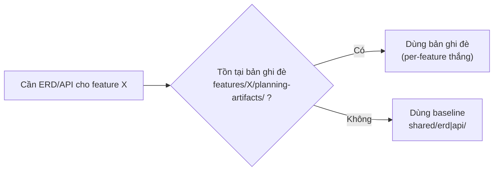
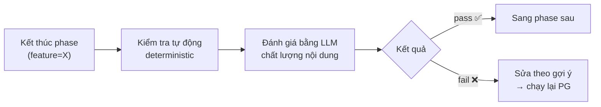
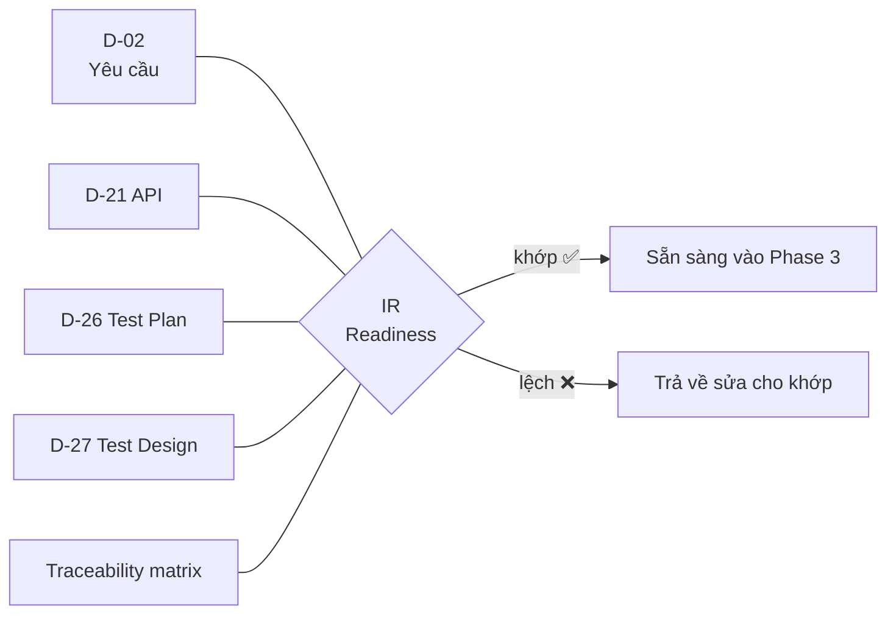
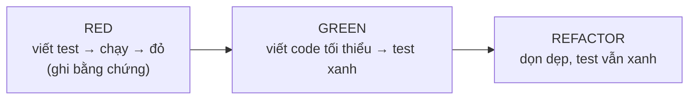
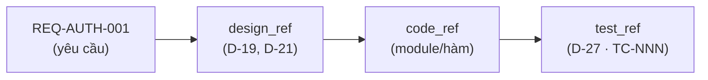
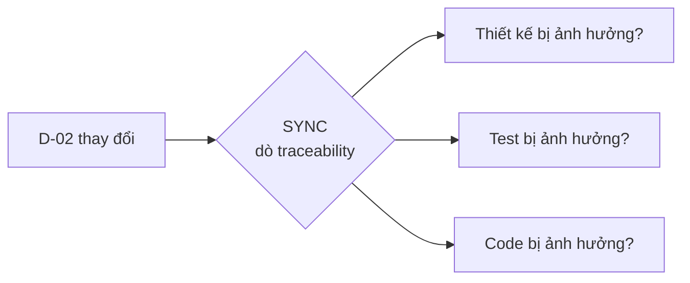
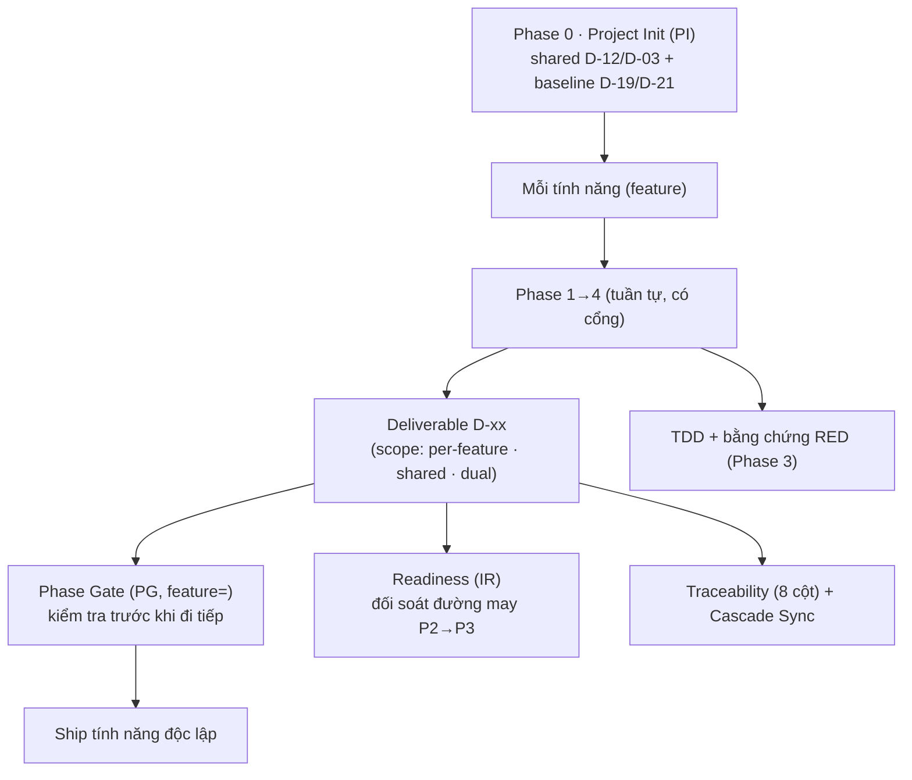

# Khái niệm cốt lõi của HBC

> 🌐 [English](../../en/explanation/concepts.md) · **Tiếng Việt**
>
> 💡 **Explanation** — tài liệu này giải thích *vì sao* HBC được thiết kế như vậy. Không phải các bước làm (xem [Tutorial](../tutorials/getting-started-hbc.md)), mà là tư duy đằng sau.

HBC là module mở rộng cho BMad Method. Cách giao hàng của nó là **giao tăng dần theo từng tính năng (incremental per-feature delivery)**: mỗi tính năng đi qua 4 phase có cổng + lõi TDD rồi *ship độc lập*, không cần chờ các tính năng khác.

Để hiểu cả phương pháp, bạn cần nắm các khái niệm sau: **Tính năng & Phạm vi**, **Phase 0 (Project Init)**, **Phase & Phase Gate**, **Deliverable D-xx**, **Readiness (IR)**, **TDD với bằng chứng RED**, và **Traceability + Cascade Sync**.

> 🧭 **Một ý xuyên suốt:** *máy lo cấu trúc · người/LLM lo ngữ nghĩa.* Kiểm tra cứng (đường dẫn, định dạng, ID) do máy lo một cách tất định; còn chất lượng nội dung (rõ ràng, đầy đủ, nhất quán) do người hoặc LLM đánh giá. Mọi khái niệm bên dưới đều bám theo lằn ranh này.

---

## 1. Tính năng & Phạm vi — đơn vị giao hàng, và "ai dùng chung cái gì"

HBC **không** chạy toàn dự án một lượt rồi mới giao. Nó giao **tăng dần theo từng tính năng (feature)**: `auth`, `billing`, `report`… mỗi tính năng là một đơn vị đi hết 4 phase rồi ship — độc lập với nhau.

Nhưng không phải thứ gì cũng thuộc riêng một tính năng. Một số sản phẩm (deliverable) là **dùng chung (shared)** cho cả dự án. Vì thế mỗi deliverable có một **phạm vi (scope)**:

| Phạm vi | Deliverable | Đặt ở đâu |
| --- | --- | --- |
| **Per-feature** (riêng tính năng) | D-02, D-06, D-26, D-27 + (theo facet) D-09, D-14, D-16 | `_bmad-output/features/<feature>/planning-artifacts/` |
| **Shared** (dùng chung) | D-03 (glossary), D-12 (coding-standards) | `_bmad-output/shared/glossary/`, `…/coding-standards/` |
| **Dual** (lưỡng tính) | D-19 (erd), D-21 (api) | baseline ở `shared/erd\|api/` + bản ghi đè tùy chọn ở `features/<feature>/planning-artifacts/` |

**Vì sao tách phạm vi?** Glossary và Coding Standards mà mỗi tính năng tự định nghĩa lại thì sẽ mâu thuẫn nhau — nên chúng *dùng chung*, là **deliverable do Phase 0 tạo một lần cho cả dự án** (không phải bước tùy chọn của từng tính năng — xem [mục 2](#2-phase-0--project-init-bước-bắt-buộc-chạy-đầu-tiên-cho-cả-dự-án)). Ngược lại, đặc tả yêu cầu (D-02) hay test (D-27) thì gắn chặt với từng tính năng — nên chúng *per-feature*. D-19/D-21 là **lưỡng tính**: baseline dùng chung dựng ở Phase 0, cộng bản ghi đè per-feature tùy chọn.

**Dual = quy tắc ưu tiên theo sự tồn tại đường dẫn (path-existence precedence).** ERD (D-19) và API (D-21) có một **baseline dùng chung** cho cả dự án, nhưng một tính năng có thể cần **ghi đè cục bộ**. Quy tắc rất đơn giản:

> 🔎 **Phép loại suy:** baseline dùng chung như *bản đồ thành phố*; bản ghi đè per-feature như *bản đồ phóng to một quận*. Có bản phóng to thì dùng bản phóng to; không thì dùng bản đồ chung. Không cần cờ cấu hình — chỉ cần "file có tồn tại hay không".

**Applicability theo facet — không phải tính năng nào cũng cần mọi deliverable.** Một số deliverable thiết kế ở Phase 2 chỉ có ý nghĩa khi tính năng mang tính chất tương ứng. HBC mã hoá điều này trong **applicability-catalog** (`src/hbc-shared/references/deliverable-catalog.yaml`): mỗi tính năng được gắn các **facet** (thuộc tính boolean — vd `has-ui`, `has-integration`, `has-state-machine`), và facet quyết định deliverable nào **required / optional / N-A** cho tính năng đó:

- **D-09 Architecture** — required nếu `has-integration` hoặc `has-algorithm`.
- **D-16 Behavioral Design** — required nếu tính năng "phi-CRUD phức" (state-machine, đồng bộ chéo thực thể, bất biến, thuật toán, hoặc concurrency).
- **D-14 UX/Screen** — required nếu `has-ui`.

Một tính năng tối giản (thuần CRUD, không UI, không tích hợp) chỉ bắt buộc **D-02 + D-06**. **Maturity** là một bộ chỉnh riêng: chế độ `exploratory` có thể hạ một số deliverable required → optional và giảm số câu hỏi elicitation, nhưng **không bao giờ** đụng tới sàn đúng đắn (correctness floor). Nhờ catalog, "thiếu D-14" với tính năng không-UI được hiểu đúng là **N/A**, chứ không phải lỗ hổng.

---

## 2. Phase 0 — Project Init: bước **bắt buộc, chạy đầu tiên** cho cả dự án

Vì phần dùng chung (shared) phục vụ *mọi* tính năng, sẽ vô lý nếu để tính năng đầu tiên tự đẻ ra chúng. Nên HBC có **Phase 0 — Project Init** (`PI`, skill `hbc-project-init`) — bước **bắt buộc** và **chạy đầu tiên**, *trước khi* bắt tay tính năng nào, một lần cho cả dự án (chạy lại để **cập nhật trực tiếp** khi nền tảng thay đổi).

**Vì sao đầu tiên?** Phase 0 làm hai việc nền móng mà mọi tính năng đều dựa vào: nó *thiết lập hiểu biết về dự án* và *dựng phần dùng chung* để từng tính năng đứng lên trên. Chưa có nền này thì Phase 1 của tính năng đầu tiên không có chuẩn code, từ điển, hay sơ đồ DB nền để bám vào — nên Phase 0 phải đi trước.

**Phase 0 nhận biết brownfield.** Với một **codebase đã có**, Phase 0 *tài liệu hóa dự án trước*: quét mã nguồn bằng `bmad-document-project`, dựng `project-context.md` qua `bmad-generate-project-context` — rồi **suy ra các deliverable dùng chung từ chính phần phân tích đó**:

- **D-12 Coding Standards** — rút ra từ quy ước code đang có trong codebase.
- **D-03 Glossary** — rút ra từ miền nghiệp vụ (domain) của dự án.
- **baseline D-19 ERD** — dựng từ schema DB hiện hữu.
- **baseline D-21 API** — dựng từ các endpoint hiện hữu.

Với dự án **greenfield** (chưa có code), các deliverable này được tạo từ PRD/brief/lựa chọn ban đầu thay vì từ phân tích codebase.

**Vì sao một lần, ở đầu?** Để mọi tính năng về sau đứng trên cùng một nền: cùng chuẩn code, cùng cách gọi tên, cùng sơ đồ DB nền. Phase 0 **không cần** tham số `feature` — vì nó vốn dĩ thuộc về cả dự án; và khi nền tảng đổi, chạy lại để **cập nhật trực tiếp** các deliverable dùng chung.

> 🔎 **Phép loại suy:** như khảo sát khu đất rồi đổ móng và kéo điện nước cho cả khu *trước khi* xây từng căn nhà. Khu đất đã có sẵn công trình (brownfield) thì khảo sát hiện trạng trước rồi mới dựng nền chung. Làm một lần, mọi căn cùng hưởng.

---

## 3. Phase — chia mỗi tính năng thành 4 chặng có thứ tự

Với *mỗi* tính năng, HBC chạy **tuần tự, có cổng** qua 4 phase: mỗi phase hoàn thành (qua Phase Gate) rồi mới sang phase sau.

| Phase | Trả lời câu hỏi | Sản phẩm chính |
| --- | --- | --- |
| 1 · Analysis | *Cần làm cái gì?* | Yêu cầu (D-02) |
| 2 · Design + Test Design | *Làm bằng cách nào? Test ra sao?* | Thiết kế DB/API, kế hoạch test (D-26), test design (D-27) |
| 3 · Implementation | *Viết code thế nào?* | Code (theo TDD) |
| 4 · Testing | *Đã đúng chưa?* | Báo cáo nghiệm thu |

Đây là *bộ xương* tuần tự, thiết kế-trước — nhưng đó chỉ là **cách kỷ luật bên trong một tính năng** (design-first, chốt từng mốc), *không phải* mô hình giao hàng của HBC. Mô hình giao hàng của HBC là **giao tăng dần theo từng tính năng**: nhiều chu trình nhỏ chạy song song theo nhịp riêng, chứ không phải một chu trình lớn cho cả dự án (xem [Mô hình giao hàng của HBC](why-incremental-tdd.md#mô-hình-giao-hàng-của-hbc-từng-tính-năng-không-làm-một-lượt)).

**Vì sao tuần tự bên trong tính năng?** Mỗi phase đứng trên vai phase trước. Bạn không thể thiết kế DB nếu chưa rõ yêu cầu; không thể viết code đúng nếu chưa có thiết kế. Đi đúng thứ tự giúp tránh làm lại tốn kém vì hiểu sai từ đầu.

> 🔎 **Phép loại suy:** như xây *một căn nhà* — khảo sát nhu cầu → bản vẽ → xây → nghiệm thu. Không ai đổ móng khi chưa có bản vẽ. Nhưng cả khu phố thì xây dần từng căn, không chờ căn cuối mới giao căn đầu.

---

## 4. Phase Gate — chốt kiểm soát giữa các phase

**Phase Gate** (`PG`) là một "trạm kiểm soát" ở ranh giới mỗi phase. Vì giờ làm theo từng tính năng, mỗi gate **mang theo `feature=`** để biết đang chốt tính năng nào. Trước khi sang phase sau, Gate kiểm tra phase hiện tại đã đủ chất lượng chưa, gồm hai lớp:

- **Lớp tự động (máy lo cấu trúc):** kiểm tra cứng — deliverable bắt buộc có tồn tại không, định dạng/đường dẫn đúng không.
- **Lớp LLM (người/LLM lo ngữ nghĩa):** đánh giá mềm — nội dung có rõ ràng, đầy đủ, nhất quán không.

**Vì sao cần Gate?** Để lỗi không trôi sang phase sau. Một yêu cầu mơ hồ lọt qua Phase 1 sẽ thành thiết kế sai ở Phase 2, code sai ở Phase 3 — càng về sau sửa càng đắt. Gate chặn lỗi tại nguồn.

> 📌 Deliverable bắt buộc để qua gate: **D-02, D-12, D-19, D-26, D-27**. Tùy chọn: D-03, D-21. **Bắt buộc theo facet** (applicability-catalog): D-09, D-14, D-16 — required khi tính năng có facet tương ứng, ngược lại N-A. Gate Phase 1 còn có mục **P1-09 — model-validation** (USER ký xác nhận domain model đã được kiểm chứng; tự điều chỉnh cho greenfield).

> 🔎 **Phép loại suy:** như cửa kiểm tra an ninh sân bay — không qua được thì không lên máy bay. Gate "fail" không phải để phạt bạn, mà để bảo vệ phase sau.

---

## 5. Deliverable D-xx — sản phẩm bàn giao được đánh mã

Mỗi phase tạo ra một hoặc nhiều **deliverable** — tài liệu/sản phẩm cụ thể, đặt tên theo mã **D-xx** (D-02, D-19, D-27…).

**Vì sao đánh mã?** Để mọi người (và mọi agent) gọi cùng một thứ bằng cùng một tên. "D-02" luôn là Đặc tả yêu cầu, ở bất kỳ dự án nào. Mã ổn định giúp:

- Tham chiếu chéo rõ ràng ("test case này phủ REQ trong D-02").
- Phase Gate kiểm tra được "deliverable bắt buộc đã có chưa".
- Traceability nối các deliverable lại với nhau.

Ngoài mã D-xx, mỗi deliverable còn có một **phạm vi** (per-feature · shared · dual — xem [mục 1](#1-tính-năng--phạm-vi--đơn-vị-giao-hàng-và-ai-dùng-chung-cái-gì)) quyết định nó nằm ở `features/<feature>/…` hay `shared/…`.

**Namespace ID yêu cầu.** Yêu cầu được đánh mã theo từng tính năng: **`REQ-<FEAT>-NNN`** (ví dụ `REQ-AUTH-001`), cộng thêm **`REQ-SHARED-NNN`** cho yêu cầu dùng chung. Nhờ namespace, `REQ-AUTH-001` và `REQ-BILLING-001` không đụng nhau. (Mã cũ `REQ-NNN` vẫn đọc được để tương thích.) Test case đánh số **`TC-NNN`**, tuần tự *trong D-27 của từng tính năng*.

> 📌 Có deliverable **bắt buộc** (⭐) và **tùy chọn**. Bắt buộc là điều kiện để qua Gate; tùy chọn làm khi tính năng cần. Xem danh sách đầy đủ ở [Bảng deliverable](../reference/deliverables-glossary.md).

---

## 6. Readiness (IR) — cổng "đường may" cuối Phase 2

Giữa thiết kế (Phase 2) và viết code (Phase 3) có một **đường may (seam)** dễ rách: yêu cầu, thiết kế và test có thể đã *lệch* nhau lúc nào không hay. **Readiness check** (`IR`, skill `hbc-check-implementation-readiness`) là cổng đối soát đặt đúng tại đường may đó, *trước khi* bước vào Phase 3.

`IR` đối soát **D-02** (yêu cầu) với **D-21** (API), **D-26** (kế hoạch test), **D-27** (test design) và **ma trận traceability**:

**Vì sao cần `IR`?** Để bắt sớm những lệch pha kiểu: có yêu cầu mà không có test phủ, có endpoint API mà không có test, hay ma trận thiếu dòng. Nếu để lọt qua đường may này, Phase 3 sẽ code dựa trên một bộ tài liệu không nhất quán.

> 🔎 **Phép loại suy:** như kiểm tra mép vải khớp nhau *trước khi* đặt mũi may. Khâu xong rồi mới phát hiện lệch thì phải tháo ra làm lại.

---

## 7. TDD với bằng chứng RED — viết test trước, có dấu vết

Phase 3 (`IM`) viết code theo vòng **RED → GREEN → REFACTOR**: viết một test *thất bại* trước (RED), rồi viết code tối thiểu cho test *đậu* (GREEN), rồi dọn dẹp (REFACTOR).

HBC dùng **enforcement mềm (soft enforcement)**: trước khi viết code, cần **ghi lại bằng chứng RED (RED evidence)** — dấu vết cho thấy test đã từng đỏ. Gate Phase 3 sẽ kiểm tra có bằng chứng RED hay không.

**"Mềm" nghĩa là gì?** Bằng chứng RED là **tự khai (self-attested)**, không phải bằng chứng mật mã. HBC tin người làm, nhưng *yêu cầu để lại dấu vết*. Tinh thần là **"test-first với bằng chứng RED"**, chứ không chỉ là "có tồn tại test".

**Vì sao test trước?** Viết test sau khi code xong dễ biến thành "test cho vừa khít code" — đo lại chính cái mình vừa viết. Viết test trước buộc bạn phát biểu *kỳ vọng* trước, và bước RED chứng minh test thật sự có khả năng *bắt lỗi*.

> 🔎 **Phép loại suy:** như đặt bẫy chuột rồi thử xem bẫy có sập không (RED) *trước khi* tin rằng nó hoạt động. Một cái bẫy chưa từng sập thì không đáng tin.

---

## 8. Traceability — sợi chỉ nối yêu cầu đến test, và Cascade Sync

**Traceability** (truy vết) là một **ma trận** trả lời câu hỏi: *"Mỗi yêu cầu đã được thiết kế, code và test chưa?"* Ở HBC v2, ma trận có **8 cột**:

`feature | req_id | story_id | design_ref | code_ref | test_ref | gate_status | timestamp`

Độ phủ (coverage) được tính từ ba cột `design_ref` / `code_ref` / `test_ref` — một REQ thiếu bất kỳ cột nào là một *gap*.

Ma trận được giữ **theo từng tính năng**; `TRR` có thể **gộp chéo nhiều tính năng (rollup)** để báo cáo toàn dự án (dòng shared chỉ đếm một lần). Vòng đời: `TRI` (khởi tạo từ REQ ID) → `TRU` (cập nhật cuối mỗi phase) → `TRA` (audit gap cuối cùng); `TRR` cho báo cáo coverage bất cứ lúc nào.

**Cascade Sync (`SYNC`) — khi một tài liệu đổi.** Các deliverable không độc lập: đổi D-02 có thể kéo theo phải sửa thiết kế, test, code. **Cascade Sync** là phân tích *tác động lan truyền*: khi một tài liệu nguồn thay đổi, `SYNC` dò ma trận traceability để **đề xuất** các cập nhật cần làm ở những deliverable/test/code hạ nguồn.

> 📌 `SYNC` **đề xuất**, không tự ý sửa — vẫn theo "máy lo cấu trúc · người/LLM lo ngữ nghĩa": máy chỉ ra *cái gì có thể bị ảnh hưởng*, người quyết định *sửa thế nào*.

**Vì sao quan trọng?** Traceability trả lời hai câu hỏi mà dự án nào cũng sợ: *"Có yêu cầu nào bị bỏ quên không?"* (gap lộ ra ngay) và *"Code/test này phục vụ yêu cầu nào?"* (truy ngược được, không có code "mồ côi"). Cascade Sync trả lời câu thứ ba: *"Đổi chỗ này thì còn gì phải sửa theo?"*

> 🔎 **Phép loại suy:** ma trận như *danh sách hành lý* — đánh dấu từng món đã xếp; cuối cùng nhìn là biết còn thiếu gì. Cascade Sync như *báo thay đổi lịch bay* — đổi một chuyến, hệ thống nhắc bạn những đặt chỗ liên quan cần xếp lại.

---

## Các khái niệm ăn khớp với nhau thế nào

- **Tính năng & Phạm vi** quyết định đơn vị giao hàng và ai dùng chung cái gì.
- **Phase 0** dựng phần dùng chung một lần trước.
- **Phase** chia mỗi tính năng thành chặng; **Gate** chốt từng chặng; **IR** canh đường may giữa thiết kế và code.
- **Deliverable** là sản phẩm cụ thể, có mã và phạm vi.
- **TDD + bằng chứng RED** giữ kỷ luật test-first ở Phase 3.
- **Traceability + Cascade Sync** xâu chuỗi mọi thứ để không bỏ sót, và lan truyền thay đổi.

> 💬 Không chắc bước tiếp theo? Hỏi `bmad-help` — trợ lý "làm gì tiếp" luôn sẵn sàng.

## Đọc tiếp

- 📘 Muốn thấy các khái niệm này vận hành: [Bắt đầu với HBC](../tutorials/getting-started-hbc.md).
- 🗺️ Toàn cảnh skill & deliverable: [Bản đồ quy trình](../tutorials/workflow-map.md).
- 🤔 Vì sao giao tăng dần + TDD: [Giao tăng dần & TDD](why-incremental-tdd.md).
- 🔧 Thực hành cụ thể: [Chạy Phase Gate](../how-to/run-a-phase-gate.md) · [Quản lý Traceability](../how-to/manage-traceability.md).
- 📖 Tra nhanh một thuật ngữ: [Glossary khái niệm](../reference/concept-glossary.md) · [Bảng deliverable](../reference/deliverables-glossary.md).
