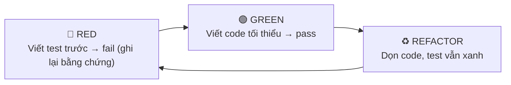
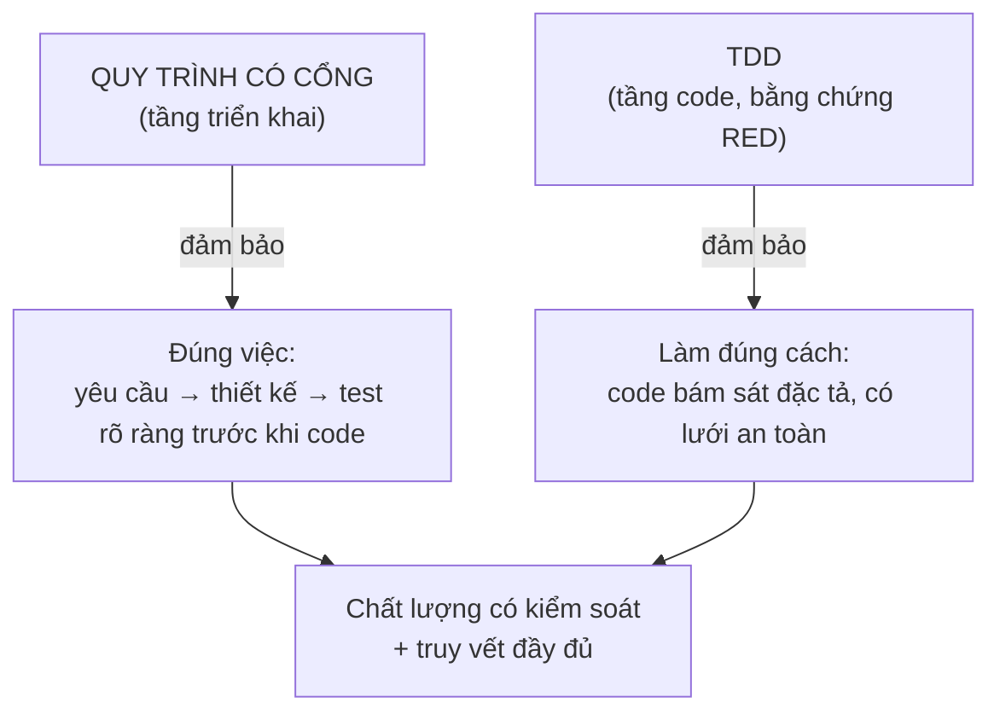
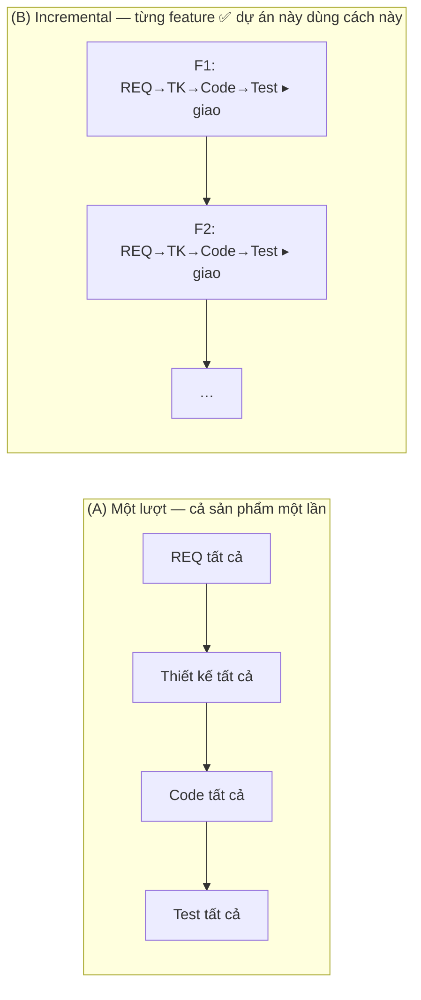

# Vì sao HBC chọn Incremental + TDD

> 🌐 [English](../../en/explanation/why-incremental-tdd.md) · **Tiếng Việt**
>
> 💡 **Explanation** — bài này lý giải lựa chọn nền tảng của HBC: *giao tăng dần theo từng tính năng (incremental / staged delivery)*, mỗi tính năng chạy một chu trình *có cổng, thiết kế-trước* kết hợp *TDD*.

HBC kết hợp hai tầng: **quy trình có cổng, thiết kế-trước** (mỗi feature đi tuần tự Analysis → Design → Implementation → Testing) ở tầng triển khai, và **TDD** ở tầng viết code. Toàn bộ áp dụng **theo từng tính năng** — và v2 *đảm bảo* tính độc lập đó bằng cách cô lập đầu ra theo feature, gate theo feature, nghiệm thu theo feature. Nên ở cấp dự án đây là **incremental (giao tăng dần)**, không phải làm một-lượt cả dự án. Sự kết hợp này là có chủ đích.

---

## Quy trình có cổng, thiết kế-trước: vì sao kỷ luật này đáng giá

Trong mỗi tính năng, công việc đi tuần tự: Analysis → Design → Implementation → Testing, mỗi phase chốt xong (qua **Phase Gate**, mang theo `feature=`) mới sang phase sau.

**Vì sao chọn kỷ luật có cổng thay vì "code ngay, dò dần"?**

| Bối cảnh phù hợp | Lý do |
| --- | --- |
| Yêu cầu rõ và ổn định | Ít thay đổi giữa chừng → đầu tư phân tích kỹ từ đầu là xứng đáng |
| Cần truy vết & tài liệu đầy đủ | Hợp đồng, audit, bàn giao — cần deliverable D-xx rõ ràng |
| Dự án outsourcing / nhiều bên | Ranh giới phase + phase gate giúp các bên đồng thuận từng mốc |
| Chất lượng kiểm soát theo cổng | Lỗi bị chặn ngay tại Gate, không trôi xuống dưới |

Đây chính là môi trường của HBLAB (ERP, dự án có hợp đồng và yêu cầu nghiệm thu). Kỷ luật có cổng + phase gate + traceability cho **khả năng kiểm soát và truy vết** mà lối "code ngay" khó đảm bảo bằng tài liệu.

> ⚠️ **Khi nào kỷ luật này *không* hợp:** yêu cầu mơ hồ, cần dò đường bằng prototype, thị trường biến động nhanh. Lúc đó lối làm linh hoạt (lặp nhanh, ít tài liệu) phù hợp hơn — đừng ép khung có cổng vào.

---

## TDD: kỷ luật chất lượng ở tầng code (mềm, dựa trên bằng chứng RED)

Bên trong Phase 3, HBC chạy **Test-Driven Development** theo chu trình **RED → GREEN → REFACTOR**:

**Cưỡng chế mềm, không phải đếm test.** HBC không chỉ đòi "mỗi task có một test" — mà đòi **test-first kèm bằng chứng RED**: trước khi viết code, phải có (và *ghi lại*) một test thất bại. **Cổng Phase 3 kiểm tra bằng chứng RED** đó (tự khai báo, không phải bằng chứng mật mã) — nếu thiếu RED, gate chặn. Cơ chế này giữ tinh thần TDD mà không biến nó thành nghi thức cứng nhắc.

**Vì sao TDD?**

- **Test viết trước = đặc tả thực thi được.** Bạn buộc phải hiểu rõ "đúng nghĩa là gì" trước khi code.
- **Bằng chứng RED = chứng cứ test-first.** Một test fail được ghi lại *trước* code chứng minh bạn thật sự viết test trước — không phải "viết test bù" sau.
- **Lưới an toàn khi refactor.** Có test xanh thì dọn code mà không sợ vỡ.
- **Khớp với D-27.** Test case trong Test Spec (D-27, per-feature) chính là nguồn để viết test RED.

---

## Vì sao ghép kỷ luật có cổng + TDD lại ăn ý

Hai tầng này bù khuyết cho nhau:

- **Kỷ luật có cổng** trả lời *"có đang xây đúng thứ không?"* — nhờ phân tích & thiết kế kỹ trước.
- **TDD** trả lời *"có đang xây đúng cách không?"* — nhờ test (bằng chứng RED) dẫn dắt từng dòng code.

Có cổng mà không có TDD: tài liệu đẹp nhưng code có thể lệch khỏi đặc tả. TDD mà không có cổng: code chắc nhưng dễ build sai thứ. Ghép lại: **vừa đúng việc, vừa đúng cách**, với traceability nối hai tầng từ `REQ-<FEAT>-NNN` đến từng test case.

---

## Phase 0 và cô lập theo feature: incremental được *đảm bảo* thế nào

Để "mỗi tính năng giao độc lập" không chỉ là khẩu hiệu, v2 dựng sẵn các bệ đỡ cụ thể:

- **Phase 0 — Project Init (chạy MỘT lần, toàn dự án):** trước mọi feature, `hbc-project-init` tạo các deliverable **dùng chung** — D-12 Coding Standards, D-03 Glossary, baseline D-19 ERD / D-21 API. Idempotent (bỏ qua cái đã có), không cần `feature`. Nhờ vậy mọi feature về sau khởi chạy trên cùng một nền móng, không lặp lại groundwork.
- **Cô lập đầu ra theo feature:** mỗi tính năng ghi vào `_bmad-output/features/<feature>/{planning-artifacts, implementation-artifacts, gates, traceability}/`; deliverable dùng chung nằm ở `_bmad-output/shared/...`. Hai feature không giẫm lên đầu ra của nhau.
- **Gate theo feature & nghiệm thu theo feature:** Phase Gate mang `feature=`; bước acceptance (`AC`) đóng *một* feature và cho phép giao nó độc lập — không chờ feature khác.
- **Không gian ID theo feature:** yêu cầu dùng `REQ-<FEAT>-NNN` (vd `REQ-AUTH-001`), cộng `REQ-SHARED-NNN` cho phần dùng chung; test case `TC-NNN` đánh số trong D-27 *của từng feature*. Nhờ vậy ID không đụng nhau giữa các feature.

Chính bốn bệ đỡ này biến "incremental" từ ý định thành **bảo đảm cấu trúc**: mỗi feature là một đơn vị có ranh giới riêng, gate riêng, ID riêng, giao được độc lập.

---

## Mô hình giao hàng của HBC: từng tính năng, không làm một lượt

Câu trả lời gọn: **mô hình giao hàng là một *thuộc tính của cách triển khai dự án*, không phải kiến trúc của HBC.** Một dự án giao theo cách nào do *cách triển khai thật* quyết định — cách chia scope, viết & duyệt tài liệu, chia task, lên lịch, bàn giao — chứ không phải do "công cụ có mấy bước".

HBC chỉ là **workflow có cổng, hướng-deliverable cho MỘT đơn vị công việc** (một feature): REQ → thiết kế → code (TDD/RED) → test, có Phase Gate ở mỗi ranh giới. Cái thứ-tự-có-cổng đó *không* tự quyết định mô hình giao hàng của cả dự án. Cùng một HBC chạy được theo hai cách:

> 📌 **Ở dự án này:** HBC được triển khai theo **(B) — incremental, từng tính năng**. Sau Phase 0 dựng nền chung, mỗi feature đi trọn 4 giai đoạn có cổng + TDD rồi giao (đầu ra cô lập trong `features/<feature>/...`, gate và nghiệm thu riêng), xong feature này sang feature khác. Nên ở cấp dự án đây là **giao tăng dần (incremental / staged delivery)**, không phải làm một-lượt cả dự án. Cái thứ-tự-có-cổng chỉ mô tả *kỷ luật bên trong một feature* (thiết kế trước, duyệt từng mốc, tài liệu đầy đủ) — không phải mô hình giao hàng cả dự án.

Ngoài ra, ngay *bên trong một feature* kỷ luật tuần tự của HBC cũng đã mềm hơn một quy trình tuần tự giáo khoa: test được **đặc tả sớm (Design) chạy muộn (Testing)** — hình chữ **V**; và có **dung sai phản hồi** (gate `fail → fix → re-run`, chế độ `update`).

---

## Tóm lại

| | Kỷ luật có cổng | TDD |
| --- | --- | --- |
| Tầng | Triển khai (macro) | Viết code (micro) |
| Trả lời | Xây đúng *thứ* không? | Xây đúng *cách* không? |
| Cơ chế | Phase + Gate + Traceability (per-feature) | RED-GREEN-REFACTOR (cưỡng chế mềm qua bằng chứng RED) |
| Hợp khi | Yêu cầu ổn, cần truy vết | Mọi lúc viết code |

> 🏷️ **Thuật ngữ đúng:** mô hình giao hàng của HBC là **incremental (giao tăng dần) / staged delivery** — Phase 0 dựng nền chung một lần, rồi mỗi tính năng là một chu trình có cổng, thiết kế-trước + TDD, cô lập và giao độc lập.

## Đọc tiếp

- 💡 Bốn khái niệm nền tảng: [Khái niệm cốt lõi](concepts.md).
- 📘 Thấy TDD vận hành trong Phase 3: [Bắt đầu với HBC](../tutorials/getting-started-hbc.md#phase-3--implementation-lập-trình-theo-tdd).
