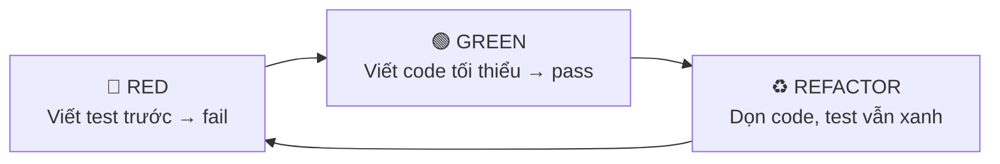
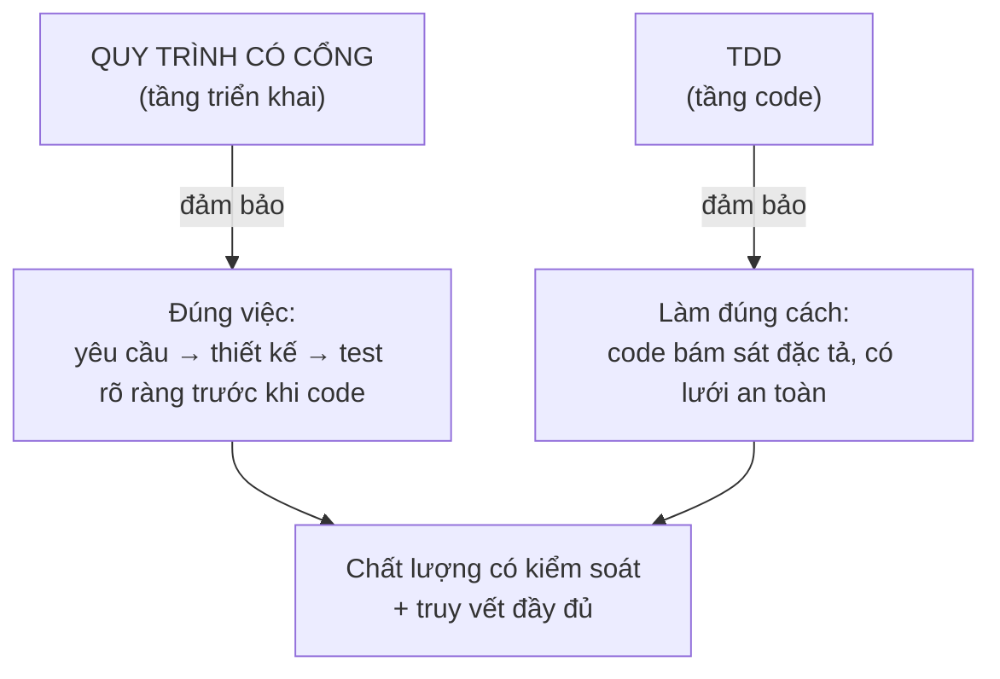
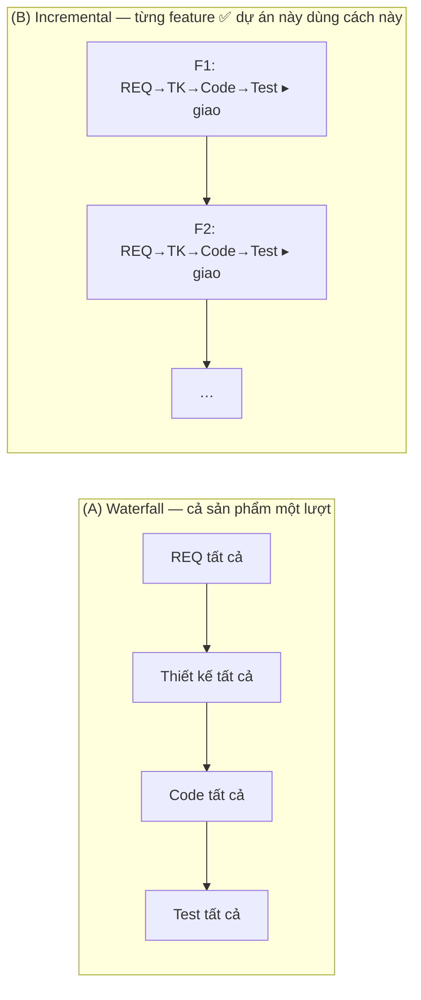

# Vì sao HBC chọn Incremental + TDD

> 🌐 [English](../../en/explanation/why-incremental-tdd.md) · **Tiếng Việt**
>
> 💡 **Explanation** — bài này lý giải lựa chọn nền tảng của HBC: *giao tăng dần theo từng tính năng (incremental)*, mỗi tính năng chạy một chu trình *có cổng, thiết kế-trước* kết hợp *TDD*.

HBC kết hợp hai tầng: **quy trình có cổng, thiết kế-trước** (mỗi feature đi tuần tự Analysis → Design → Implementation → Testing) ở tầng triển khai, và **TDD** ở tầng viết code. Toàn bộ áp dụng **theo từng tính năng** nên ở cấp dự án là **incremental**. Sự kết hợp này là có chủ đích.

---

## Quy trình có cổng, thiết kế-trước: vì sao kỷ luật này đáng giá

Trong mỗi tính năng, công việc đi tuần tự: Analysis → Design → Implementation → Testing, mỗi phase chốt xong (qua **Phase Gate**) mới sang phase sau.

**Vì sao chọn kỷ luật có cổng thay vì "code ngay, dò dần"?**

| Bối cảnh phù hợp | Lý do |
| --- | --- |
| Yêu cầu rõ và ổn định | Ít thay đổi giữa chừng → đầu tư phân tích kỹ từ đầu là xứng đáng |
| Cần truy vết & tài liệu đầy đủ | Hợp đồng, audit, bàn giao — cần deliverable D-xx rõ ràng |
| Dự án outsourcing / nhiều bên | Ranh giới phase + phase gate giúp các bên đồng thuận từng mốc |
| Chất lượng kiểm soát theo cổng | Lỗi bị chặn ngay tại Gate, không trôi xuống dưới |

Đây chính là môi trường của HBLAB (ERP, dự án có hợp đồng và yêu cầu nghiệm thu). Kỷ luật có cổng + phase gate + traceability cho **khả năng kiểm soát và truy vết** mà lối "code ngay" khó đảm bảo bằng tài liệu.

> ⚠️ **Khi nào kỷ luật này *không* hợp:** yêu cầu mơ hồ, cần dò đường bằng prototype, thị trường biến động nhanh. Lúc đó lối làm linh hoạt (lặp nhanh, ít tài liệu) phù hợp hơn — đừng ép khung có cổng vào.

---

## TDD: kỷ luật chất lượng ở tầng code

Bên trong Phase 3, HBC bắt buộc **Test-Driven Development** theo chu trình **RED → GREEN → REFACTOR**:

**Vì sao TDD?**

- **Test viết trước = đặc tả thực thi được.** Bạn buộc phải hiểu rõ "đúng nghĩa là gì" trước khi code.
- **Lưới an toàn khi refactor.** Có test xanh thì dọn code mà không sợ vỡ.
- **Phủ test tự nhiên cao.** Không phải "viết test bù" sau khi code xong.
- **Khớp với D-27.** Test case trong Test Spec (D-27) chính là nguồn để viết test RED.

---

## Vì sao ghép kỷ luật có cổng + TDD lại ăn ý

Hai tầng này bù khuyết cho nhau:

- **Kỷ luật có cổng** trả lời *"có đang xây đúng thứ không?"* — nhờ phân tích & thiết kế kỹ trước.
- **TDD** trả lời *"có đang xây đúng cách không?"* — nhờ test dẫn dắt từng dòng code.

Có cổng mà không có TDD: tài liệu đẹp nhưng code có thể lệch khỏi đặc tả. TDD mà không có cổng: code chắc nhưng dễ build sai thứ. Ghép lại: **vừa đúng việc, vừa đúng cách**, với traceability nối hai tầng từ REQ đến từng test case.

---

## HBC có thực sự là "waterfall thuần" không?

Câu trả lời gọn: **"waterfall" là một *mô hình triển khai dự án*, không phải kiến trúc của HBC.** Một dự án là waterfall hay không do *cách triển khai thật* quyết định — cách chia scope, viết & duyệt tài liệu, chia task, lên lịch, bàn giao — chứ không phải do "công cụ có mấy bước".

HBC chỉ là **workflow có cổng, hướng-deliverable cho MỘT đơn vị công việc** (một feature): REQ → thiết kế → code (TDD) → test, có Phase Gate ở mỗi ranh giới. Cái thứ-tự-có-cổng đó *không* tự làm cả dự án thành waterfall. Cùng một HBC chạy được theo hai cách:

> 📌 **Ở dự án này:** HBC được triển khai theo **(B) — incremental, từng tính năng**. Mỗi feature đi trọn 4 giai đoạn có cổng + TDD rồi giao, xong feature này sang feature khác. Nên ở cấp dự án đây là **giao tăng dần (incremental / staged delivery)**, không phải waterfall một-lượt. "Waterfall" chỉ mô tả *kỷ luật bên trong một feature* (thiết kế trước, duyệt từng mốc, tài liệu đầy đủ) — không phải mô hình triển khai cả dự án.

Ngoài ra, ngay *bên trong một feature* HBC cũng đã mềm hơn waterfall giáo khoa: test được **đặc tả sớm (Design) chạy muộn (Testing)** — hình chữ **V**; và có **dung sai phản hồi** (gate `fail → fix → re-run`, chế độ `update`).

---

## Tóm lại

| | Kỷ luật có cổng | TDD |
| --- | --- | --- |
| Tầng | Triển khai (macro) | Viết code (micro) |
| Trả lời | Xây đúng *thứ* không? | Xây đúng *cách* không? |
| Cơ chế | Phase + Gate + Traceability | RED-GREEN-REFACTOR |
| Hợp khi | Yêu cầu ổn, cần truy vết | Mọi lúc viết code |

> 🏷️ **Thuật ngữ đúng:** mô hình triển khai của HBC là **incremental (giao tăng dần) / staged delivery** — mỗi tính năng là một chu trình có cổng, thiết kế-trước + TDD. Không gọi cả dự án là "waterfall".

## Đọc tiếp

- 💡 Bốn khái niệm nền tảng: [Khái niệm cốt lõi](concepts.md).
- 📘 Thấy TDD vận hành trong Phase 3: [Bắt đầu với HBC](../tutorials/getting-started-hbc.md#phase-3--implementation-lập-trình-theo-tdd).
