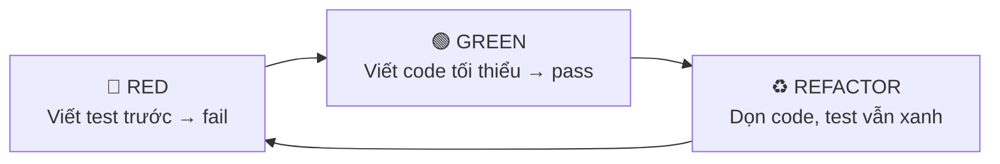
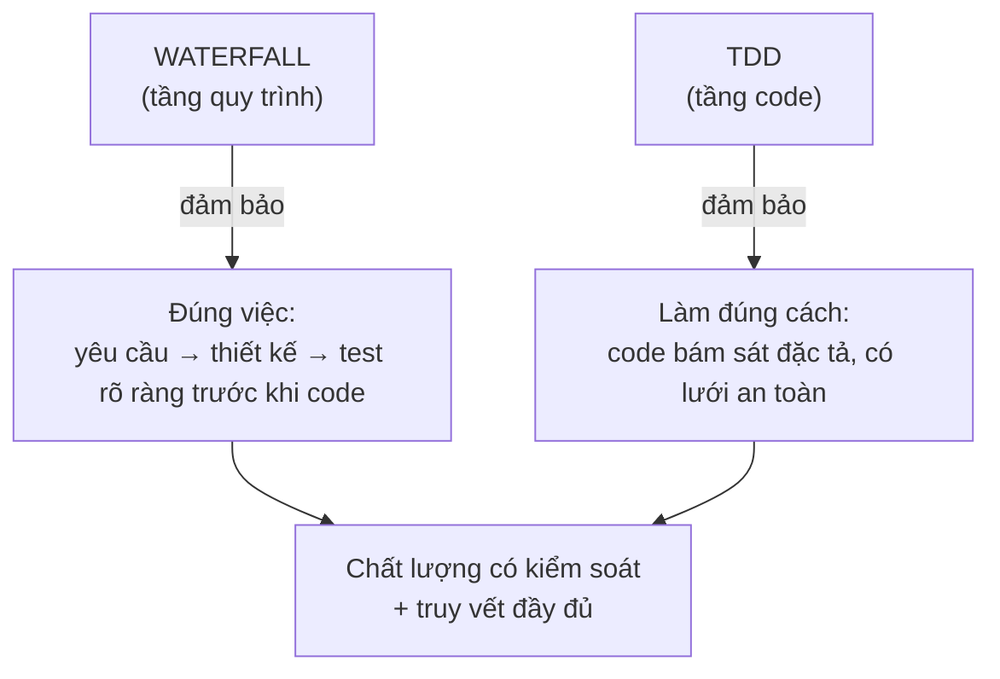

# Vì sao HBC chọn Waterfall + TDD

> 🌐 [English](../../en/explanation/why-waterfall-tdd.md) · **Tiếng Việt**
>
> 💡 **Explanation** — bài này lý giải lựa chọn nền tảng của HBC. Nếu bạn từng thắc mắc "sao lại waterfall trong thời đại agile?", đây là câu trả lời.

HBC kết hợp hai thứ tưởng như đối nghịch: **waterfall** ở tầng quy trình, và **TDD** ở tầng viết code. Sự kết hợp này là có chủ đích.

---

## Waterfall: dành cho yêu cầu cần chốt chặt

Waterfall đi tuần tự: Analysis → Design → Implementation → Testing, mỗi phase chốt xong mới sang phase sau.

**Vì sao chọn waterfall thay vì agile thuần?**

| Bối cảnh phù hợp waterfall | Lý do |
| --- | --- |
| Yêu cầu rõ và ổn định | Ít thay đổi giữa chừng → đầu tư phân tích kỹ từ đầu là xứng đáng |
| Cần truy vết & tài liệu đầy đủ | Hợp đồng, audit, bàn giao — cần deliverable D-xx rõ ràng |
| Dự án outsourcing / nhiều bên | Ranh giới phase + phase gate giúp các bên đồng thuận từng mốc |
| Chất lượng kiểm soát theo cổng | Lỗi bị chặn ngay tại Gate, không trôi xuống dưới |

Đây chính là môi trường của HBLAB (ERP, dự án có hợp đồng và yêu cầu nghiệm thu). Waterfall + phase gate + traceability cho **khả năng kiểm soát và truy vết** mà agile thuần khó đảm bảo bằng tài liệu.

> ⚠️ **Khi nào waterfall *không* hợp:** yêu cầu mơ hồ, cần dò đường bằng prototype, thị trường biến động nhanh. Lúc đó agile/iterative phù hợp hơn — đừng ép waterfall vào.

---

## TDD: kỷ luật chất lượng ở tầng code

Bên trong Phase 3, HBC bắt buộc **Test-Driven Development** theo chu trình **RED → GREEN → REFACTOR**:

**Vì sao TDD?**

- **Test viết trước = đặc tả thực thi được.** Bạn buộc phải hiểu rõ "đúng nghĩa là gì" trước khi code.
- **Lưới an toàn khi refactor.** Có test xanh thì dọn code mà không sợ vỡ.
- **Phủ test tự nhiên cao.** Không phải "viết test bù" sau khi code xong.
- **Khớp với D-27.** Test case trong Test Spec (D-27) chính là nguồn để viết test RED.

---

## Vì sao ghép waterfall + TDD lại ăn ý

Hai tầng này bù khuyết cho nhau:

- **Waterfall** trả lời *"có đang xây đúng thứ không?"* — nhờ phân tích & thiết kế kỹ trước.
- **TDD** trả lời *"có đang xây đúng cách không?"* — nhờ test dẫn dắt từng dòng code.

Waterfall mà không có TDD: tài liệu đẹp nhưng code có thể lệch khỏi đặc tả. TDD mà không có waterfall: code chắc nhưng dễ build sai thứ. Ghép lại: **vừa đúng việc, vừa đúng cách**, với traceability nối hai tầng từ REQ đến từng test case.

---

## Tóm lại

| | Waterfall | TDD |
| --- | --- | --- |
| Tầng | Quy trình (macro) | Viết code (micro) |
| Trả lời | Xây đúng *thứ* không? | Xây đúng *cách* không? |
| Cơ chế | Phase + Gate + Traceability | RED-GREEN-REFACTOR |
| Hợp khi | Yêu cầu ổn, cần truy vết | Mọi lúc viết code |

## Đọc tiếp

- 💡 Bốn khái niệm nền tảng: [Khái niệm cốt lõi](concepts.md).
- 📘 Thấy TDD vận hành trong Phase 3: [Bắt đầu với HBC](../tutorials/getting-started-hbc.md#phase-3--implementation-lập-trình-theo-tdd).
