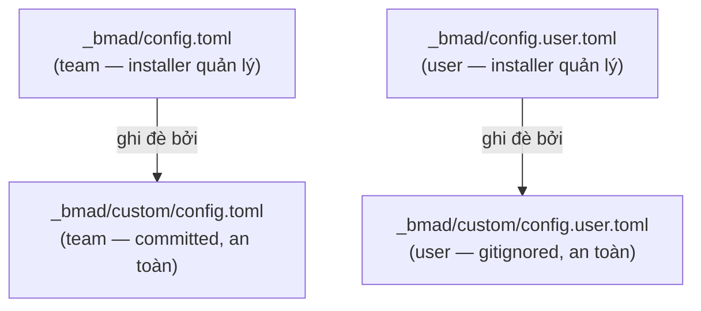

# Cách tùy chỉnh cấu hình

> 🌐 [English](../../en/how-to/customize-config.md) · **Tiếng Việt**
>
> 🔧 **How-to** — đổi các giá trị cấu hình (ngôn ngữ, thư mục output, tên hiển thị) một cách bền vững.

## Mục tiêu

Thay đổi giá trị cấu hình mà **không bị ghi đè** khi cài lại module.

## Các biến cấu hình

| Biến | Phạm vi | Mô tả |
| --- | --- | --- |
| `user_name` | User | Tên hiển thị khi agent chào |
| `communication_language` | User | Ngôn ngữ agent giao tiếp với bạn |
| `document_output_language` | Team | Ngôn ngữ tài liệu sinh ra |
| `output_folder` | Team | Thư mục output gốc (mặc định `_bmad-output`) |

## Hiểu các tầng config (quan trọng)



> ⚠️ **Đừng sửa trực tiếp** `_bmad/config.toml` hay `_bmad/config.user.toml` — chúng do installer quản lý và **sẽ bị ghi đè** ở lần cài tiếp theo.

## Hai cách đổi giá trị

### Cách 1 — Chạy lại installer (đơn giản)

Dùng **bản tương tác** để giữ nguyên các module đang cài:

```bash
npx bmad-method install
```

Installer nhớ câu trả lời cũ làm mặc định; bạn chỉ cần nhập giá trị mới.

> ⚠️ Đừng dùng `npx bmad-method install --custom-source ...` đơn lẻ chỉ để đổi cấu hình — nếu thiếu `--modules`, nó sẽ **gỡ** các module official khác (`bmm`/`bmb`).

### Cách 2 — Ghim giá trị qua file custom (bền, ưu tiên)

Sửa/ tạo file override — installer **không bao giờ đụng** tới chúng:

- Giá trị **team** (committed): `_bmad/custom/config.toml`
- Giá trị **user** (cá nhân, gitignored): `_bmad/custom/config.user.toml`

Ví dụ ghim ngôn ngữ tài liệu và tên hiển thị:

```toml
# _bmad/custom/config.toml
[core]
document_output_language = "Tiếng Việt có dấu"
output_folder = "{project-root}/_bmad-output"
```

```toml
# _bmad/custom/config.user.toml
[core]
user_name = "Hanhnt2"
communication_language = "Tiếng Việt có dấu"
```

Giá trị trong file custom **luôn thắng** giá trị do installer sinh ra.

## Mẹo

- Đặt giá trị **chung cả team** vào `custom/config.toml` (commit để mọi người dùng chung).
- Đặt giá trị **riêng bạn** vào `custom/config.user.toml` (đã gitignore).

## Liên quan

- 📘 [Bắt đầu với HBC](../tutorials/getting-started-hbc.md)
- 📖 [Catalog skill](../reference/skills-catalog.md)
