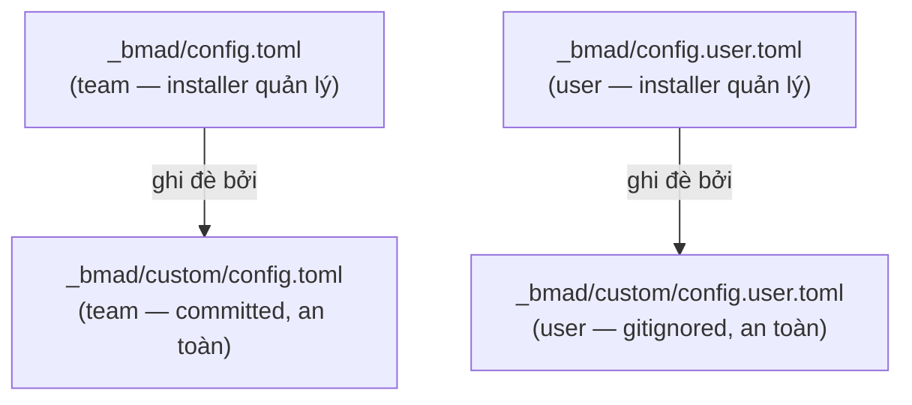
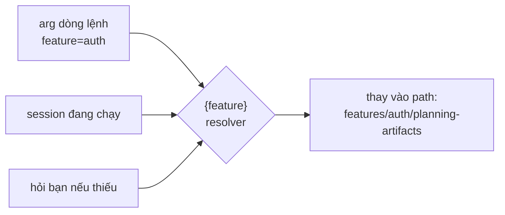
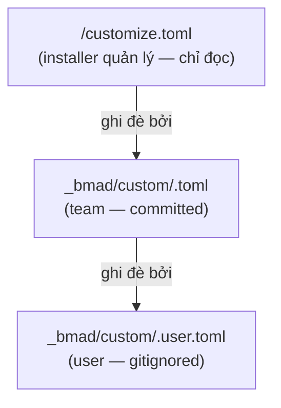

# Cách tùy chỉnh cấu hình

> 🌐 [English](../../en/how-to/customize-config.md) · **Tiếng Việt**
>
> 🔧 **How-to** — đổi các giá trị cấu hình (ngôn ngữ, thư mục output, **đường dẫn output theo bố cục per-feature / shared**) một cách bền vững, không bị ghi đè khi cài lại.

## Mục tiêu

Thay đổi giá trị cấu hình — đặc biệt là **nơi từng skill ghi deliverable** — mà **không bị ghi đè** khi cài lại module.

## Hai loại cấu hình

HBC có hai bề mặt tùy chỉnh tách biệt:

1. **Config dự án** (`config.toml`) — ngôn ngữ, tên hiển thị, `output_folder` gốc.
2. **Config từng skill** (`<skill>.toml`) — `output_dir` / các đường dẫn output của riêng skill đó, dùng bố cục **per-feature / shared / dual**.

## Phần A — Config dự án

### Các biến cấu hình

| Biến | Phạm vi | Mô tả |
| --- | --- | --- |
| `user_name` | User | Tên hiển thị khi agent chào |
| `communication_language` | User | Ngôn ngữ agent giao tiếp với bạn |
| `document_output_language` | Team | Ngôn ngữ tài liệu sinh ra |
| `output_folder` | Team | Thư mục output gốc (mặc định `_bmad-output`) — gốc cho **mọi** đường dẫn per-feature/shared |

### Các tầng config (quan trọng)



> ⚠️ **Đừng sửa trực tiếp** `_bmad/config.toml` hay `_bmad/config.user.toml` — chúng do installer quản lý và **sẽ bị ghi đè** ở lần cài tiếp theo.

### Hai cách đổi giá trị

#### Cách 1 — Chạy lại installer (đơn giản)

Dùng **bản tương tác** để giữ nguyên các module đang cài:

```bash
npx bmad-method install
```

Installer nhớ câu trả lời cũ làm mặc định; bạn chỉ cần nhập giá trị mới.

> ⚠️ Đừng dùng `npx bmad-method install --custom-source ...` đơn lẻ chỉ để đổi cấu hình — nếu thiếu `--modules`, nó sẽ **gỡ** các module official khác (`bmm`/`bmb`).

#### Cách 2 — Ghim giá trị qua file custom (bền, ưu tiên)

Sửa/tạo file override — installer **không bao giờ đụng** tới chúng:

- Giá trị **team** (committed): `_bmad/custom/config.toml`
- Giá trị **user** (cá nhân, gitignored): `_bmad/custom/config.user.toml`

```toml
# _bmad/custom/config.toml
[core]
document_output_language = "Tiếng Việt có dấu"
output_folder = "{project-root}/_bmad-output"
```

```toml
# _bmad/custom/config.user.toml
[core]
user_name = "Hanhnt2"
communication_language = "Tiếng Việt có dấu"
```

Giá trị trong file custom **luôn thắng** giá trị do installer sinh ra.

## Phần B — Đường dẫn output của từng skill (bố cục per-feature / shared)

Mỗi skill HBC có file `customize.toml` riêng (chỉ-đọc, do installer quản lý) khai báo skill đó ghi deliverable ở đâu. Các đường dẫn này **không còn dùng bố cục phẳng cũ** (`_bmad-output/planning-artifacts/...`) mà theo **phạm vi (scope)**:

| Phạm vi | Ghi vào đâu | Ví dụ skill |
| --- | --- | --- |
| **Per-feature** | `{output_folder}/features/{feature}/planning-artifacts` (hoặc `implementation-artifacts`) | `REQ` D-02, `BFD` D-06, `TP` D-26, `TS` D-27 |
| **Shared** (toàn dự án) | `{output_folder}/shared/{coding-standards \| glossary}` | `CS` D-12, `GLO` D-03 |
| **Dual** (ERD/API) | baseline **shared** `{output_folder}/shared/{erd \| api}` **+** override **per-feature** | `ERD` D-19, `API` D-21 |

### `{feature}` được giải quyết lúc chạy

Placeholder `{feature}` trong đường dẫn được thay bằng **slug tính năng** tại thời điểm chạy, theo thứ tự ưu tiên:



Chỉ những đường dẫn **chứa** `{feature}` mới được thay. Đường dẫn **shared** không có `{feature}` nên ghi cố định một chỗ cho cả dự án.

### Skill dual (ERD/API): hai đường dẫn, ưu tiên theo path-existence

Skill `ERD` và `API` khai báo **đồng thời** một đường dẫn baseline shared và một đường dẫn override per-feature:

```toml
# trích từ src/hbc-create-er-diagram/customize.toml (chỉ-đọc)
er_diagram_output_path  = "{output_folder}/shared/erd/D-19-database-design.md"
er_diagram_feature_path = "{output_folder}/features/{feature}/planning-artifacts/D-19-{feature}-database-design.md"
```

Quy tắc: **bản override per-feature thắng nếu nó tồn tại** (path-existence precedence). Không có `feature` → dùng baseline shared.

### Tầng override (giống config dự án)



Quy tắc merge: **scalar → override thắng** · **array (`persistent_facts`, `activation_steps_*`) → append (nối thêm)**.

> ⚠️ Đừng sửa `customize.toml` trong thư mục skill — nó **bị ghi đè mỗi lần update**. Luôn override qua `_bmad/custom/<skill>.toml`.

### Ví dụ 1 — đổi đường dẫn một skill **per-feature**

Đưa output D-02 của `REQ` sang thư mục `requirements` riêng (vẫn theo từng feature):

```toml
# _bmad/custom/hbc-create-requirements.toml
[workflow]
# scalar → override thắng; {feature} vẫn được resolver thay lúc chạy
output_dir = "{output_folder}/features/{feature}/requirements"
```

Khi chạy `REQ create feature=auth`, file ghi vào `_bmad-output/features/auth/requirements/`.

### Ví dụ 2 — đổi đường dẫn một skill **shared**

Đổi nơi `GLO` ghi D-03 (glossary dùng chung toàn dự án — không có `{feature}`):

```toml
# _bmad/custom/hbc-create-glossary.toml
[workflow]
glossary_output_path = "{output_folder}/shared/glossary/GLOSSARY.md"
```

File luôn ghi một chỗ cho cả dự án, không phụ thuộc feature.

## Mẹo

- Đặt giá trị **chung cả team** vào `custom/config.toml` và `custom/<skill>.toml` (commit để mọi người dùng chung).
- Đặt giá trị **riêng bạn** vào `custom/config.user.toml` và `custom/<skill>.user.toml` (đã gitignore).
- Giữ nguyên placeholder `{output_folder}` và `{feature}` trong đường dẫn — chúng được resolver thay lúc chạy; viết cứng đường dẫn sẽ phá bố cục per-feature/shared.

## Liên quan

- 📘 [Bắt đầu với HBC](../tutorials/getting-started-hbc.md)
- 📖 [Catalog skill](../reference/skills-catalog.md)
- 📖 [Glossary deliverable (D-xx)](../reference/deliverables-glossary.md)
- 🔗 [Dùng chế độ Headless](use-headless-mode.md)
