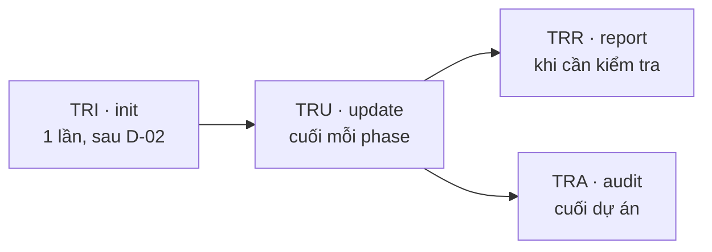

# Cách quản lý Traceability

> 🌐 [English](../../en/how-to/manage-traceability.md) · **Tiếng Việt**
>
> 🔧 **How-to** — vận hành ma trận truy vết qua cả vòng đời dự án. Muốn hiểu *traceability là gì & vì sao*, xem [Khái niệm cốt lõi](../explanation/concepts.md#4-traceability--sợi-chỉ-nối-yêu-cầu-đến-test).

## Mục tiêu

Đảm bảo mọi yêu cầu (REQ ID) đều có thiết kế, code và test tương ứng — không bỏ sót, không "mồ côi".

## Vòng đời 4 lệnh



| Bước | Lệnh | Khi nào | Kết quả |
| --- | --- | --- | --- |
| 1. Khởi tạo | `TRI` | **Một lần**, sau khi D-02 chốt | Ma trận từ các REQ ID |
| 2. Cập nhật | `TRU` | Cuối **mỗi** phase | Điền cột mới (design/code/test/gate) |
| 3. Báo cáo | `TRR` | Bất cứ lúc nào | Coverage: bao nhiêu REQ đủ chuỗi |
| 4. Audit | `TRA` | Cuối dự án (Phase 4) | Danh sách gap + mức nghiêm trọng |

Thêm `-H` vào bất kỳ lệnh nào để chạy headless.

## Các bước cụ thể

### 1. Khởi tạo (một lần)

Sau khi D-02 hoàn tất và đã có REQ-xxx ID:

```
TRI
```

Tạo ma trận tại `{output_folder}/traceability` (mặc định `_bmad-output/traceability`).

> ⚠️ Chỉ chạy `TRI` **một lần**. Chạy lại có thể ghi đè ma trận hiện có.

### 2. Cập nhật sau mỗi phase

Cuối mỗi phase (trước khi chạy `PG`):

```
TRU
```

`TRU` điền các cột: `design_ref` (sau Phase 2), `code_ref` (sau Phase 3), `test_ref` (sau Phase 2/3), `gate_status`.

### 3. Kiểm tra coverage bất cứ lúc nào

```
TRR
```

Cho biết bao nhiêu REQ ID đã có chuỗi truy vết đầy đủ — dùng để theo dõi tiến độ.

### 4. Audit gap cuối dự án

```
TRA
```

Liệt kê REQ nào còn thiếu link (thiếu thiết kế/code/test) và phân loại mức nghiêm trọng. Mục tiêu: **0 gap** trước nghiệm thu.

## Xử lý khi có gap

1. Chạy `TRA`, đọc danh sách gap.
2. Với mỗi gap, bổ sung phần còn thiếu (vd thiếu `test_ref` → quay lại `TS`/`TE` tạo test cho REQ đó).
3. Chạy lại `TRU` rồi `TRA` để xác nhận gap đã đóng.

## Liên quan

- 🔗 [Chạy Phase Gate](run-a-phase-gate.md)
- 📖 [Bảng deliverable D-xx](../reference/deliverables-glossary.md)
