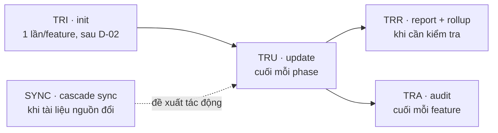
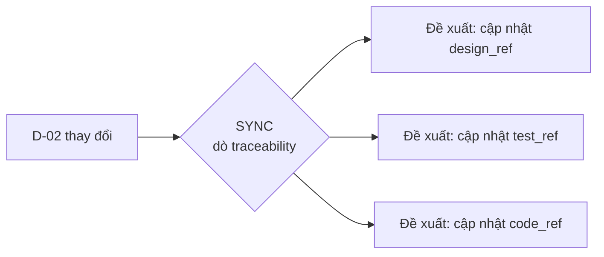

# Cách quản lý Traceability

> 🌐 [English](../../en/how-to/manage-traceability.md) · **Tiếng Việt**
>
> 🔧 **How-to** — vận hành ma trận truy vết (traceability matrix) cho **từng tính năng (feature)** và gộp (rollup) qua nhiều feature. Muốn hiểu *traceability là gì & vì sao*, xem [Khái niệm cốt lõi](../explanation/concepts.md#8-traceability--sợi-chỉ-nối-yêu-cầu-đến-test-và-cascade-sync).

## Mục tiêu

Đảm bảo mọi yêu cầu (`REQ-<FEAT>-NNN` hoặc `REQ-SHARED-NNN`) đều có thiết kế, code và test tương ứng — không bỏ sót, không "mồ côi". HBC giao **tăng dần theo từng tính năng (incremental per-feature)**, nên ma trận cũng theo từng feature: bạn ship được một feature mà không phải chờ feature khác.

## Ma trận 8 cột

Ở HBC v2, mỗi dòng ma trận có **8 cột**:

| Cột | Ý nghĩa |
| --- | --- |
| `feature` | Slug tính năng (vd `auth`) — `SHARED` cho yêu cầu dùng chung |
| `req_id` | `REQ-<FEAT>-NNN` (vd `REQ-AUTH-001`) hoặc `REQ-SHARED-NNN` |
| `story_id` | User story liên quan |
| `design_ref` | Tham chiếu thiết kế (D-19 ERD / D-21 API…) |
| `code_ref` | Tham chiếu code (file/hàm) |
| `test_ref` | Tham chiếu test (TC-NNN trong D-27) |
| `gate_status` | Trạng thái Phase Gate gần nhất |
| `timestamp` | Lần cập nhật gần nhất |

> 📊 **Coverage** được tính trên ba cột `design_ref` / `code_ref` / `test_ref`: một REQ "đủ chuỗi" khi cả ba đều có giá trị.

Ma trận của mỗi feature nằm tại `_bmad-output/features/<feature>/traceability/`.

## build-graph / matrix-as-view

Ma trận **không phải** một bảng bạn duy trì thủ công — nó là một **VIEW (matrix-as-view)** được suy ra từ một **build-graph kernel**: các artifact là node, các cạnh REQ→design→code→test được tính từ trường `sources:` mà mỗi node khai báo. Coverage và drift đến **TỪ đồ thị** (vd `missing_edges` = một REQ định nghĩa trong D-02 nhưng không có dòng nào trong ma trận), không phải từ việc bạn gõ tay đúng các ô.

`TRU` vẫn **ghi nhận mapping** (điền các tham chiếu vào ô), nhưng những con số coverage/drift mà bạn đọc là tính lại sống từ build-graph mỗi lần chạy — nên không thể âm thầm quên mất sự lỗi thời.

> 📐 Đồ thị còn cưỡng chế **v_pair** (mỗi deliverable thiết kế hiện diện phải có cạnh test-level ghép cặp). Còn re-baseline **xuyên feature** theo blast-radius là một engine riêng — `hbc-rebaseline` (`[RBL]`), không phải phần việc của 4 lệnh ở đây.

## Vòng đời 4 lệnh



| Bước | Lệnh | Khi nào | Kết quả |
| --- | --- | --- | --- |
| 1. Khởi tạo | `TRI` | **Một lần / feature**, sau khi D-02 chốt | Ma trận 8 cột từ các REQ ID của feature |
| 2. Cập nhật | `TRU` | Cuối **mỗi** phase | Điền `design_ref` / `code_ref` / `test_ref` / `gate_status` / `timestamp` |
| 3. Báo cáo | `TRR` | Bất cứ lúc nào | Coverage per-feature + **rollup** qua nhiều feature |
| 4. Audit | `TRA` | Cuối mỗi feature (Phase 4) | Danh sách gap + mức nghiêm trọng |
| ➕ Cascade Sync | `SYNC` | Khi một tài liệu nguồn thay đổi | Phân tích tác động lan truyền (read-only) + đề xuất sửa hạ nguồn |

Thêm `-H` vào bất kỳ lệnh nào để chạy headless. Các lệnh per-feature cần `feature=<slug>` khi chạy headless — xem [Chế độ headless](use-headless-mode.md).

## Các bước cụ thể

### 1. Khởi tạo (một lần / feature)

Sau khi D-02 của feature hoàn tất và đã có các REQ ID (`REQ-<FEAT>-NNN`):

```
TRI feature=auth
```

Tạo ma trận tại `_bmad-output/features/auth/traceability/`. Mỗi dòng là một REQ ID; bảy cột còn lại để trống chờ `TRU` điền dần.

> ⚠️ Chỉ chạy `TRI` **một lần cho mỗi feature**. Chạy lại có thể ghi đè ma trận hiện có của feature đó.

### 2. Cập nhật sau mỗi phase

Cuối mỗi phase (trước khi chạy `PG`):

```
TRU feature=auth
```

`TRU` điền các cột theo tiến độ phase:

- `design_ref` — sau **Phase 2** (Design: ERD/API).
- `test_ref` — sau **Phase 2** (Test Design: D-27) và bổ sung ở **Phase 4**.
- `code_ref` — sau **Phase 3** (Implementation).
- `gate_status` + `timestamp` — mỗi lần qua một Phase Gate.

### 3. Báo cáo coverage + rollup

```
TRR feature=auth     # coverage của riêng feature auth
TRR                  # rollup qua tất cả feature
```

`TRR` cho biết bao nhiêu REQ ID đã có chuỗi truy vết đầy đủ (cả `design_ref` + `code_ref` + `test_ref`).

> 🧮 **Rollup qua nhiều feature:** khi chạy `TRR` không kèm `feature=`, các ma trận per-feature được gộp lại. Các dòng `REQ-SHARED-NNN` (dùng chung) chỉ **đếm một lần**, tránh thổi phồng con số khi nhiều feature cùng tham chiếu một yêu cầu chung.

### 4. Audit gap cuối mỗi feature

```
TRA feature=auth
```

Liệt kê REQ nào của feature còn thiếu link (thiếu `design_ref` / `code_ref` / `test_ref`) và phân loại mức nghiêm trọng. Mục tiêu: **0 gap** trước khi nghiệm thu (acceptance) feature đó.

> 🔎 **drift-watch:** một `test_ref` *đã điền* vẫn có thể trở nên lỗi thời khi D-27 lớn dần (test case đổi/thêm mà ô không còn khớp). Audit **gắn cờ** trường hợp này; chạy lại **`TRU` Phase-2** để backfill cho khớp.

## Cascade Sync — khi một tài liệu nguồn thay đổi

Các deliverable không độc lập: đổi D-02 (yêu cầu) có thể kéo theo phải sửa thiết kế (D-19/D-21), test (D-27) và code. `SYNC` **đề xuất tác động**: nó dò ma trận traceability để gợi ý những cập nhật cần làm ở các deliverable/test/code hạ nguồn — phần gợi ý này không tự sửa.

> ⚠️ **Nhưng cascade giờ được CƯỠNG CHẾ, không chỉ đề xuất.** Một bước **cascade-precheck** chạy trước khi một tài liệu được coi là "complete": nếu có một **thay đổi chưa truy vết** (untraced change), nó **CHẶN** với mã `untraced_change` / `cascade_required` — tài liệu không thể đạt trạng thái complete cho tới khi bạn **backfill** cạnh truy vết còn thiếu rồi chạy lại. Tóm lại: `SYNC` *đề xuất* việc cần làm hạ nguồn; cascade-precheck *bắt buộc* bạn không bỏ sót một thay đổi nào.



```
SYNC feature=auth
```

`SYNC` đưa ra đề xuất theo từng skill (vd "chạy lại `ERD` cho REQ-AUTH-003", "bổ sung `TS` cho REQ-AUTH-007"). Bạn tự quyết áp dụng đề xuất nào, sau đó chạy lại `TRU` để cập nhật ma trận.

## Xử lý khi có gap

1. Chạy `TRA feature=<slug>`, đọc danh sách gap.
2. Với mỗi gap, bổ sung phần còn thiếu (vd thiếu `test_ref` → quay lại `TS`/`TE` tạo test cho REQ đó).
3. Nếu gap bắt nguồn từ một tài liệu nguồn vừa đổi, chạy `SYNC feature=<slug>` để xem còn gì phải sửa theo.
4. Chạy lại `TRU` rồi `TRA` để xác nhận gap đã đóng.

> 💡 Không chắc bước tiếp theo? Gọi `bmad-help` để được gợi ý skill phù hợp với trạng thái hiện tại.

## Liên quan

- 🔗 [Chạy Phase Gate](run-a-phase-gate.md)
- 🔗 [Chế độ headless](use-headless-mode.md)
- 📖 [Bảng deliverable D-xx](../reference/deliverables-glossary.md)
- 📖 [Danh mục skill](../reference/skills-catalog.md)
