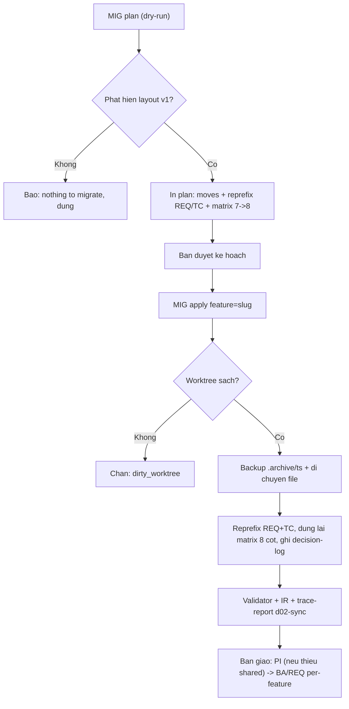

# Cách migrate dự án từ HBC v1 lên v2

> 🌐 [English](../../en/how-to/migrate-from-v1.md) · **Tiếng Việt**
>
> 🔧 **How-to** — hướng dẫn làm một việc cụ thể: đưa một dự án đã chạy **HBC v1 (layout phẳng)** lên **layout v2 (per-feature + shared)** một cách an toàn. Muốn hiểu *vì sao v2 đổi sang per-feature*, xem [Vì sao Incremental + TDD](../explanation/why-incremental-tdd.md).

## Mục tiêu

Bạn có một dự án **chạy HBC v1**: output nằm phẳng dưới `_bmad-output/{planning-artifacts,implementation-artifacts,gates,traceability}/`, ID dạng `REQ-NNN`, ma trận truy vết 7 cột. HBC v2 đổi sang mô hình **per-feature + shared**. Tài liệu này giúp bạn migrate **một cách an toàn** (xem trước → duyệt → áp dụng), rồi bàn giao về luồng per-feature bình thường.

## Khi nào bạn cần

Chạy `MIG` khi dự án có **dấu hiệu layout v1 (phẳng)**:

- output phẳng `_bmad-output/planning-artifacts/D-*`, `implementation-artifacts/`, `gates/`, `traceability/`;
- ID yêu cầu dạng `REQ-NNN` (chưa có tiền tố feature);
- ma trận truy vết **7 cột** (chưa có cột `feature`).

Nếu dự án đã ở v2 (hoặc chưa có gì để migrate), `MIG` báo **"nothing to migrate"** và dừng — không phá gì cả.

## Cái gì thay đổi (v1 → v2)

| Khía cạnh | v1 (phẳng) | v2 (per-feature + shared) |
| --- | --- | --- |
| Bố cục | `_bmad-output/{planning-artifacts,implementation-artifacts,gates,traceability}/` | `_bmad-output/features/<feature>/{…}/` + `_bmad-output/shared/{coding-standards,glossary,erd,api}/` |
| ID yêu cầu | `REQ-NNN` | `REQ-<FEAT>-NNN` (+ `REQ-SHARED-NNN`) |
| ID test case | `TC-NNN` (phẳng) | `TC-NNN` per-feature |
| Ma trận truy vết | 7 cột | **8 cột** (thêm cột `feature` ở đầu) |
| Mã D-code | D-08 (Architecture), D-17 (Behavioral) | **reconcile** về canonical: D-08 → D-09, D-17 → D-16 |

**Cách định tuyến artifact:** D-12 Coding Standards / D-03 Glossary + baseline D-19 ERD / D-21 API → `shared/`; còn D-02, D-06, D-26, D-27, task-breakdown, gates và ma trận → `features/<feature>/`.

## Luồng an toàn: plan → duyệt → apply

Migration là thao tác **một lần, có dịch chuyển file (destructive)**, nên luôn đi qua hai bước: **xem trước (dry-run)** rồi mới **áp dụng**.

### 1. Xem trước (dry-run, mặc định)

```
MIG plan
```

`MIG plan` **không ghi gì cả**. Nó in toàn bộ kế hoạch để bạn soi:

- từng phép dịch chuyển `src → dst` (file nào về `shared/`, file nào về `features/<feature>/`);
- bảng đổi tiền tố `REQ-NNN → REQ-<FEAT>-NNN` **và** `TC-NNN`;
- danh sách **D-code reconcile** (`dcode_rename`): D-08 → D-09, D-17 → D-16;
- kế hoạch dựng lại ma trận từ 7 → 8 cột (chèn cột `feature`).

> ⚠️ Ở chế độ headless (`-H`), mặc định cũng là **dry-run** trả về plan JSON. Để thực sự dịch chuyển file, headless cần đủ `feature=<slug>` **và** `--apply`. Thiếu feature → bị chặn với mã `feature_required`; nhiều feature trong tài liệu phẳng → chặn `multi_feature_ambiguous`. Chọn autonomy `--strict` (dừng ở quyết định domain đầu tiên) hay `--assumptions-allowed` (mặc định CI) — xem [Autonomy (A5)](use-headless-mode.md#autonomy-a5-strict-vs-assumptions-allowed).

### 2. Duyệt kế hoạch

Đọc kỹ preview. Đặc biệt kiểm tra **feature được gán có đúng không** và **D-19/D-21 có đi về `shared/` (baseline)** chứ không phải per-feature (D-06 mới là per-feature).

### 3. Áp dụng

```
MIG apply feature=<slug>
```

Khi `apply`, `MIG` sẽ: dịch chuyển file; đổi tiền tố **REQ và TC** trong D-02/D-26/D-27 + ma trận đã chuyển; **reconcile D-code** (đổi tên D-08 → D-09, D-17 → D-16); **dựng lại ma trận 8 cột** (chèn cột `feature`); và ghi **decision-log** mọi thay đổi.

## Backup & dirty-guard

Trước khi dịch chuyển bất cứ thứ gì, `apply` luôn:

- **kiểm tra worktree sạch (dirty-guard):** nếu còn thay đổi chưa commit, `MIG` **từ chối** dịch chuyển (mã `dirty_worktree`) — commit hoặc stash trước, hoặc dùng `--force` nếu bạn chắc chắn;
- **sao lưu trước (backup):** chép trạng thái hiện tại vào `.archive/<timestamp>/` (hoặc ghi chú git stash) để có thể quay lại.

## Một feature mỗi lần chạy

Ở v1, **mỗi lần `apply` chỉ xử lý một feature** — luôn truyền `feature=<slug>`. Nếu tài liệu phẳng chứa yêu cầu của **nhiều feature**, `MIG` sẽ **cảnh báo** (`multi_feature_ambiguous`) và yêu cầu bạn tách thủ công rồi chạy `MIG apply feature=<slug>` **lần lượt cho từng feature**. Coi chừng **đụng số TC giữa các feature** sau khi tách.

## Idempotency (chạy lại an toàn)

`MIG` nhận biết artifact **đã ở v2** và bỏ qua chúng. Chạy lại trên dự án đã migrate (hoặc không có gì để migrate) → báo **"nothing to migrate"**, không ghi đè. Nếu `shared/` đã có nội dung (vì `PI` từng chạy), `MIG` **không ghi đè** — tránh tạo trùng.

**D-code reconcile cũng idempotent:** file đã ở mã canonical (D-09/D-16) **không bị đổi tên lại**.

### Cây D-code lẫn lộn (MIXED) — `dcode_collision`

Nếu cây hiện có **cả mã cũ lẫn mã canonical** cùng tồn tại (vd có cả D-08 *và* D-09), `MIG` không tự ý gộp — nó báo **`dcode_collision`** và **để bạn phân xử** (giữ file nào, gộp nội dung ra sao) trước khi reconcile tiếp.

## Xác minh & bàn giao

Sau khi `apply`, xác nhận layout v2 đã hợp lệ rồi mới quay lại luồng bình thường:

1. **Chạy validator** trên các artifact đã chuyển (mỗi deliverable phải PASS validator của nó).
2. **Đối soát D-02 ↔ test/IR:** chạy `IR feature=<slug>` cho PASSED (đối soát D-02 ↔ D-21/D-26/D-27 + ma trận) và kiểm tra d02-sync qua trace-report.
3. **Bàn giao về luồng per-feature:** nếu `shared/` còn thiếu, chạy `PI` một lần; rồi tiếp tục `BA → REQ …` **cho từng feature** như bình thường.

> 💡 Sau migrate, ma trận đã là 8 cột — chạy `TRU feature=<slug>` để cập nhật, rồi `PG <n> feature=<slug>` như mọi feature khác.

## Luồng migrate



## Mẹo

- Luôn chạy `MIG plan` (dry-run) trước, đọc kỹ preview rồi mới `apply`.
- Commit hoặc stash mọi thay đổi **trước khi** `apply` để dirty-guard không chặn bạn.
- Một feature mỗi lần chạy — tài liệu nhiều feature thì tách thủ công, chạy lần lượt.
- Sau migrate, đừng tạo lại shared bằng `PI` nếu `shared/` đã có nội dung.
- Chưa rõ bước tiếp theo? Hỏi `bmad-help` để được gợi ý.

## Liên quan

- 🚀 [Khởi tạo dự án (Phase 0)](../tutorials/getting-started-hbc.md)
- 🔗 [Quản lý Traceability](manage-traceability.md)
- 🤖 [Dùng chế độ Headless](use-headless-mode.md)
- 🗺️ [Bản đồ quy trình](../tutorials/workflow-map.md)
- 📖 [Catalog skill](../reference/skills-catalog.md)
