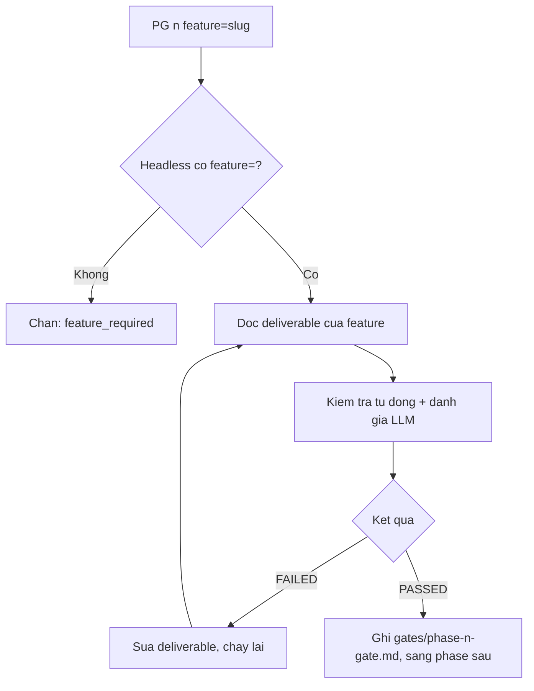

# Cách chạy Phase Gate

> 🌐 [English](../../en/how-to/run-a-phase-gate.md) · **Tiếng Việt**
>
> 🔧 **How-to** — hướng dẫn làm một việc cụ thể: chạy và xử lý kết quả Phase Gate cho **một tính năng (feature)**. Muốn hiểu *Gate là gì*, xem [Khái niệm cốt lõi](../explanation/concepts.md#4-phase-gate--chốt-kiểm-soát-giữa-các-phase).

## Mục tiêu

Kiểm tra một phase của **một tính năng** đã hoàn thành đủ chuẩn để sang phase sau chưa. Phase Gate giờ chạy **theo từng tính năng (per-feature)**: mỗi tính năng có bộ gate riêng, được kiểm soát độc lập với các tính năng khác.

## Chạy gate

Luôn **truyền số phase** (1–4) kèm **slug của tính năng** qua `feature=`:

```
PG 2 feature=auth
```

hoặc chạy không tương tác (headless):

```
PG 2 feature=auth -H
```

Tham số **bắt buộc**:

- `1` | `2` | `3` | `4` — số phase
- `feature=<slug>` — slug tính năng cần chạy gate
- thêm `-H` để chạy headless

> ⚠️ Ở chế độ headless, `PG` **bắt buộc** có `feature=`. Thiếu nó, gate bị chặn với mã `feature_required`.

## Đọc kết quả

Gate chạy hai lớp — **kiểm tra tự động** (deliverable bắt buộc có chưa, định dạng đúng chưa) + **đánh giá LLM** (nội dung rõ, đủ, nhất quán chưa) — rồi trả về một trong các **verdict**:

| Verdict | Ý nghĩa |
| --- | --- |
| **PASSED** | Đạt — sang phase sau được. |
| **FAILED** | Không đạt — có mục bắt buộc (knockout) fail; sửa rồi chạy lại. |
| **WARNING** | Hạ cấp ở chế độ lenient, **chỉ** cho các mục không-đúng-đắn (non-correctness); không chặn cứng. |
| **CONTESTED** | Chặn; một **con người phải phân xử** — gate **không bao giờ tự động pass**. |
| **BLOCKED** | Evaluator **crash / không chạy được** — **không bao giờ là PASS**, và không phải một lỗi thoáng qua (transient) bỏ qua được. |

Ở chế độ headless, một **design gate** sạch nhưng **chưa có chữ ký USER** trả về verdict **`PASSED_PENDING_SIGNOFF`** dưới `--assumptions-allowed` (xem [Chế độ headless](use-headless-mode.md#autonomy-a5-strict-vs-assumptions-allowed)) — sạch về máy nhưng vẫn chờ ký.

Gate đọc và ghi báo cáo trong thư mục **của chính tính năng đó**:

```
_bmad-output/features/<feature>/gates/phase-<n>-gate*.md
```

Ví dụ với `feature=auth`, gate Phase 2 ghi vào `_bmad-output/features/auth/gates/phase-2-gate.md`.

### Điều kiện riêng theo phase

- **Gate Phase 1** có mục **`P1-09` — model-validation**: USER **ký xác nhận** domain model (thực thể, trạng thái, luật) đã được kiểm chứng trước khi đóng Analysis. Mục này **tự điều chỉnh cho greenfield** (chưa có code để đối chiếu thì xác nhận trên giả định/PRD). Mục đích: chặn lỗi "model sai nhưng vẫn được PASSED" trôi xuống thiết kế.
- **Gate Phase 1** còn có mục **`P1-11`** (chỉ khi D-02 đặt `discovery_risk: uncertain`): phải có **discovery-note** verdict **VALIDATED** + đã ký (chạy `DSC` / `hbc-discovery-spike`). RESHAPE/KILL — hoặc thiếu/chưa ký — nghĩa là model **chưa sẵn** → **FAIL** tới khi spike lại đạt VALIDATED. `known`/vắng → N/A. Với feature uncertain, đây là *đường* kiểm chứng cho P1-09 (không nhận chữ ký chay).
- **Gate Phase 2** còn yêu cầu **`IR` (kiểm tra sẵn sàng / readiness check)** đã PASSED — `IR` đối soát D-02 ↔ D-21/D-26/D-27 và ma trận truy vết trước khi cho sang Phase 3.
- **Gate Phase 3** kiểm tra **bằng chứng RED (RED evidence)** — phải có bằng chứng test thất bại được ghi lại *trước khi* viết code (test-first, theo TDD mềm).

> ⚠️ **Design gate cần chữ ký USER:** một **design-gate PASS ở cả Phase 1 VÀ Phase 2** đòi USER **ký xác nhận tường minh** trên thiết kế — không nhận chữ ký chay, không tự động pass. (P1-09 ở trên là biến thể Phase 1 của quy tắc này.)

### Sàn máy reconcile — knockout chặn cứng

Ngoài checklist, gate còn chạy một bước **reconcile / invariant-FAIL** ở **sàn máy** (build-graph). Đây là một RED **không caller nào hạ cấp được** (verdict đóng băng, miễn nhiễm waiver) và **chặn PASS ngay cả khi checklist xanh** — đảm bảo chống false-green:

- **model-drift** giữa code↔thiết kế (vd D-19 ↔ code) — node `ground-truth` (code/DB) phân kỳ với node thiết kế; hoặc
- một **REQ thiếu cạnh ma trận** (`missing_edges`: một REQ định nghĩa trong D-02 nhưng không có dòng nào trong ma trận).

Bất kỳ cái nào ở trên → gate **không PASS**, kể cả khi mọi mục checklist đã đạt. (Phán đoán "sai có *thực chất* không" — đổi tên vs phân kỳ thật — là **trần ngữ nghĩa**, nhường cho tầng review LLM, không quyết ở sàn máy.)

## Khi FAILED

1. Mở báo cáo gate trong `features/<feature>/gates/`, đọc phần liệt kê mục chưa đạt.
2. Sửa đúng deliverable được nêu (vd: D-02 thiếu tiêu chí chấp nhận → mở `REQ` chế độ `update` với cùng `feature`).
3. Chạy lại `PG <n> feature=<feature>`.
4. Lặp đến khi **PASSED** mới sang phase sau.

> 💡 Gate "FAILED" không phải lỗi của bạn — nó đang chặn lỗi trôi xuống phase sau (nơi sửa đắt hơn nhiều).

## RECYCLE → phase-(n−k)

Khi vấn đề nằm ở một node **thượng nguồn đã lỗi thời** (vd Phase 3 gate phát hiện thiết kế Phase 2 đã stale), gate **không** trả một FAIL phẳng — nó **RECYCLE**, trả quyền điều khiển về **phase sớm nhất** sở hữu node dirty/fail đó (earliest-wins). Bạn sửa **tại phase đó**, rồi chạy lại tiến lên (re-run forward) qua các gate.

Mỗi lần recycle được đếm. Recycle lặp nhiều lần chạm **loop-cap** ("blown appetite") → gate chuyển sang **BLOCKED** kèm khuyến nghị **circuit-breaker** cho USER quyết: **re-slice / defer / kill** (là đề xuất, không phải hành động tự động). Trong khi BLOCKED, CI **không bao giờ xanh**.

## Mẹo

- Chạy gate **trước mỗi lần chuyển phase**, đừng để dồn đến cuối.
- Trước khi chạy `PG`, nên `TRU` để cập nhật traceability của tính năng — gate cũng soi `gate_status` trong ma trận `features/<feature>/traceability/`.
- Với Phase 2, chạy `IR feature=<feature>` cho PASSED trước, rồi mới `PG 2`.
- Dùng `-H` khi chạy trong CI/script tự động (nhớ luôn kèm `feature=`). Chọn autonomy `--strict` (dừng ở quyết định domain đầu tiên) hay `--assumptions-allowed` (mặc định CI) — xem [Autonomy (A5)](use-headless-mode.md#autonomy-a5-strict-vs-assumptions-allowed).
- Chưa rõ bước tiếp theo? Hỏi `bmad-help` để được gợi ý.

## Luồng gate per-feature



## Liên quan

- 🔗 [Quản lý Traceability](manage-traceability.md)
- 🤖 [Chế độ headless](use-headless-mode.md)
- 🗺️ [Bản đồ quy trình](../tutorials/workflow-map.md)
- 📖 [Danh mục skill](../reference/skills-catalog.md)
