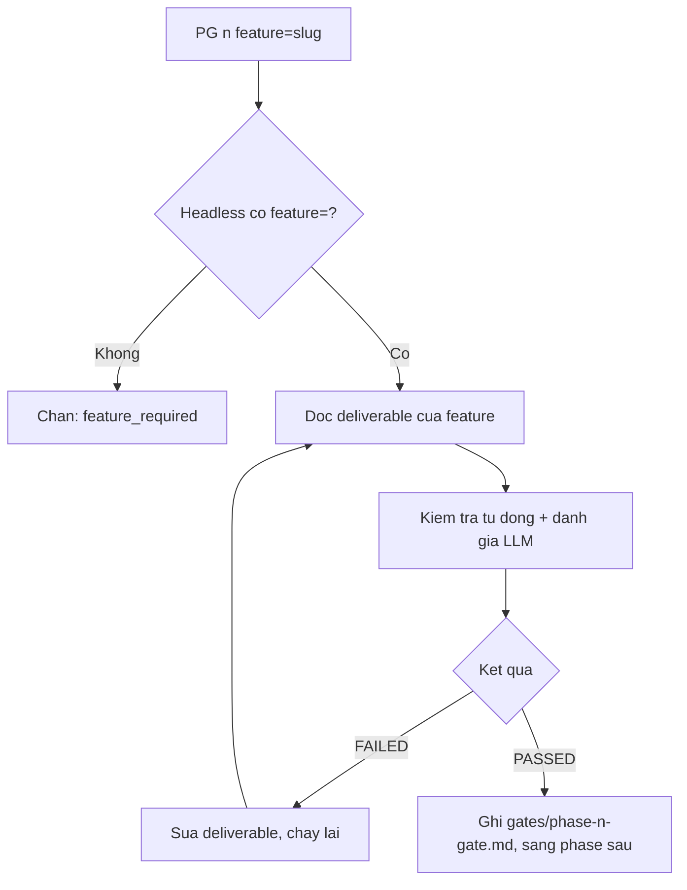

# Cách chạy Phase Gate

> 🌐 [English](../../en/how-to/run-a-phase-gate.md) · **Tiếng Việt**
>
> 🔧 **How-to** — hướng dẫn làm một việc cụ thể: chạy và xử lý kết quả Phase Gate cho **một tính năng (feature)**. Muốn hiểu *Gate là gì*, xem [Khái niệm cốt lõi](../explanation/concepts.md#4-phase-gate--chốt-kiểm-soát-giữa-các-phase).

## Mục tiêu

Kiểm tra một phase của **một tính năng** đã hoàn thành đủ chuẩn để sang phase sau chưa. Phase Gate giờ chạy **theo từng tính năng (per-feature)**: mỗi tính năng có bộ gate riêng, được kiểm soát độc lập với các tính năng khác.

## Chạy gate

Luôn **truyền số phase** (1–4) kèm **slug của tính năng** qua `feature=`:

```
PG 2 feature=auth
```

hoặc chạy không tương tác (headless):

```
PG 2 feature=auth -H
```

Tham số **bắt buộc**:

- `1` | `2` | `3` | `4` — số phase
- `feature=<slug>` — slug tính năng cần chạy gate
- thêm `-H` để chạy headless

> ⚠️ Ở chế độ headless, `PG` **bắt buộc** có `feature=`. Thiếu nó, gate bị chặn với mã `feature_required`.

## Đọc kết quả

Gate chạy hai lớp — **kiểm tra tự động** (deliverable bắt buộc có chưa, định dạng đúng chưa) + **đánh giá LLM** (nội dung rõ, đủ, nhất quán chưa) — rồi trả báo cáo **PASSED** hoặc **FAILED**.

Gate đọc và ghi báo cáo trong thư mục **của chính tính năng đó**:

```
_bmad-output/features/<feature>/gates/phase-<n>-gate*.md
```

Ví dụ với `feature=auth`, gate Phase 2 ghi vào `_bmad-output/features/auth/gates/phase-2-gate.md`.

### Điều kiện riêng theo phase

- **Gate Phase 2** còn yêu cầu **`IR` (kiểm tra sẵn sàng / readiness check)** đã PASSED — `IR` đối soát D-02 ↔ D-21/D-26/D-27 và ma trận truy vết trước khi cho sang Phase 3.
- **Gate Phase 3** kiểm tra **bằng chứng RED (RED evidence)** — phải có bằng chứng test thất bại được ghi lại *trước khi* viết code (test-first, theo TDD mềm).

## Khi FAILED

1. Mở báo cáo gate trong `features/<feature>/gates/`, đọc phần liệt kê mục chưa đạt.
2. Sửa đúng deliverable được nêu (vd: D-02 thiếu tiêu chí chấp nhận → mở `REQ` chế độ `update` với cùng `feature`).
3. Chạy lại `PG <n> feature=<feature>`.
4. Lặp đến khi **PASSED** mới sang phase sau.

> 💡 Gate "FAILED" không phải lỗi của bạn — nó đang chặn lỗi trôi xuống phase sau (nơi sửa đắt hơn nhiều).

## Mẹo

- Chạy gate **trước mỗi lần chuyển phase**, đừng để dồn đến cuối.
- Trước khi chạy `PG`, nên `TRU` để cập nhật traceability của tính năng — gate cũng soi `gate_status` trong ma trận `features/<feature>/traceability/`.
- Với Phase 2, chạy `IR feature=<feature>` cho PASSED trước, rồi mới `PG 2`.
- Dùng `-H` khi chạy trong CI/script tự động (nhớ luôn kèm `feature=`).
- Chưa rõ bước tiếp theo? Hỏi `bmad-help` để được gợi ý.

## Luồng gate per-feature



## Liên quan

- 🔗 [Quản lý Traceability](manage-traceability.md)
- 🤖 [Chế độ headless](use-headless-mode.md)
- 🗺️ [Bản đồ quy trình](../tutorials/workflow-map.md)
- 📖 [Danh mục skill](../reference/skills-catalog.md)
