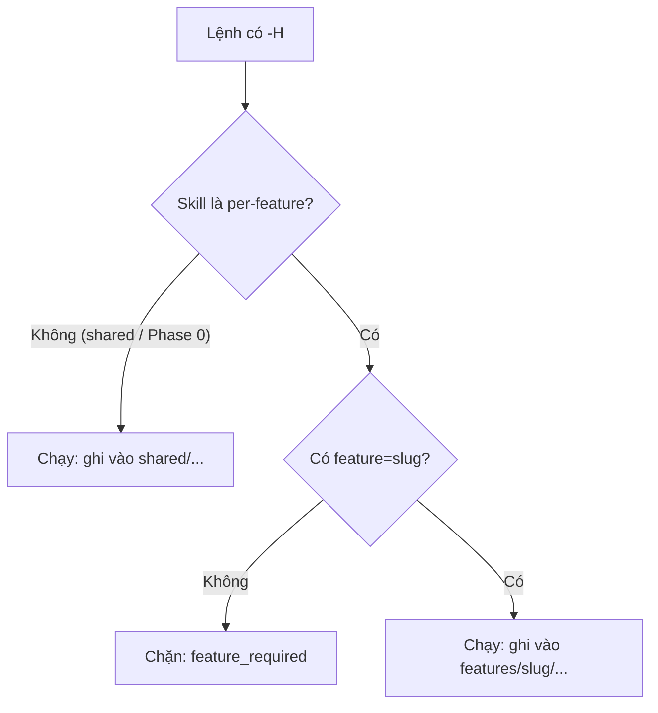

# Cách dùng chế độ Headless

> 🌐 [English](../../en/how-to/use-headless-mode.md) · **Tiếng Việt**
>
> 🔧 **How-to** — chạy skill HBC không cần hỏi-đáp tương tác, đúng theo từng tính năng (per-feature).

## Mục tiêu

Chạy một skill ở chế độ tự động (không dừng lại hỏi bạn) cho script, CI, hoặc khi đầu vào đã đủ rõ — đồng thời chỉ đúng **tính năng** (feature) mà skill cần thao tác.

Vì HBC bàn giao tăng dần theo từng tính năng (incremental per-feature delivery), hầu hết skill phải biết mình đang chạy cho feature nào. Ở chế độ tương tác agent có thể hỏi; ở chế độ headless **không có ai để hỏi**, nên bạn phải truyền `feature=<slug>` ngay trong lệnh.

## Cú pháp

Thêm cờ `--headless` hoặc viết tắt `-H`, kèm `feature=<slug>` khi skill cần:

```
REQ create feature=auth -H
PG 1 feature=auth -H
TRU feature=auth -H
```

Một lệnh headless thực tế đầy đủ cho Phase 1 của tính năng `auth`:

```
REQ create feature=auth -H
```

Lệnh này ghi kết quả vào `_bmad-output/features/auth/planning-artifacts/D-02-...`. Mỗi feature có cây thư mục riêng dưới `features/<feature>/`, nên truyền sai `feature=` sẽ ghi nhầm chỗ.

Hầu hết skill workflow đều hỗ trợ `-H` (xem cột Args trong [Catalog skill](../reference/skills-catalog.md)).

## `feature=` bắt buộc khi nào?

Quy tắc phụ thuộc vào **phạm vi** (scope) của skill:

| Phạm vi | Skill (code) | `feature=` ở headless | Nơi ghi kết quả |
| --- | --- | --- | --- |
| **Phase 0** | `PI` (hbc-project-init) | Không nhận `feature` | `shared/...` (chạy một lần, toàn dự án) |
| **Dùng chung (shared)** | `GLO` D-03, `CS` D-12 | Không nhận `feature` | `shared/glossary/`, `shared/coding-standards/` |
| **Dual** | `ERD` D-19, `API` D-21 | Tùy chọn (mặc định baseline shared) | `shared/erd\|api/`, hoặc `features/<feature>/...` nếu có override |
| **Per-feature** | `REQ`, `BFD`, `TP`, `TS`, `IR`, `TB`, `IM`, `TE`, `AC`, `PG`, `TRI/TRU/TRR/TRA` | **Bắt buộc** | `features/<feature>/...` |

Skill **per-feature** thiếu `feature=` ở headless sẽ bị chặn với lý do `feature_required` (không có ai để hỏi nên skill dừng an toàn thay vì đoán).

> 💡 Skill **dual** (`ERD`/`API`) coi `feature` là tùy chọn: bỏ trống thì cập nhật baseline dùng chung; truyền vào thì tạo/ghi đè bản per-feature. Áp dụng quy tắc **path-existence precedence** — nếu bản override tồn tại thì nó thắng.

## Khái niệm "blocked reason" (lý do bị chặn)

Khi chạy headless mà điều kiện chưa đủ, skill **không đoán bừa** — nó dừng và trả về một *lý do bị chặn* thuộc một **tập đóng** (closed set) định nghĩa sẵn. Mỗi skill liệt kê tập lý do của riêng nó trong phần "headless contract" của nó; `feature_required` là một thành viên dùng chung cho mọi skill per-feature.



## Autonomy (A5): strict vs assumptions-allowed

Khi chạy headless, agent vẫn gặp những lựa chọn cần quyết. **A5 autonomy** tách quyết định **MECHANICAL** (máy tự quyết & đi tiếp) khỏi quyết định **DOMAIN** (phải hỏi; không bao giờ bịa một default). Hai cờ chuẩn — áp dụng đồng nhất cho mọi skill **và** cho gate — chọn cách xử lý một quyết định domain chưa được giải:

| Cờ | Hành vi |
| --- | --- |
| `--strict` | Dừng ở **quyết định DOMAIN chưa giải đầu tiên** và trả về `blocked` kèm câu hỏi. |
| `--assumptions-allowed` (mặc định CI) | Chọn phương án **dễ-bảo-vệ-nhất**, log một `ASSUMPTION`, rồi đi tiếp; **không bao giờ chặn ngay lượt đầu, không bao giờ bịa một green/PASS**. |

Hai cờ này **trực giao** với `-H`: `-H` quyết định *có hỏi-đáp tương tác không*, còn `--strict`/`--assumptions-allowed` quyết định *khi không có ai để hỏi thì xử lý quyết định domain ra sao*. Mặc định CI là `--assumptions-allowed` để pipeline chạy liền mạch mà vẫn để lại dấu vết `ASSUMPTION` cho người soi lại.

> 💡 Trên một **design gate** sạch nhưng **chưa có chữ ký USER**, `--assumptions-allowed` trả verdict headless **`PASSED_PENDING_SIGNOFF`** (xem [Chạy Phase Gate](run-a-phase-gate.md)) — sạch về máy nhưng vẫn chờ ký, **không** phải một PASS đầy đủ.

Một vài **blocked reason** xuyên-skill thường gặp ở `--strict` (mỗi skill liệt kê tập đóng của riêng nó):

- `untraced_change` — một thay đổi chưa có cạnh truy vết (cascade-precheck).
- `stale_design` — node thiết kế thượng nguồn đã lỗi thời (dirty-set).
- `mapping_unconfirmed` — một ánh xạ cần USER xác nhận.
- `dcode_collision` — cây D-code lẫn lộn (cả mã cũ lẫn mã canonical cùng tồn tại).

## Khi nào nên dùng

| Tình huống | Vì sao headless hợp |
| --- | --- |
| Chạy trong CI/CD pipeline | Không có người trả lời prompt |
| Đầu vào đã đầy đủ, rõ ràng | Không cần agent hỏi thêm |
| Chạy lại hàng loạt (batch) | Tránh dừng giữa chừng |
| Tự động hóa qua script | Thực thi liền mạch, mỗi feature một dòng |

## Khi nào **không** nên dùng

- Lần đầu tạo deliverable cần bàn bạc (vd `REQ` lần đầu cho một feature mới) — chế độ tương tác giúp elicitation tốt hơn.
- Khi yêu cầu còn mơ hồ — để agent hỏi sẽ ra kết quả chất lượng hơn.

> 💡 Quy tắc đơn giản: **tương tác khi sáng tạo nội dung lần đầu; headless khi validate, cập nhật, hoặc chạy tự động.**

## Kết hợp với chế độ và feature

`-H` đi kèm chế độ/đối số của skill **và** `feature=<slug>`. Ví dụ chạy trọn một feature từ thiết kế tới gate:

```
ERD feature=auth -H
CS -H
TP feature=auth -H
TS feature=auth -H
IR feature=auth -H
PG 2 feature=auth -H
```

Lưu ý: `CS` là skill shared nên **không** kèm `feature=`; `ERD` là dual nên truyền `feature=auth` để tạo bản override per-feature (bỏ đi thì cập nhật baseline shared).

Hoặc validate hàng loạt cuối một feature:

```
REQ validate feature=auth -H
TS validate feature=auth -H
TRA feature=auth -H
```

## Liên quan

- 📖 Cột Args từng skill: [Catalog skill](../reference/skills-catalog.md)
- 🔗 [Chạy Phase Gate](run-a-phase-gate.md)
- 🔗 [Quản lý traceability](manage-traceability.md)
