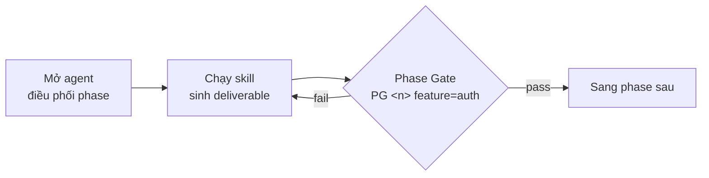
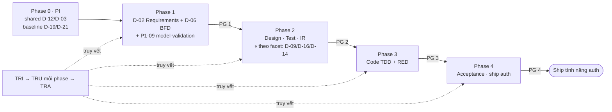

# Bắt đầu với HBC (Đưa một tính năng đi trọn vòng đời)

> 🌐 [English](../../en/tutorials/getting-started-hbc.md) · **Tiếng Việt**
>
> 📘 **Tutorial** — học qua làm. Khởi tạo dự án một lần, rồi đưa **một** tính năng đi trọn các phase của HBC cho đến khi ship.

## Bạn sẽ làm được gì

Sau hướng dẫn này, bạn sẽ:

- Hiểu vòng lặp cốt lõi của HBC: **mở agent → chạy skill → qua Phase Gate → sang phase sau**.
- Chạy **Phase 0 (`PI`)** một lần để tạo các deliverable dùng chung của cả dự án.
- Tự tay đưa một tính năng đi hết Phase 1 → 4: Analysis → Design → Implementation → Testing, rồi **ship riêng tính năng đó**.
- Biết cách bật **traceability** để truy vết từ yêu cầu đến test.

HBC giao **tăng dần theo từng tính năng** (incremental per-feature delivery): mỗi tính năng đi qua các phase rồi ship độc lập với tính năng khác. Bên trong **một** tính năng, HBC giữ **kỷ luật tuần tự, thiết kế-trước** (thiết kế trước, đóng gate ở mỗi mốc) — đó là cách làm việc bên trong một feature, không phải mô hình giao hàng của cả dự án.

Chúng ta dùng một ví dụ xuyên suốt: tính năng **`auth`** (Đăng nhập / Xác thực). Mọi đường dẫn và mã ID dưới đây đều theo tính năng này.

## Trước khi bắt đầu

> ▶️ **Chưa chạy HBC bao giờ?** Làm [Khởi động nhanh 10 phút](quickstart.md) trước — nó hướng dẫn cài đặt, xác nhận chạy, môi trường để gõ lệnh, và tạo file D-02 đầu tiên. Bài này tiếp nối từ đó để đi trọn vòng đời một tính năng.

Bạn cần đã hoàn thành Quickstart (đã cài HBC, đã gõ `BA` thấy agent chào). Nếu `BA` chưa phản hồi, xem [phần xử lý sự cố trong Quickstart](quickstart.md#nếu-ba-không-phản-hồi-).

> 💡 **Mẹo vàng:** Bất cứ lúc nào không biết làm gì tiếp, gõ `bmad-help`. Nó xem trạng thái dự án và gợi ý bước kế tiếp.
>
> 📖 **Gặp từ lạ?** (deliverable, phase gate, traceability, scope, RED evidence…) → tra nhanh ở [Glossary khái niệm](../reference/concept-glossary.md).

## Vòng lặp cốt lõi

Mọi phase của một tính năng đều theo đúng nhịp này:



Nhớ được nhịp này là bạn dùng được HBC. Giờ làm thử.

## Hai loại đường dẫn: per-feature và shared

HBC ghi output vào hai chỗ. Nắm trước thì các bước sau sẽ rõ:

- **Per-feature** (riêng tính năng): `_bmad-output/features/auth/{planning-artifacts, implementation-artifacts, gates, traceability}/`
- **Shared** (dùng chung cả dự án): `_bmad-output/shared/{coding-standards, glossary, erd, api}/`

| Phạm vi | Deliverable | Nằm ở |
| --- | --- | --- |
| **Per-feature** | D-02, D-06, D-26, D-27 + (theo facet) D-09, D-14, D-16 | `features/auth/planning-artifacts/` |
| **Shared** | D-03 (glossary), D-12 (coding-standards) | `shared/glossary/`, `shared/coding-standards/` |
| **Dual** | D-19 (erd), D-21 (api) | baseline ở `shared/erd|api/` + bản ghi đè per-feature tùy chọn ở `features/auth/planning-artifacts/` (bản ghi đè thắng nếu tồn tại) |

Yêu cầu được đánh mã **`REQ-AUTH-NNN`** (per-feature, ví dụ `REQ-AUTH-001`); yêu cầu dùng chung là `REQ-SHARED-NNN`. Test case `TC-NNN` đánh số tuần tự trong D-27 **của từng tính năng**.

---

## Phase 0 — Project Init (BẮT BUỘC, chạy ĐẦU TIÊN cho cả dự án)

**Phase 0 là bắt buộc và phải hoàn thành TRƯỚC khi làm bất kỳ tính năng nào.** Chạy một lần cho cả dự án; về sau muốn cập nhật thì **chạy lại để cập nhật trực tiếp**. Bước này **không** kèm tên tính năng.

```
PI
```

`PI` (`hbc-project-init`) làm hai việc, theo thứ tự:

1. **Hiểu dự án** —
   - *Brownfield* (đã có code): tài liệu hóa codebase trước bằng `bmad-document-project`, rồi đảm bảo có `project-context.md` (`bmad-generate-project-context`).
   - *Greenfield* (làm mới): rút bối cảnh từ PRD / product brief / yêu cầu bạn cung cấp.
2. **Tạo các deliverable dùng chung TỪ bối cảnh đó** — **D-12 Coding Standards** (brownfield: rút từ quy ước code hiện có), **D-03 Glossary** (thuật ngữ nghiệp vụ), **constitution.md** (các nguyên tắc bất biến xuyên phase: test-first · language-policy · SoD · handoff-through-artifact · simplicity-caps), và **baseline D-19 ERD** (brownfield: từ schema DB) / **baseline D-21 API** (brownfield: từ các endpoint hiện có), ghi vào `shared/`.

`PI` **idempotent** — chạy lại sẽ bỏ qua những gì đã có (hoặc cập nhật trực tiếp), nên cứ yên tâm chạy.

> 📌 Vì không gắn với tính năng nào, `PI` **không** nhận `feature=`. **D-12 và D-03 là deliverable dùng chung của Phase 0**, không phải bước tùy chọn của Phase 1/2. Sau bước này, mọi việc còn lại đều theo từng tính năng.

✅ **Xong Phase 0:** dự án đã hiểu rõ bối cảnh và có chuẩn code, glossary, constitution, baseline ERD/API dùng chung — tạo ra từ chính bối cảnh đó. Giờ đưa tính năng `auth` vào quy trình.

---

## Phase 1 — Analysis (Phân tích)
**Mục tiêu:** mô tả rõ tính năng `auth` muốn gì, dưới dạng yêu cầu có mã (`REQ-AUTH-NNN`).

### Bước 1.1 — Mở agent Phân tích

```
BA
```

Agent **BA** (Business Analyst) sẽ chào và hiện menu các việc của Phase 1.

> 🎉 **Micro-win:** Thấy agent chào nghĩa là bạn đã "ở trong" HBC đúng chỗ — mọi bước sau chỉ là chọn việc cho nó làm.

### Bước 1.2 — Tạo Đặc tả yêu cầu (D-02)

```
REQ
```

Agent phỏng vấn bạn về tính năng. Với `auth`, bạn có thể trả lời đại ý:

> Người dùng nhập email và mật khẩu để đăng nhập. Hệ thống kiểm tra thông tin đăng nhập, khóa tài khoản tạm thời sau 5 lần sai, và phát hành phiên đăng nhập khi thành công.

Kết quả: file **D-02 Requirements Specification** ở `_bmad-output/features/auth/planning-artifacts/`, với các yêu cầu đánh mã `REQ-AUTH-001`, `REQ-AUTH-002`… Cú pháp từ khóa EARS giữ tiếng Anh (`WHEN … THE SYSTEM SHALL …`); phần văn xuôi theo `{document_output_language}`.

> 📌 **D-02 (REQ) và D-06 (BFD) đều là deliverable per-feature BẮT BUỘC của Phase 1** — không thể qua `PG 1` nếu thiếu một trong hai. D-02 là nền cho mọi phase sau; D-06 mô tả luồng nghiệp vụ và mọi REQ phải map về một flow. Lưu ý: **D-03 glossary đến từ Phase 0** (dùng chung), không phải bước Phase 1 — về sau skill `GLO` chỉ *cập nhật* D-03 đã có.

### Bước 1.2b — Tạo Sơ đồ luồng nghiệp vụ (D-06 / BFD)

```
BFD
```

`BFD` (`hbc-create-business-flow-diagram`) sinh **D-06 Business Flow Diagram** ở `_bmad-output/features/auth/planning-artifacts/`, gồm sơ đồ **Mermaid AS-IS / TO-BE** cho luồng `auth` (ví dụ: người dùng nhập thông tin → kiểm tra → phát hành phiên / khóa tài khoản sau 5 lần sai). **D-06 là deliverable bắt buộc để qua Phase 1** — `PG 1` kiểm tra D-06 tồn tại, có Mermaid hợp lệ, và **mọi REQ map về một flow**. Phần văn xuôi theo `{document_output_language}`.

### Bước 1.3 — Khởi tạo Traceability

> **Traceability** = nối mỗi yêu cầu tới thiết kế, code và test của nó, để không bỏ sót yêu cầu nào.

Ngay khi đã có REQ ID, bật ma trận truy vết của tính năng:

```
TRI
```

`TRI` đọc các REQ ID từ D-02 và tạo ma trận traceability ở `features/auth/traceability/`. Ma trận có **8 cột**: `feature | req_id | story_id | design_ref | code_ref | test_ref | gate_status | timestamp`. Từ giờ, mỗi phase sau sẽ điền thêm cột (thiết kế, code, test).

### Bước 1.4 — Qua Phase Gate 1

Trước khi sang Design, kiểm tra Phase 1 đã đủ chưa — **luôn kèm số phase và tên tính năng**:

```
PG 1 feature=auth
```

Phase Gate chạy kiểm tra tự động + đánh giá bằng LLM, rồi trả về **pass** hoặc **fail** kèm lý do, ghi vào `features/auth/gates/`. Để **pass**, `PG 1` đòi hỏi: **D-02** đầy đủ REQ ID, **D-06 (BFD)** tồn tại + có Mermaid hợp lệ + mọi REQ map về một flow, ma trận traceability đã khởi tạo, và mục **`P1-09` — model-validation** (bạn **ký xác nhận** domain model của `auth` — thực thể, trạng thái, luật — đã được kiểm chứng; mục này tự điều chỉnh cho greenfield). Nếu **fail**, sửa theo gợi ý rồi chạy lại. **Pass** mới đi tiếp.

> 📌 **P1-09 chặn lỗi gốc.** Mục này có để một domain model *sai* không lọt qua Phase 1 rồi kéo theo thiết kế/code sai ở phase sau — bạn xác nhận model đúng *trước khi* khoá Analysis.
>
> 🔬 **Feature có model chưa chắc chắn?** Đặt `discovery_risk: uncertain` ở frontmatter D-02 → chạy **[DSC] `hbc-discovery-spike`** để kiểm chứng giả định rủi ro nhất so với code/DB/ví dụ thật, ra verdict **VALIDATED/RESHAPE/KILL**. Khi đó gate Phase 1 (**P1-11**) đòi một discovery-note VALIDATED đã ký — không nhận chữ ký chay. Feature rõ ràng (`known`) thì bỏ qua bước này.
>
> 🔁 **Gate không chỉ "pass/fail".** Khi vấn đề nằm ở một node thượng nguồn đã lỗi thời, gate có thể trả **RECYCLE → một phase sớm hơn** (earliest-wins) thay vì FAIL phẳng — bạn sửa **tại phase đó** rồi chạy lại tiến lên. Recycle lặp chạm loop-cap thì giữ **BLOCKED** cho USER quyết. Xem [Cách chạy Phase Gate](../how-to/run-a-phase-gate.md).
>
> 🤖 **Agent sẽ HỎI ở các quyết định nghiệp vụ.** Theo **A5 autonomy**, agent tự quyết các điểm máy móc (MECHANICAL) rồi đi tiếp, nhưng dừng lại **hỏi** ở quyết định **DOMAIN** — không bao giờ bịa một mặc định.

✅ **Xong Phase 1:** đã có D-02, D-06 (BFD), ma trận traceability khởi tạo, và model-validation đã ký cho `auth`.

---

## Phase 2 — Design (Thiết kế) + Test Design
**Mục tiêu:** thiết kế dữ liệu/quy chuẩn code, lên kế hoạch test, rồi **kiểm tra sẵn sàng** — trước khi viết dòng code nào.

### Bước 2.1 — Thiết kế (agent ARCH)

```
ARCH
```

Agent ARCH chạy các skill thiết kế **phù hợp với facet của tính năng** — applicability-catalog quyết định cái nào áp dụng (xem [Khái niệm cốt lõi · applicability theo facet](../explanation/concepts.md)). Với `auth` (có cả state-machine khóa tài khoản, lẫn màn hình đăng nhập):

- `ERD` → **D-19 Database Design / ER Diagram** (dual). Mặc định cập nhật baseline ở `shared/erd/`; nếu `auth` cần khác baseline, tạo bản ghi đè per-feature (ví dụ bảng `users` có `email`, `password_hash`, `failed_attempts`…). Bản ghi đè thắng nếu tồn tại.
- `CS` → **D-12 Coding Standards** (shared — thường đã có từ Phase 0; chạy lại để bổ sung nếu cần).
- `API` → **D-21 API Specification** (dual, tùy chọn — ví dụ endpoint `POST /auth/login`).
- `AD` → **D-09 Architecture Design** ◑ — chạy nếu tính năng có **tích hợp / thuật toán**. Với `auth`, ghi lại **ADR** cho quyết định kiến trúc (vd lưu phiên ở đâu, cơ chế băm mật khẩu).
- `BD` → **D-16 Behavioral Design** ◑ — chạy vì `auth` có **state-machine** (khóa tài khoản sau 5 lần sai) và **invariant**. Đặc tả ST/DR/INV/SEQ, làm nguồn để QA viết unit-test.
- `UX` → **D-14 UX / Screen Design** ◑ — chạy vì `auth` có **màn hình đăng nhập** (`has-ui`): SCR/CMP, trạng thái lỗi/khóa; tùy chọn token Claude Design (`DESIGN.md`).

> 📌 **◑ = theo facet.** Một tính năng thuần CRUD, không UI, không tích hợp sẽ **bỏ qua** AD/BD/UX (trạng thái N/A — không chặn gate). `auth` tình cờ kích hoạt cả ba; tính năng khác có thể chỉ cần ERD + test.

### Bước 2.2 — Thiết kế test (agent QA)

```
QA
```

Rồi:

- `TP` → **D-26 Test Plan** (chiến lược test cho `auth`).
- `TS` → **D-27 Test Specification** (các test case cụ thể `TC-001`, `TC-002`… ví dụ: "sai mật khẩu → báo lỗi", "5 lần sai → khóa tài khoản").

### Bước 2.3 — Cập nhật Traceability

```
TRU
```

`TRU` điền cột `design_ref` / `test_ref` vào ma trận — giờ mỗi REQ ID đã nối tới thiết kế và test case tương ứng.

### Bước 2.4 — Kiểm tra sẵn sàng (`IR`) rồi qua Gate

Đây là chốt chặn mới ở Phase 2 — chạy **trước** `PG 2`:

```
IR
```

`IR` (`hbc-check-implementation-readiness`) đối chiếu **D-02 ↔ D-21 / D-26 / D-27 + ma trận**: mọi yêu cầu đã có API, test plan, test case và dòng truy vết tương ứng chưa? Đây là "đường nối" giữa thiết kế và lập trình — sửa các thiếu sót mà `IR` chỉ ra trước khi đi tiếp. Khi `IR` ổn:

```
PG 2 feature=auth
```

✅ **Xong Phase 2:** đã có thiết kế DB, kế hoạch test, test spec, đã qua readiness check — tất cả truy vết về REQ.

---

## Phase 3 — Implementation (Lập trình theo TDD)
> **TDD** = viết test trước, chạy thấy fail, rồi mới viết code cho test đó pass.

**Mục tiêu:** viết code theo chu trình **RED → GREEN → REFACTOR**, có **bằng chứng RED** trước khi viết code.

### Bước 3.1 — Chia nhỏ công việc

```
DEV
TB
```

`TB` (Task Breakdown) chia `auth` thành các task nhỏ, có thứ tự, ghi vào `features/auth/implementation-artifacts/`.

### Bước 3.2 — Lập trình TDD (bằng chứng RED trước code)

Chạy toàn bộ task (hoặc một task cụ thể với `IM task TASK-001`):

```
IM all
```

`IM` dẫn bạn qua từng task theo TDD:

1. 🔴 **RED** — viết test (từ D-27) trước, **chạy thấy fail, và ghi lại bằng chứng RED**. HBC áp dụng **TDD mềm**: bằng chứng RED phải được ghi nhận *trước khi* viết code — gate Phase 3 sẽ kiểm tra bằng chứng này (tự khai báo, không cần chứng minh mật mã).
2. 🟢 **GREEN** — viết code tối thiểu để test **pass**.
3. ♻️ **REFACTOR** — dọn code, test vẫn xanh.

> 📌 Tinh thần: "test-first kèm bằng chứng RED", không chỉ là "có tồn tại test".

### Bước 3.3 — Cập nhật Traceability & qua Gate

```
TRU
PG 3 feature=auth
```

`TRU` điền cột `code_ref`. `PG 3` kiểm tra cả bằng chứng RED.

✅ **Xong Phase 3:** code đã chạy, có test xanh và bằng chứng RED, truy vết tới REQ.

---

## Phase 4 — Testing (Kiểm thử & Nghiệm thu)
**Mục tiêu:** chạy toàn bộ test, xử lý lỗi, ra quyết định nghiệm thu — rồi **ship riêng tính năng `auth`**.

```
TST
TE all
AC review
```

- `TE all` → **Test Execution Report** (chạy test, ghi kết quả, triage lỗi). Có thể chạy riêng `TE unit` / `TE integration` / `TE e2e`.
- `AC review` → **Acceptance Report** (quyết định ACCEPTED/REJECTED/DEFERRED/PENDING). Nghiệm thu ở **mức tính năng**: `auth` được chấp nhận và ship độc lập, không phải chờ các tính năng khác.

Cuối cùng, chốt truy vết và soi lỗ hổng:

```
TRA
PG 4 feature=auth
```

`TRA` audit ma trận của `auth` — chỉ ra REQ nào còn thiếu `design_ref`/`code_ref`/`test_ref`. Lý tưởng: **0 gap**.

> 💡 Muốn xem nhanh độ phủ bất cứ lúc nào (không bắt buộc), gõ `TRR`. `TRR` còn có thể tổng hợp coverage **xuyên nhiều tính năng** (các dòng shared chỉ đếm một lần).

> 🔁 **Khi một tài liệu nguồn thay đổi về sau:** chạy `SYNC` (Cascade Sync) để phân tích tác động và đề xuất cập nhật lan truyền xuống các doc/test/code phụ thuộc.
>
> 🌐 **Khi một model lõi/shared đổi xuyên nhiều feature** (sau khi đã có feature ship trên model cũ): chạy **`RBL` (`hbc-rebaseline`)** — nó tính **blast-radius** (feature/artifact nào stale) rồi lập kế hoạch re-baseline per-feature ở mức epic/baseline-change. Đây là engine RIÊNG, không phải `MIG` (migrate layout).

✅ **Xong Phase 4:** tính năng `auth` đã đi trọn vòng đời, được nghiệm thu và ship riêng, có truy vết đầy đủ.

---

## Bạn vừa làm được gì



Bạn đã chạy **Phase 0** một lần, rồi đưa tính năng `auth` đi hết 4 phase với traceability đầy đủ và ship riêng. Tính năng tiếp theo chỉ cần lặp lại Phase 1 → 4 với `feature=` của nó — Phase 0 không phải chạy lại.

## Bước tiếp theo

- 🗺️ Xem toàn cảnh mọi skill & deliverable: [Bản đồ quy trình](workflow-map.md).
- 💡 Hiểu sâu Phase / Gate / Scope / Traceability và vì sao bàn giao tăng dần + TDD: [Khái niệm cốt lõi](../explanation/concepts.md) · [Vì sao incremental + TDD](../explanation/why-incremental-tdd.md).
- 🔧 Khi cần làm việc cụ thể: [Chạy Phase Gate](../how-to/run-a-phase-gate.md) · [Quản lý Traceability](../how-to/manage-traceability.md) · [Chế độ Headless](../how-to/use-headless-mode.md) · [Tùy chỉnh cấu hình](../how-to/customize-config.md).
- 📚 Tra cứu: [Glossary khái niệm](../reference/concept-glossary.md) · [Danh mục skill](../reference/skills-catalog.md) · [Glossary deliverable](../reference/deliverables-glossary.md).

## Bảng tra nhanh

| Việc | Gõ |
| --- | --- |
| Không biết làm gì tiếp | `bmad-help` |
| Khởi tạo dự án (một lần, shared) | `PI` |
| Mở agent từng phase | `BA` · `ARCH` · `QA` · `DEV` · `TST` |
| Tạo yêu cầu (D-02) | `REQ` |
| Tạo sơ đồ luồng nghiệp vụ (D-06, bắt buộc Phase 1) | `BFD` |
| Thiết kế theo facet (Phase 2, ◑) | `AD` (D-09) · `BD` (D-16) · `UX` (D-14) |
| Kiểm tra sẵn sàng (Phase 2) | `IR` |
| Lập trình TDD (RED trước) | `IM all` (hoặc `IM task TASK-001`) |
| Chạy test / nghiệm thu | `TE all` · `AC review` |
| Kiểm tra ranh giới phase | `PG 1 feature=auth` … `PG 4 feature=auth` |
| Traceability | `TRI` (khởi tạo) → `TRU` (cập nhật) → `TRA` (audit) · `TRR` (coverage, có thể xuyên tính năng) |
| Đồng bộ khi doc đổi | `SYNC` |
| Re-baseline khi model lõi/shared đổi xuyên feature | `RBL` |
