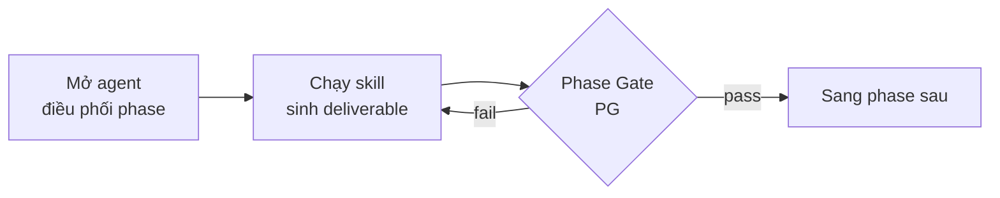
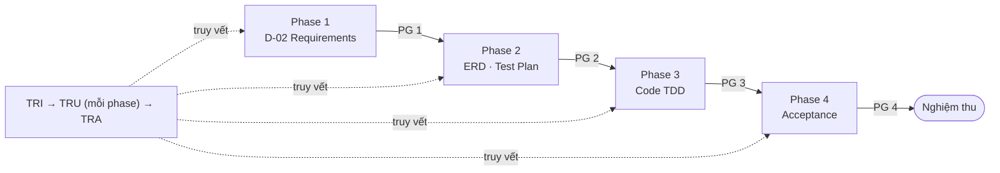

# Bắt đầu với HBC (Walkthrough 4 phase)

> 🌐 [English](../../en/tutorials/getting-started-hbc.md) · **Tiếng Việt**
>
> 📘 **Tutorial** — học qua làm. Đưa một tính năng nhỏ đi trọn 4 phase của HBC.

## Bạn sẽ làm được gì

Sau hướng dẫn này, bạn sẽ:

- Hiểu vòng lặp cốt lõi của HBC: **mở agent → chạy skill → qua Phase Gate → sang phase sau**.
- Tự tay đưa một tính năng nhỏ đi hết 4 phase: Analysis → Design → Implementation → Testing.
- Biết cách bật **traceability** để truy vết từ yêu cầu đến test.

Chúng ta dùng một ví dụ xuyên suốt: tính năng **"Đổi mật khẩu"** (Change Password).

## Trước khi bắt đầu

> ▶️ **Chưa chạy HBC bao giờ?** Làm [Khởi động nhanh 10 phút](quickstart.md) trước — nó hướng dẫn cài đặt, xác nhận chạy, môi trường để gõ lệnh, và tạo file D-02 đầu tiên. Bài này tiếp nối từ đó để đi trọn 4 phase.

Bạn cần đã hoàn thành Quickstart (đã cài HBC, đã gõ `BA` thấy agent chào, đã có D-02). Nếu `BA` chưa phản hồi, xem [phần xử lý sự cố trong Quickstart](quickstart.md#nếu-ba-không-phản-hồi-).

> 💡 **Mẹo vàng:** Bất cứ lúc nào không biết làm gì tiếp, gõ `bmad-help`. Nó xem trạng thái dự án và gợi ý bước kế tiếp.
>
> 📖 **Gặp từ lạ?** (deliverable, phase gate, traceability, TDD…) → tra nhanh ở [Glossary khái niệm](../reference/concept-glossary.md).

## Vòng lặp cốt lõi

Mọi phase trong HBC đều theo đúng nhịp này:



Nhớ được nhịp này là bạn dùng được HBC. Giờ làm thử.

---

## Phase 1 — Analysis (Phân tích)

**Mục tiêu:** mô tả rõ tính năng muốn gì, dưới dạng yêu cầu có mã (REQ ID).

### Bước 1.1 — Mở agent Phân tích

Gõ:

```
BA
```

Agent **BA** (Business Analyst) sẽ chào và hiện menu các việc của Phase 1.

> 🎉 **Micro-win:** Thấy agent chào nghĩa là bạn đã "ở trong" HBC đúng chỗ — mọi bước sau chỉ là chọn việc cho nó làm.

### Bước 1.2 — Tạo Đặc tả yêu cầu (D-02)

Gõ:

```
REQ
```

Agent sẽ phỏng vấn bạn về tính năng. Với ví dụ "Đổi mật khẩu", bạn có thể trả lời đại ý:

> Người dùng đã đăng nhập có thể đổi mật khẩu bằng cách nhập mật khẩu cũ và mật khẩu mới. Hệ thống kiểm tra mật khẩu cũ đúng, mật khẩu mới đủ mạnh (≥ 8 ký tự), và không trùng mật khẩu cũ.

Kết quả: file **D-02 Requirements Specification** trong `_bmad-output/planning-artifacts/`, với các yêu cầu được đánh mã như `REQ-001`, `REQ-002`…

> 📌 **D-02 là bắt buộc** — nó là nền cho mọi phase sau. Các deliverable khác của Phase 1 (`GLO` glossary, `BFD` business flow) là tùy chọn, làm khi cần.

### Bước 1.3 — Khởi tạo Traceability

> **Traceability** = nối mỗi yêu cầu tới thiết kế, code và test của nó, để không bỏ sót yêu cầu nào.

Ngay khi đã có REQ ID, bật ma trận truy vết:

```
TRI
```

`TRI` đọc các REQ ID từ D-02 và tạo ma trận traceability ban đầu. Từ giờ, mỗi phase sau sẽ điền thêm cột (thiết kế, code, test) vào ma trận này.

### Bước 1.4 — Qua Phase Gate 1

Trước khi sang Design, kiểm tra Phase 1 đã đủ chưa — **luôn kèm số phase**:

```
PG 1
```

Phase Gate chạy kiểm tra tự động + đánh giá bằng LLM, rồi trả về **pass** hoặc **fail** kèm lý do. Nếu **fail**, sửa theo gợi ý rồi chạy lại `PG 1`. **Pass** mới đi tiếp.

✅ **Xong Phase 1:** bạn đã có D-02 và ma trận traceability khởi tạo.

---

## Phase 2 — Design (Thiết kế) + Test Design

**Mục tiêu:** thiết kế dữ liệu/quy chuẩn code, và lên kế hoạch test — trước khi viết dòng code nào.

### Bước 2.1 — Thiết kế (agent ARCH)

```
ARCH
```

Rồi chạy các deliverable bắt buộc:

- `ERD` → **D-19 Database Design / ER Diagram** (ví dụ minh họa với "Đổi mật khẩu": bảng `users` có thể có `password_hash`, `password_updated_at`… — kết quả thật tùy thiết kế của bạn).
- `CS` → **D-12 Coding Standards** (nếu dự án chưa có).
- `API` → **D-21 API Specification** (tùy chọn — ví dụ endpoint `PUT /users/me/password`).

### Bước 2.2 — Thiết kế test (agent QA)

```
QA
```

Rồi:

- `TP` → **D-26 Test Plan** (chiến lược test cho tính năng).
- `TS` → **D-27 Test Specification** (các test case cụ thể, ví dụ: "mật khẩu cũ sai → báo lỗi", "mật khẩu mới < 8 ký tự → từ chối").

### Bước 2.3 — Cập nhật Traceability & qua Gate

```
TRU
```

`TRU` điền cột thiết kế/test vào ma trận — giờ mỗi REQ ID đã nối tới thiết kế và test case tương ứng. Sau đó:

```
PG 2
```

✅ **Xong Phase 2:** đã có thiết kế DB, kế hoạch test, test spec — tất cả truy vết về REQ.

---

## Phase 3 — Implementation (Lập trình theo TDD)

> **TDD** = viết test trước, rồi mới viết code cho test đó pass.

**Mục tiêu:** viết code theo chu trình **TDD: RED → GREEN → REFACTOR**.

### Bước 3.1 — Chia nhỏ công việc

```
DEV
TB
```

`TB` (Task Breakdown) chia tính năng thành các task nhỏ, có thứ tự, đánh mã `TASK-xxx`.

### Bước 3.2 — Lập trình TDD

Chạy toàn bộ task (hoặc một task cụ thể với `IM task TASK-001`):

```
IM all
```

`IM` dẫn bạn qua từng task theo TDD:

1. 🔴 **RED** — viết test (từ D-27) trước, chạy thấy **fail**.
2. 🟢 **GREEN** — viết code tối thiểu để test **pass**.
3. ♻️ **REFACTOR** — dọn code, test vẫn xanh.

### Bước 3.3 — Cập nhật Traceability & qua Gate

```
TRU
PG 3
```

✅ **Xong Phase 3:** code đã chạy, có test xanh, truy vết tới REQ.

---

## Phase 4 — Testing (Kiểm thử & Nghiệm thu)

**Mục tiêu:** chạy toàn bộ test, xử lý lỗi, ra quyết định nghiệm thu.

```
TST
TE all
AC review
```

- `TE all` → **Test Execution Report** (chạy test, ghi kết quả, triage lỗi). Có thể chạy riêng `TE unit` / `TE integration` / `TE e2e`.
- `AC review` → **Acceptance Report** (quyết định ACCEPTED/REJECTED/DEFERRED/PENDING).

Cuối cùng, chốt truy vết toàn trình và soi lỗ hổng:

```
TRA
PG 4
```

`TRA` audit toàn bộ ma trận — chỉ ra REQ nào còn thiếu thiết kế/code/test. Lý tưởng: **0 gap**.

> 💡 Muốn xem nhanh độ phủ bất cứ lúc nào (không bắt buộc), gõ `TRR` để có báo cáo coverage.

✅ **Xong Phase 4:** tính năng "Đổi mật khẩu" đã đi trọn vòng đời, có nghiệm thu và truy vết đầy đủ.

---

## Bạn vừa làm được gì



Bạn đã nắm **vòng lặp cốt lõi** và đưa một tính năng đi hết 4 phase với traceability đầy đủ. Đây chính là cách HBC vận hành cho mọi tính năng — chỉ khác về quy mô.

## Bước tiếp theo

- 🗺️ Xem toàn cảnh mọi skill & deliverable: [Bản đồ quy trình](workflow-map.md).
- 💡 Hiểu sâu Phase / Gate / Deliverable / Traceability: [Khái niệm cốt lõi](../explanation/concepts.md).
- 🔧 Khi cần làm việc cụ thể: [Chạy Phase Gate](../how-to/run-a-phase-gate.md) · [Quản lý Traceability](../how-to/manage-traceability.md) · [Chế độ Headless](../how-to/use-headless-mode.md) · [Tùy chỉnh cấu hình](../how-to/customize-config.md).

## Bảng tra nhanh

| Việc | Gõ |
| --- | --- |
| Không biết làm gì tiếp | `bmad-help` |
| Mở agent từng phase | `BA` · `ARCH` · `QA` · `DEV` · `TST` |
| Tạo yêu cầu (D-02) | `REQ` |
| Lập trình TDD | `IM all` (hoặc `IM task TASK-001`) |
| Chạy test / nghiệm thu | `TE all` · `AC review` |
| Kiểm tra ranh giới phase | `PG 1` … `PG 4` (luôn kèm số) |
| Traceability | `TRI` (khởi tạo) → `TRU` (cập nhật) → `TRA` (audit) · `TRR` (báo cáo coverage) |
