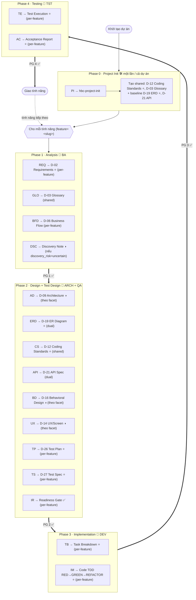
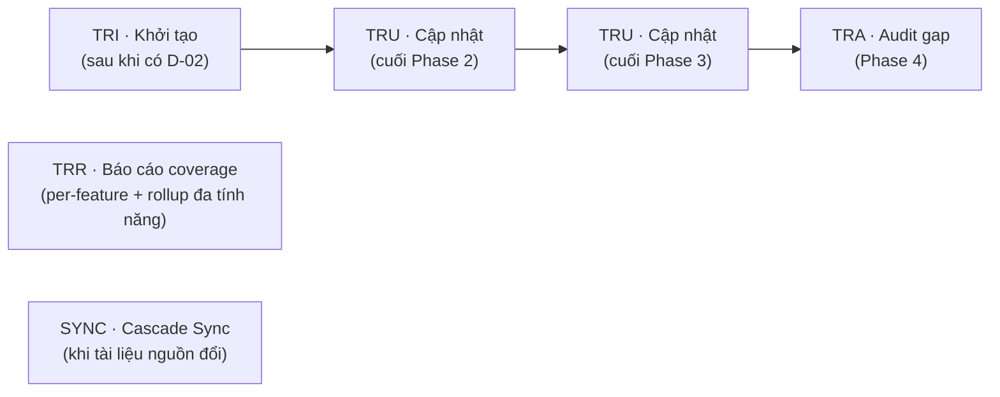

# Bản đồ quy trình HBC

> 🌐 [English](../../en/tutorials/workflow-map.md) · **Tiếng Việt**
>
> 📘 **Tutorial** — toàn cảnh HBC trong một trang. Dùng đây như tấm bản đồ: thấy mình đang ở đâu, vừa làm gì, sắp tới đâu.

## Mô hình giao hàng: bàn giao tăng dần theo từng tính năng

HBC là module mở rộng của BMad Method. Cách giao hàng là **bàn giao tăng dần theo từng tính năng (staged delivery)**: mỗi tính năng đi qua 4 phase có cổng + TDD rồi nghiệm thu — **độc lập** với các tính năng khác.

Mô hình giao hàng là *cách bạn chia phạm vi*, **không phải** kiến trúc của HBC. Bên trong **một** tính năng, HBC giữ **kỷ luật tuần tự, thiết kế-trước** (thiết kế trước, chốt từng mốc bằng gate); nhưng ở cấp dự án, việc chia theo từng tính năng khiến tổng thể là *incremental*, không phải làm một-lượt cả dự án.

Trước khi làm bất kỳ tính năng nào, chạy **Phase 0** một lần cho cả dự án để tạo các deliverable dùng chung. Sau đó mỗi tính năng chạy Phase 1–4.

## Toàn cảnh: Phase 0 + vòng lặp 4 phase theo từng tính năng

> ⭐ = deliverable **bắt buộc** ở gate. ◑ = **bắt buộc theo facet** (applicability-catalog quyết định per-feature: D-09 nếu có tích hợp/thuật toán; D-16 nếu phi-CRUD phức; D-14 nếu có UI). Các skill còn lại là tùy chọn, làm khi cần.
> Mỗi mũi tên `PG <n> ✅` là một **Phase Gate** mang theo `feature=` — phải pass mới qua phase sau.
> `IR` (readiness gate) là **đường nối Phase 2 → 3**: đối soát D-02 ↔ D-21/D-26/D-27 + ma trận trước khi vào code.

## Phase 0 — Project Init (chạy MỘT lần, cả dự án)

`PI` (skill `hbc-project-init`) chạy **một lần cho cả dự án, trước mọi tính năng**, để tạo các **deliverable dùng chung**:

- **D-12 Coding Standards** (shared ⭐) → `shared/coding-standards/`
- **D-03 Glossary** (shared) → `shared/glossary/`
- **baseline D-19 ERD** (⭐) → `shared/erd/`
- **baseline D-21 API** → `shared/api/`

Skill này **idempotent** (bỏ qua phần đã có), **không** nhận tham số `feature`. Sau Phase 0, mỗi tính năng mới đi qua Phase 1–4 của nó.

## Bố cục output: `features/<feature>/...` + `shared/...`

Bố cục mới thay cho thư mục phẳng `planning-artifacts` cũ:

- **Per-feature:** `_bmad-output/features/<feature>/{planning-artifacts, implementation-artifacts, gates, traceability}/`
- **Shared (cả dự án):** `_bmad-output/shared/{coding-standards, glossary, erd, api}/`

| Phạm vi (scope) | Deliverable | Nơi lưu |
| --- | --- | --- |
| **Per-feature** | D-02, D-06, D-26, D-27 + (theo facet) D-09, D-14, D-16 | `features/<feature>/planning-artifacts/` |
| **Shared** | D-03 (glossary), D-12 (coding-standards) | `shared/glossary/`, `shared/coding-standards/` |
| **Dual** | D-19 (erd), D-21 (api) | baseline `shared/erd|api/` + bản ghi đè per-feature tùy chọn tại `features/<feature>/planning-artifacts/` — **ưu tiên theo path-existence** (bản ghi đè thắng nếu tồn tại) |

> Artifact của implementation (task-breakdown, code, test-execution-report, acceptance-report) → `features/<feature>/implementation-artifacts/`. Gate → `features/<feature>/gates/`. Ma trận → `features/<feature>/traceability/`.

## Lớp xuyên suốt: Traceability + Cascade Sync

Traceability chạy song song, không thuộc riêng phase nào — nó nối mọi thứ về REQ ID. **Cascade Sync (`SYNC`)** cũng xuyên suốt: khi một tài liệu nguồn đổi, nó phân tích ảnh hưởng và đề xuất cập nhật lan truyền xuống tài liệu/test/code phía dưới.

| Skill | Khi nào dùng | Làm gì |
| --- | --- | --- |
| `TRI` | Sau khi có D-02 | Khởi tạo ma trận từ các REQ ID |
| `TRU` | Cuối mỗi phase | Điền cột mới (thiết kế / code / test) |
| `TRR` | Bất cứ lúc nào | Báo cáo độ phủ (coverage) per-feature + rollup đa tính năng (hàng shared đếm một lần) |
| `TRA` | Phase 4 | Audit, chỉ ra gap và mức nghiêm trọng |
| `SYNC` | Khi tài liệu nguồn đổi | Phân tích ảnh hưởng, đề xuất cập nhật lan truyền xuống tài liệu/test/code |

### Ma trận truy vết — 8 cột

`feature | req_id | story_id | design_ref | code_ref | test_ref | gate_status | timestamp`

Độ phủ tính theo `design_ref` / `code_ref` / `test_ref`. Ma trận là **per-feature**; `TRR` có thể rollup qua nhiều tính năng (hàng shared chỉ đếm một lần).

## Bảng tra: phase → agent → skill → deliverable → scope

| Phase | Agent | Skill | Deliverable | Scope | Bắt buộc |
| --- | --- | --- | --- | --- | :---: |
| **0 · Project Init** | — | `PI` | hbc-project-init (D-12/D-03 + baseline D-19/D-21) | shared, chạy một lần | — |
| **1 · Analysis** | `BA` | `REQ` | D-02 Requirements Specification | per-feature | ✅ |
| | | `GLO` | D-03 Glossary | shared | — |
| | | `BFD` | D-06 Business Flow Diagram | per-feature | — |
| | | `DSC` | Discovery Note (kiểm chứng model; gate P1-11) | per-feature | ◑ nếu uncertain |
| **2 · Design** | `ARCH` | `AD` | D-09 Architecture Design | per-feature | ◑ theo facet |
| | | `ERD` | D-19 Database Design / ER Diagram | dual | ✅ |
| | | `CS` | D-12 Coding Standards | shared | ✅ |
| | | `API` | D-21 API Specification | dual | — |
| | | `BD` | D-16 Behavioral Design | per-feature | ◑ theo facet |
| | | `UX` | D-14 UX / Screen Design | per-feature | ◑ theo facet |
| **2 · Test Design** | `QA` | `TP` | D-26 Test Plan | per-feature | ✅ |
| | | `TS` | D-27 Test Specification | per-feature | ✅ |
| | | `IR` | Readiness gate (đối soát D-02 ↔ D-21/D-26/D-27 + ma trận) | per-feature | ✅ |
| **3 · Implementation** | `DEV` | `TB` | Task Breakdown | per-feature | ✅ |
| | | `IM` | Code (TDD: RED-GREEN-REFACTOR, bằng chứng RED) | per-feature | ✅ |
| **4 · Testing** | `TST` | `TE` | Test Execution Report | per-feature | ✅ |
| | | `AC` | Acceptance Report (giao một tính năng độc lập) | per-feature | ✅ |
| **Xuyên suốt** | — | `PG` | Phase Gate (mang `feature=`) | per-feature | — |
| | — | `TRI`/`TRU`/`TRR`/`TRA` | Traceability matrix (8 cột) | per-feature + rollup | — |
| | — | `SYNC` | Cascade Sync (phân tích ảnh hưởng) | xuyên suốt | — |

> 💡 Mỗi skill workflow có 3 chế độ: **Create / Update / Validate**, đa số hỗ trợ `--headless` / `-H` để chạy không tương tác. Skill per-feature cần `feature=<slug>` khi chạy headless (thiếu sẽ bị chặn `feature_required`); skill dual (ERD/API) thì `feature` tùy chọn (mặc định baseline shared); skill shared (GLO/CS) và Phase 0 (`PI`) không nhận `feature`.
>
> ℹ️ `PG`, `TRI/TRU/TRR/TRA` và `SYNC` không phải *deliverable bắt buộc* (cột để "—"), nhưng là **thực hành xuyên suốt được khuyến nghị mạnh** ở mọi ranh giới phase — bỏ qua sẽ mất khả năng kiểm soát và truy vết.

## TDD mềm (soft): bằng chứng RED

Phase 3 `IM` chạy RED→GREEN→REFACTOR. **Enforcement mềm:** phải có/ghi lại **bằng chứng test thất bại (RED)** *trước khi* viết code; gate Phase 3 kiểm tra bằng chứng RED (tự khai báo, không phải chứng minh mật mã). Hãy hiểu là "test-first kèm bằng chứng RED", không chỉ là "có test".

## Đọc bản đồ này thế nào

- **Phase 0 trước, rồi vòng lặp tính năng.** Chạy `PI` một lần; sau đó lặp lại Phase 1→4 cho từng tính năng, mỗi tính năng giao độc lập.
- **Đi tuần tự trái → phải trong một tính năng.** Các phase đi tuần tự có cổng — không nhảy cóc. (Áp dụng từng tính năng nên ở cấp dự án là *incremental*, không phải làm một-lượt cả dự án.)
- **Mỗi ranh giới có Gate.** Gặp `PG <n> ✅` nghĩa là phải dừng kiểm tra trước khi đi tiếp; `IR` là gate readiness ở đường nối Phase 2 → 3.
- **Traceability + Sync chạy nền.** Cứ cuối phase thì `TRU` một lần; cuối dự án thì `TRA`; khi tài liệu nguồn đổi thì `SYNC` để lan truyền.

## Bước tiếp theo

- 📘 Chưa chạy thử lần nào? Bắt đầu từ [Bắt đầu với HBC](getting-started-hbc.md).
- 💡 Muốn hiểu *vì sao* có Gate, Deliverable, Traceability, TDD tăng dần: [Khái niệm cốt lõi](../explanation/concepts.md) · [Vì sao incremental + TDD](../explanation/why-incremental-tdd.md).
- 📖 Tra mã D-xx đầy đủ: [Bảng deliverable](../reference/deliverables-glossary.md). Tra skill: [Danh mục skill](../reference/skills-catalog.md). Tra khái niệm: [Bảng khái niệm](../reference/concept-glossary.md).
- 🧭 Không chắc làm gì tiếp? `bmad-help` luôn sẵn sàng gợi ý bước kế tiếp.
