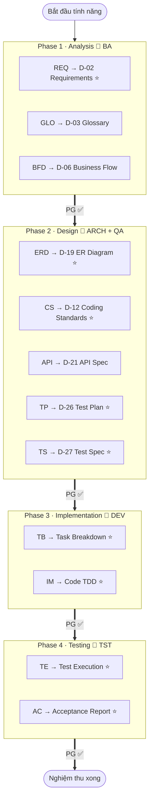
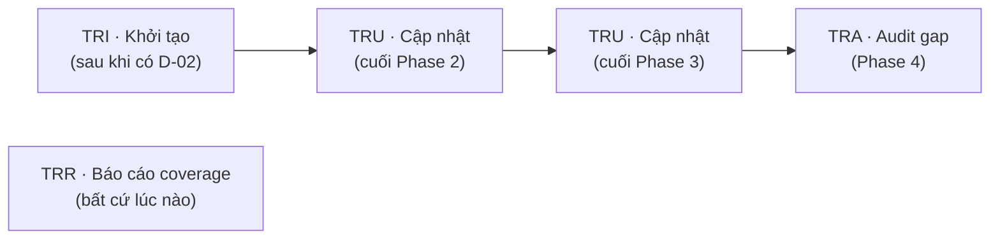

# Bản đồ quy trình HBC

> 🌐 [English](../../en/tutorials/workflow-map.md) · **Tiếng Việt**
>
> 📘 **Tutorial** — toàn cảnh HBC trong một trang. Dùng đây như tấm bản đồ: thấy mình đang ở đâu, vừa làm gì, sắp tới đâu.

## Toàn cảnh: 4 phase, 5 agent, các deliverable D-xx

> ⭐ = deliverable **bắt buộc**. Các skill còn lại là tùy chọn, làm khi cần.
> Mỗi mũi tên `PG ✅` là một **Phase Gate** — phải pass mới qua phase sau.

## Lớp xuyên suốt: Traceability

Traceability chạy song song, không thuộc riêng phase nào — nó nối mọi thứ về REQ ID:

| Skill | Khi nào dùng | Làm gì |
| --- | --- | --- |
| `TRI` | Sau khi có D-02 | Khởi tạo ma trận từ các REQ ID |
| `TRU` | Cuối mỗi phase | Điền cột mới (thiết kế / code / test) |
| `TRR` | Bất cứ lúc nào | Báo cáo độ phủ (coverage) hiện tại |
| `TRA` | Phase 4 | Audit, chỉ ra gap và mức nghiêm trọng |

## Bảng tra: phase → agent → skill → deliverable

| Phase | Agent | Skill | Deliverable | Bắt buộc |
| --- | --- | --- | --- | :---: |
| **1 · Analysis** | `BA` | `REQ` | D-02 Requirements Specification | ✅ |
| | | `GLO` | D-03 Glossary | — |
| | | `BFD` | D-06 Business Flow Diagram | — |
| **2 · Design** | `ARCH` | `ERD` | D-19 Database Design / ER Diagram | ✅ |
| | | `CS` | D-12 Coding Standards | ✅ |
| | | `API` | D-21 API Specification | — |
| **2 · Test Design** | `QA` | `TP` | D-26 Test Plan | ✅ |
| | | `TS` | D-27 Test Specification | ✅ |
| **3 · Implementation** | `DEV` | `TB` | Task Breakdown | ✅ |
| | | `IM` | Code (TDD: RED-GREEN-REFACTOR) | ✅ |
| **4 · Testing** | `TST` | `TE` | Test Execution Report | ✅ |
| | | `AC` | Acceptance Report | ✅ |
| **Xuyên suốt** | — | `PG` | Phase Gate (validate ranh giới) | — |
| | — | `TRI`/`TRU`/`TRR`/`TRA` | Traceability matrix | — |

> 💡 Mỗi skill workflow có 3 chế độ: **Create / Update / Validate**, đa số hỗ trợ `--headless` / `-H` để chạy không tương tác.
>
> ℹ️ `PG` và `TRI/TRU/TRR/TRA` không phải *deliverable bắt buộc* (cột để "—"), nhưng là **thực hành xuyên suốt được khuyến nghị mạnh** ở mọi ranh giới phase — bỏ qua sẽ mất khả năng kiểm soát và truy vết.

## Đọc bản đồ này thế nào

- **Đi tuần tự trái → phải.** Trong một tính năng, các phase đi tuần tự có cổng — không nhảy cóc. (Áp dụng từng tính năng nên ở cấp dự án là *incremental*, không phải waterfall một-lần.)
- **Mỗi ranh giới có Gate.** Gặp `PG ✅` nghĩa là phải dừng kiểm tra trước khi đi tiếp.
- **Traceability chạy nền.** Cứ cuối phase thì `TRU` một lần; cuối dự án thì `TRA`.

## Bước tiếp theo

- 📘 Chưa chạy thử lần nào? Bắt đầu từ [Bắt đầu với HBC](getting-started-hbc.md).
- 💡 Muốn hiểu *vì sao* có Gate, Deliverable, Traceability: [Khái niệm cốt lõi](../explanation/concepts.md).
- 📖 Tra mã D-xx đầy đủ: [Bảng deliverable](../reference/deliverables-glossary.md).
