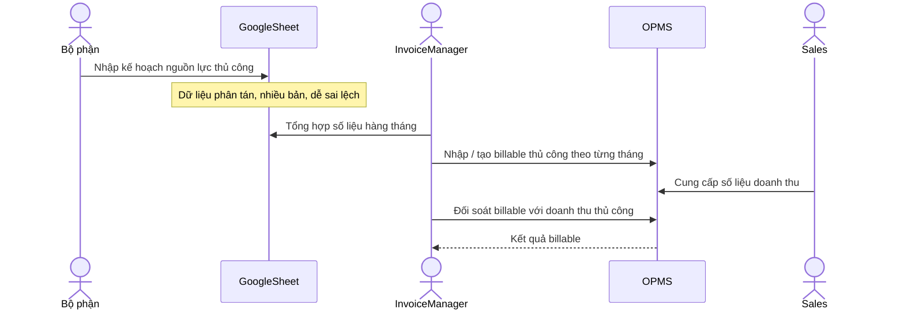
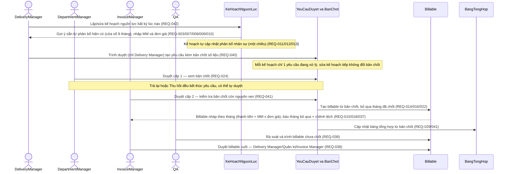
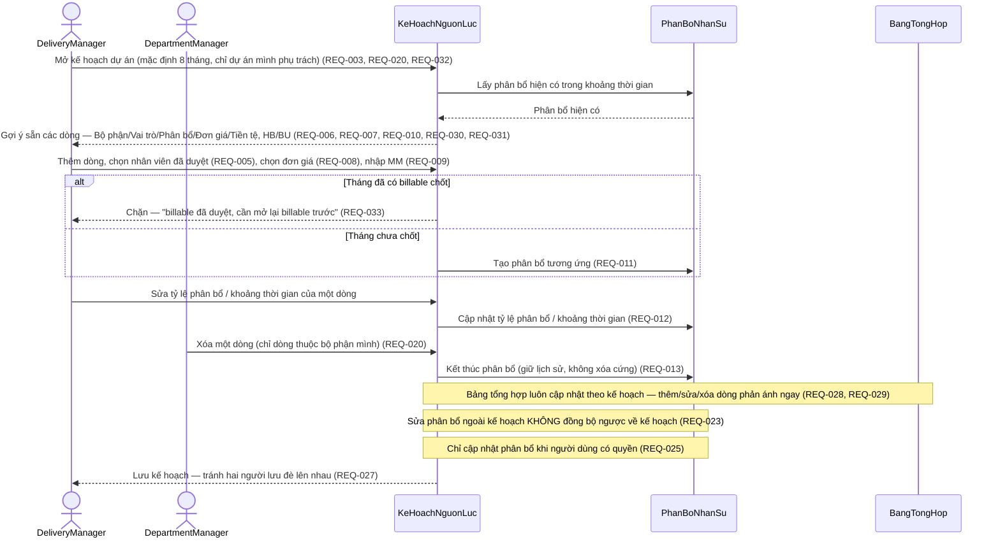
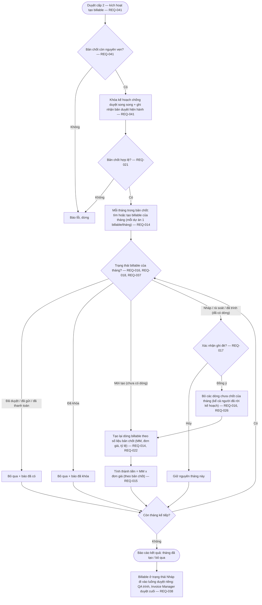
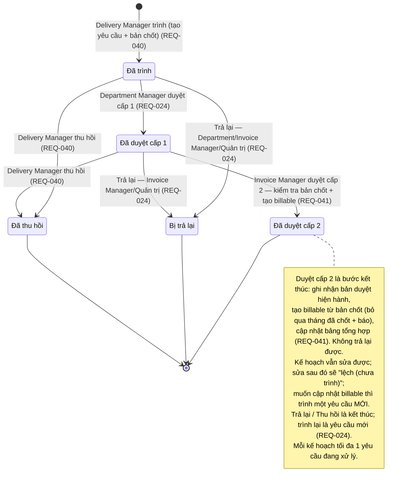
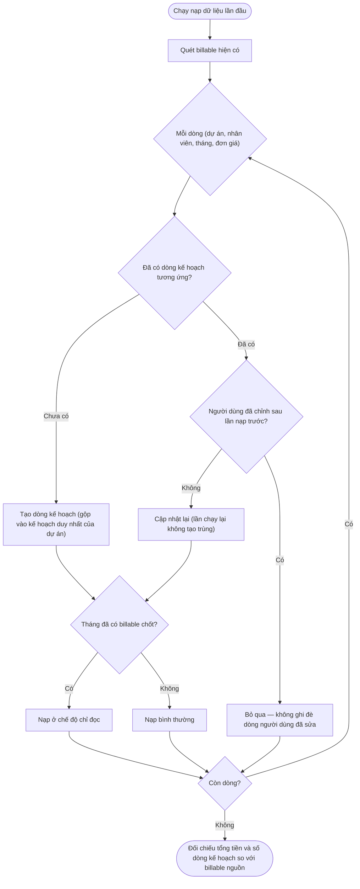

# D-06 Sơ đồ luồng nghiệp vụ — Lập kế hoạch nguồn lực & tạo Billable

> Phạm vi: quy trình **lập kế hoạch nguồn lực** trên OPMS và **tạo billable** (hóa đơn nội bộ theo tháng) từ kế hoạch. Bối cảnh: chuyển đổi từ cách làm cũ trên **Google Sheet (AS-IS)** sang làm trực tiếp trên **OPMS (TO-BE)**.
>
> **Điểm chính của quy trình mới:**
> - **Kế hoạch nguồn lực** sửa được bất kỳ lúc nào. Mỗi lần cần duyệt, Delivery Manager **trình một yêu cầu duyệt** kèm một **bản chốt số liệu** (không sửa được) tại thời điểm trình.
> - **Duyệt 2 cấp**: Department Manager duyệt cấp 1 → Invoice Manager duyệt cấp 2. Duyệt cấp 2 xong, hệ thống **tự tạo billable** từ bản chốt.
> - Billable theo tháng đi theo một **luồng duyệt riêng**: QA rà soát và trình, Delivery Manager / Quản trị / Invoice Manager duyệt cuối.
> - Các tháng **đã chốt** (đã duyệt / đã gửi / đã thanh toán / đã khóa) được **bảo vệ**, không bị ghi đè — hệ thống chỉ **báo chênh lệch**.
> - **Bảng tổng hợp nguồn lực** luôn cập nhật theo kế hoạch.
>
> **Vai trò người dùng (REQ-RESOURCE-PLAN-BILLABLE-020, 036, 038):**
> - **Delivery Manager** — lập kế hoạch nguồn lực và trình duyệt. Chỉ thấy/sửa kế hoạch của các dự án mình phụ trách (theo nhóm Delivery) (REQ-020).
> - **Department Manager** — duyệt cấp 1; chỉnh sửa các dòng nhân sự thuộc bộ phận mình.
> - **Invoice Manager** — duyệt cấp 2, duyệt billable cuối, toàn quyền chỉnh sửa/xóa billable.
> - **QA** — rà soát và trình billable **chưa chốt**; được **sửa nhưng không được xóa**; không lập kế hoạch nguồn lực, không tự duyệt cuối (REQ-036, REQ-038).

## 1. Luồng nghiệp vụ: Lập kế hoạch nguồn lực & tạo Billable

### AS-IS (Hiện tại)

Hiện tại các bộ phận nhập kế hoạch nguồn lực trên Google Sheet, tổng hợp và tạo billable thủ công.

**Vấn đề AS-IS:** thao tác thủ công, dữ liệu tách rời khỏi OPMS, khó truy vết khi kế hoạch thay đổi, rủi ro lệch giữa kế hoạch nguồn lực và phân bổ thực tế, không có quy trình duyệt chuẩn hóa.

### TO-BE (Mục tiêu) — Lập kế hoạch, duyệt 2 cấp và tạo billable

Nhập kế hoạch nguồn lực trực tiếp trên OPMS, cập nhật phân bổ nhân sự một chiều, **duyệt 2 cấp**, sau đó hệ thống **tự tạo billable**.

**Khác biệt AS-IS → TO-BE:**
- Nguồn nhập chuyển từ Google Sheet sang kế hoạch nguồn lực trên OPMS (REQ-RESOURCE-PLAN-BILLABLE-001, REQ-RESOURCE-PLAN-BILLABLE-002).
- Bổ sung **vòng đời duyệt 2 cấp** (Delivery lập + trình → Department Manager duyệt cấp 1 → Invoice Manager duyệt cấp 2), có Trả lại và tự duyệt (REQ-RESOURCE-PLAN-BILLABLE-024) — không có ở AS-IS.
- Tổng hợp + tạo billable thủ công → hệ thống **tự tạo billable** sau khi duyệt cấp 2: tìm hoặc tạo billable nháp của tháng (mỗi dự án chỉ một billable mỗi tháng), thay các dòng chưa chốt bằng số liệu từ bản chốt (REQ-RESOURCE-PLAN-BILLABLE-014, REQ-RESOURCE-PLAN-BILLABLE-015, REQ-RESOURCE-PLAN-BILLABLE-016, REQ-RESOURCE-PLAN-BILLABLE-022).
- Bổ sung **luồng duyệt riêng của billable** sau khi tạo: **QA rà soát và trình**, **Delivery Manager / Quản trị / Invoice Manager duyệt cuối** (REQ-RESOURCE-PLAN-BILLABLE-038).
- Bổ sung **cập nhật phân bổ nhân sự một chiều** từ kế hoạch (REQ-RESOURCE-PLAN-BILLABLE-011..REQ-RESOURCE-PLAN-BILLABLE-013, REQ-RESOURCE-PLAN-BILLABLE-023) và **bảng tổng hợp nguồn lực luôn cập nhật theo kế hoạch** (REQ-RESOURCE-PLAN-BILLABLE-028, REQ-RESOURCE-PLAN-BILLABLE-029) — không có ở AS-IS.
- Bổ sung **bảo vệ tháng đã chốt**, cơ chế ghi đè có xác nhận và **báo chênh lệch** khi kế hoạch lệch so với billable đã chốt (REQ-RESOURCE-PLAN-BILLABLE-016..REQ-RESOURCE-PLAN-BILLABLE-018, REQ-RESOURCE-PLAN-BILLABLE-033, REQ-RESOURCE-PLAN-BILLABLE-037, REQ-RESOURCE-PLAN-BILLABLE-039).

## 2. Luồng nghiệp vụ: Nhập kế hoạch & cập nhật phân bổ nhân sự (TO-BE chi tiết)

## 3. Luồng nghiệp vụ: Tạo Billable (có nhiều nhánh quyết định)

> **Tạo billable diễn ra tự động khi yêu cầu được duyệt cấp 2** (không phải nút bấm riêng): hệ thống kiểm tra bản chốt còn nguyên vẹn, **khóa kế hoạch** để tránh hai lần duyệt song song, rồi với mỗi tháng trong bản chốt — tìm hoặc tạo billable của tháng (mỗi dự án chỉ một billable mỗi tháng), thay các dòng chưa chốt bằng số liệu từ bản chốt. Tháng **đã chốt** bị bỏ qua kèm **báo chênh lệch**; tháng chưa chốt nhưng đã có dữ liệu cần **xác nhận ghi đè**. Chạy lại nhiều lần vẫn an toàn (không nhân đôi).

## 4. Vòng đời yêu cầu duyệt (2 cấp) + luồng billable sau khi tạo

> **Kế hoạch nguồn lực không có trạng thái duyệt** — Delivery Manager sửa bất kỳ lúc nào (REQ-042). Vòng đời duyệt 2 cấp nằm ở **yêu cầu duyệt** (mỗi lần trình là một yêu cầu kèm bản chốt không đổi). Yêu cầu được **duyệt cấp 2 mới nhất** là nguồn dữ liệu cho billable và bảng tổng hợp (REQ-024/040/041).

Luồng **billable theo tháng** sau khi tạo đi theo vòng đời riêng (độc lập với kế hoạch): **QA rà soát và trình** billable chưa chốt, **Delivery Manager / Quản trị / Invoice Manager duyệt cuối** (REQ-RESOURCE-PLAN-BILLABLE-038):

```mermaid
stateDiagram-v2
    state "Nháp" as draft
    state "Rà soát" as review
    state "Đã trình" as submitted
    state "Đã duyệt" as approved
    state "Đã gửi" as sent
    state "Đã thanh toán" as paid
    state "Đã khóa" as locked

    [*] --> draft: Tạo billable khi yêu cầu duyệt cấp 2 (từ bản chốt) (REQ-014, REQ-038)
    draft --> review: QA rà soát (REQ-038)
    review --> submitted: QA trình (REQ-038)
    submitted --> approved: Delivery Manager/Quản trị/Invoice Manager duyệt cuối (REQ-038)
    approved --> sent
    sent --> paid
    paid --> locked
    note right of draft
        Nháp / rà soát / đã trình = chưa chốt: QA sửa được (không xóa), tạo billable lại được (có xác nhận ghi đè).
        Đã duyệt / đã gửi / đã thanh toán / đã khóa = đã chốt: chỉ Invoice Manager; tạo billable bỏ qua + báo lệch; kế hoạch vẫn sửa được (không đè tháng đã chốt).
        QA không tự duyệt cuối (chỉ Delivery Manager / Quản trị / Invoice Manager).
    end note
```

## 5. Nạp dữ liệu lần đầu cài đặt (billable hiện có → kế hoạch nguồn lực)

> Lần cài đặt đầu tiên, hệ thống nạp dữ liệu **billable hiện có** thành **kế hoạch nguồn lực**. **Chạy lại nhiều lần vẫn an toàn**: mỗi dòng kế hoạch nhận diện theo (dự án, nhân viên, vai trò, tháng). Với mỗi kế hoạch, tạo sẵn một yêu cầu **đã duyệt cấp 2** kèm bản chốt (sao chép **giá trị lịch sử** từ billable nguồn — MM / đơn giá / thành tiền, không lấy đơn giá hiện hành) để bảng tổng hợp có nguồn; **không tạo lại billable** (giữ nguyên billable đã có). Cuối cùng đối chiếu số dòng và tổng tiền (REQ-RESOURCE-PLAN-BILLABLE-034/040/041).

## 6. Ánh xạ REQ ↔ luồng (Coverage note)

| Nhóm REQ | Phủ trong luồng |
|---|---|
| REQ-RESOURCE-PLAN-BILLABLE-001, REQ-RESOURCE-PLAN-BILLABLE-002, REQ-RESOURCE-PLAN-BILLABLE-010 | Mục 1 TO-BE, Mục 2 (mở/tạo kế hoạch duy nhất của dự án, gợi ý sẵn) |
| REQ-RESOURCE-PLAN-BILLABLE-003, REQ-RESOURCE-PLAN-BILLABLE-032 | Mục 2 (cửa sổ mặc định 8 tháng) |
| REQ-RESOURCE-PLAN-BILLABLE-004, REQ-RESOURCE-PLAN-BILLABLE-005, REQ-RESOURCE-PLAN-BILLABLE-006, REQ-RESOURCE-PLAN-BILLABLE-007, REQ-RESOURCE-PLAN-BILLABLE-009 | Mục 2 (nhập dòng, nhân viên đã duyệt, Bộ phận/Vai trò/Phân bổ, MM) |
| REQ-RESOURCE-PLAN-BILLABLE-008, REQ-RESOURCE-PLAN-BILLABLE-030 | Mục 1 & 2 (chọn đơn giá, tiền tệ theo đơn giá) |
| REQ-RESOURCE-PLAN-BILLABLE-031 | Mục 2 (hiển thị Department HB + OB Delivery BU) |
| REQ-RESOURCE-PLAN-BILLABLE-011, REQ-RESOURCE-PLAN-BILLABLE-012, REQ-RESOURCE-PLAN-BILLABLE-013, REQ-RESOURCE-PLAN-BILLABLE-023, REQ-RESOURCE-PLAN-BILLABLE-025 | Mục 2 (cập nhật phân bổ nhân sự một chiều từ kế hoạch; có kiểm tra quyền; không đồng bộ ngược) |
| REQ-RESOURCE-PLAN-BILLABLE-014, REQ-RESOURCE-PLAN-BILLABLE-022 | Mục 1 TO-BE, Mục 3 (tự tạo billable sau duyệt cấp 2: tìm hoặc tạo billable của tháng, mỗi dự án 1 billable/tháng, thay dòng chưa chốt bằng số liệu bản chốt) |
| REQ-RESOURCE-PLAN-BILLABLE-015 | Mục 1 TO-BE & Mục 3 (thành tiền = MM × đơn giá) |
| REQ-RESOURCE-PLAN-BILLABLE-016, REQ-RESOURCE-PLAN-BILLABLE-017, REQ-RESOURCE-PLAN-BILLABLE-026 | Mục 3 (ghi đè tháng chưa chốt + xác nhận ghi đè; kế hoạch là nguồn dữ liệu chính) |
| REQ-RESOURCE-PLAN-BILLABLE-018, REQ-RESOURCE-PLAN-BILLABLE-037 | Mục 3 & Mục 4 (bỏ qua tháng đã chốt: "đã có" / "đã khóa") |
| REQ-RESOURCE-PLAN-BILLABLE-019 | Mục 3 & Mục 4 (hiển thị trạng thái tháng — đề cập, giao diện) |
| REQ-RESOURCE-PLAN-BILLABLE-020 | Vai trò người dùng + Mục 1/2/3 (Delivery/Department/Invoice Manager theo quy trình; dòng theo bộ phận) |
| REQ-RESOURCE-PLAN-BILLABLE-021 | Mục 3 (chặn tạo billable khi kế hoạch không hợp lệ) |
| REQ-RESOURCE-PLAN-BILLABLE-020 (phạm vi) | Vai trò người dùng + Mục 1/2 (Delivery chỉ thấy dự án mình phụ trách) |
| REQ-RESOURCE-PLAN-BILLABLE-024 | Mục 1 TO-BE & Mục 4 (vòng đời duyệt 2 cấp; Trả lại; tự duyệt; Trả lại vẫn giữ tháng đã chốt) |
| REQ-RESOURCE-PLAN-BILLABLE-027 | Mục 2 (lưu kế hoạch tránh hai người lưu đè nhau) |
| REQ-RESOURCE-PLAN-BILLABLE-028, REQ-RESOURCE-PLAN-BILLABLE-029 | Mục 1 TO-BE & Mục 2 (bảng tổng hợp nguồn lực luôn cập nhật theo kế hoạch) |
| REQ-RESOURCE-PLAN-BILLABLE-033 | Mục 2 & Mục 4 (chặn sửa kế hoạch của tháng đã chốt) |
| REQ-RESOURCE-PLAN-BILLABLE-034 | Mục 5 (nạp dữ liệu lần đầu, chạy lại an toàn, tháng đã chốt nạp chỉ đọc) |
| REQ-RESOURCE-PLAN-BILLABLE-035 | Mục 2 (thêm tháng mới trên biểu mẫu, gộp vào kế hoạch duy nhất) |
| REQ-RESOURCE-PLAN-BILLABLE-036 | Vai trò người dùng + Mục 4 (Invoice Manager toàn quyền; QA sửa billable chưa chốt, KHÔNG xóa; nhóm khác chỉ xem) |
| REQ-RESOURCE-PLAN-BILLABLE-038 | Mục 1 TO-BE, Mục 3 & Mục 4 (billable sau khi tạo: QA trình, Invoice Manager duyệt cuối; luồng riêng) |
| REQ-RESOURCE-PLAN-BILLABLE-039 | Mục 1/3/4 (báo chênh lệch hai chiều: kế hoạch ↔ bản chốt + bản chốt ↔ billable thực) |
| REQ-RESOURCE-PLAN-BILLABLE-040 | Mục 1/4 (Delivery Manager trình → yêu cầu + bản chốt không đổi theo (nhân viên, vai trò, tháng); 1 yêu cầu đang xử lý; Thu hồi) |
| REQ-RESOURCE-PLAN-BILLABLE-041 | Mục 1/3 (khi duyệt cấp 2: kiểm tra bản chốt + khóa + ghi nhận bản duyệt hiện hành + tạo billable + cập nhật bảng tổng hợp) |
| REQ-RESOURCE-PLAN-BILLABLE-042 | Mục 1/4 (kế hoạch không có trạng thái duyệt, luôn sửa được; vòng đời ở yêu cầu duyệt; bản duyệt hiện hành) |

> Các yêu cầu cấp chi tiết chỉ **đề cập** trong D-06 mà không vẽ thành bước riêng: REQ-RESOURCE-PLAN-BILLABLE-004 (ràng buộc khi lưu dòng), REQ-RESOURCE-PLAN-BILLABLE-019 (hiển thị trạng thái tháng — giao diện), REQ-RESOURCE-PLAN-BILLABLE-022 (cách tạo dòng billable từ bản chốt), và toàn bộ NFR-001..008. Các yêu cầu này được đặc tả ở D-02 và sẽ truy vết qua test (D-26/D-27).

---

**Revision History**

| Date | Version | Changes | Author |
|---|---|---|---|
| 2026-06-11 | 1.0 | Initial version | OPMS team |
| 2026-06-18 | 1.1 | Cập nhật theo D-02 v1.6: tách actor theo vai (Delivery/Dept Manager/IM/QA); vòng đời plan 2 cấp với state machine riêng + sơ đồ state (Mục 4); đổi Generate → Đồng bộ (action mới, chỉ IM, sau Approved L2, action_generate_lines + overlay MM/rate); thêm bỏ qua tháng đã-chốt ("đã có"/"đã khóa") + blocking confirm; luồng period sau đồng bộ (QA/IM, REQ-038); allocation một chiều + live-sync Summary (Mục 2); migration lần đầu (Mục 5); cập nhật ánh xạ REQ (028–038). | OPMS team |
| 2026-06-19 | 1.2 | Cập nhật theo D-02 v1.7 (cascade từ sync, không lan truyền tiếp). Luồng period sau đồng bộ map method thật: **QA đẩy tới `submitted`**, **IM duyệt cuối → `approved`** (`action_approve_delivery`→`_try_set_approved`); bỏ `dept_approved`; sửa state machine period (Mục 1/3/4). Đồng bộ: thêm **unlink member chưa-chốt** trước generate_lines, **find-or-create** + UNIQUE(project,month), **serialize/lock**, overlay cả `effort_ratio` (Mục 1/3, REQ-014/016/022). Quyền QA: edit period chưa-chốt, **không delete** (header + Mục 4, REQ-036). Scope Delivery theo field **`delivery_team_id.manager_id.user_id`** trên project (header + Mục 1/2, REQ-020). Thêm **REQ-039** chỉ báo lệch plan↔period (Mục 1/4). Summary đổi từ live-sync sang **model stored + refresh qua hook** (read_group/SQL view) (Mục 1/2, REQ-028/029). Migration key thêm `rate_id` + report assert số dòng (Mục 5, REQ-034). | OPMS team |
| 2026-06-19 | 1.3 | Cập nhật theo D-02 v1.8 (tuần tự in-session, sau verify-code). **Summary quay lại model stored + ACL + pivot + hook** (Odoo 11 pivot cần model backing — V6/REQ-028/029, đảo lại "view" của v1.2). Scope Delivery dùng **`delivery_team_id.manager_id.user_id`** sẵn có, KHÔNG field mới (V1/REQ-020). Period approve cuối **DM/Admin/IM** (không chỉ IM), cần `delivery_manager_user_id` raise nếu thiếu (V2/REQ-038). Đồng bộ ở `submitted` **re-sync downstream** billable/summary/customer-invoice/confirm (V5/REQ-014/016). UNIQUE `uniq_project_month` đã có (V4). Đơn giá `rate.price`/currency `rate.price_currency_id` (V3). | OPMS team |
| 2026-06-19 | 2.2 | **Tái cấu trúc theo D-02 v2.1/v2.2 (Request + Snapshot, sau party-mode + adversarial).** Vòng đời chuyển từ plan → **`resource.plan.request`** (state machine §4 = Submitted→ApprovedL1→ApprovedL2, Rejected/Cancelled terminal); **plan stateless luôn editable** (§1/§4). Submit (chỉ DelM) tạo **snapshot bất biến** grain (emp,role,month) giá trị-copy + hash; 1 in-flight/plan; DelM Withdraw. **Đồng bộ = sự kiện khi Approved L2** từ snapshot (§1/§3): verify hash + lock + set active_request_id + bỏ qua tháng đã-chốt + báo lệch; **rebuild Summary từ snapshot active** (bỏ refresh-live). Lệch 2 chiều (plan↔snapshot, snapshot↔invoice — REQ-039). Migration tạo request approved_l2 + snapshot copy từ invoice nguồn (§5). Tách DelM/DeptM. Coverage +REQ-040/041/042. | OPMS team |
| 2026-06-19 | 2.3 | **Viết lại theo hướng nghiệp vụ — loại bỏ thuật ngữ kỹ thuật triển khai.** Thay tên model/field/method và chi tiết kỹ thuật (vd. `resource.plan`, `project.invoice.period`, `active_request_id`, `snapshot_hash`, `SELECT FOR UPDATE`, `action_generate_lines`, `write_date`, `delivery_team_id.manager_id.user_id`, `idempotent`, `optimistic lock`, `pivot`, `hook`) bằng thuật ngữ nghiệp vụ tương đương (kế hoạch nguồn lực, billable theo tháng, bản chốt số liệu, khóa chống duyệt song song, chạy lại an toàn, bảng tổng hợp...). Nhãn trạng thái trong sơ đồ chuyển sang tiếng Việt. **Giữ nguyên logic nghiệp vụ, cấu trúc 6 mục, và ánh xạ REQ (truy vết).** | OPMS team |
