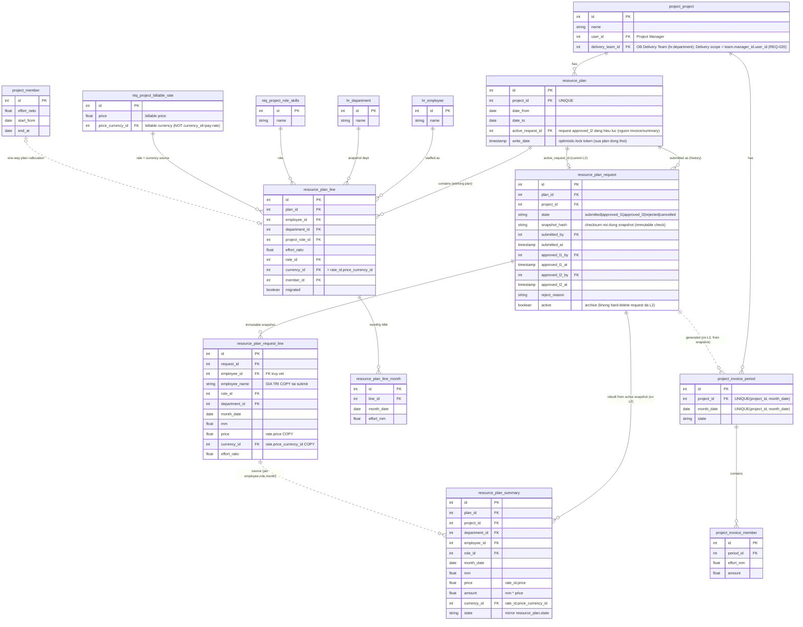

# D-19 — Thiết kế cơ sở dữ liệu (Database Design / ER Diagram)

## 1. Tổng quan (Overview)

- **Tổng quan**: Thiết kế dữ liệu cho feature **Resource Plan & Billable Generation** (module project invoice). Bổ sung **3 bảng mới** (`resource_plan`, `resource_plan_line`, `resource_plan_line_month`) và mô tả quan hệ tới các bảng **hiện có** của OPMS (project, employee, department, role, billable rate, allocation, invoice period/member). Mức chuẩn hóa: **logical**. Tên vật lý theo `snake_case` kiểu bảng Odoo.
- **Phạm vi**: chỉ các thực thể liên quan tới feature; các bảng hiện có chỉ liệt kê thuộc tính khóa cần cho quan hệ, không tái tài liệu toàn schema.
- **Quy ước quan hệ**: nét liền (`--`) = quan hệ định danh có FK; nét đứt (`..`) = quan hệ **không** có FK định danh ở DB (vd "generates": Đồng bộ sinh period theo project + tháng, không gắn FK plan→period).
- **Resource Plan Summary là MODEL STORED + ACL + pivot** (V6/REQ-028/029): Odoo 11 pivot cần model backing có quyền đọc → Summary là **bảng vật lý stored** `resource_plan_summary` theo mẫu `project.invoice.member.summary` (populate bằng `generate_*` bulk-insert raw SQL). Refresh qua **ORM hook khi create/write/unlink dòng plan** (regenerate scope nhỏ), có **guard chống re-entrancy** với ghi allocation. Nó **phản ánh KẾ HOẠCH (plan)** (không phản ánh invoice). Sơ đồ ER, định nghĩa bảng và index **có liệt kê** `resource_plan_summary`.

## 2. Sơ đồ ER (ER Diagram)

> [!NOTE]
> Bảng mới: `resource_plan`, `resource_plan_line`, `resource_plan_line_month`, **`resource_plan_summary`** (model stored, refresh qua hook — REQ-028/029). Các bảng còn lại là hiện có (chỉ hiển thị khóa liên quan).

## 3. Định nghĩa bảng (Table Definitions)

---
### 3.1. Resource Plan

- **Tên logic (Logical name)**: Kế hoạch nguồn lực
- **Tên vật lý (Physical name)**: `resource_plan`
- **Tổng quan (Overview)**: Header kế hoạch nguồn lực theo dự án (1 plan/dự án, `project_id` UNIQUE — REQ-002). **STATELESS — không có vòng đời duyệt trên plan**; Delivery Manager sửa bất kỳ lúc nào (REQ-042). Vòng đời duyệt + snapshot nằm ở `resource_plan_request` (REQ-040/024). `active_request_id` trỏ request **approved_l2** đang hiệu lực = nguồn invoice/summary (REQ-041). KHÔNG lưu `currency_id` ở header (đa-currency, giữ ở line theo `rate_id.price_currency_id` — REQ-030). Optimistic concurrency cấp plan dựa `write_date` (sửa plan đồng thời — REQ-027).

| Tên logic | Tên vật lý | Kiểu | Ràng buộc | Mô tả |
|---|---|---|---|---|
| ID | id | INTEGER | PK, NOT NULL, AUTO_INCREMENT | |
| Dự án | project_id | INTEGER | FK → project_project, NOT NULL, UNIQUE | 1 plan / dự án (REQ-002) |
| Từ tháng | date_from | DATE | NOT NULL | Đầu khoảng (REQ-003) |
| Đến tháng | date_to | DATE | NOT NULL | Cuối khoảng; date_to ≥ date_from |
| Request hiệu lực | active_request_id | INTEGER | FK → resource_plan_request, **ON DELETE SET NULL** | Request approved_l2 mới nhất = nguồn invoice/summary (REQ-041) |

> **Bỏ khỏi `resource_plan`** (so v1.x): `state`, `dept_manager_id`, `im_id`, `submitted_by/at`, `approved_l1/l2_by/at`, `reject_reason` — tất cả chuyển sang `resource_plan_request` (REQ-042).
| Optimistic-lock token | write_date | TIMESTAMP | | Token concurrency cấp plan; lưu khi bản ghi đã đổi → từ chối, yêu cầu tải lại (REQ-027) |

---
### 3.1.1. Resource Plan Request (yêu cầu duyệt + snapshot)

- **Tên vật lý (Physical name)**: `resource.plan.request`
- **Tổng quan**: Bản ghi yêu cầu đưa plan vào invoice + **vòng đời duyệt 2 cấp** (REQ-040/024). State: `submitted → approved_l1 (Dept Mgr) → approved_l2 (IM)`, hoặc `rejected` (terminal). Chỉ Delivery Manager Submit. **Tối đa 1 request in-flight** (state ∈ {submitted, approved_l1}) mỗi plan — enforced ở **DB partial UNIQUE `uq_rpr_inflight`** (chống 2 Submit đồng thời). `snapshot_hash` (canonical) để kiểm tra bất biến. Không hard-delete request đã từng approved_l2 (dùng `active`). Khi approved_l2 → set `plan.active_request_id`, đồng bộ snapshot → invoice + rebuild summary (REQ-041).

| Tên logic | Tên vật lý | Kiểu | Ràng buộc | Mô tả |
|---|---|---|---|---|
| ID | id | INTEGER | PK | |
| Plan | plan_id | INTEGER | FK → resource_plan, NOT NULL, ON DELETE CASCADE | |
| Dự án | project_id | INTEGER | FK → project_project, NOT NULL | denormalize tiện scope |
| Trạng thái | state | VARCHAR | NOT NULL | submitted \| approved_l1 \| approved_l2 \| rejected \| cancelled (DelM withdraw) |
| Snapshot hash | snapshot_hash | VARCHAR | | checksum nội dung snapshot (immutable check) |
| Người submit | submitted_by | INTEGER | FK → res_users | Delivery Manager |
| Thời điểm submit | submitted_at | TIMESTAMP | | |
| Người duyệt L1 | approved_l1_by | INTEGER | FK → res_users | Department Manager |
| Thời điểm L1 | approved_l1_at | TIMESTAMP | | |
| Người duyệt L2 | approved_l2_by | INTEGER | FK → res_users | Invoice Manager |
| Thời điểm L2 | approved_l2_at | TIMESTAMP | | |
| Lý do reject | reject_reason | TEXT | | |
| Active | active | BOOLEAN | default True | archive thay vì hard-delete |

### 3.1.2. Resource Plan Request Line (snapshot bất biến — GIÁ TRỊ COPY)

- **Tên vật lý (Physical name)**: `resource.plan.request.line`
- **Tổng quan**: Snapshot **đông cứng** plan tại thời điểm submit, grain **(employee, month)**. Lưu **GIÁ TRỊ COPY** (không phụ thuộc bản ghi sống) → employee nghỉ / rate đổi sau submit KHÔNG ảnh hưởng (REQ-040). Bất biến: chặn write/unlink khi request rời `submitted`. **KHÔNG chụp allocation** (allocation vẫn live). Là nguồn để đồng bộ invoice + rebuild summary khi approved_l2.

| Tên logic | Tên vật lý | Kiểu | Ràng buộc | Mô tả |
|---|---|---|---|---|
| ID | id | INTEGER | PK | |
| Request | request_id | INTEGER | FK → resource_plan_request, NOT NULL, ON DELETE CASCADE | |
| Nhân viên (FK) | employee_id | INTEGER | FK → hr_employee | chỉ truy vết |
| Tên NV (copy) | employee_name | VARCHAR | | GIÁ TRỊ COPY tại submit |
| Role | role_id | INTEGER | FK → ntq_project_role_skills, **NOT NULL** | copy; NOT NULL để UNIQUE grain không vỡ (Postgres coi NULL phân biệt) |
| Bộ phận | department_id | INTEGER | FK → hr_department | copy |
| Tháng | month_date | DATE | NOT NULL | |
| MM | mm | FLOAT | | copy |
| Đơn giá | price | FLOAT | | `rate_id.price` COPY |
| Tiền tệ | currency_id | INTEGER | FK → res_currency | `rate_id.price_currency_id` COPY |
| Allocation % | effort_ratio | FLOAT | | copy |

> UNIQUE(request_id, employee_id, role_id, month_date) — **role_id NOT NULL** nên grain không bị NULL-distinct làm vỡ. Snapshot **bất biến NGAY KHI TẠO** — chỉ ghi trong transaction submit; write/unlink sau đó bị chặn bất kể state (REQ-040). `snapshot_hash` **canonical** (sort (employee,role,month) + scale số cố định → deterministic) verify trước khi L2 đồng bộ (REQ-041).

---
### 3.2. Resource Plan Line (bản làm việc — luôn editable)

- **Tên logic (Logical name)**: Dòng nhân sự kế hoạch
- **Tên vật lý (Physical name)**: `resource_plan_line`
- **Tổng quan (Overview)**: Mỗi dòng = một nhân sự trong plan. Đồng bộ **một chiều plan → allocation** (`project.member`) qua `member_id` (REQ-011/012/013/023). Currency của dòng ăn theo `rate_id.price_currency_id` (REQ-030). Cờ `migrated` phục vụ migration idempotent (REQ-034).

| Tên logic | Tên vật lý | Kiểu | Ràng buộc | Mô tả |
|---|---|---|---|---|
| ID | id | INTEGER | PK, NOT NULL, AUTO_INCREMENT | |
| Plan | plan_id | INTEGER | FK → resource_plan, NOT NULL, ON DELETE CASCADE | |
| Nhân viên | employee_id | INTEGER | FK → hr_employee, NOT NULL | Nhân viên approved (REQ-005) |
| Bộ phận | department_id | INTEGER | FK → hr_department | Snapshot, tự hiển thị (REQ-006) |
| Vai trò | project_role_id | INTEGER | FK → ntq_project_role_skills, **NOT NULL** | Tự hiển thị (REQ-006); NOT NULL để UNIQUE (plan,employee,role) không vỡ |
| Allocation (%) | effort_ratio | FLOAT | | Đồng bộ project_member.effort_ratio (REQ-007) |
| Đơn giá | rate_id | INTEGER | FK → ntq_project_billable_rate, NOT NULL | Chọn từ bảng rate; là nguồn currency của dòng (REQ-008) |
| Đơn vị tiền tệ | currency_id | INTEGER | FK → res_currency | Ăn theo `rate_id.price_currency_id` (billable currency, KHÔNG phải pay-rate `currency_id`) (REQ-030) |
| Allocation liên kết | member_id | INTEGER | FK → project_member | Link sync **một chiều** plan → allocation; xóa dòng = set end_at, không xóa cứng (REQ-013/023) |
| Đã migrate | migrated | BOOLEAN | NOT NULL, default FALSE | Cờ migration idempotent; so `write_date` để bỏ qua dòng user đã sửa sau migrate (REQ-034) |

- **UNIQUE**: (plan_id, employee_id, **project_role_id**) — một dòng / nhân viên / **role** / plan (khớp key member `uniq_period_employee` = period, employee, role; nhân viên nhiều role = nhiều dòng — REQ-002/V7). Khóa upsert idempotent migration ở grain dòng × tháng = **(project_id, employee, role, month) + cờ `migrated`** (khớp D-02 REQ-034; rate suy từ nguồn, không vào key).

---
### 3.3. Resource Plan Line Month

- **Tên logic (Logical name)**: Effort theo tháng
- **Tên vật lý (Physical name)**: `resource_plan_line_month`
- **Tổng quan (Overview)**: Ô MM theo từng tháng của một dòng. Chuẩn hóa cho khoảng tháng động (REQ-009).

| Tên logic | Tên vật lý | Kiểu | Ràng buộc | Mô tả |
|---|---|---|---|---|
| ID | id | INTEGER | PK, NOT NULL, AUTO_INCREMENT | |
| Dòng | line_id | INTEGER | FK → resource_plan_line, NOT NULL, ON DELETE CASCADE | |
| Tháng | month_date | DATE | NOT NULL | Chuẩn hóa ngày đầu tháng (YYYY-MM-01) |
| MM | effort_mm | FLOAT | NOT NULL, default 0, CHECK (effort_mm >= 0) | Man-month; dùng để tính billable = effort_mm × rate (REQ-014, REQ-015) |

- **UNIQUE**: (line_id, month_date) — một ô / dòng / tháng.

---
### 3.4. Resource Plan Summary — MODEL STORED (pivot)

- **Tên logic (Logical name)**: Tổng hợp kế hoạch nguồn lực (pivot)
- **Tên vật lý (Physical name)**: `resource_plan_summary` — **bảng vật lý stored** theo mẫu `project.invoice.member.summary`. **Nguồn = snapshot của `plan.active_request_id`** (request approved_l2 mới nhất), KHÔNG phải plan live. **Rebuild khi request approved_l2** (REQ-029/041) trong cùng transaction — KHÔNG refresh theo mỗi lần sửa plan. Odoo 11 pivot cần model backing có ACL → model stored (REQ-028/029).
- **Tổng quan (Overview)**: Mỗi dòng summary gồm: plan_id, request_id (snapshot nguồn), project_id, employee_id, department_id, role_id, month_date, mm, price, amount (= mm × price), currency_id. Trục pivot: hàng Department → Project → Member; cột `month_date`; pivot **tách theo currency**. Default filter: dự án chưa closed, năm hiện tại. **Phản ánh snapshot active L2** (dự án chưa có request L2 → không có dòng summary).
- **Chỉ báo lệch (REQ-039):** field `diverged` = plan live ≠ snapshot active (so key (employee,role,month) trên MM+rate) → "cần submit yêu cầu mới".

> **Bảng hiện có** (`project_project`, `hr_employee`, `hr_department`, `ntq_project_role_skills`, `ntq_project_billable_rate`, `project_member`, `project_invoice_period`, `project_invoice_member`) không định nghĩa lại ở đây — chỉ hiển thị khóa liên quan trong sơ đồ ER.
>
> **Đồng bộ (REQ-014/016/022) — narrative:** Action **Đồng bộ** **find-or-create** `project_invoice_period` theo (project, tháng) ở state `draft` **tái dùng ràng buộc sẵn có `uniq_project_month`** (`invoice_period.py:381` — KHÔNG thêm constraint mới), **unlink `project_invoice_member` chưa-chốt** của tháng đó, rồi tái dùng `action_generate_lines` để dựng khung (generate_lines KHÔNG unlink, set `effort_mm=0`/`rate_id=False`/`effort_ratio` weighted), sau đó **overlay từ plan: `effort_mm`=MM, `rate_id`=rate (`rate_id.price`), `effort_ratio`=allocation%**. Với period `submitted` (đã `_sync_to_billable_tables` lúc submit), sau ghi đè **bắt buộc re-sync** `_sync_to_billable_tables` + `_regenerate_summaries` + re-gen `customer_invoice_line`/`invoice_confirm_line` (FK `ondelete=set null` → mất nguồn). Serialize chống 2 IM.
>
> **Định nghĩa "đã-chốt" (committed):** một tháng đã-chốt khi `project_invoice_period.state ∈ {approved, sent, paid, locked}` (predicate chung cho REQ-016/018/033/037). Tháng đã-chốt: chặn sửa plan và bị Đồng bộ bỏ qua.
>
> **Vòng đời period sau Đồng bộ (REQ-038):** period sinh ở `draft`, đi qua luồng period sẵn có (độc lập plan): QA đẩy `draft→review→submitted` (KHÔNG approve); duyệt cuối `submitted→approved` do **Delivery Manager / Admin / Invoice Manager** (`action_approve_delivery`→`_try_set_approved`). **Tiền đề:** `_get_required_approvals` raise nếu thiếu `delivery_manager_user_id` (= manager của `delivery_team_id`).
>
> **Phân quyền edit/delete invoice (REQ-036):** trên module project invoice **Invoice Manager** được edit/delete đầy đủ; **QA (`project_report.group_project_report_qa`) chỉ edit period chưa-chốt (state draft/review/submitted), KHÔNG delete** (ACL unlink=0 + record rule giới hạn state); các nhóm khác (Delivery Manager, Department Manager, PM, FPM, …) chỉ còn view.

### 3.5. Phân quyền & ràng buộc truy cập (Access Control)

- **`ir.model.access.csv`**: read/write/create/unlink trên `resource_plan`, `resource_plan_line`, `resource_plan_line_month` cấp cho **2 nhóm Odoo**: Invoice Manager + Department Manager (nhóm `ntq_project.group_project_department_manager` kiêm cả vai Delivery Manager — scope qua record rule `delivery_team_id.manager_id.user_id`); KHÔNG tạo nhóm Delivery riêng (REQ-020). **`resource_plan_summary` là bảng stored, có ACL đọc** cho Invoice Manager, Department Manager, Delivery Manager, **QA** (pivot — REQ-028); write/create/unlink chỉ do hook hệ thống (không UI).
- **KHÔNG thêm field mới**: scope Delivery dùng đường dẫn sẵn có **`project_id.delivery_team_id.manager_id.user_id`** (project hiện có `delivery_team_id` = OB Delivery Team; `user_id` = Project Manager). Field `delivery_manager_id` hiện hữu (trên period) trỏ `partner.account_lead_id` — khác khái niệm, KHÔNG dùng.
- **Record rule (row-level, REQ-020):**
  - Invoice Manager → mọi `resource_plan`.
  - Delivery Manager → `resource_plan` mà `project_id.delivery_team_id.manager_id.user_id` (+ `parent_id.manager_id.user_id`) là user (dự án mình phụ trách).
  - Department Manager → đọc plan, nhưng chỉ write/create/unlink `resource_plan_line` có `department_id` thuộc bộ phận mình quản lý; dòng bộ phận khác read-only.
- **Quyền sync allocation (REQ-025):** thao tác ghi `project.member` khi sync chạy dưới quyền của user (không `sudo`); user thiếu quyền ghi `project.member` → sync bị từ chối.
- **Phân quyền invoice (REQ-036):** trên module project invoice **Invoice Manager** edit/delete đầy đủ; **QA (`project_report.group_project_report_qa`) chỉ edit period chưa-chốt (state draft/review/submitted), KHÔNG delete** (ACL unlink=0 + record rule giới hạn state — đúng năng lực QA hiện tại); các nhóm trước đây (Delivery Manager, Department Manager, PM, FPM, …) chỉ còn view — kiểm soát ở cả `ir.model.access.csv` và record rule.
- **Bất biến khi khóa / đã-chốt (REQ-018/033/037):** write/create/unlink `project_invoice_member` của period đã-chốt (`state ∈ {approved, sent, paid, locked}`) bị chặn (UserError); sửa plan của tháng đã-chốt bị chặn; Đồng bộ bỏ qua tháng đã-chốt.
- **ACL request (REQ-040/024/042):** `resource_plan` stateless luôn editable bởi DelM (group `ntq_project.group_project_department_manager` scoped delivery); **`resource.plan.request`**: create+submit+withdraw = **DelM**; `approve_l1` = **DeptM**; `approve_l2` = **IM** (`project_invoice.group_project_invoice_manager`); `resource.plan.request.line` read theo scope plan, **write/unlink bị chặn sau khi tạo** (immutable). Self-approval cho phép (IM⊇DeptM).
- **Vòng đời request (REQ-024):** state machine trên **`resource.plan.request`**: Submitted → Approved L1 (DeptM) → Approved L2 (IM); `reject` (DeptM@Submitted; IM/Admin@Submitted|Approved L1) → `rejected` (terminal); DelM `withdraw` → `cancelled`. **Approved L2 không reject.** Khi Approved L2: verify hash + (lock plan) set `active_request_id` + đồng bộ snapshot→invoice + rebuild summary (REQ-041). Plan KHÔNG có state.
- **Vòng đời period sau Đồng bộ (REQ-038):** period sinh ở `draft`; **QA** đẩy tới `submitted` (record rule QA giới hạn draft/review/submitted, KHÔNG approve); duyệt cuối `submitted→approved` do **Delivery Manager / Admin / Invoice Manager** (`action_approve_delivery`→`_try_set_approved`), tiền đề có `delivery_manager_user_id` (raise nếu thiếu). Độc lập vòng đời plan.
- **Concurrency (REQ-027):** optimistic ở cấp `resource_plan` dựa token `write_date` của Odoo; **mọi create/write/unlink trên `resource_plan_line` / `resource_plan_line_month` phải touch (bump) `resource_plan.write_date`** để token phản ánh sửa cấp dòng; lưu khi bản ghi đã đổi → bị từ chối, yêu cầu tải lại.
- **Resource Plan Summary là model stored (REQ-029):** `resource_plan_summary` bảng vật lý + ACL + pivot; **nguồn = snapshot của `active_request_id`**, **rebuild khi request Approved L2** (KHÔNG refresh-live theo sửa plan). Theo mẫu `project.invoice.member.summary` (`generate_*` bulk-insert).
- **Chỉ báo lệch (REQ-039) — 2 chiều:** (a) plan live ≠ snapshot active (key employee,role,month trên MM+rate); (b) snapshot active ≠ invoice thực (tháng đã-chốt/thu hẹp). Tính gọn 1 lần/plan + cache (tránh N+1). Field `diverged` trên summary cho chiều (a); chiều (b) so snapshot↔period.

## 4. Định nghĩa index (Index Definitions)

| Tên bảng (vật lý) | Tên index | Cột | UNIQUE |
|---|---|---|---|
| resource_plan | uq_resource_plan_project | project_id | UNIQUE |
| resource_plan_line | ix_rpl_plan | plan_id | |
| resource_plan_line | ix_rpl_employee | employee_id | |
| resource_plan_line | ix_rpl_member | member_id | |
| resource_plan_line | uq_rpl_plan_emp_role | plan_id, employee_id, project_role_id | UNIQUE |
| resource_plan_line | ix_rpl_migrated | migrated | |
| resource_plan_line_month | ix_rplm_line | line_id | |
| resource_plan_line_month | uq_rplm_line_month | line_id, month_date | UNIQUE |
| resource_plan_line_month | ix_rplm_month | month_date | |
| resource_plan_summary | ix_rps_proj_month | project_id, month_date | |
| resource_plan_summary | uq_rps_grain | plan_id, department_id, project_id, employee_id, role_id, month_date | UNIQUE |
| resource_plan | ix_rp_active_request | active_request_id | |
| resource_plan_request | ix_rpr_plan | plan_id | |
| resource_plan_request | ix_rpr_state | state | |
| resource_plan_request | **uq_rpr_inflight** | plan_id **WHERE state IN ('submitted','approved_l1')** | **UNIQUE (partial)** — chống 2 request in-flight/plan (race 2 Submit đồng thời, REQ-040 #9) |
| resource_plan_request_line | ix_rprl_request | request_id | |
| resource_plan_request_line | uq_rprl_grain | request_id, employee_id, role_id, month_date | UNIQUE (role_id NOT NULL) |
| project_invoice_period | uniq_project_month (đã có sẵn) | project_id, month_date | UNIQUE |

> **Lưu ý index:** `resource_plan_summary` là **bảng stored** nên có index trở lại (V6/REQ-028/029). UNIQUE(project_id, month_date) trên `project.invoice.period` **ĐÃ TỒN TẠI** sẵn tên `uniq_project_month` (`invoice_period.py:381`) — Đồng bộ **find-or-create tái dùng** ràng buộc này, KHÔNG thêm constraint mới (REQ-014/V4).

---

**Lịch sử sửa đổi (Revision History)**

| Ngày | Phiên bản | Nội dung | Người thực hiện |
|---|---|---|---|
| 2026-06-12 | 1.0 | Bản đầu (Initial creation) — model resource plan + quan hệ tới schema hiện có | OPMS team |
| 2026-06-18 | 1.1 | Cascade-sync khớp D-02 v1.6: thêm bảng mới `resource_plan_summary` (pivot live-sync, REQ-028/029) + quan hệ derived; bổ sung trên `resource_plan` các trường vòng đời 2 cấp (state draft/submitted/approved_l1/approved_l2/rejected, dept_manager_id, im_id, approved_l1/l2, reject_reason — REQ-024), currency_id (REQ-030), write_date optimistic-lock (REQ-027); bổ sung trên `resource_plan_line` currency_id (REQ-030) + migrated (REQ-034) + ghi chú UNIQUE(plan,employee,month); member_id một chiều (REQ-023). Narrative: Đồng bộ tái dùng action_generate_lines + overlay MM/rate (REQ-014/022), định nghĩa "đã-chốt" (REQ-016/018/033/037), period duyệt QA/IM (REQ-038), invoice edit/delete IM+QA (REQ-036). Cập nhật index summary. | OPMS team |
| 2026-06-19 | 1.3 | Cascade-sync khớp D-02 v1.8 (tuần tự in-session, sau pass verify-code): **đưa lại `resource_plan_summary` thành MODEL STORED + ACL + pivot + hook khi sửa plan** (đảo lại v1.2 view — V6/REQ-028/029); **bỏ field `delivery_manager_id`** → scope Delivery qua `delivery_team_id.manager_id.user_id` sẵn có (V1/REQ-020); currency = `rate_id.price_currency_id` (không phải `currency_id` pay-rate — V3/REQ-008/030); UNIQUE(project,month) **đã có** tên `uniq_project_month`, bỏ "thêm mới" (V4/REQ-014); grain dòng (plan, employee, **role**, month) khớp member (V7/REQ-002); period approval đúng guard (QA→submitted, DM/admin/IM→approved, cần `delivery_manager_user_id` — V2/REQ-038); đồng bộ ở `submitted` bắt buộc re-sync billable/summary/customer-invoice/confirm (V5/REQ-014/016). | OPMS team |
| 2026-06-19 | 2.1 | **Tái cấu trúc theo D-02 v2.1 (Request + Snapshot).** `resource_plan` **stateless** + thêm `active_request_id`; bỏ state/audit khỏi plan. Thêm 2 bảng: **`resource.plan.request`** (vòng đời submitted→approved_l1→approved_l2→rejected, snapshot_hash, 1 in-flight/plan, archive) + **`resource.plan.request.line`** (snapshot bất biến grain (employee,month), **GIÁ TRỊ COPY** employee_name/role/dept/price/currency/MM/effort, không chụp allocation). Summary nguồn = **snapshot active L2**, rebuild khi L2 (bỏ refresh-live); thêm field `request_id`/`diverged`. Quan hệ sync/summary chuyển từ plan → request. §3.5 ACL + §4 index cho request (đã hoàn thiện ở v2.2). | OPMS team |
| 2026-06-19 | 2.2 | Vá theo **adversarial review** (khớp D-02 v2.2). F2: snapshot bất biến **ngay khi tạo** (§3.1.2). F3: verify `snapshot_hash` trước L2 (§3.5). F8: `active_request_id` **ondelete=SET NULL** (§3.1). F10: thêm state **`cancelled`** (DelM withdraw). F15: hoàn thiện **§3.5 ACL request** (DelM submit/withdraw, DeptM L1, IM L2, request_line immutable) + **§4 index** (ix_rp_active_request, ix_rpr_plan/state, ix_rprl_request, uq_rprl_grain). §3.5 summary nguồn = snapshot active (rebuild khi L2, bỏ refresh-live); lệch 2 chiều (plan↔snapshot, snapshot↔invoice). | OPMS team |
| 2026-06-19 | 2.3 | Vá theo **adversarial review cascade v2.2** (khớp D-02 v2.3). #8: `request_line.role_id` **NOT NULL** + `resource_plan_line.project_role_id` **NOT NULL** (UNIQUE grain không vỡ do NULL-distinct). #9: thêm **partial UNIQUE `uq_rpr_inflight`** (plan_id WHERE state IN submitted/approved_l1) chống 2 Submit đồng thời. #7: ghi rõ `snapshot_hash` **canonical** (sort + scale số cố định). #4: khóa migration = **(project,employee,role,month)+migrated** (bỏ rate_id khỏi key, khớp D-02 REQ-034). | OPMS team |
| 2026-06-19 | 1.2 | Cascade-sync khớp D-02 v1.7 (invoked-by-sync, không cascade tiếp): **bỏ entity/bảng/index `resource_plan_summary`** — Summary nay là view/read_group tính khi đọc trên dòng plan (REQ-028/029); **bỏ `currency_id` ở header `resource_plan`** (plan đa-currency, currency giữ ở line theo rate — REQ-030); QA group đổi `ntq_project_qa` → **`project_report.group_project_report_qa`**, QA edit period chưa-chốt KHÔNG delete (REQ-036); **thêm field `delivery_manager_id` (res.users) trên `project.project`** + record rule Delivery scope (REQ-020/A4); **thêm UNIQUE(project_id, month_date)** trên `project.invoice.period` (find-or-create — REQ-014/J-1); narrative Đồng bộ unlink member chưa-chốt + overlay effort_mm/rate_id/**effort_ratio** từ plan (REQ-014/016/022); optimistic lock touch parent `resource_plan.write_date` (REQ-027); thêm chỉ báo lệch plan↔period đã-chốt (REQ-039). | OPMS team |
