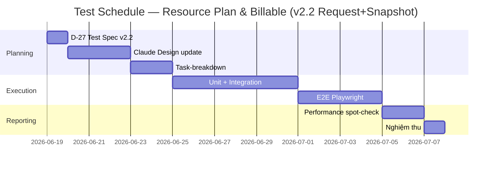

# OPMS Resource Plan & Billable Generation — Kế hoạch kiểm thử (Test Plan)

## 1. Tổng quan (Overview)

### 1.1 Mục đích (Purpose)

Xác định chiến lược, phạm vi, cấp độ, môi trường, tiêu chí vào/ra, lịch trình và rủi ro cho việc kiểm thử feature **Resource Plan & Billable Generation** (module project invoice, OPMS — Odoo 11). Tài liệu này trả lời "test CÁI GÌ và THẾ NÀO ở mức chiến lược"; chi tiết từng test case nằm ở D-27.

### 1.2 Tài liệu tham chiếu (Reference Documents)

| Document | ID | Description |
|----------|----|-------------|
| Đặc tả yêu cầu | D-02 | 42 REQ (REQ-RESOURCE-PLAN-BILLABLE-001…042, **v2.2**) — nguồn phạm vi test |
| Bảng từ vựng | D-03 | Thuật ngữ (MM, billable, allocation, period, request, snapshot…) |
| Sơ đồ luồng nghiệp vụ | D-06 | Luồng AS-IS/TO-BE (**v2.2 request+snapshot**) — nguồn kịch bản integration/E2E |
| Thiết kế CSDL | D-19 | resource_plan (stateless) + **resource_plan_request** + **resource_plan_request_line** (snapshot) — nguồn test dữ liệu/ràng buộc |
| UX (EXPERIENCE.md) | — | Hành vi UI lưới, states, dialog — nguồn E2E |

> ⚠️ **THAY ĐỔI MÔ HÌNH (v2.2 — Request + Snapshot).** Vòng đời KHÔNG còn trên plan. **Plan stateless, luôn editable.** Để cập nhật invoice, DelM **Submit một yêu cầu** → tạo `resource.plan.request` + **snapshot bất biến** của plan (grain (employee,role,month), giá-trị-copy + hash). DeptM duyệt **L1**, IM duyệt **L2**; **chỉ khi Approved L2** mới đồng bộ — và đồng bộ **từ snapshot** (không từ plan live). `resource_plan.active_request_id` trỏ request L2 mới nhất. **Resource Plan Summary đọc từ snapshot active** (không refresh-live theo plan). Lệch **2 chiều**: plan↔snapshot và snapshot↔invoice. Mọi mục test dưới đây phản ánh model này; các mục model cũ (lifecycle-trên-plan, sync-từ-plan-live, summary-refresh-live, reject-ở-approved-l2) đã bị **thay thế/đảo**.

### 1.3 Thuật ngữ (Terminology)

Theo D-03. Quan trọng: **MM** (man-month), **billable** (= MM × đơn giá), **allocation** (`project.member`), **period** (`project.invoice.period`), **lock** (`period.state='locked'`), **đã-chốt** (period.state ∈ {approved, sent, paid, locked}), **plan** (`resource.plan` — **stateless, luôn editable**, KHÔNG có state), **request** (`resource.plan.request` — bản ghi yêu cầu cập nhật; vòng đời Submitted→ApprovedL1→ApprovedL2, Rejected/Cancelled terminal; REQ-RESOURCE-PLAN-BILLABLE-024/040), **snapshot** (`resource.plan.request.line` — bản chụp **bất biến** của plan tại thời điểm Submit; grain (employee,role,month); **giá-trị-copy** employee_name/role/department/mm/price/currency/effort_ratio; **hash** toàn snapshot; immutable-on-create), **active_request_id** (`resource_plan.active_request_id` — trỏ request L2 mới nhất; ondelete SET NULL), **Submit** (DelM tạo request+snapshot; 1-in-flight/plan; DelM Withdraw được), **L1/L2** (DeptM duyệt L1, IM duyệt L2), **Đồng bộ** (**sự kiện một lần khi Approved L2**; verify hash + lock FOR UPDATE + set active_request_id + **overlay member từ SNAPSHOT** unlink-member-chưa-chốt→generate_lines→overlay; **find-or-create** period theo (project,month); bỏ qua tháng đã-chốt + báo; serialize 2×L2), **Resource Plan Summary** (pivot Department→Project→Member **đọc từ snapshot active**, rebuild khi L2 — KHÔNG refresh-live theo plan), **QA** (`project_report.group_project_report_qa`; edit period chưa-chốt **không delete**), **chỉ báo lệch 2 chiều** (plan↔snapshot + snapshot↔invoice — REQ-RESOURCE-PLAN-BILLABLE-039).

## 2. Phạm vi kiểm thử (Test Scope)

### 2.1 Trong phạm vi (In Scope)

Toàn bộ 42 REQ của feature (D-02 v2.2), nhóm theo vùng chức năng:

| Vùng | REQ | Trọng tâm test |
|---|---|---|
| Resource plan & nhập lưới | REQ-RESOURCE-PLAN-BILLABLE-001, REQ-RESOURCE-PLAN-BILLABLE-002, REQ-RESOURCE-PLAN-BILLABLE-003, REQ-RESOURCE-PLAN-BILLABLE-004, REQ-RESOURCE-PLAN-BILLABLE-005, REQ-RESOURCE-PLAN-BILLABLE-006, REQ-RESOURCE-PLAN-BILLABLE-007, REQ-RESOURCE-PLAN-BILLABLE-008, REQ-RESOURCE-PLAN-BILLABLE-009, REQ-RESOURCE-PLAN-BILLABLE-030, REQ-RESOURCE-PLAN-BILLABLE-031, REQ-RESOURCE-PLAN-BILLABLE-032, REQ-RESOURCE-PLAN-BILLABLE-035, REQ-RESOURCE-PLAN-BILLABLE-042 | CRUD plan, **plan stateless luôn editable** (sửa được kể cả khi có request pending / sau L2 — REQ-042); cửa sổ mặc định 8 tháng (current−2…current+5, theo tz server — freeze "current" trong test), pre-fill, nhập MM/rate, validation field, cột Đơn vị tiền tệ ăn theo rate, HB/BU, thêm tháng trên form (cộng dồn plan duy nhất) |
| Đồng bộ allocation | REQ-RESOURCE-PLAN-BILLABLE-010, REQ-RESOURCE-PLAN-BILLABLE-011, REQ-RESOURCE-PLAN-BILLABLE-012, REQ-RESOURCE-PLAN-BILLABLE-013, REQ-RESOURCE-PLAN-BILLABLE-023 | Sync một chiều plan→`project.member`: thêm→tạo, sửa→cập nhật, xóa→set end_at; KHÔNG sync ngược. (Lưu ý v2.2: allocation sync vẫn theo plan live khi sửa plan; **billable sync** mới là phần dời sang snapshot+L2) |
| Vòng đời Request (2 cấp) | REQ-RESOURCE-PLAN-BILLABLE-024, REQ-RESOURCE-PLAN-BILLABLE-040 | **DelM Submit** → tạo `resource.plan.request` (Submitted) + **snapshot bất biến** grain (employee,role,month) giá-trị-copy + hash; **chỉ DelM** submit; **1-in-flight/plan** (đang {submitted,approved_l1} → chặn submit mới); DelM **Withdraw** request in-flight → cancelled; **không sinh allocation** ở bước submit. **DeptM duyệt L1** (submitted→approved_l1), **IM duyệt L2** (approved_l1→approved_l2); **Reject terminal** (DeptM@submitted, IM@approved_l1 → rejected; active giữ nguyên; resubmit = request mới); **không reject ở approved_l2** (terminal); self-approval cho phép (1 IM⊇Dept). DeptM duyệt L1 toàn plan đa bộ phận |
| Snapshot bất biến | REQ-RESOURCE-PLAN-BILLABLE-040, REQ-RESOURCE-PLAN-BILLABLE-041 | Snapshot **immutable**: sửa plan/đổi rate/xóa employee sau Submit → snapshot (+hash) KHÔNG đổi; write/unlink `request.line` sau tạo → chặn (mọi state); **verify hash** trước L2, hash lệch → raise; grain (employee,role,month) UNIQUE trong 1 request |
| Đồng bộ billable (từ snapshot, khi L2) | REQ-RESOURCE-PLAN-BILLABLE-014, REQ-RESOURCE-PLAN-BILLABLE-015, REQ-RESOURCE-PLAN-BILLABLE-016, REQ-RESOURCE-PLAN-BILLABLE-017, REQ-RESOURCE-PLAN-BILLABLE-021, REQ-RESOURCE-PLAN-BILLABLE-026, REQ-RESOURCE-PLAN-BILLABLE-037, REQ-RESOURCE-PLAN-BILLABLE-041 | Đồng bộ = **sự kiện một lần khi IM duyệt L2** (REQ-014/041), **dữ liệu lấy từ SNAPSHOT** (không từ plan live): verify hash → lock FOR UPDATE → set `active_request_id` → **find-or-create** period `draft` theo (project,month) dựa UNIQUE → **unlink toàn bộ member chưa-chốt** rồi `action_generate_lines`, sau đó **overlay effort_mm/rate_id/effort_ratio từ snapshot** (assert amount=MM×price snapshot ≠ 0, effort_ratio ≠ weighted); **idempotent** (re-run sync không nhân đôi); **race 2×L2** serialize → 1 thắng, active = mới nhất, không double-write; gate bỏ qua tháng đã-chốt ("đã có"/"đã khóa") + báo skip, khoảng toàn đã-chốt → 0 period; dòng/tháng MM=0 không sinh member; chặn snapshot/request không hợp lệ |
| Khóa & bảng chân trị | REQ-RESOURCE-PLAN-BILLABLE-018, REQ-RESOURCE-PLAN-BILLABLE-019, REQ-RESOURCE-PLAN-BILLABLE-033 | Bảng chân trị (period.state × action) — mỗi hàng một TC: chưa có period→tạo draft; draft/review/submitted→ghi đè; approved/sent/paid→chặn sửa + "đã có"; locked→chặn + "đã khóa". "Committed"={approved,sent,paid,locked}; predicate `month_has_committed_invoice` + enum `committed_reason` (assert giá trị có cấu trúc, KHÔNG parse chuỗi tiếng Việt). Hiển thị trạng thái tháng |
| Báo cáo Summary (từ snapshot active) | REQ-RESOURCE-PLAN-BILLABLE-028, REQ-RESOURCE-PLAN-BILLABLE-029 | Pivot Department→Project→Member **đọc từ snapshot active** (request L2 mới nhất của project); **KHÔNG refresh-live theo plan** — sửa plan sau snapshot KHÔNG đổi Summary; **rebuild khi L2**; default filter (chưa closed, năm hiện tại); pivot **đa-currency tách theo currency** (không cộng lẫn). **"Xanh giả" sanity**: phải đổi plan sau snapshot RỒI mới assert Summary đọc snapshot |
| Period sau đồng bộ | REQ-RESOURCE-PLAN-BILLABLE-038 | Period ở `draft` → QA đẩy tới `submitted` (record rule QA giới hạn draft/review/submitted), **IM duyệt cuối → `approved`**; QA KHÔNG tự đẩy sang approved; người ngoài QA/IM bị từ chối (độc lập vòng đời request) |
| Lệch 2 chiều | REQ-RESOURCE-PLAN-BILLABLE-039 | Chỉ báo lệch **2 chiều**: (a) **plan↔snapshot** — plan live ≠ snapshot active (key (employee,role,month) MM/rate); (b) **snapshot↔invoice** — snapshot ≠ billable thực (tháng đã-chốt bị bỏ qua / period thu hẹp); phân biệt "kế hoạch"/"đã chụp"/"đã chốt"; assert cờ có cấu trúc, không parse chuỗi |
| Phân quyền | REQ-RESOURCE-PLAN-BILLABLE-020, REQ-RESOURCE-PLAN-BILLABLE-025, REQ-RESOURCE-PLAN-BILLABLE-036, REQ-RESOURCE-PLAN-BILLABLE-040 | Plan: **stateless (không có lifecycle-state) NHƯNG vẫn giữ row-level scope REQ-020** (Delivery chỉ plan dự án mình, DeptM chỉ sửa dòng bộ phận mình) — KHÔNG phải "ai cũng sửa mọi dòng"; **request**: DelM (Submit/Withdraw) / DeptM (L1) / IM (L2); `request.line` immutable với mọi role; row-level scope (DeptM chỉ duyệt/thấy plan bộ phận mình, đa bộ phận; Delivery chỉ dự án mình theo `delivery_team_id.manager_id.user_id`); đồng bộ **tự động khi L2** (không còn nút thủ công); quyền sync allocation theo user; invoice: **IM edit/delete đầy đủ; QA (`project_report.group_project_report_qa`) edit period chưa-chốt KHÔNG delete** (ACL unlink=0 + record rule state), nhóm cũ view-only |
| Nhất quán | REQ-RESOURCE-PLAN-BILLABLE-022 | Khung member khớp `action_generate_lines` (Đồng bộ tự unlink trước, generate_lines không); MM/rate/effort_ratio overlay **từ snapshot** (effort_ratio ≠ weighted; phân biệt MM=0 chủ đích vs 0-mặc-định) |
| Migration | REQ-RESOURCE-PLAN-BILLABLE-034 | Migration tạo **request `approved_l2` + snapshot copy từ invoice nguồn** (MM/price lịch sử của member), set `active_request_id`; **KHÔNG re-sync invoice** (invoice cũ là chân lý); plan stateless (không state). Idempotent: rerun → created=0, không dup request/snapshot (cờ migrated); report đối chiếu **vừa số snapshot-line (== số member nguồn) vừa tổng amount = invoice cũ**; Summary khớp invoice cũ; dữ liệu bẩn (employee non-approved/đã nghỉ, rate không map, >1 member cùng (project,employee,month,role)) ghi report không crash |
| Concurrency | REQ-RESOURCE-PLAN-BILLABLE-027 | Optimistic cấp plan theo write_date; false-conflict (2 user khác dòng → user lưu sau bị từ chối) |
| NFR | NFR-001..008 | Kiểm có chọn lọc; NFR-001/002/008 có điều kiện đo (p95, dataset, warm, 20 runs) — xem 2.2 |

### 2.2 Ngoài phạm vi (Out of Scope)

- **Luồng invoice hiện có không bị sửa:** tạo customer invoice, đối soát/confirm, gửi/duyệt period theo luồng cũ (chỉ test phần feature tác động).
- **Excel import wizard** (`invoice_import_wizard`) — không đổi, không re-test (chỉ test tính nhất quán REQ-RESOURCE-PLAN-BILLABLE-022 ở mức so khớp output).
- **Performance load testing tự động** — NFR-001/002/008 nay có **điều kiện đo cụ thể** (p95, DB nền 50 project × 200 dòng × 12 tháng, warm cache, 20 runs) nhưng vẫn chỉ **spot-check** (TC-060), không đưa vào suite tự động chặn merge ở giai đoạn này vì khó dựng dataset/warm-cache xác định trong CI; nếu không tạo được điều kiện đo xác định thì giữ thủ công và ghi nhận sai số.
- **Ma trận đa trình duyệt/thiết bị** — công cụ nội bộ, chỉ desktop web; E2E chạy trên 1 trình duyệt chính.

## 3. Cấp độ kiểm thử (Test Levels)

### 3.1 Kiểm thử đơn vị (Unit Testing)

- **Công cụ:** Odoo test framework (`odoo.tests.common.TransactionCase` / `SavepointCase`).
- **Trọng tâm:** logic model thuần — `amount = effort_mm × rate.price` (REQ-RESOURCE-PLAN-BILLABLE-015); **build snapshot** khi Submit (giá-trị-copy grain (employee,role,month) + tính hash; immutable-on-create — write/unlink line raise) (REQ-RESOURCE-PLAN-BILLABLE-040); **verify hash** (REQ-RESOURCE-PLAN-BILLABLE-041); overlay effort_mm/rate/effort_ratio **từ snapshot** khi đồng bộ (REQ-RESOURCE-PLAN-BILLABLE-014/022 — assert ≠ giá trị mặc định 0/False/weighted); **tách tầng validation MM**: UI type-coercion vs **CHECK DB `effort_mm >= 0`** (bỏ qua UI vẫn bị DB chặn) + **`@api.constrains` cho employee approved** (REQ-RESOURCE-PLAN-BILLABLE-009/005); **state machine REQUEST** Submitted→ApprovedL1→ApprovedL2 + Reject terminal (DeptM@submitted, IM@approved_l1; KHÔNG reject ở approved_l2) + Cancelled (Withdraw) + 1-in-flight guard + self-approval IM⊇Dept (REQ-RESOURCE-PLAN-BILLABLE-024/040); **plan stateless** — không có state, write plan luôn cho phép (REQ-RESOURCE-PLAN-BILLABLE-042); predicate `month_has_committed_invoice` + enum `committed_reason` cho bảng chân trị (REQ-RESOURCE-PLAN-BILLABLE-018/033/037 — assert giá trị có cấu trúc, không parse chuỗi); cờ lệch **2 chiều** plan↔snapshot + snapshot↔invoice (REQ-RESOURCE-PLAN-BILLABLE-039 — assert cờ, không parse chuỗi); helper sync allocation (gồm dòng member_id=False); guard chặn ghi member khi period đã-chốt (REQ-RESOURCE-PLAN-BILLABLE-018/033); logic unlink + sinh lại member line từ snapshot (REQ-RESOURCE-PLAN-BILLABLE-016); optimistic concurrency theo write_date — **sanity-check write_date đổi sau sửa 1 ô MM** (REQ-RESOURCE-PLAN-BILLABLE-027); migration tạo request approved_l2 + snapshot copy từ invoice nguồn, idempotent + cờ migrated, assert số snapshot-line + amount (REQ-RESOURCE-PLAN-BILLABLE-034).
- **Trách nhiệm:** Dev (TDD — xem 4.1).

### 3.2 Kiểm thử tích hợp (Integration Testing)

- **Công cụ:** Odoo `TransactionCase` (đa model) / `HttpCase`.
- **Trọng tâm:** **Submit request** → tạo request(submitted) + snapshot bất biến (REQ-RESOURCE-PLAN-BILLABLE-040); **Đồng bộ là sự kiện khi IM duyệt L2**, dữ liệu **từ snapshot**: verify hash → lock → set active_request_id → **find-or-create** period(draft) theo (project,month) dựa UNIQUE + member overlay effort_mm/rate/effort_ratio từ snapshot (REQ-RESOURCE-PLAN-BILLABLE-014/041); **idempotent** (re-run sync không nhân đôi); **race 2×L2 serialize** → 1 thắng, active=mới nhất, không double-write; **unlink toàn bộ member chưa-chốt** rồi sinh lại từ snapshot → nhân viên đã xóa khỏi snapshot biến mất (REQ-RESOURCE-PLAN-BILLABLE-016); bảng chân trị period.state × action — bỏ qua tháng đã-chốt với lý do "đã có"/"đã khóa", khoảng toàn đã-chốt → 0 period (REQ-RESOURCE-PLAN-BILLABLE-018/037); **plan vẫn editable** kể cả tháng đã-chốt (chỉ billable bị guard) (REQ-RESOURCE-PLAN-BILLABLE-042); **snapshot immutable** — sửa plan sau Submit không đổi snapshot/hash (REQ-RESOURCE-PLAN-BILLABLE-040); sync một chiều plan→allocation (thêm/sửa/xóa→end_at, dòng member_id=False, không dup khi employee đã có allocation, REQ-RESOURCE-PLAN-BILLABLE-011/012/013); KHÔNG sync ngược (REQ-RESOURCE-PLAN-BILLABLE-023); vòng đời request 2 cấp + Reject terminal + Withdraw + 1-in-flight + multi-department duyệt L1 (REQ-RESOURCE-PLAN-BILLABLE-024/040); period sau đồng bộ — QA→submitted, IM duyệt cuối→approved (REQ-RESOURCE-PLAN-BILLABLE-038); chỉ báo lệch **2 chiều** plan↔snapshot + snapshot↔invoice (REQ-RESOURCE-PLAN-BILLABLE-039); chặn đồng bộ khi snapshot/request không hợp lệ / dòng MM=0 mọi tháng không sinh member (REQ-RESOURCE-PLAN-BILLABLE-021); **Summary đọc từ snapshot active, rebuild khi L2 — sửa plan KHÔNG đổi Summary; "xanh giả" sanity; pivot đa-currency tách theo currency** (REQ-RESOURCE-PLAN-BILLABLE-028/029); migration tạo request approved_l2 + snapshot copy từ invoice nguồn, idempotent + report đối chiếu số snapshot-line + amount = invoice cũ + dữ liệu bẩn (REQ-RESOURCE-PLAN-BILLABLE-034); concurrency false-conflict (REQ-RESOURCE-PLAN-BILLABLE-027); **đồng bộ all-or-nothing trong transaction L2** — 1 tháng lỗi → rollback toàn bộ L2, request ở lại approved_l1 (NFR-005); audit/log đồng bộ = sự kiện L2 (IM + request_id + tháng skip — NFR-004).

### 3.3 Kiểm thử hệ thống (System Testing)

- Kịch bản đầu-cuối theo D-06: Delivery mở plan → pre-fill → sửa/thêm dòng (sync allocation, plan luôn editable) → **Submit request (tạo snapshot)** → Dept Manager duyệt L1 → IM duyệt L2 (**đồng bộ tự động từ snapshot → tạo period draft + rebuild Summary**) → xem Resource Plan Summary (đọc snapshot active) → QA/IM duyệt period. Bao gồm nhánh thất bại (snapshot rỗng, tất cả tháng đã-chốt, MM âm, **Reject terminal → resubmit request mới**, **Withdraw**, **hash lệch**, **race 2×L2**). Kịch bản migration lần đầu install (request approved_l2 + snapshot từ invoice nguồn, idempotent rerun).

### 3.4 Kiểm thử E2E (E2E Testing)

- **Framework:** **Playwright** (ngoài Odoo) cho UI.
- **Phạm vi:** lưới frozen-pane (cột định danh + header đứng yên khi scroll), cửa sổ 8 tháng (current−2…current+5, freeze "current"), cột Đơn vị tiền tệ liền sau Đơn giá + HB/BU, nhập ô MM (**plan luôn editable**), **nút Submit request** (DelM) + **blocking confirm Submit** (xác nhận chụp snapshot) (REQ-RESOURCE-PLAN-BILLABLE-017/040), **màn duyệt request hiển thị SNAPSHOT** (không phải plan live) cho DeptM/IM + nút Withdraw (DelM), **chip lệch 2 chiều** plan↔snapshot / snapshot↔invoice (REQ-039), hiển thị trạng thái đã-chốt read-only, **pivot Resource Plan Summary** (Department→Project→Member, đọc snapshot active, default filter), hiển thị nút theo vai trò + trạng thái request (đồng bộ tự động khi L2, không nút thủ công) (REQ-RESOURCE-PLAN-BILLABLE-020, REQ-RESOURCE-PLAN-BILLABLE-024), accessibility floor (tab-traversal, aria-invalid, focus dialog).
- 1 trình duyệt chính (desktop). Không ma trận đa trình duyệt.
- ⚠️ **E2E PENDING DESIGN:** các kịch bản UI cho mô hình mới (màn Submit request, màn duyệt L1/L2 hiển thị **snapshot**, nút Withdraw, chip lệch 2 chiều) hiện là **suy diễn** — sẽ **chốt lại sau khi update Claude Design** (bước kế tiếp trong cascade). Đặc tả E2E ở đây mang tính định hướng, không phải bản cuối.

## 4. Phương pháp kiểm thử (Test Approach)

### 4.1 Chiến lược TDD (TDD Strategy)

Bắt buộc chu trình **RED → GREEN → REFACTOR** theo chuẩn module: viết test thất bại trước (RED), code tối thiểu để pass (GREEN), refactor giữ test xanh. Áp cho mọi unit + integration test logic model.

### 4.2 Kiểm thử hồi quy (Regression Testing)

- Toàn bộ suite Odoo + Playwright chạy trên CI mỗi PR vào nhánh feature và trước merge `develop`.
- Đặc biệt chú ý hồi quy luồng invoice/period hiện có (sync_to_billable, Generate Lines) do feature dùng chung model.

### 4.3 Kiểm thử hiệu năng (Performance Testing)

- **Không tự động hóa chặn merge** ở giai đoạn này, nhưng đo theo **điều kiện đo xác định** (TC-060): DB nền 50 project × 200 dòng × 12 tháng, **warm cache, đo 20 lần lấy p95**. Mục tiêu: render plan 200 dòng × 8 tháng p95 < 3s (NFR-001); Đồng bộ 200 dòng × 12 tháng p95 < 15s không timeout (NFR-002); pivot Summary default filter p95 < 5s (NFR-008). Ghi nhận kết quả vào báo cáo nghiệm thu. Nếu không dựng được dataset/warm-cache xác định trong CI → giữ ở mức thủ công, ghi nhận sai số (đo không hoàn toàn deterministic).

### 4.4 Kiểm thử bảo mật (Security Testing)

- Kiểm phân quyền model (`ir.model.access.csv`) + record rule: **plan stateless** (không lifecycle-state) **nhưng vẫn row-level scope** (Delivery theo `delivery_team_id.manager_id.user_id`, DeptM theo bộ phận — REQ-020); **request** theo workflow — Delivery Manager (Submit/Withdraw), Department Manager (duyệt L1), Invoice Manager (duyệt L2); **`request.line` (snapshot) immutable với mọi role** (ACL write=0/unlink=0); đồng bộ chạy tự động trong transaction L2 (không action thủ công riêng); nhóm khác bị từ chối ở cả model access lẫn hành động Submit/Withdraw/Approve (REQ-RESOURCE-PLAN-BILLABLE-020/040, NFR-003). Kiểm audit đồng bộ (NFR-004).
- **Siết quyền invoice (REQ-RESOURCE-PLAN-BILLABLE-036):** module project invoice — **Invoice Manager edit/delete đầy đủ; QA (`project_report.group_project_report_qa`) chỉ edit period chưa-chốt (state draft/review/submitted), KHÔNG delete** (ACL `unlink=0` + record rule giới hạn state) — gồm case QA cố delete member của period approved → bị chặn; nhóm cũ (Delivery/Dept/PM/FPM) chỉ view — kiểm ở cả `ir.model.access.csv` và record rule, cả hướng cho phép lẫn từ chối.
- **Row-level scope (REQ-RESOURCE-PLAN-BILLABLE-020):** Delivery Manager chỉ truy cập plan/request dự án mình phụ trách (record rule theo `project.delivery_team_id.manager_id.user_id`); Department Manager chỉ thấy/duyệt request bộ phận mình — request đa bộ phận: duyệt L1 áp cho **cả request** (duyệt cấp request, không per-dòng); IM toàn quyền. Test cả hướng cho phép lẫn bị từ chối.
- **Quyền sync allocation (REQ-RESOURCE-PLAN-BILLABLE-025):** sync ghi `project.member` chạy dưới quyền user; user thiếu quyền `project.member` → sync bị từ chối (không sudo bypass).
- **Period sau đồng bộ (REQ-RESOURCE-PLAN-BILLABLE-038):** period ở `draft` → QA đẩy tới `submitted`, **IM duyệt cuối → `approved`** (`action_approve_delivery` → `delivery_approved` → `_try_set_approved`); **QA KHÔNG tự đẩy sang approved**; user ngoài QA/IM bị từ chối.
- **Audit Đồng bộ (NFR-004):** mỗi lần Đồng bộ ghi nhận người thực hiện + thời điểm + tháng bị bỏ qua do đã-chốt — assert có bản ghi log/audit (không chỉ kiểm UI).
- **Tách biệt nhiệm vụ:** self-approval được phép (người Submit tự duyệt) — test xác nhận KHÔNG bị chặn, gồm **1 IM (group IM ⊇ Dept Manager) tự duyệt cả L1+L2** (REQ-RESOURCE-PLAN-BILLABLE-024). **Reject là terminal** (Dept Manager ở submitted, IM ở approved_l1 → request `rejected`; **không reject ở approved_l2**); active_request_id giữ nguyên (request L2 trước đó vẫn là nguồn billable); resubmit = request mới. Plan lệch snapshot/invoice → chỉ báo lệch 2 chiều (REQ-RESOURCE-PLAN-BILLABLE-039).

## 5. Môi trường kiểm thử (Test Environment)

### 5.1 Cấu hình môi trường (Environment Setup)

| Environment | Purpose | Configuration |
|-------------|---------|---------------|
| Local dev | TDD unit/integration | Odoo 11 + PostgreSQL (Docker), DB test riêng |
| CI | Hồi quy tự động | Odoo test runner + Playwright headless, DB ephemeral |
| Staging | Spot-check performance + nghiệm thu | Bản dữ liệu gần production, ẩn danh |

### 5.2 Dữ liệu kiểm thử (Test Data)

- Dự án mẫu có sẵn allocation (`project.member`) đa nhân sự/role; bảng rate (`ntq.project.billable.rate`) đủ rate (≥2 currency cho test cột Đơn vị tiền tệ); nhân viên `process_state='approved'`.
- Bộ dữ liệu biên: period đủ 8 trạng thái cho bảng chân trị (chưa có / draft / review / submitted / approved / sent / paid / locked), period đã có member line (cho ghi đè), period đồng bộ A+B rồi bỏ B (cho unlink), khoảng tháng lệch năm + khoảng toàn tháng đã-chốt, MM = 0 / 0.5 / 1.0 / âm (gồm dòng MM=0 mọi tháng và tháng MM=0 chủ đích); **request ở đủ state** submitted/approved_l1/approved_l2/rejected/cancelled; **snapshot** (request.line) đủ grain (employee,role,month) + hash; plan stateless đa bộ phận; plan đa-currency (VND+USD) cho Summary; **plan đã sửa-lệch so với snapshot active** (cho lệch plan↔snapshot + "xanh giả" sanity); dòng member_id=False; employee đã có allocation; effort_ratio 0%/150%; period approved + snapshot lệch (lệch snapshot↔invoice, REQ-RESOURCE-PLAN-BILLABLE-039); dataset migration: invoice cũ có member → nguồn cho request approved_l2 + snapshot.
- **Freeze "current"** = 2026-06 theo tz server cho test cửa sổ 8 tháng; **= 2026-11** cho cửa sổ vắt qua năm (2027); freeze server time quanh mốc UTC cho tz-server (tránh flakiness).
- Snapshot project invoice nguồn (có tháng đã-chốt) cho migration + **dữ liệu bẩn**: employee non-approved/đã nghỉ, rate không map `ntq.project.billable.rate`, >1 member cùng (project,employee,month); dự án closed + chưa closed, năm hiện tại + năm trước cho Summary default filter.
- Ràng buộc: UNIQUE(project_id) trên plan, UNIQUE(plan,employee,month) trên dòng, UNIQUE(project_id, month_date) trên period.
- Dataset hiệu năng: 50 project × 200 dòng × 12 tháng, warm cache, 20 runs.
- User mỗi nhóm Delivery / Dept Manager (≥2 bộ phận) / IM (⊇ Dept) / QA (`project_report.group_project_report_qa`) + nhóm cũ + user ngoài.
- Không dùng dữ liệu thật khách hàng; staging ẩn danh.

## 6. Tiêu chí vào/ra (Entry & Exit Criteria)

### 6.1 Tiêu chí vào (Entry Criteria)

- D-02 (v2.2), D-19 (v2.2) đã hoàn tất; Phase 1 gate PASSED.
- D-27 (test spec) tồn tại với TC phủ mọi REQ.
- Môi trường test + dữ liệu mẫu sẵn sàng.

### 6.2 Tiêu chí ra (Exit Criteria)

- 100% REQ-xxx có ≥1 test case đã thực thi.
- Độ phủ code ≥ **80%** (coverage_threshold) cho code feature mới.
- 100% test case Critical/High **pass**; 0 defect Critical còn mở.
- Spot-check performance đạt NFR-001/002/008 (theo điều kiện đo p95/dataset/warm/20 runs hoặc ghi nhận sai số nếu chạy thủ công).
- Hồi quy luồng invoice hiện có: xanh.

## 7. Lịch trình (Schedule)

### 7.1 Mốc tiến độ (Milestones)

> Lịch điều chỉnh sau tái cấu trúc v2.2 (Request+Snapshot) chốt ngày 2026-06-19. Mốc cũ (D-27 v1.x "hoàn tất 2026-06-16") không còn áp dụng.

| Milestone | Target Date | Dependencies |
|-----------|------------|--------------|
| D-27 test spec v2.2 hoàn tất | 2026-06-19 | D-26 v2.2 |
| Update Claude Design (màn request/snapshot) | 2026-06-23 | D-27 v2.2 |
| Re-derive task-breakdown | 2026-06-24 | Claude Design, D-27 |
| Unit + integration (TDD) xanh | 2026-07-01 | task-breakdown, môi trường |
| E2E Playwright xanh | 2026-07-04 | UI implement (sau Claude Design) |
| Spot-check performance + nghiệm thu | 2026-07-07 | Staging |

### 7.2 Biểu đồ Gantt (Gantt Chart)

## 8. Đội ngũ & vai trò (Team & Roles)

| Role | Responsibility | Assignee |
|------|---------------|----------|
| QA | Thiết kế test (D-27), review độ phủ, gate | TBD |
| Dev | Unit/integration theo TDD, fix defect | TBD |
| Tester | Thực thi E2E, spot-check performance, báo cáo | TBD |
| Invoice Manager (nghiệp vụ) | UAT luồng submit/approve, đối chiếu billable | TBD |

## 9. Quản lý rủi ro (Risk Management)

| Risk | Likelihood | Impact | Mitigation |
|------|-----------|--------|------------|
| Sync một chiều ghi sai/hỏng allocation (`project.member` dùng chung) | High | High | Integration test cho create/update/end_at; tuyệt đối không xóa cứng (REQ-RESOURCE-PLAN-BILLABLE-013); kiểm dữ liệu allocation trước/sau sync |
| Ghi đè/sửa qua tháng đã-chốt (bypass) | Medium | High | Bảng chân trị period.state × action (TC-059); predicate `month_has_committed_invoice` + enum `committed_reason`; unit guard ở write/create member (REQ-RESOURCE-PLAN-BILLABLE-018/033/037). Lưu ý v2.2: **plan vẫn editable**, guard chỉ ở billable |
| **Snapshot không bất biến**: sửa plan/đổi rate sau Submit làm đổi snapshot/hash | High | High | TC snapshot-immutable: sửa plan/rate/xóa employee sau Submit → snapshot + hash không đổi; write/unlink request.line bị chặn (REQ-RESOURCE-PLAN-BILLABLE-040) |
| **Đồng bộ từ plan live thay vì snapshot** (đọc sai nguồn) | High | High | TC sync-from-snapshot: đổi plan giữa Submit và L2 → invoice khớp **snapshot** không phải plan; "xanh giả" sanity (đổi plan trước khi assert) (REQ-RESOURCE-PLAN-BILLABLE-014/041) |
| **Hash lệch không bị phát hiện ở L2** | Medium | High | TC verify-hash: snapshot bị tamper → L2 raise (REQ-RESOURCE-PLAN-BILLABLE-041) |
| Đồng bộ tạo member amount=0 / effort_ratio weighted do quên overlay (generate_lines mặc định 0/False/weighted) | High | High | TC-017/026 assert effort_mm=MM, rate_id=rate, effort_ratio=% **từ snapshot**, amount=MM×price ≠ 0 (REQ-RESOURCE-PLAN-BILLABLE-014/022) |
| Đồng bộ để sót member nhân viên đã xóa khỏi snapshot (quên unlink) | High | High | TC-019 assert unlink toàn bộ member chưa-chốt rồi sinh lại từ snapshot → member đã xóa biến mất (REQ-RESOURCE-PLAN-BILLABLE-016) |
| **Race 2×L2 song song** → double-write / active sai / period trùng | Medium | High | TC race-2xL2: serialize (lock FOR UPDATE), idempotent re-run, find-or-create dựa UNIQUE(project,month); 1 thắng, active=mới nhất (REQ-RESOURCE-PLAN-BILLABLE-041) |
| Vòng đời request 2 cấp mới → chuyển cấp/quyền sai; **reject ở approved_l2** / quên 1-in-flight | Medium | High | TC L1/L2 + **Reject terminal** (không reject ở approved_l2) + Withdraw + 1-in-flight; self-approval IM⊇Dept; multi-department (REQ-RESOURCE-PLAN-BILLABLE-024/040) |
| **Summary refresh-live theo plan** thay vì đọc snapshot active / cộng nhầm đa-currency | Medium | High | TC-047/048: sửa plan sau snapshot KHÔNG đổi Summary; rebuild khi L2; "xanh giả" sanity; pivot đa-currency tách theo currency (REQ-RESOURCE-PLAN-BILLABLE-028/029) |
| Migration: snapshot/request không khớp invoice nguồn / re-sync đè invoice cũ / dup khi rerun | Medium | High | TC migration: request approved_l2 + snapshot copy từ invoice nguồn, **KHÔNG re-sync invoice**; idempotent + cờ migrated; report đối chiếu **số snapshot-line + tổng amount = invoice cũ**; dữ liệu bẩn ghi report không crash (REQ-RESOURCE-PLAN-BILLABLE-034) |
| Hồi quy luồng billable hiện có do dùng chung model (`action_generate_lines`) | Medium | High | Chạy lại suite invoice/period hiện có; assert nhất quán REQ-RESOURCE-PLAN-BILLABLE-022 (khung từ generate_lines, Đồng bộ tự unlink trước, MM/rate/effort_ratio overlay) |
| Period approval sai cấp: QA tự đẩy sang approved | Medium | High | TC-058: QA→submitted, IM duyệt cuối→approved, QA không tự approve (REQ-RESOURCE-PLAN-BILLABLE-038) |
| QA delete nhầm invoice (quá quyền) | Medium | Medium | TC-056: QA edit period chưa-chốt KHÔNG delete (ACL unlink=0); QA cố delete approved bị chặn (REQ-RESOURCE-PLAN-BILLABLE-036) |
| Lưới/Đồng bộ/pivot chậm/timeout | Low | Medium | Spot-check theo điều kiện đo p95/dataset/warm/20 runs (NFR-001/002/008, TC-060); không tự động hóa chặn merge giai đoạn này |
| Hai người cùng sửa một plan (đồng thời) | Low | Medium | Optimistic concurrency cấp plan (REQ-RESOURCE-PLAN-BILLABLE-027): phát hiện khi lưu, yêu cầu tải lại; Generate dùng dữ liệu đã lưu + cảnh báo nháp. Test: TC-042, TC-043 |

## 10. Sản phẩm bàn giao (Deliverables)

- D-27 Test Specification (TC chi tiết).
- Bộ test tự động: Odoo (unit/integration) + Playwright (E2E).
- Ma trận truy vết REQ ↔ TC (qua `hbc-traceability`).
- Báo cáo thực thi test + kết quả spot-check performance.

## Lịch sử sửa đổi (Revision History)

| Version | Date | Author | Scope of Change |
|---------|------|--------|----------------|
| 1.0 | 2026-06-12 | OPMS team | Initial creation — test strategy cho Resource Plan & Billable Generation |
| 1.1 | 2026-06-18 | OPMS team | Đồng bộ theo D-02 v1.6 (38 REQ). Đổi tên Generate→Đồng bộ (chỉ IM, sau Approved L2, overlay MM/rate); vùng scope mở rộng: bảng chân trị period.state×action (predicate + committed_reason enum), Resource Plan Summary live-sync rollback 2 chiều (028/029), cột currency (030), HB/BU (031), cửa sổ 8 tháng tz (032), chặn sửa đã-chốt (033), migration idempotent (034), thêm tháng form (035), siết quyền invoice IM+QA (036), gate "đã có" (037), period QA/IM duyệt (038). Vòng đời plan 2 cấp + Reject orphan-by-design (024). NFR-001/002/008 có điều kiện đo (p95/dataset/warm/20 runs). Cập nhật levels/security/performance/risks/test-data/entry-exit. D-27 lên 60 TC (v1.3). |
| 1.2 | 2026-06-19 | OPMS team | Đồng bộ theo D-02 v1.8 (39 REQ). **Đồng bộ:** unlink member chưa-chốt trước generate_lines, overlay thêm `effort_ratio`=% plan, find-or-create period dựa UNIQUE(project,month), serialize/lock + race/TOCTOU re-check (REQ-RESOURCE-PLAN-BILLABLE-014/016/022). **Summary:** đổi từ live-sync rollback 2 chiều → **model stored + refresh qua hook** (model stored + pivot, không bảng vật lý/hook) + pivot đa-currency tách theo currency (REQ-RESOURCE-PLAN-BILLABLE-028/029). **QA:** group = `project_report.group_project_report_qa`, edit period chưa-chốt **không delete**; period sau Đồng bộ — QA→submitted, **IM duyệt cuối→approved**, QA không tự approve. **Migration:** key (project,employee,month,rate_id) + assert số dòng + dữ liệu bẩn. **Optimistic lock:** sanity-check write_date đổi sau sửa 1 ô MM. **+REQ-RESOURCE-PLAN-BILLABLE-039** chỉ báo lệch plan↔period; **NFR-004** audit Đồng bộ vào coverage; multi-department + self-approval IM⊇Dept (REQ-RESOURCE-PLAN-BILLABLE-020/024); tách tầng UI type-coercion vs CHECK DB vs @api.constrains. Cập nhật terminology/scope/levels/security/risks/test-data/entry. D-27 lên 82 TC (v1.4). |
| 2.2 | 2026-06-19 | OPMS team | **Tái cấu trúc theo D-02/D-19/D-06 v2.2 (Request + Snapshot, sau party-mode + adversarial).** Vòng đời chuyển từ plan → **`resource.plan.request`** (Submitted→ApprovedL1→ApprovedL2, Rejected/Cancelled terminal); **plan stateless luôn editable** (REQ-042). Submit (chỉ DelM) tạo **snapshot bất biến** grain (employee,role,month) giá-trị-copy + hash; 1-in-flight; Withdraw (REQ-040). **Đồng bộ = sự kiện khi Approved L2 từ SNAPSHOT** (verify hash + lock + set active_request_id + overlay từ snapshot + idempotent + race 2×L2 + bỏ tháng đã-chốt); **Summary đọc snapshot active**, rebuild khi L2 (bỏ refresh-live) (REQ-014/041/028/029). Lệch **2 chiều** plan↔snapshot + snapshot↔invoice (REQ-039). Migration tạo request approved_l2 + snapshot copy từ invoice nguồn, KHÔNG re-sync (REQ-034). +TC "xanh giả" sanity, snapshot-immutable, verify-hash, race-2xL2, reject-terminal, withdraw. +REQ-040/041/042. Cập nhật terminology/scope/levels/system/E2E/security/risks/test-data/entry. D-27 lên ~106 TC (v2.2). | OPMS team |
| 2.3 | 2026-06-19 | OPMS team | Vá theo **adversarial review cascade v2.2**. #2: làm rõ **plan stateless ≠ vô hạn quyền** — vẫn giữ row-level scope REQ-020 (scope §2.1/§4.4). #5: đồng bộ **all-or-nothing trong transaction L2** (1 tháng lỗi → rollback toàn bộ L2; bỏ "per-month") — levels/risks (NFR-005). #3: audit = sự kiện L2 (IM+request_id+tháng skip — NFR-004). #13: cập nhật **§7 Milestones/Gantt** cho timeline v2.2 thực tế (chốt 2026-06-19, thêm mốc Claude Design + task-breakdown). #14: §3.4 đánh dấu **E2E PENDING DESIGN** (chốt sau update Claude Design). | OPMS team |
| 1.3 | 2026-06-19 | OPMS team | Đồng bộ D-02 v1.8 (sau verify-code). **Summary** quay lại **model stored + ACL + pivot + hook khi sửa plan** (Odoo 11 pivot cần model backing — V6/028/029). **Scope Delivery** qua `delivery_team_id.manager_id.user_id` sẵn có, bỏ field mới (V1/020). **Period approve cuối** DM/Admin/IM (cần `delivery_manager_user_id`), QA chỉ tới submitted (V2/038). **Currency/đơn giá** = `rate.price`/`rate.price_currency_id` (V3/008/030). **Đồng bộ ở submitted** bắt buộc re-sync billable/summary/customer-invoice/confirm (V5/014/016). UNIQUE `uniq_project_month` đã có (V4). Grain (plan,employee,role,month) (V7/002). REQ-RESOURCE-PLAN-BILLABLE-005 domain UI mềm (V8). | OPMS team |
