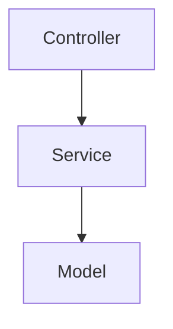

<!-- {project_name}: filled by LLM from project context at generation time. -->
---
document_id: D-09
feature: "{feature}"
title: "{project_name} — Architecture Design — feature: {feature}"
version: "1.0"
status: draft
stepsCompleted: []
lastStep: ""
updated: ""
---

# {project_name} — Architecture Design

## 1. Overview

<!-- Purpose of this feature's architecture; key drivers (the NFRs / integration that shape it). 1–3 paragraphs. -->

## 2. Components

<!-- Each component this feature adds or changes. Every row maps to >=1 REQ. -->

| Component | Responsibility | Layer | REQ Ref |
|-----------|----------------|-------|---------|

<!-- Optional component/layer view:

-->

## 3. Integration Points

<!-- Existing models/modules/services this feature touches. Anchor each to an
     integration-map entry (existing system), classify NEW vs CHANGE, state the contract. -->

| Integration Point | Existing System Ref | Change Type | Contract / Seam |
|-------------------|---------------------|-------------|-----------------|

## 4. NFR-Driven Decisions

<!-- For each relevant NFR in D-02 §5, the structural choice it forces. Cross-references the ADRs below. -->

| NFR Ref | Structural choice | ADR |
|---------|-------------------|-----|

## 5. Decision Records

<!-- One ADR per non-obvious architectural decision. Each MUST carry a rationale. -->

### ADR-01: (title)

- **Decision:** …
- **Rationale:** … (why this over the alternatives)
- **Alternatives considered:** …
- **REQ / NFR Ref:** REQ-{feature}-NNN / NFR-…

## Revision History

| Version | Date | Author | Scope of Change |
|---------|------|--------|----------------|
| 1.0 | | | Initial creation |
