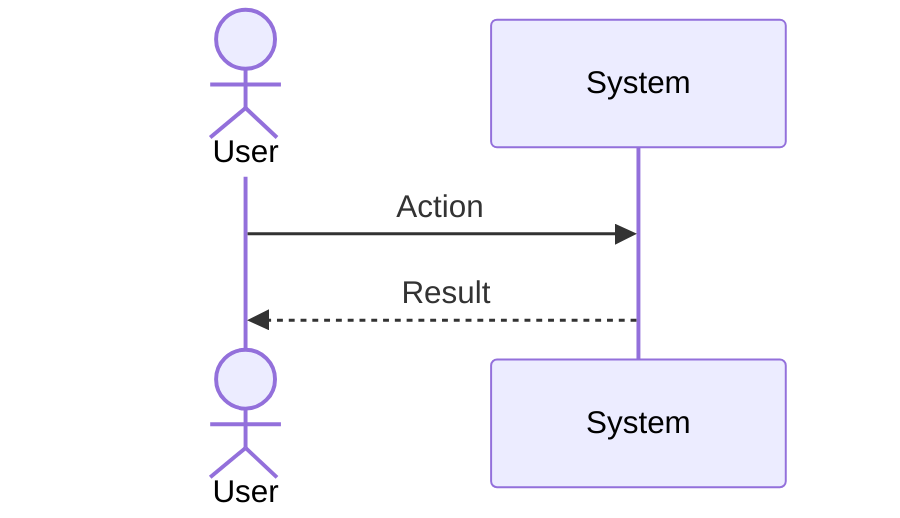
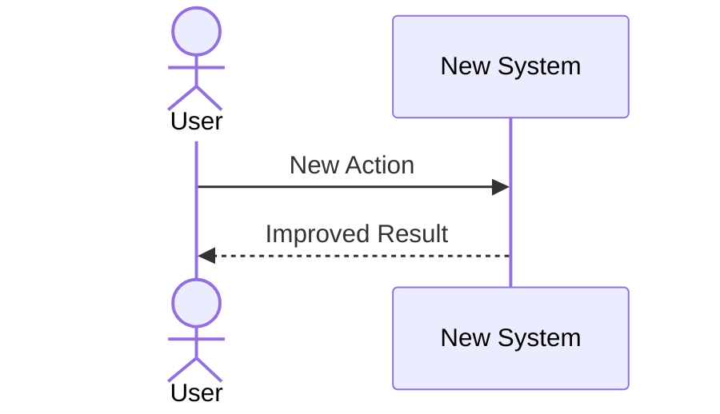

# D-06 Business Flow Diagram

## Business Flow of (Process Name)

### AS-IS (Current Flow)
<!-- AS-IS must be grounded in real code / observed behavior, not just the PRD.
     Annotate each path with a stable path-ID (PATH-NN). Record any place the real
     behavior diverges from the PRD in the Grounding-to-code log below. -->

### TO-BE (Target Flow)
<!-- Enumerate happy / alternate / exception paths — never stop at the happy path.
     Each path gets a stable path-ID (PATH-NN). -->

## Grounding-to-code log (AS-IS reality check)

<!-- B8-3: for a brownfield / migration flow, AS-IS is read from the REAL code or
     observed behavior, not only the PRD. Record every place the drawn AS-IS
     diverges from what the PRD describes. Greenfield (no existing code): write
     "N/A — greenfield, no existing behavior to ground against". -->

| AS-IS path | Ground-truth source (code ref / observed) | Divergence from PRD | Resolution |
|---|---|---|---|
| PATH-NN | `path/to/module.py:fn` | <!-- [NEEDS CLARIFICATION] or "none" --> | |

## REQ ↔ flow-facet coverage

<!-- B8-5: every requirement that this feature owns maps to the flow(s) / path(s)
     that realize it. A flow with no REQ backing is a phantom; a REQ realized by no
     flow is an uncovered facet — record why (e.g. "specified at D-02, traced via
     test only") rather than leaving it silent. -->

| REQ id | Flow / path | Facet (read / write / admin / lifecycle / exception) |
|---|---|---|
| REQ-XXX-001 | §1 TO-BE / PATH-01 | write |

---

**Revision History**

| Date | Version | Changes | Author |
|---|---|---|---|
| yyyy-mm-dd | 1.0 | Initial version | |
